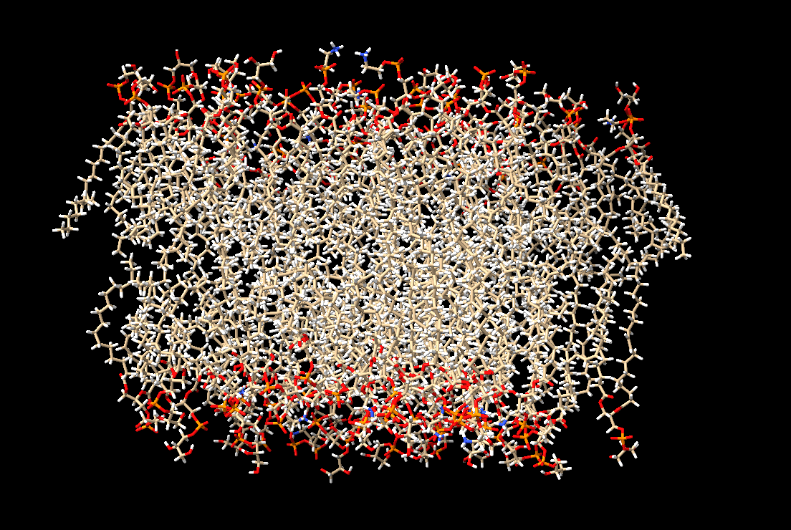
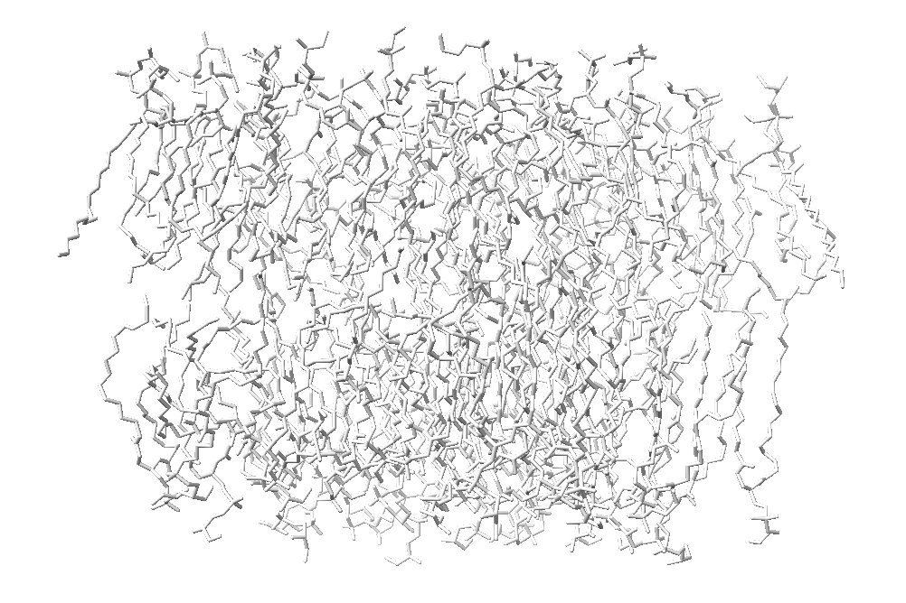

# ChimeraX绘制膜体系
在分子生物学和药物设计的研究中，细胞膜作为细胞的边界和重要的生物结构，扮演着至关重要的角色。它不仅是细胞与外界物质交换的通道，还参与了许多关键的生物学过程，如信号传导、物质运输及细胞间的相互作用。因此，研究膜体系的结构和功能，对于理解疾病机制、药物作用机制以及新药的开发至关重要。  

随着计算机技术和可视化工具的飞速发展，分子可视化成为研究和分析复杂生物分子体系的重要手段。ChimeraX作为一种强大的分子可视化软件，广泛应用于生物分子结构的分析与展示。它不仅支持丰富的分子建模和数据处理功能，还可以通过高质量的图形呈现，帮助研究者直观地理解膜体系的三维结构及其动态特性。在研究膜蛋白、脂质双层以及配体与膜的相互作用时，ChimeraX提供了强有力的工具，尤其是在绘制复杂的膜体系时，能够清晰展现其结构特征，为后续的模拟和实验提供理论支持。   

本篇文章将重点介绍如何使用ChimeraX绘制膜体系，展示其在膜结构分析中的价值。通过简单而高效的操作，研究人员可以构建精确的膜模型，进行可视化分析，并探索细胞膜的动态特性。利用ChimeraX，我们能够更好地理解膜的结构功能关系，推动膜相关疾病研究和药物设计的进展，为生物学研究和临床应用提供更加精准的理论依据。  

  
## 逐步绘制
（1）将膜结构的pdb文件拖入ChimeraX中。如下：  
  

（2）背景设置为白色。如下：  
```shell
set bgColor white
```
  

（3）不展示氢原子，删除体系中的所有氢原子。如下：  
```shell
delete @H* 
```
  

（4）选中膜部分。如下：  
```shell
select all
```
  

（5）将膜的颜色设置为灰色。如下：  
```shell
color sel light gray
```
  

（6）调节膜中分子结构的粗细。如下：  
```shell
size sel stickRadius -.05
```
  

（7）设置膜成分的透明度。如下：  
```shell
transparency sel 50 atoms
```
  

（8）设置膜中脂质分子中所有磷原子的类型，颜色和透明度。如下：  
```shell
select P   # 选中磷原子
style sel sphere   # 将磷原子设置为球
size sel atomRadius -.5   # 更改磷原子球的大小
transparency sel 0 atoms   # 设置磷原子的透明度
color sel dark orange   # 设置磷原子的颜色
lighting simple
```
  

（9）导出图片。如下：  
  
## 绘制命令集合
```shell
set bgColor white   # 设置背景白色
delete @H*   # 删除体系中的所有氢原子
select all   # 对配体进行反选，选出所有膜成分
color sel light gray   # 将膜的颜色设置为灰色
size sel stickRadius -.05   # 将膜分子的stick调细
transparency sel 50 atoms   # 设置膜成分的透明度
select P   # 选中膜体系中的所有磷原子
style sel sphere   # 将磷原子设置为球
size sel atomRadius -.5   # 更改磷原子球的大小
transparency sel 0 atoms   # 设置磷原子的透明度
color sel dark orange   # 设置磷原子的颜色
lighting simple
```