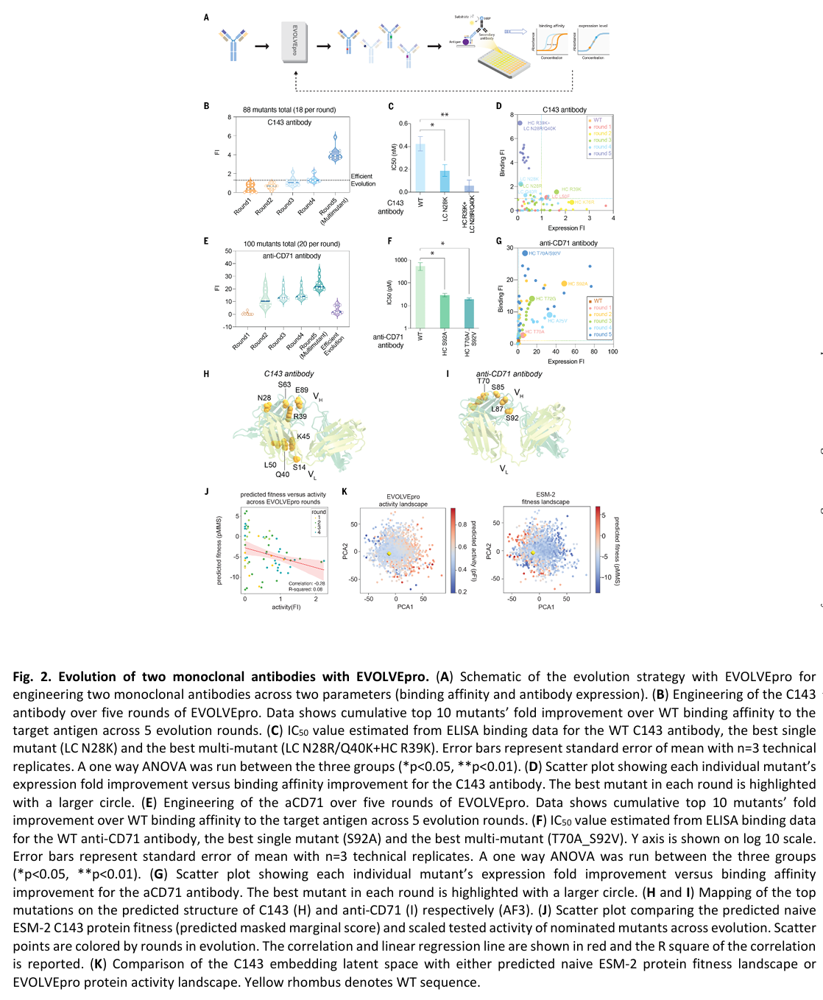
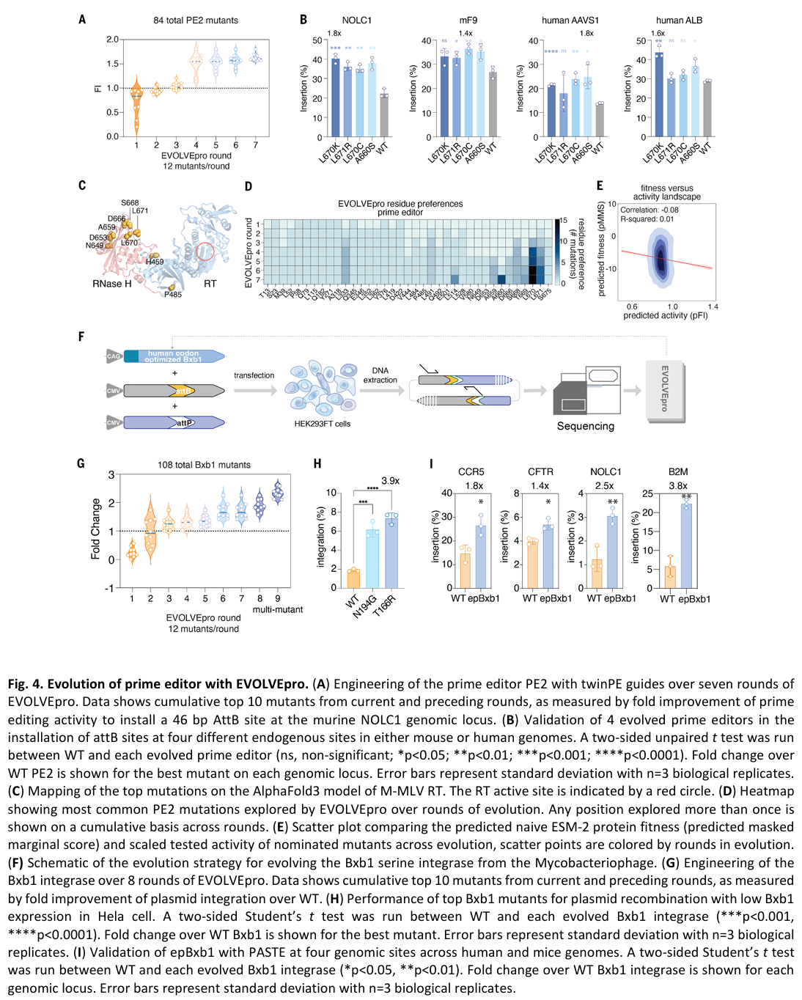

# EVOLVEpro：蛋白质语言模型驱动的快速定向进化
写在前面：  

在生物医学领域，**定向蛋白质进化**是优化蛋白质功能的关键技术，但传统方法面临实验复杂、多属性优化效率低以及局部最优陷阱等挑战。EVOLVEpro作为一种基于**蛋白质语言模型（PLMs）** 和回归模型的**少样本主动学习框架**，成功克服了这些难题，为蛋白质工程带来了革命性突破。  

  

## 背景
理解**蛋白质氨基酸序列与功能之间的关系**对于推动生物学发展和开发新疗法至关重要。实验方法如深度突变扫描（DMS）**只能探索蛋白质序列空间的一小部分**。同源序列的计算方法可以减少绘制适应度景观和优化蛋白质所需的实验数据，但这些方法需要多序列比对、高同源序列丰度和最小的序列长度变异。

为了克服这些挑战，可以通过在进化多样性上进行广泛训练来推断适应度。蛋白质语言模型（PLMs），如ESM2，通过在全面的蛋白质序列数据库上进行训练来填补缺失的氨基酸。**PLMs学习了用于蛋白质结构预测和功能注释的信息性生物学表征。** 然而，**零样本预测的突变体成功率有限，** 从头设计的蛋白质通常表现出与天然野生型（WT）序列相当或较低的活性。**优化迭代方法，如定向进化（DE），利用蛋白质适应度景观的平滑性来改善功能。** 尽管这些方法在具有合适活性景观和筛选方法的背景下是成功的，但它们可能劳动密集，并且在崎岖的景观中失败，尤其是在陷入局部最优时。  

本文提出的蛋白质进化模型EVOLVEpro通过**主动学习**和**最少的实验测试**提名高活性蛋白质变体，实现快速预测高活性突变体。该方法源于一种模块化方法，**将进化尺度的PLM与顶层回归模型结合，以学习蛋白质的活性景观并指导计算机模拟中的定向进化过程。** EVOLVEpro仅使用蛋白质序列，不需要结构信息、专家知识或先验数据。文中展示了EVOLVEpro**同时进化蛋白质多种活性的能力**，为其在生物学和医学中的应用开辟了广阔的可能性。

## 方法
**（1）使用蛋白质语言模型ESM2嵌入。** 如下图所示，蛋白质语言模型嵌入转换（ESM2-15B）将 $x_i$ 映射为一个嵌入序列，每个氨基酸对应一个嵌入，其中 $d$ 是嵌入空间的维度。为了减少特征数量并获得与蛋白质长度无关的固定大小表示，文中通过取所有氨基酸位置的平均值来计算平均嵌入向量。该向量是一个 $d$ 维向量，其表示整个蛋白质变体，然后将其用作EVOLVEpro的输入。  
  

**（2）EVOLVEpro 模型信息。** EVOLVEpro 框架中，随机森林回归器被用作顶层模型。随机森林回归器使用先前描述的由蛋白质语言模型生成的信息丰富的潜在空间平均嵌入向量作为输入特征，来预测每个变体的活性或适应性。这种集成学习方法结合多个决策树进行预测，具有抗过拟合的鲁棒性，并且能够捕捉数据中的复杂非线性关系。随机森林模型配置了 100 个估计器（即单个决策树）。使用 Friedman 均方误差（MSE）准则来评估分裂的质量。森林中的每棵树都在原始数据集的自助样本上进行训练。在树的每个节点处，通过最大化杂质减少量来确定最佳分裂。随机森林对新输入的最终预测是所有树的预测值的平均值。    
  

**主动学习方法。** 在 EVOLVEpro 的每一轮中，在当前数据集上训练随机森林后，文中使用该模型来预测其余未测试蛋白质变体的适应性值。然后，主动学习步骤选择最有潜力的变体用于下一轮的实验测试。  

**选择策略。** 文中探索了各种选择策略，包括选择在欧几里得空间中与训练集距离最远的嵌入向量，以及选择顶部和底部预测值的混合。经测试 top-n 策略是最有效的。top-n 策略是选择具有最高预测适应性值的 n 个变体。该策略旨在迭代地扩展随机森林预测范围的上限。通过关注顶部预测值，文中利用模型当前对嵌入空间中高适应性区域的理解，同时鼓励探索可能产生更好变体的附近区域。虽然这种贪心方法可能会忽略适应度景观的某些区域，但文中认为它与在有限的实验轮次中快速识别和优化高性能蛋白质变体的目标非常契合。  

**（3）数据集。** 为了进行模型基准测试，文中选取了 9 个现有的深度突变扫描（DMS）数据集，这些数据集曾在之前的一种零样本高适应性预测方法中使用。基于这项研究，文中利用每个数据集预先设定的高适应性变体的临界值，来挑选出低适应性和高适应性的变体。这里利用之前研究中既定的临界值，对这 9 个数据集中的变体按适应性高低进行筛选，为后续模型测试做准备。

文中还挑选了另外三个 DMS 数据集：一个与 AsCas12f 紧凑型基因组编辑器相关的数据集、新冠病毒刺突受体结合域相关数据集以及寨卡病毒包膜蛋白相关数据集。对于这些数据集，依据高活性变体的总体分布情况来设定临界值。在已有 9 个数据集基础上，新增 3 个不同类型的数据集，并根据这些新数据集自身高活性变体分布设定临界值，进一步丰富数据来源和类型。  

**（4）EVOLVEpro 参数网格搜索。**   
**适应度测量。** 使用每个数据集的原始适应度值，或者使用最小 - 最大归一化后的适应度值。这一步是在探索如何对适应度数据进行预处理，以找到最有利于模型优化适应性的方式。原始适应度值直接取自数据集，而最小 - 最大归一化是一种常见的数据标准化方法，将数据映射到 [0, 1] 区间，有助于在不同数据集间统一尺度，可能对模型性能产生不同影响。  

**第一轮策略。** 随机选择变体，或者利用基于蛋白质语言模型嵌入的 K - 中心点聚类进行多样化选择。在模型优化的第一轮，需要决定如何选择变体。随机选择变体是一种简单直接的方式，而基于 K - 中心点聚类的多样化选择则试图通过聚类算法，从蛋白质语言模型生成的嵌入向量中选择更具多样性的变体，为后续轮次的优化提供更丰富的起始点。  

**学习策略。** **随机选择。** 在后续轮次中，随机选择变体，这是一种简单的、不依赖模型预测或其他复杂规则的选择方式，用于对比其他更具针对性的选择策略。**选择预测适应度最高的前 n 个变体。** 基于模型预测的适应度值，挑选出排名靠前的 n 个变体，旨在直接关注模型认为最有潜力的变体，以快速提升整体适应度。**选择预测适应度最高的前 n/2 个变体和最低的后 n/2 个变体。** 这种策略不仅关注高适应度变体，还纳入低适应度变体，希望通过同时探索两个极端，更全面地了解适应度景观，可能有助于发现一些隐藏的规律或避免陷入局部最优。**选择与先前选择的变体在欧几里得嵌入距离上最大的变体。** 该策略侧重于选择与之前所选变体在特征空间（通过欧几里得距离衡量）中距离较远的变体，以增加选择的多样性，探索模型未充分覆盖的区域。  

**嵌入类型。** 文中比较了不同的嵌入表示，包括原始嵌入，以及主成分分析（PCA）降维后的嵌入（维度从 10 到 1000），以适应高维度（p）、低样本量（n）的模式。这一过程完全在最大的（150 亿参数）ESM2 模型上进行。由于数据集可能具有高维度特征但样本量相对较少，不同的嵌入方式可能会影响模型对数据的理解和处理能力。原始嵌入保留了数据的原始特征表示，而 PCA 降维后的嵌入通过提取主要成分来降低维度，在减少计算量的同时可能保留关键信息，不同的降维维度也会产生不同效果，通过比较来确定最适合的嵌入类型。  

**回归类型。** 文中评估了多种用于适应度预测的回归模型，包括岭回归、套索回归、弹性网络回归、线性回归、具有线性最后一层的神经网络、随机森林回归、K 近邻回归、高斯过程回归和梯度提升回归。这些模型大多使用默认参数。不同的回归模型对数据的拟合方式和捕捉复杂关系的能力不同，在适应度预测任务中可能会有不同表现。通过使用默认参数进行评估，可以在相对统一的条件下比较各模型的性能，找出最适合该任务的回归模型。

对于每个参数组合，文中运行了三次模拟（以改变第一轮选择的变体），每轮使用 16 个变体来考虑随机变异性。性能评估使用更新后的模型预测的前 16 个变体中高适应度变体的比例。文中通过统计每个参数值在多少个数据集中实现了最高的平均适应度二元百分比来量化每个参数值的整体有效性。这个 “获胜策略” 计数提供了一个简单而有用的总结，即哪些方法在不同的蛋白质系统中最为成功。“获胜策略” 是第一轮随机选择、原始适应度、前 n 选择、随机森林回归和原始嵌入。通过多次模拟和对不同数据集的评估，确定了在不同蛋白质系统中相对最优的参数组合，即 “获胜策略”，为后续的模型优化和应用提供了参考依据。多次模拟可以减少随机因素对结果的影响，使评估结果更具可靠性。**通过统计在多个数据集上的表现来确定最优策略，能更好地适应不同类型的蛋白质系统。**

## 结果
### EVOLVEpro 模型的开发与基准测试。
**（1）EVOLVEpro 模型框架概述。** 基于深度学习的定向进化框架 EVOLVEpro 结合了：（i）一个蛋白质语言模型（PLM），将蛋白质序列编码到一个连续的潜在空间中，以促进活性优化；（ii）一个顶层回归模型，从少量数据点中学习潜在空间与活性之间的映射关系。EVOLVEpro 在多轮进化中主动学习适应度景观。在每一轮中，回归模型根据预测的活性对蛋白质序列进行排序，选择排名靠前的序列进行实验验证。反复执行这些循环，以提高特定蛋白质的活性，直到达到期望水平（图 1A）。这里阐述了 EVOLVEpro 的核心组成部分，PLM 用于对蛋白质序列进行编码，顶层回归模型则建立潜在空间与活性的联系，通过多轮迭代优化蛋白质活性。  

**（2）准备数据集优化模型架构。** 文中首先整理了 12 个深度突变扫描（DMS）数据集对 EVOLVEpro 的计算框架进行了优化。在进行任何实验测试之前，通过模拟运行来选择最优的架构和参数。这种模拟仅向 EVOLVEpro 展示模型提名变体的真实活性数据。为模型基准测试选择的 12 个 DMS 数据集涵盖了多种活性，包括病毒刺突蛋白、RNA 引导的核酸酶、DNA 结合蛋白、RNA 结合蛋白和激酶，这最大化了模型架构的通用性，该模型架构将作为整个研究后续实验应用中的最终 EVOLVEpro 模型。通过整理多个不同类型的 DMS 数据集，在计算机模拟中优化模型的架构和参数，利用这些多样的数据集增强模型通用性，为后续实验应用奠定基础。  

**（3）EVOLVEpro 架构的参数优化。** 文中针对五个参数对 EVOLVEpro 架构进行了优化：**（i）第一轮突变体选择策略；（ii）学习活性景观的顶层回归模型；（iii）选择下一轮突变体的主动学习策略；（iv）实验测量活性的数据处理方式；（v）PLM 嵌入向量转换。** 首先选择 ESM - 2 作为基础 PLM，因为它具有大量的训练数据，且模型规模分别大于 2 亿个蛋白质和 150 亿个参数。使用 ESM - 2 150 亿参数模型，网格搜索发现最优策略是：（i）随机选择第一轮变体；（ii）使用随机森林回归判别模型预测蛋白质活性；（iii）使用所有氨基酸平均的嵌入向量；（iv）在每轮进化中使用前 N 选择策略。该模型在仅五轮内就高频提名了功能获得性蛋白质变体，并且在所有 DMS 数据集中，提名的顶级突变体的中位活性和活性都逐轮快速增加。通过对五个关键参数的优化，确定了最优策略，该策略在多轮进化中能有效提升蛋白质变体的活性，并且研究了每轮变体数量对性能的影响，展示了 EVOLVEpro 在不同实验规模下的适用性。  

**（4）PLM 模型的比较与选择。** 在优化顶层模型和学习策略后，文中考察了一系列的 PLM。使用网格搜索得到的最优参数，文中比较了 ESM - 2 150 亿参数模型与较小版本的 ESM - 2、ESM - 1、UniRep、ProtT5、ProteinBERT、Ankh、独热编码以及整数编码的蛋白质表示，在 12 个数据集上识别最高活性候选物的能力。确定了 ESM - 2 150 亿参数模型在识别高活性候选物方面的优势，同时研究了输入维度对模型性能的影响，发现全长嵌入在多数数据集及困难任务中表现更好。（图 1B）   

**（5）与其他方法比较。** 由于机器学习驱动的定向进化（MLDE）方法需要预训练一个判别模型，文中比较了经过不同程度预训练的增强型 EVOLVEpro（图 1C）。主动学习大幅减少了所需突变体的总数：仅经过 5 轮进化（每轮 16 个突变体）的 EVOLVEpro 性能与预训练 160 个突变体的 EVOLVEpro 相当，而 10 轮进化（每轮 16 个突变体）的性能与预训练 500 个突变体相当。此外，EVOLVEpro 的表现优于零样本预测方法（图 1C）。这种比较证实了 EVOLVEpro 的少样本特性允许以最小的努力和每轮低 N 测试实现高效的定向进化（图 1C）。为了探究 EVOLVEpro 是否受益于更擅长外推复杂景观的基础模型，文中比较了随机森林回归器、高斯过程回归器和基于 k 近邻的回归器的性能，发现随机森林回归器表现最佳。**通过与不同预训练程度的自身以及零样本预测方法比较，体现了 EVOLVEpro 少样本特性在高效定向进化中的优势，同时比较不同回归器性能，再次确认随机森林回归器在低 N 情况下的优势。**   

**（6）每轮活性提升分析。** 文中还分析了 EVOLVEpro 与独热编码、整数编码以及零样本预测相比每轮的活性提升情况。每轮 16 个突变，EVOLVEpro 在每个数据集的第 5 轮都发现了活性显著增强的变体（图 1D）。此外，独热编码和整数编码框架在进化过程中往往更早饱和，且从未达到 EVOLVEpro 所实现的活性水平。有趣的是，文中还观察到一些蛋白质在第 3 轮后蛋白质活性出现非线性增加，这表明随着 EVOLVEpro 进化的进行，在绘制蛋白质活性景观方面有更显著的收获。**通过与其他编码方式和零样本预测比较，突出了 EVOLVEpro 在提升蛋白质活性方面的优势，以及进化过程中蛋白质活性的非线性变化特点。**  

  

### 使用 EVOLVEpro 进行抗体优化
文中使用EVOLVEpro优化了两个治疗相关的单克隆抗体：C143（针对SARS-CoV-2刺突蛋白的抗体）和aCD71（针对人类转铁蛋白受体的抗体，用于将药物和siRNA递送到肌肉和心脏细胞）。**文中设计了多目标优化，使用EVOLVEpro优化抗体的表达水平和与目标抗原的结合亲和力（图2A）。**   

**C143 抗体的优化。** 对于C143的进化，文中使用酶联免疫吸附测定（ELISA）量化了与SARS-CoV-2刺突蛋白SP6稳定变体的结合亲和力。经过3轮EVOLVEpro进化后，结合亲和力得到改善，超过了之前的零样本方法（图2B）。在第4轮中发现轻链突变体（N28K）有显著改善，IC50为0.19 nM（图2C）。4轮单突变后，文中使用EVOLVEpro设计了第五轮的多突变组合。最佳多突变组合（轻链N28R/Q40K与重链R39K）与SP6刺突抗原的结合IC50为60 pM（图2C）。另外结果发现许多改进的结合剂在产量上有所妥协（图2D），这是多目标设计中偏向结合的结果。文中还分析了前10个突变在热点区域的出现频率和与种系序列的偏差。发现前10个突变中没有一个是回复到种系未突变共同祖先序列（UCA）的。  

**aCD71抗体的优化。** 对于CD71抗体进化，文中使用酶联免疫吸附测定（ELISA）测量了与人类TfR蛋白的结合亲和力，并使用抗IgG测量了抗体表达。经过几轮EVOLVEpro进化看到了结合亲和力的改善（图2E）。在第4轮中发现最佳单突变体重链S92A与抗原的结合IC50为29 pM，显著高于野生型的551 pM（图2F）。在第5轮多突变中，文中改善了结合和表达，重链T70A/S92V突变体与hTfr蛋白的结合IC50为19 pM（图2F）。在分析aCD71抗体突变的新颖性时，发现前10个突变中只有一个是回复到种系未突变共同祖先序列（UCA）的，位于V73位置。  

**结构建模。** 此外文中使用AF3对抗CD71和C143抗体的结构进行建模（图2H和I）。发现EVOLVEpro在C143抗体的框架区域有两个主要的探索簇，轻链突变S14、Q40、L50和K45共定位，重链突变R39、S63和E89紧密相邻。

**活性与预测适应度的关系。** 将突变体的适应度计算为ESM2嵌入中的预测边际掩码得分（pMMS），发现EVOLVEpro变体的活性与预测的ESM2适应度不相关（图2J）。   

**进化轨迹。**  通过计算每轮的几何中点，分析从第1轮到最后一轮的进化轨迹，发现顶层模型将进化过程导向C143抗体的PCA1较高侧和抗CD7的PCA2较高侧，这与更高的蛋白质功能相关。    

   

### 使用 EVOLVEpro 进化 CRISPR 核酸酶
可编程的RNA引导核酸酶在基础生物学、治疗和诊断中有广泛的应用。然而，常用的核酸酶，如来自化脓性链球菌的Cas9（SpCas9），体积太大，无法有效包装到常见的腺相关病毒（AAV）载体中，而更紧凑的高效核酸酶，如来自金黄色葡萄球菌的Cas9（SaCas9），仍然无法使用较大的调控元件或蛋白质融合。小型Cas12f核酸酶具有紧凑的尺寸（<700个残基），但效率较低，需要工程化改造以用于基因组编辑应用。**文中测试了EVOLVEpro是否能够快速开发高活性的Cas12f变体，以加速小型核酸酶的工程化。**  

**EVOLVEpro进化过程。** 文中选择了来自铜绿假单胞菌的Cas12f（PsaCas12f）进行进化，以内源性RNF2位点的插入/缺失（indel）形成作为优化指标（图3A）。经过每轮12个单突变体的四轮进化，EVOLVEpro产生了PsaCas12f的点突变体，插入/缺失形成提高了4.9倍。最佳变体PsaCas12f K333V在RNF2位点的插入/缺失效率超过40%（图3B）。为了识别EVOLVEpro提名突变体之间的协同作用，文中将前几轮的最佳变体组合到第五轮中。并评估了这些多突变体，发现PsaCas12f I178A/K333V/K454P在RNF2位点产生了约50%的插入/缺失活性。  

**测试。** **广泛测试：** 为了验证epPsaCas12f的改进活性，文中在五个内源性基因组位点的10个不同靶点上评估了该酶，与野生型PsaCas12f和七个先前表征的Cas12效应器进行了比较。**体内基因组编辑应用：** 将epPsaCas12f应用于体内基因组编辑，利用其紧凑的尺寸进行单载体病毒递送。**PCSK9基因编辑：** 设计了靶向小鼠PCSK9基因外显子3上游序列的引导RNA（图3D）。**体内实验：** 在AAV注射后14天内跟踪了血液PCSK9水平，发现14天后显著下降至原始水平的约50%（图3F）。

为了理解EVOLVEpro提名的有益突变的机制，文中使用AF3预测了PsaCas12f的结构（图3G）。通过计算模型探索的各个残基的累积频率，分析了模型对蛋白质中特定残基的关注点。多个残基被模型反复提名，包括G147和E451（图3H）。

此外，文中也同样计算了每个提名突变体的预测边际掩码得分（pMMS），以理解基础层PLM的适应度预测与实际测量的蛋白质活性之间的关系（图3I）。  

**全局突变轨迹。** 文中进一步将基础层PLM的适应度得分和顶层随机森林回归器的活性得分投影到EMS2潜在空间中，以理解EVOLVEpro的全局突变轨迹（图3J-L）。  

  

### 用 EVOLVEpro 优化 prime editors
许多分子工具，如下一代基因组编辑蛋白质，作为多个酶协同工作。Prime editing（PE）使用RNA模板逆转录酶可编程地安装多种基因组编辑，是SpCas9切口突变体（nCas9）与工程化的莫洛尼鼠白血病病毒逆转录酶（M-MLV RT）[D200N, L603W, T306K, W313F, T330P]（称为PE2）的融合。文中使用EVOLVEpro改进这些理性突变。  

由于基于PE的插入在安装较长（>40 nt）编辑时存在困难，因此专注于具有较长（46 bp）插入的编辑结果，这对可编程基因插入方法（如PASTE）特别有用。文中使用先前描述的双PE（twinPE）方法设置了进化策略，其中两个重叠的pegRNA组合使用，以在鼠肝细胞系（Hepa1-6）的NOLC1位点安装46bp的attB位点。经过连续几轮优化，发现EVOLVEpro逐渐学习了PE2逆转录酶（RT）的活性景观，在初始随机选择轮后产生了改进的变体，并在第4轮显著改进了基于PE2的编辑（图4A）。为了检查进化过程中可能产生的对基因组中单个位点的偏差，文中在两个细胞系中的三个额外基因组位点（人类AAVS1、人类ALB和小鼠Factor IX）测试了表现最佳的四个变体（A660S、L670C、L670K和L671R）。将顶级突变投影到AF3预测的RT结构上，发现大多数突变集中在C端RNA聚合酶H（RNase H）结构域（图4C）。文中进一步分析了EVOLVEpro在进化过程中对残基位点的偏好，观察到对L670、L671和A660等残基的关注，表明模型正在学习这些位点可能对提高活性非常有益（图4D）。通过底层PLM计算的预测适应度（pMMS）分析再次显示了prime editor的适应度与活性之间的差异（图4E）。最后，文中通过将随机森林回归器学习的活性景观和基础层ESM2的蛋白质适应度景观投影到嵌入的前两个PCA上，试图理解全局突变轨迹。进化轨迹明显的向PCA2蛋白质嵌入维度较低侧移动，表明顶层正在将序列推向潜在空间中的该区域。   

  

### 使用 EVOLVEpro 对 Bxb1 整合酶定向进化
LSRs（大丝氨酸重组酶） 是一类能够精确重排 DNA 的酶，是基因组编辑的重要工具。Bxb1 整合酶 是 LSRs 的一种，用于真核细胞中的基因插入技术 PASTE。然而，Bxb1 的活性在细胞中仅能达到 20% 到 60% 的饱和水平，限制了其整体整合效率。**研究目标是利用 EVOLVEpro 技术对 Bxb1 进行定向进化，提高其活性，并展示其在 PASTE 技术中的应用改进。**  

**实验设计：** 在 HEK293FT 细胞 中设计了一个简单的整合实验，将含有 AttP 的 DNA 质粒插入含有 AttB 靶点的质粒中（图 4F）。通过 下一代测序（NGS） 测量整合效率，进化策略旨在优化这一效率。**进化过程：** 首先生成 11 个随机点突变的 Bxb1 变体，经过 9 轮进化后，获得了活性比野生型（WT）高 2.6 倍的突变体（图 4G）。  

**验证进化结果。** Bxb1 本身活性较高，因此进化后的活性提升接近饱和水平。在 Hela 细胞 中进行质粒滴定实验，验证了在低 Bxb1 表达下，重组效率提高了四倍（图 4H）。进一步验证：在 HEK293FT 细胞 中使用慢病毒预装 attB 位点，发现 EVOLVEpro 突变体的整合效率比野生型提高了四倍。将 T166R 突变体 命名为 epBxb1（EVOLVEpro 增强型 Bxb1）。在 PASTE 技术 中测试 epBxb1 变体，比较其与野生型 Bxb1 在五个不同基因组位点的插入效率。结果显示，epBxb1 在大片段 DNA 插入效率上提高了四倍，表明其活性提升具有普遍性（图 4I）。

**结构分析与突变机制。** AF3 预测模型显示，EVOLVEpro 的有益突变集中在 Bxb1 的 DNA 结合域，可能提高了其与 DNA 靶标的亲和力。其中，V292S 突变可能直接与 DNA 磷酸骨架相互作用，而其他突变可能通过间接作用调节 DNA 结合。表明 EVOLVEpro 能够识别蛋白质功能重要区域。  

**活性与适应度的关系以及进化轨迹。** 计算了 Bxb1 整合酶的 适应度（pMMS） 和 活性（观察到的倍数提升） 之间的关系，发现两者呈弱正相关。这表明在某些蛋白质家族中，蛋白质稳定性和适应度可以预测活性，但相关性较弱。EVOLVEpro 的全局突变图谱与 ESM2 预测的适应度（pMMS）相关性更弱，进一步表明 EVOLVEpro 能够在全局范围内学习蛋白质活性，而仅靠稳定性/适应度预测不足以实现快速高效的蛋白质进化。  

### 使用 EVOLVEpro 对 T7 RNA 聚合酶（T7 RNAP） 进行多目标优化
