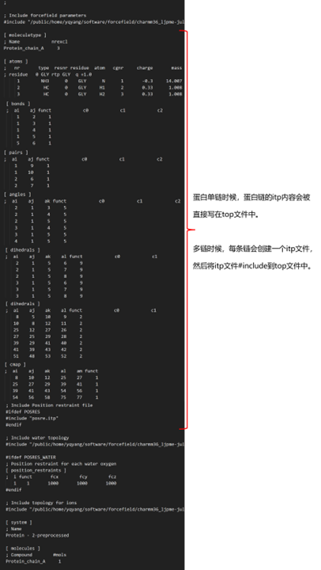
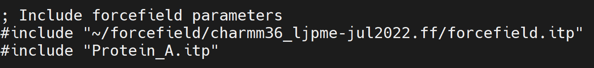
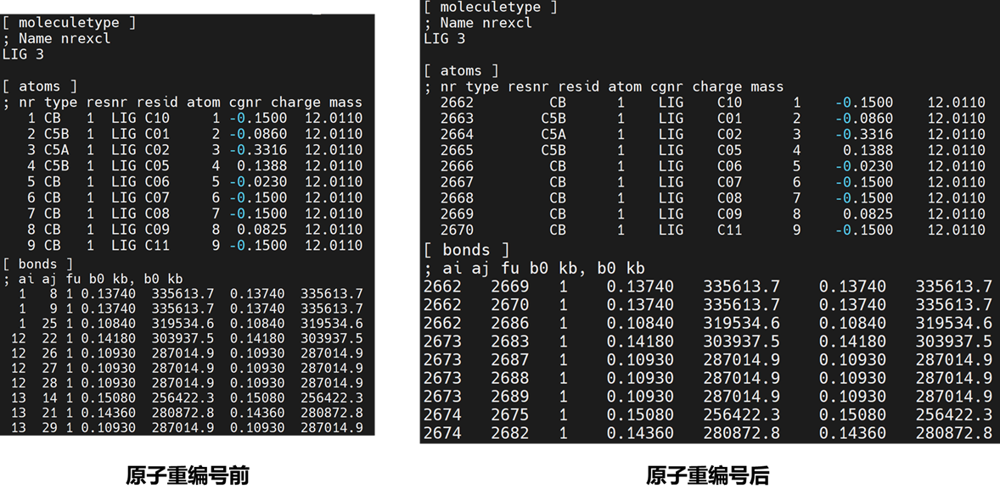
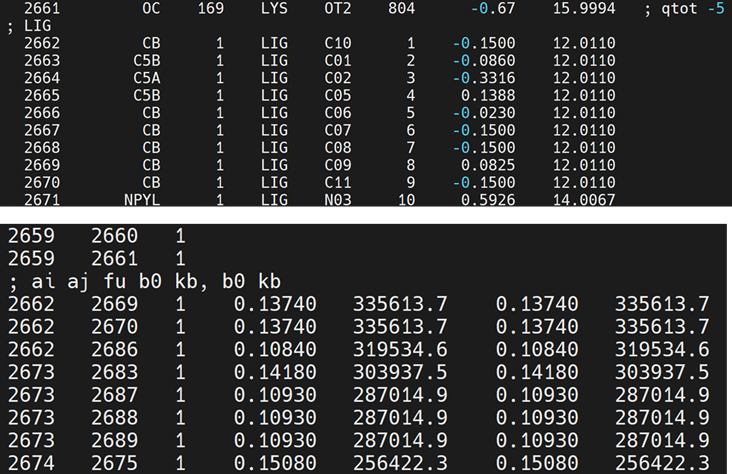
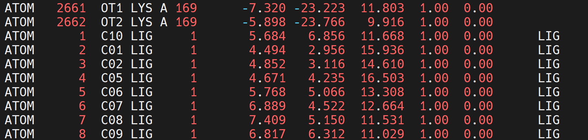
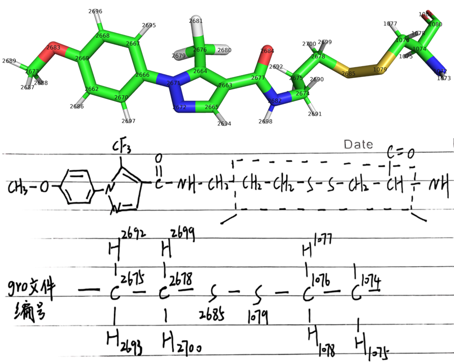
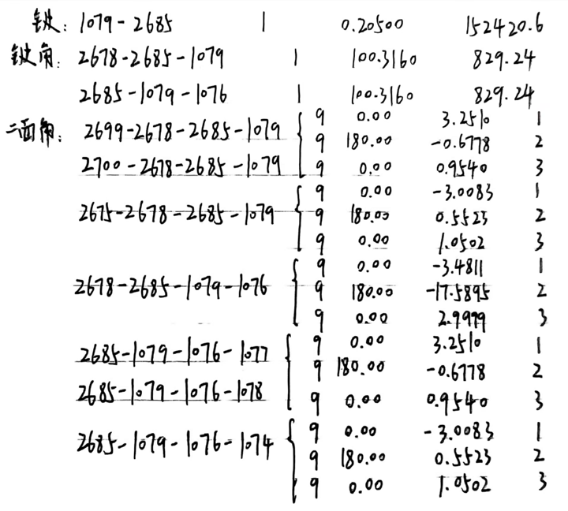

# Gromacs进行共价体系蛋白配体动力学模拟：蛋白使用pdb2gmx charmm36，共价小分子使用swissparam（续）
**写在前面：** 这篇是文章[]()的后续。文章[]()中设置共价的方式是在[ intermolecular_interactions ]字段使用分子间限制（距离限制，角度限制，二面角限制）模拟共价作用。[ intermolecular_interactions ]字段中不能使用成化学键的bond type (type 1)，所以选用了距离限制（type 6）代替。所以真实模拟时候确实能模拟近似共价的效果。本篇文章则不使用[ intermolecular_interactions ]字段，而是将蛋白配体itp合并，将共价相关信息直接加入[ bonds ]，[ angles ]，[ dihedrals ]中进行更加准确的模拟。**如果后续进行共价体系的模拟更加推荐本文的做法。**  

本文在文章[]()的基础上仍以PDBid：5VBM为例将重点介绍如何在GROMACS平台上进行共价体系的蛋白-配体动力学模拟，利用CHARMM36为蛋白质提供强大的力场支持，同时使用SwissParam为共价小分子配体生成定制的力场参数。另外，本文重点介绍共价相关的文件准备，其他步骤可参考文章[]()。  

## 使用SwissParam产生共价配体92V的MMFF力场参数itp文件
参考文章[]()中的 使用SwissParam产生共价配体92V的MMFF力场参数itp文件。  
## pdb2gmx产生共价反应后蛋白的拓扑与力场
参考文章[]()中的 pdb2gmx产生共价反应后蛋白的拓扑与力场。  
## 修改拓扑文件构建共价结构和力场参数（键，键角，二面角等参数）
本文不同之处主要在此部分。为了能将共价相关部分加到top文件的bond，angle等字段中。首先需要将蛋白配体的itp进行合并，配体原子序号重新编号。然后将配体各个字段加到总的top文件中，最后将共价相关的键，键角，二面角等参数加入到总体top文件的bond，angle等字段中。  

**（1）修改结构pdb文件，删除多余原子。** 将72位的CYS残基中的HG1原子删除。  

**（2）修改蛋白部分top文件。** topol.top文件结构如下图所示。    
   

这里将蛋白单链的itp部分单独写入到一个itp文件中并将其#include入top文件中。如下图。  
  

修改Protein_A.itp文件，删除其中72位残基的HG1原子，并将整个文件的原子重新编号，修改键，键角，二面角的原子编号。可参考下述脚本 modifyiptfile.py 进行itp文件修改。  
```python
import os
from collections import defaultdict

class Lig_itp:

    def __init__(self, lig_itp_file):

        self.moleculetype = list()
        self.atoms = list()
        self.bonds = list()
        self.pairs = list()
        self.angles = list()
        self.dihedrals = list()
        self.imp = list()
        self.cmap = list()

        index = 0
        dihe_index = 0
        flag_mol = ""
        with open(lig_itp_file) as f:
            lines = f.readlines()

        self.title = lines[0]
        self.end = lines[-4:]

        while index < len(lines):
            line = lines[index]

            if line.startswith("[") and line.strip().endswith("]"):
                flag_mol = line.strip()
                if flag_mol == "[ dihedrals ]":
                    dihe_index += 1
            if flag_mol == "[ moleculetype ]":
                self.moleculetype.append(line)
            elif flag_mol == "[ atoms ]":
                self.atoms.append(line)
            elif flag_mol == "[ bonds ]":
                self.bonds.append(line)
            elif flag_mol == "[ pairs ]":
                self.pairs.append(line)
            elif flag_mol == "[ angles ]":
                self.angles.append(line)
            elif flag_mol == "[ dihedrals ]":
                if dihe_index == 1:
                    self.dihedrals.append(line)
                else:
                    self.imp.append(line)

            elif flag_mol == "[ cmap ]":
                self.cmap.append(line)

            index += 1

    def get_residues(self):

        self.resi_lines = defaultdict(list)
        for i in self.atoms:
            if i.startswith("[") or i.startswith(";   nr") or i.startswith("\n"):
                pass
            else:
                if i.startswith("; residue"):
                    line = i.split()
                    resi = line[2]
                    self.resi_lines[resi].append(i)
                else:
                    self.resi_lines[resi].append(i)
        return self.resi_lines

itp = Lig_itp("Protein_A.itp")
rt = open("Protein_A_1.itp", "w")
rt.write("".join(itp.moleculetype))
resi_lines = itp.get_residues()

need_del = ["HG1", ]

new_resi14 = list()
del_id = list()
for i in resi_lines["72"]:
    if i.startswith(";"):
        new_resi14.append(i)
    else:
        line = i.split()
        if line[4] in need_del:
            del_id.append(line[0])
        else:
            new_resi14.append(i)
resi_lines["72"] = new_resi14

rt.write("[ atoms ]\n")
rt.write(";   nr       type  resnr residue  atom   cgnr     charge       mass  typeB    chargeB      massB\n")
index_id = 1
dict_resiname_id = dict()
dict_resiname_id_old = dict()
old2new_id = dict()
for i in resi_lines.keys():
    lines = resi_lines[i]
    for a in lines:
        if a.startswith(";") or a.startswith("\n"):
            rt.write(a)
        else:
            a_lines = a.split()
            dict_resiname_id[(i,a_lines[4])] = index_id
            dict_resiname_id_old[(i,a_lines[4])] = a_lines[0]
            old2new_id[a_lines[0]] =str(index_id)
            rt.write("{:6} ".format(index_id)+a[7:])
            index_id += 1
rt.write("\n")

for i in itp.bonds:
    flag = True
    print(i)
    if i.startswith(";") or i.startswith("["):
        rt.write(i)
    elif i.startswith("\n"):
        pass
    else:
        line = i.strip().split()
        for a in line:
            print(a)
            if a in del_id:
                flag = False
        if flag:
            rt.write("{:6} {:6} {:6}\n".format(old2new_id[line[0]], old2new_id[line[1]], line[2]))
rt.write("\n")

for i in itp.pairs:
    flag = True
    print(i)
    if i.startswith(";") or i.startswith("[") or i.startswith("\n"):
        rt.write(i)
    else:
        line = i.strip().split()
        for a in line:
            print(a)
            if a in del_id:
                flag = False
        if flag:
            rt.write("{:6} {:6} {:6}\n".format(old2new_id[line[0]], old2new_id[line[1]], line[2]))

for i in itp.angles:
    flag = True
    print(i)
    if i.startswith(";") or i.startswith("["):
        rt.write(i)
    elif i.startswith("\n"):
        pass
    else:
        line = i.strip().split()
        for a in line:
            print(a)
            if a in del_id:
                flag = False
        if flag:
            rt.write("{:6} {:6} {:6} {:6}\n".format(old2new_id[line[0]], old2new_id[line[1]], old2new_id[line[2]], line[3]))
rt.write("\n")

for i in itp.dihedrals:
    flag = True
    print(i)
    if i.startswith(";") or i.startswith("["):
        rt.write(i)
    elif i.startswith("\n"):
        pass
    else:
        line = i.strip().split()
        for a in line:
            print(a)
            if a in del_id:
                flag = False
        if flag:
            rt.write("{:6} {:6} {:6} {:6} {:6}\n".format(old2new_id[line[0]], old2new_id[line[1]], old2new_id[line[2]], old2new_id[line[3]], line[4]))
rt.write("\n")

for i in itp.imp:
    flag = True
    print(i)
    if i.startswith(";") or i.startswith("["):
        rt.write(i)
    elif i.startswith("\n"):
        pass
    else:
        line = i.strip().split()
        for a in line:
            print(a)
            if a in del_id:
                flag = False
        if flag:
            rt.write("{:6} {:6} {:6} {:6} {:6}\n".format(old2new_id[line[0]], old2new_id[line[1]], old2new_id[line[2]], old2new_id[line[3]], line[4]))
rt.write("\n")

for i in itp.cmap:
    flag = True
    print(i)
    if i.startswith(";") or i.startswith("[") or i.startswith("\n") or i.startswith("#"):
        rt.write(i)
    else:
        line = i.strip().split()
        for a in line:
            print(a)
            if a in del_id:
                flag = False
        if flag:
            rt.write("{:6} {:6} {:6} {:6} {:6} {:6}\n".format(old2new_id[line[0]], old2new_id[line[1]], old2new_id[line[2]], old2new_id[line[3]], old2new_id[line[4]], line[5]))

print(del_id)

rt.close()

os.rename("Protein_A.itp", "Protein_A_2.itp")
os.rename("Protein_A_1.itp", "Protein_A.itp")
os.rename("Protein_A_2.itp", "Protein_A_1.itp")

with open("posre.itp") as f:
    f1 = f.readlines()
rt = open("posre_1.itp", "w")
for i in f1:
    if i.startswith(";") or i.startswith("[") or i.startswith("\n"):
        rt.write(i)
    else:
        print(i)
        line = i.strip().split()
        rt.write("{:>6} {:>6} {:>6} {:>6} {:>6}\n".format(old2new_id[line[0]],line[1],line[2],line[3],line[4],))
rt.close()

os.rename("posre.itp", "posre_2.itp")
os.rename("posre_1.itp", "posre.itp")
os.rename("posre_2.itp", "posre_1.itp")

```

**（3）将配体部分拓扑原子序号重新编号。** 如前所述，需将蛋白的拓扑和配体的拓扑合并到一个文件中。根据上述蛋白部分的原子编号紧接着对配体部分原子重新编号。配体跟在蛋白最后（与gro文件中的原子顺序对应）。    

首先，将post.itp文件分作两部分，第一部分[ atomtypes ]和[ pairtypes ]两个字段保存为LIG.par，因为在总的拓扑中这两个字段必须在所有[ moleculetype ]字段前，否则会报错；第二部分为除去第一部分的其他内容，保存为LIG.prm。  

然后，查看Protein_A.itp中蛋白部分最后一个原子编号是2661，所以配体部分原子需要从2662开始重新编号。可参考下述脚本 reindexlig.py 对LIG.prm进行配体原子编号重排。  
```shell
import os
from collections import defaultdict

class Lig_itp:

    def __init__(self, lig_itp_file):

        self.moleculetype = list()
        self.atoms = list()
        self.bonds = list()
        self.pairs = list()
        self.angles = list()
        self.dihedrals = list()
        self.imp = list()
        self.posres = list()

        index = 0
        dihe_index = 0
        flag_mol = ""
        with open(lig_itp_file) as f:
            lines = f.readlines()

        while index < len(lines):
            line = lines[index]

            if line.startswith("[") and line.strip().endswith("]"):
                flag_mol = line.strip()
                if flag_mol == "[ dihedrals ]":
                    dihe_index += 1
            if line == "#ifdef POSRES_LIGAND\n" or line == "[ position_restraints ]\n":
                flag_mol = "posres"
            if flag_mol == "[ moleculetype ]":
                self.moleculetype.append(line)
            elif flag_mol == "[ atoms ]":
                self.atoms.append(line)
            elif flag_mol == "[ bonds ]":
                self.bonds.append(line)
            elif flag_mol == "[ pairs ]":
                self.pairs.append(line)
            elif flag_mol == "[ angles ]":
                self.angles.append(line)
            elif flag_mol == "[ dihedrals ]":
                if dihe_index == 1:
                    self.dihedrals.append(line)
                else:
                    self.imp.append(line)

            elif flag_mol == "posres":
                self.posres.append(line)

            index += 1

id_start = 2661

itp = Lig_itp("LIG.prm")
rt = open("LIG_1.prm", "w")
rt.write("".join(itp.moleculetype))
for i in itp.atoms:
    if i.startswith(";") or i.startswith("\n") or i.startswith("["):
        rt.write(i)
    else:
        line = i.replace("\n", "").split()
        rt.write("{:>6} {:>10} {:>6} {:>6} {:>6} {:>6} {:>10} {:>10}  \n".format(int(line[0])+id_start, line[1], line[2], line[3], line[4], line[5], line[6], line[7]))
rt.write("\n")

for i in itp.bonds:
    if i.startswith(";") or i.startswith("\n") or i.startswith("["):
        rt.write(i)
    else:
        line = i.replace("\n", "").split()
        rt.write("{:<3}   {:<3}   {:<1}   {:>8}   {:>8}   {:>8}   {:>8}  \n".format(int(line[0])+id_start, int(line[1])+id_start, line[2], line[3], line[4], line[5], line[6]))
rt.write("\n")

for i in itp.pairs:
    if i.startswith(";") or i.startswith("\n") or i.startswith("["):
        rt.write(i)
    else:
        line = i.replace("\n", "").split()
        rt.write("{:<3}   {:<3}   {:<1}  \n".format(int(line[0])+id_start, int(line[1])+id_start, line[2]))
rt.write("\n")

for i in itp.angles:
    if i.startswith(";") or i.startswith("\n") or i.startswith("["):
        rt.write(i)
    else:
        line = i.replace("\n", "").split()
        rt.write("{:<3}   {:<3}   {:<3}   {:<1}   {:>8}   {:>8}   {:>8}   {:>8}  \n".format(int(line[0])+id_start, int(line[1])+id_start, int(line[2])+id_start, line[3], line[4], line[5], line[6], line[7]))
rt.write("\n")

for i in itp.dihedrals:
    if i.startswith(";") or i.startswith("\n") or i.startswith("["):
        rt.write(i)
    else:
        line = i.replace("\n", "").split()
        rt.write("{:<3}   {:<3}   {:<3}   {:<3}   {:<1}   {:>8}   {:>8}   {:<1}   {:>8}   {:>8}   {:<1}  \n".format(int(line[0])+id_start, int(line[1])+id_start, int(line[2])+id_start, int(line[3])+id_start, line[4], line[5], line[6], line[7], line[8], line[9], line[10]))
rt.write("\n")

for i in itp.imp:
    if i.startswith(";") or i.startswith("\n") or i.startswith("["):
        rt.write(i)
    else:
        line = i.replace("\n", "").split()
        rt.write("{:<3}   {:<3}   {:<3}   {:<3}   {:<1}   {:>8}   {:>8}   {:>8}   {:>8}  \n".format(int(line[0])+id_start, int(line[1])+id_start, int(line[2])+id_start, int(line[3])+id_start, line[4], line[5], line[6], line[7], line[8]))
rt.write("\n")

for i in itp.posres:
    if i.startswith(";") or i.startswith("\n") or i.startswith("[") or i.startswith("#"):
        rt.write(i)
    else:
        line = i.replace("\n", "").split()
        rt.write("{:<3}   {:<1}   {:<5}   {:<5}   {:<5}  \n".format(int(line[0])+id_start, line[1], line[2], line[3], line[4]))
rt.write("\n")

os.rename("LIG.prm", "LIG_2.prm")
os.rename("LIG_1.prm", "LIG.prm")
os.rename("LIG_2.prm", "LIG_1.prm")
```
原子编号重排后结果如下图所示：   
  

**（4）将配体重新编号的拓扑及参数复制进入蛋白拓扑中。** 将LIG.prm内容复制进入Protein_A.itp文件对应的字段中。如下图所示：   
  

**（5）合并pdb文件。** 将配体post.pdb添加到build.pdb文件末尾。如下图：  
  

**（6）生成复合物所有原子重新排序的gro文件。** 
```shell
gmx editconf -f build.pdb -o newbox.gro -bt cubic -d 0.8 
```

**（7）确定共价相关的拓扑和参数。** 如何确定共价相关的键，键角和二面角参数也可参考[]()和[]()两篇文章。如下图所示，首先找出共价键相关的键，键角和二面角。  
  

但是共价反应产生的力场中仅延伸到CYS残基的CB原子，并没有延申到CA原子。所以根据上述已有的文件是没办法获得含有CA原子的二面角参数的。所以这里将分子结构mol2文件多保存一些然后使用SwissParam基于MMFF再产生一次力场参数。输入结构如下图所示，并根据参数文件将上述确实的参数匹配补齐。   
  

将下述内容也加到拓扑文件Protein_A.itp对应字段中：  
```text
[ intermolecular_interactions ]
[ bonds ]
; ai aj fu b0 kb, b0 kb
1079   2685   6   0.20500   152420.6   
[ angles ]
; ai aj ak fu th0 kth ub0 kub th0 kth ub0 kub
2678   2685   1079   1   100.3160   829.24   
2685   1079   1076   1   100.3160   829.24   
[ dihedrals ]
; ai aj ak al fu phi0 kphi mult phi0 kphi mult
2699   2678   2685   1079   9   0.00   3.2510   1   
2699   2678   2685   1079   9   180.00   -0.6778   2   
2699   2678   2685   1079   9   0.00   0.9540   3   
2700   2678   2685   1079   9   0.00   3.2510   1   
2700   2678   2685   1079   9   180.00   -0.6778   2   
2700   2678   2685   1079   9   0.00   0.9540   3   
2675   2678   2685   1079   9   0.00   -3.0083   1   
2675   2678   2685   1079   9   180.00   0.5523   2   
2675   2678   2685   1079   9   0.00   1.0502   3   
2678   2685   1079   1076   9   0.00   -3.4811   1   
2678   2685   1079   1076   9   180.00   -17.5895   2   
2678   2685   1079   1076   9   0.00   2.9999   3   
2685   1079   1076   1077   9   0.00   3.2510   1   
2685   1079   1076   1077   9   180.00   -0.6778   2   
2685   1079   1076   1077   9   0.00   0.9540   3   
2685   1079   1076   1078   9   0.00   3.2510   1   
2685   1079   1076   1078   9   180.00   -0.6778   2   
2685   1079   1076   1078   9   0.00   0.9540   3  
2685   1079   1076   1074   9   0.00   -3.0083   1   
2685   1079   1076   1074   9   180.00   0.5523   2   
2685   1079   1076   1074   9   0.00   1.0502   3   
```
**（8）将共价相关参数追加到蛋白拓扑及参数中** 如下图所示：  
  

**（9）确证最终拓扑文件** 如下图所示：  
  

**（10）加水，加离子，准备index文件等。**    
```shell
gmx solvate -cp newbox.gro -cs spc216.gro -p topol.top -o solv.gro
gmx grompp -f ~/file/gmx_file/ions.mdp -c solv.gro -p topol.top -o ions.tpr -maxwarn 2
echo 15 | gmx genion -s ions.tpr -o solv_ions.gro -p topol.top -pname SOD -nname CLA -neutral -conc 0.15
gmx make_ndx -f solv_ions.gro -o index.ndx   # SOLU SOLV
```
## 准备em，nvt，npt和prod的mdp文件
参考文章[]()中的 准备em，nvt，npt和prod的mdp文件。  
## 跑模拟的脚本文件
参考文章[]()中的 跑模拟的脚本文件。  
## 模拟所需文件的整体构成 
参考文章[]()中的 模拟所需文件的整体构成。  