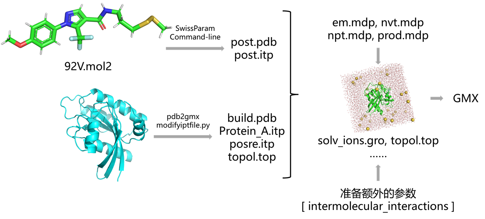
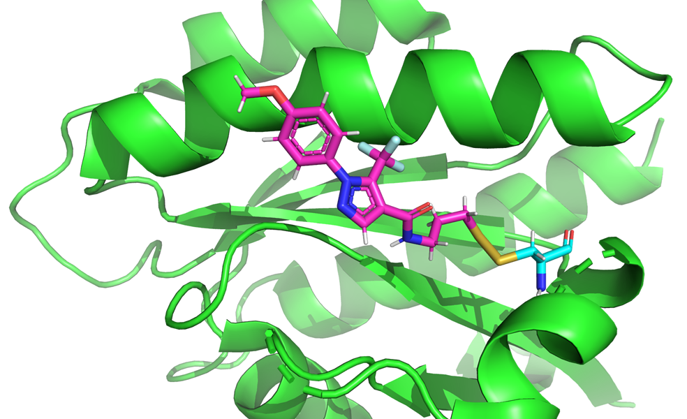
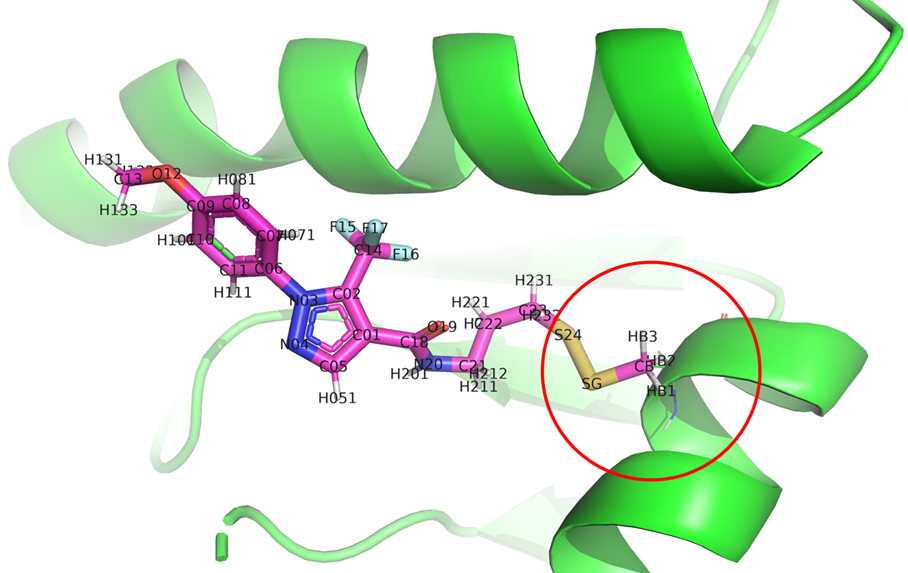
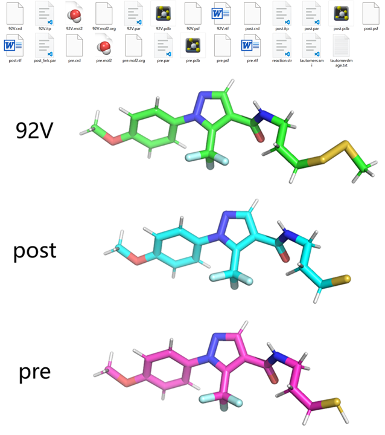
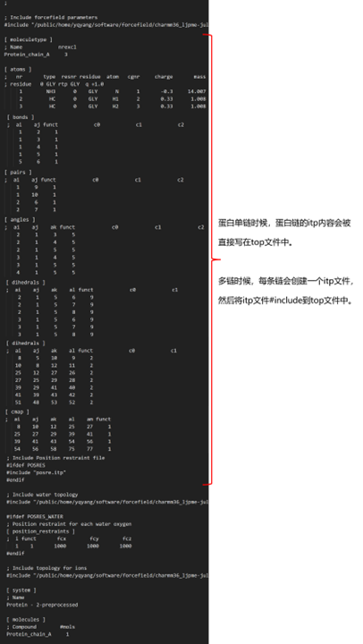
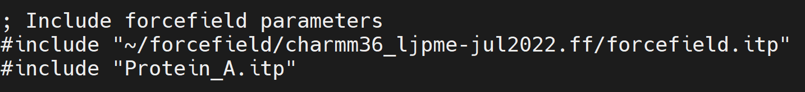
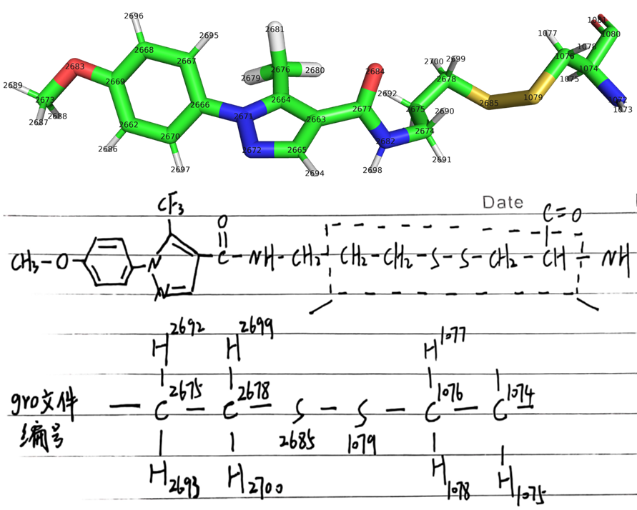
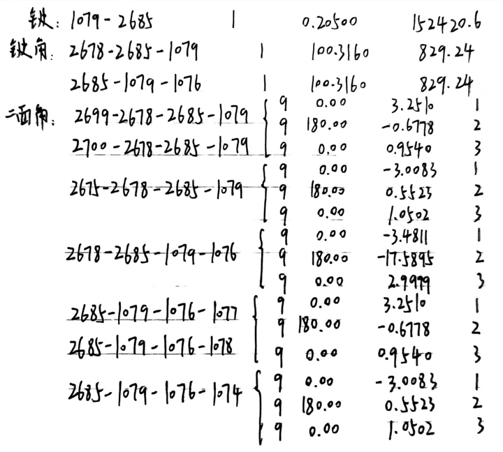

# Gromacs进行共价体系蛋白配体动力学模拟：蛋白使用pdb2gmx charmm36，共价小分子使用swissparam
写在前面，该教程中设置共价的方式是在[ intermolecular_interactions ]字段使用分子间限制（距离限制，角度限制，二面角限制）模拟共价作用。[ intermolecular_interactions ]字段中不能使用成化学键的bond type (type 1)，所以选用了距离限制（type 6）代替。所以真实模拟时候确实能模拟近似共价的效果。后续会再出一份不使用[ intermolecular_interactions ]字段，而是将蛋白配体itp合并，将共价相关信息直接加入[ bonds ]，[ angles ]，[ dihedrals ]中进行模拟的教程，后者会更加准确一些。   

分子动力学模拟（MD模拟）作为一种强有力的计算工具，已广泛应用于生物分子研究中，尤其是在蛋白质-配体相互作用的研究中。对于共价体系，蛋白质和配体之间的结合不仅是非共价相互作用的简单叠加，更涉及到共价键的形成与断裂，这使得常规的非共价模拟方法无法充分捕捉其细节。因此，为共价小分子配体生成合适的力场参数并进行准确的动力学模拟，成为了研究共价抑制剂、设计新药和探索化学反应机制的核心挑战。

在这方面，GROMACS与SwissParam的结合提供了一个强大且高效的解决方案。GROMACS作为世界领先的分子动力学模拟软件，其优秀的性能和灵活的功能，使得它成为进行蛋白质-配体动力学模拟的理想选择。而SwissParam，则为共价小分子配体提供了自动化的力场参数化功能，特别适用于处理涉及共价结合的复杂体系。通过将GROMACS中的pdb2gmx模块与CHARMM36力场相结合，我们能够为蛋白质生成稳定的结构和准确的力场描述；而使用SwissParam为共价小分子配体生成专门的参数，可以有效模拟配体与蛋白质之间的共价反应过程。

之前文章 []() 介绍了NAMD进行共价体系模拟。本文仍以PDBid：5VBM为例将重点介绍如何在GROMACS平台上进行共价体系的蛋白-配体动力学模拟，利用CHARMM36为蛋白质提供强大的力场支持，同时使用SwissParam为共价小分子配体生成定制的力场参数。通过这一过程，我们可以深入了解共价抑制剂在蛋白质活性位点的作用机制，为药物设计、分子优化及新疗法的探索提供科学依据。

  
## 使用SwissParam产生共价配体92V的MMFF力场参数itp文件
示例PDBid：5VBM中共价配体92V中的原子S24与蛋白的CYS残基形成了二硫键。  
  

首先准备输入的mol2格式文件。如下图所示，mol2文件是在配体的基础上向外延申了二硫键以及一个碳原子。其中向外延申的CYS残基部分的原子名称需要和残基中的原子名称一致。  
  

反应的配体原子名称是S24。反应类型是形成二硫键反应。形成共价的残基是CYS。输入结构文件的结构是共价反应后的结构。所以使用下述命令准备共价配体参数。该方式形成的力场参数是MMFF的。   
```shell
$ curl -s -F "myMol2=@92V.mol2" "swissparam.ch:5678/startparam?ligsite=S24&reaction=disulf_form&protres=CYS&topology=post-cap"
```

生成的文件如下所示。92V是含有二硫键以及延申的碳原子的结构的力场文件，post是反应后的配体部分的结构以及力场文件，pre是单单配体部分反应前的结构以及力场文件。  
  

上述生成的post.pdb文件和post.itp文件是后续建模所需文件。  
## pdb2gmx产生共价反应后蛋白的拓扑与力场
共价反应中蛋白残基与配体发生了化学反应形成了共价键。经由化学反应配体中因形成共价键会丢失一些原子，上述SwissParam产生的post.pdb和post.itp是反应后的配体结构和力场参数。现在也需要获得蛋白部分共价反应后的结构和力场参数。  

以此例为例，其中的CYS残基因形成二硫键应该会丢失一个氢原子。为准备蛋白反应后的结构和拓扑，首先可以使用pdb2gmx -ignh对蛋白自动加氢获取完整加氢后的蛋白结构和拓扑，后续则需要修改蛋白结构文件和拓扑文件，删除其中多余的原子并构建共价键和共价所需的键，键角，二面角等参数。  
```shell
echo 2|gmx pdb2gmx -f complex.pdb -o build.pdb -water tip3p -ignh   # 2就是charmm36力场
```
## 修改拓扑文件构建共价结构和力场参数（键，键角，二面角等参数）
**（1）修改结构pdb文件，删除多余原子。** 将72位的CYS残基中的HG1原子删除。  
**（2）修改蛋白部分top文件。** topol.top文件结构如下图所示。    
  

这里将蛋白单链的itp部分单独写入到一个itp文件中并将其#include入top文件中。如下图。  
  

修改Protein_A.itp文件，删除其中72位残基的HG1原子，并将整个文件的原子重新编号，修改键，键角，二面角的原子编号。可参考下述脚本 modifyiptfile.py 进行itp文件修改。  
```python
import os
from collections import defaultdict

class Lig_itp:

    def __init__(self, lig_itp_file):

        self.moleculetype = list()
        self.atoms = list()
        self.bonds = list()
        self.pairs = list()
        self.angles = list()
        self.dihedrals = list()
        self.imp = list()
        self.cmap = list()

        index = 0
        dihe_index = 0
        flag_mol = ""
        with open(lig_itp_file) as f:
            lines = f.readlines()

        self.title = lines[0]
        self.end = lines[-4:]

        while index < len(lines):
            line = lines[index]

            if line.startswith("[") and line.strip().endswith("]"):
                flag_mol = line.strip()
                if flag_mol == "[ dihedrals ]":
                    dihe_index += 1
            if flag_mol == "[ moleculetype ]":
                self.moleculetype.append(line)
            elif flag_mol == "[ atoms ]":
                self.atoms.append(line)
            elif flag_mol == "[ bonds ]":
                self.bonds.append(line)
            elif flag_mol == "[ pairs ]":
                self.pairs.append(line)
            elif flag_mol == "[ angles ]":
                self.angles.append(line)
            elif flag_mol == "[ dihedrals ]":
                if dihe_index == 1:
                    self.dihedrals.append(line)
                else:
                    self.imp.append(line)

            elif flag_mol == "[ cmap ]":
                self.cmap.append(line)

            index += 1

    def get_residues(self):

        self.resi_lines = defaultdict(list)
        for i in self.atoms:
            if i.startswith("[") or i.startswith(";   nr") or i.startswith("\n"):
                pass
            else:
                if i.startswith("; residue"):
                    line = i.split()
                    resi = line[2]
                    self.resi_lines[resi].append(i)
                else:
                    self.resi_lines[resi].append(i)
        return self.resi_lines

itp = Lig_itp("Protein_A.itp")
rt = open("Protein_A_1.itp", "w")
rt.write("".join(itp.moleculetype))
resi_lines = itp.get_residues()

need_del = ["HG1", ]

new_resi14 = list()
del_id = list()
for i in resi_lines["72"]:
    if i.startswith(";"):
        new_resi14.append(i)
    else:
        line = i.split()
        if line[4] in need_del:
            del_id.append(line[0])
        else:
            new_resi14.append(i)
resi_lines["72"] = new_resi14

rt.write("[ atoms ]\n")
rt.write(";   nr       type  resnr residue  atom   cgnr     charge       mass  typeB    chargeB      massB\n")
index_id = 1
dict_resiname_id = dict()
dict_resiname_id_old = dict()
old2new_id = dict()
for i in resi_lines.keys():
    lines = resi_lines[i]
    for a in lines:
        if a.startswith(";") or a.startswith("\n"):
            rt.write(a)
        else:
            a_lines = a.split()
            dict_resiname_id[(i,a_lines[4])] = index_id
            dict_resiname_id_old[(i,a_lines[4])] = a_lines[0]
            old2new_id[a_lines[0]] =str(index_id)
            rt.write("{:6} ".format(index_id)+a[7:])
            index_id += 1
rt.write("\n")

for i in itp.bonds:
    flag = True
    print(i)
    if i.startswith(";") or i.startswith("["):
        rt.write(i)
    elif i.startswith("\n"):
        pass
    else:
        line = i.strip().split()
        for a in line:
            print(a)
            if a in del_id:
                flag = False
        if flag:
            rt.write("{:6} {:6} {:6}\n".format(old2new_id[line[0]], old2new_id[line[1]], line[2]))
rt.write("\n")

for i in itp.pairs:
    flag = True
    print(i)
    if i.startswith(";") or i.startswith("[") or i.startswith("\n"):
        rt.write(i)
    else:
        line = i.strip().split()
        for a in line:
            print(a)
            if a in del_id:
                flag = False
        if flag:
            rt.write("{:6} {:6} {:6}\n".format(old2new_id[line[0]], old2new_id[line[1]], line[2]))

for i in itp.angles:
    flag = True
    print(i)
    if i.startswith(";") or i.startswith("["):
        rt.write(i)
    elif i.startswith("\n"):
        pass
    else:
        line = i.strip().split()
        for a in line:
            print(a)
            if a in del_id:
                flag = False
        if flag:
            rt.write("{:6} {:6} {:6} {:6}\n".format(old2new_id[line[0]], old2new_id[line[1]], old2new_id[line[2]], line[3]))
rt.write("\n")

for i in itp.dihedrals:
    flag = True
    print(i)
    if i.startswith(";") or i.startswith("["):
        rt.write(i)
    elif i.startswith("\n"):
        pass
    else:
        line = i.strip().split()
        for a in line:
            print(a)
            if a in del_id:
                flag = False
        if flag:
            rt.write("{:6} {:6} {:6} {:6} {:6}\n".format(old2new_id[line[0]], old2new_id[line[1]], old2new_id[line[2]], old2new_id[line[3]], line[4]))
rt.write("\n")

for i in itp.imp:
    flag = True
    print(i)
    if i.startswith(";") or i.startswith("["):
        rt.write(i)
    elif i.startswith("\n"):
        pass
    else:
        line = i.strip().split()
        for a in line:
            print(a)
            if a in del_id:
                flag = False
        if flag:
            rt.write("{:6} {:6} {:6} {:6} {:6}\n".format(old2new_id[line[0]], old2new_id[line[1]], old2new_id[line[2]], old2new_id[line[3]], line[4]))
rt.write("\n")

for i in itp.cmap:
    flag = True
    print(i)
    if i.startswith(";") or i.startswith("[") or i.startswith("\n") or i.startswith("#"):
        rt.write(i)
    else:
        line = i.strip().split()
        for a in line:
            print(a)
            if a in del_id:
                flag = False
        if flag:
            rt.write("{:6} {:6} {:6} {:6} {:6} {:6}\n".format(old2new_id[line[0]], old2new_id[line[1]], old2new_id[line[2]], old2new_id[line[3]], old2new_id[line[4]], line[5]))

print(del_id)

rt.close()

os.rename("Protein_A.itp", "Protein_A_2.itp")
os.rename("Protein_A_1.itp", "Protein_A.itp")
os.rename("Protein_A_2.itp", "Protein_A_1.itp")

with open("posre.itp") as f:
    f1 = f.readlines()
rt = open("posre_1.itp", "w")
for i in f1:
    if i.startswith(";") or i.startswith("[") or i.startswith("\n"):
        rt.write(i)
    else:
        print(i)
        line = i.strip().split()
        rt.write("{:>6} {:>6} {:>6} {:>6} {:>6}\n".format(old2new_id[line[0]],line[1],line[2],line[3],line[4],))
rt.close()

os.rename("posre.itp", "posre_2.itp")
os.rename("posre_1.itp", "posre.itp")
os.rename("posre_2.itp", "posre_1.itp")

```
**（3）合并蛋白配体pdb文件和itp文件。** 将post.pdb加到build.pdb文件最后；将post.itp加到top文件中；在[ molecules ]字段中添加配体名称。  
**（4）根据复合物pdb文件生成原子序号重新排列的gro文件。** gro文件中的编号是整个体系的全局编号。  
```shell
gmx editconf -f build.pdb -o newbox.gro -bt cubic -d 0.8 
```
**（5）准备共价相关的键，键角，二面角等参数。** 在top文件末尾的[ intermolecular_interactions ]字段中添加共价相关的键，键角，二面角等参数。可参考文章 [Gromacs中进行距离限制（一）](https://mp.weixin.qq.com/s/dw3TEJLp_4XF3k4oQPNbSw)。[ intermolecular_interactions ]字段可用于建立不同itp文件之间的键与非键作用。   

如何确定共价相关的键，键角和二面角参数也可参考文章 []()。如下图所示，[ intermolecular_interactions ]字段中用于表示原子的是体系的全局编号，即复合物gro文件中的原子编号。首先找出共价键相关的键，键角和二面角。  
  

但是共价反应产生的力场中仅延伸到CYS残基的CB原子，并没有延申到CA原子。所以根据上述已有的文件是没办法获得含有CA原子的二面角参数的。所以这里将分子结构mol2文件多保存一些然后使用SwissParam基于MMFF再产生一次力场参数。输入结构如下图所示，并根据参数文件将上述确实的参数匹配补齐。   
  

将下述内容加到topol.top文件末尾（在加完水，加完离子之后再加。）：  
```text
[ intermolecular_interactions ]
[ bonds ]
; ai aj fu b0 kb, b0 kb
1079   2685   6   0.20500   152420.6   
[ angles ]
; ai aj ak fu th0 kth ub0 kub th0 kth ub0 kub
2678   2685   1079   1   100.3160   829.24   
2685   1079   1076   1   100.3160   829.24   
[ dihedrals ]
; ai aj ak al fu phi0 kphi mult phi0 kphi mult
2699   2678   2685   1079   9   0.00   3.2510   1   
2699   2678   2685   1079   9   180.00   -0.6778   2   
2699   2678   2685   1079   9   0.00   0.9540   3   
2700   2678   2685   1079   9   0.00   3.2510   1   
2700   2678   2685   1079   9   180.00   -0.6778   2   
2700   2678   2685   1079   9   0.00   0.9540   3   
2675   2678   2685   1079   9   0.00   -3.0083   1   
2675   2678   2685   1079   9   180.00   0.5523   2   
2675   2678   2685   1079   9   0.00   1.0502   3   
2678   2685   1079   1076   9   0.00   -3.4811   1   
2678   2685   1079   1076   9   180.00   -17.5895   2   
2678   2685   1079   1076   9   0.00   2.9999   3   
2685   1079   1076   1077   9   0.00   3.2510   1   
2685   1079   1076   1077   9   180.00   -0.6778   2   
2685   1079   1076   1077   9   0.00   0.9540   3   
2685   1079   1076   1078   9   0.00   3.2510   1   
2685   1079   1076   1078   9   180.00   -0.6778   2   
2685   1079   1076   1078   9   0.00   0.9540   3  
2685   1079   1076   1074   9   0.00   -3.0083   1   
2685   1079   1076   1074   9   180.00   0.5523   2   
2685   1079   1076   1074   9   0.00   1.0502   3   
```
**（6）加水，加离子，准备index文件等。**   
```shell
gmx solvate -cp newbox.gro -cs spc216.gro -p topol.top -o solv.gro
gmx grompp -f ~/file/gmx_file/ions.mdp -c solv.gro -p topol.top -o ions.tpr -maxwarn 2
echo 15 | gmx genion -s ions.tpr -o solv_ions.gro -p topol.top -pname SOD -nname CLA -neutral -conc 0.15
gmx make_ndx -f solv_ions.gro -o index.ndx   # SOLU SOLV
```
**（7）将（5）中的参数加到topol.top文件末尾。**  
## 准备em，nvt，npt和prod的mdp文件
**em.mdp**   
```text
;====================================================
; Energy minimization
;====================================================
;----------------------------------------------------
; RUN CONTROL & MINIMIZATION
;----------------------------------------------------
define                 = -DFLEXIBLE -DPOSRES -DPOSRES_LIGAND
integrator             = steep
nsteps                 = 500000
emtol                  = 500
emstep                 = 0.01
nstcomm                = 1000

;----------------------------------------------------
; OUTPUT CONTROL
;----------------------------------------------------
nstxout                = 0          ; save coordinates to .trr every 250 steps
nstvout                = 0          ; don't save velocities to .trr
nstfout                = 0          ; don't save forces to .trr

nstxout-compressed     = 0      ; xtc compressed trajectory output every 500 steps
compressed-x-precision = 1000
nstlog                 = 5000        ; update log file every 500 steps
nstenergy              = 5000        ; save energies every 500 steps
nstcalcenergy          = 5000

;----------------------------------------------------
; NEIGHBOR SEARCHING
;----------------------------------------------------
cutoff-scheme          = Verlet
ns-type                = grid
nstlist                = 1
rlist                  = 1.2

;----------------------------------------------------
; BONDS
;----------------------------------------------------
constraints            = h-bonds
constraint-algorithm     = lincs
lincs_iter               = 1
lincs-order              = 4
continuation             = no

;----------------------------------------------------
; ELECTROSTATICS
;----------------------------------------------------
coulombtype            = PME
rcoulomb               = 1.2
pme-order              = 4
fourierspacing         = 0.10
ewald-rtol             = 1e-6

;----------------------------------------------------
; VDW
;----------------------------------------------------
vdw-type                = cut-off
rvdw                    = 1.2
vdw-modifier            = Potential-Shift
ewald-rtol-lj           = 1e-3
lj-pme-comb-rule        = Geometric
DispCorr                = EnerPres

;----------------------------------------------------
; TEMPERATURE & PRESSURE COUPL
;----------------------------------------------------
Tcoupl              = no
Pcoupl              = no
gen_vel             = no                                                                                                     
```
**nvt.mdp**  
```text
;====================================================
; NVT equilibration
;====================================================
;----------------------------------------------------
; RUN CONTROL
;----------------------------------------------------
define       = -DPOSRES -DPOSRES_LIGAND
integrator   = md            ; stochastic leap-frog integrator
nsteps       = 100000          ; 2 * 5,000 fs = 10 ps
dt           = 0.002         ; 2 fs
comm-mode    = Linear        ; remove center of mass translation
nstcomm      = 100           ; frequency for center of mass motion removal

;----------------------------------------------------
; OUTPUT CONTROL
;----------------------------------------------------
nstxout                = 0          ; don't save coordinates to .trr
nstvout                = 0          ; don't save velocities to .trr
nstfout                = 0          ; don't save forces to .trr
nstxout-compressed     = 0      ; xtc compressed trajectory output every 5000 steps
compressed-x-precision = 0       ; precision with which to write to the compressed trajectory file
nstlog                 = 500000       ; update log file every 10 ps
nstenergy              = 500000       ; save energies every 10 ps
nstcalcenergy          = 5000       ; calculate energies every 100 steps

;----------------------------------------------------
; BONDS
;----------------------------------------------------
constraint_algorithm   = lincs      ; holonomic constraints
constraints            = h-bonds  ; hydrogens only are constrained
lincs_iter             = 1          ; accuracy of LINCS (1 is default)
lincs_order            = 4          ; also related to accuracy (4 is default)
lincs-warnangle        = 30         ; maximum angle that a bond can rotate before LINCS will complain (30 is default)
continuation           = no         ; formerly known as 'unconstrained-start' - useful for exact continuations and reruns

;----------------------------------------------------
; NEIGHBOR SEARCHING
;----------------------------------------------------
cutoff-scheme   = Verlet
ns-type         = grid   ; search neighboring grid cells
nstlist         = 40     ; 20 fs (default is 10)
rlist           = 1.0    ; short-range neighborlist cutoff (in nm)
pbc             = xyz    ; 3D PBC

;----------------------------------------------------
; ELECTROSTATICS
;----------------------------------------------------
coulombtype      = PME      ; Particle Mesh Ewald for long-range electrostatics
rcoulomb         = 1.2      ; short-range electrostatic cutoff (in nm)
ewald_geometry   = 3d       ; Ewald sum is performed in all three dimensions
pme-order        = 4        ; interpolation order for PME (default is 4)
fourierspacing   = 0.10     ; grid spacing for FFT
ewald-rtol       = 1e-6     ; relative strength of the Ewald-shifted direct potential at rcoulomb

;----------------------------------------------------
; VDW
;----------------------------------------------------
vdw-type                = cut-off
rvdw                    = 1.2
vdw-modifier            = Potential-Shift
ewald-rtol-lj           = 1e-3
lj-pme-comb-rule        = Geometric
DispCorr                = EnerPres

;----------------------------------------------------
; TEMPERATURE & PRESSURE COUPL
;----------------------------------------------------
tcoupl     =  V-rescale
tc_grps    =  SOLU    SOLV
tau_t      =  1.0     1.0
ref_t      =  310.15  310.15
pcoupl     =  no

;----------------------------------------------------
; VELOCITY GENERATION
;----------------------------------------------------
gen_vel      = yes      ; Velocity generation is on (if gen_vel is 'yes', continuation should be 'no')
gen_seed     = -1       ; Use random seed
gen_temp     = 310.15

```
**npt.mdp**  
```text
;====================================================
; NPT equilibration
;====================================================
;----------------------------------------------------
; RUN CONTROL
;----------------------------------------------------
define       = -DPOSRES -DPOSRES_LIGAND
integrator   = md            ; stochastic leap-frog integrator
nsteps       = 1000000       ; 2 * 50,000 fs = 100 ps
dt           = 0.002         ; 2 fs
comm-mode    = Linear        ; remove center of mass translation
nstcomm      = 100           ; frequency for center of mass motion removal

;----------------------------------------------------
; OUTPUT CONTROL
;----------------------------------------------------
nstxout                = 0          ; don't save coordinates to .trr
nstvout                = 0          ; don't save velocities to .trr
nstfout                = 0          ; don't save forces to .trr
nstxout-compressed     = 0     ; xtc compressed trajectory output every 5000 steps
compressed-x-precision = 0      ; precision with which to write to the compressed trajectory file
nstlog                 = 500000       ; update log file every 10 ps
nstenergy              = 500000       ; save energies every 10 ps
nstcalcenergy          = 1000        ; calculate energies every 100 steps

;----------------------------------------------------
; BONDS
;----------------------------------------------------
constraint_algorithm   = lincs      ; holonomic constraints
constraints            = h-bonds  ; hydrogens only are constrained
lincs_iter             = 1          ; accuracy of LINCS (1 is default)
lincs_order            = 4          ; also related to accuracy (4 is default)
lincs-warnangle        = 30         ; maximum angle that a bond can rotate before LINCS will complain (30 is default)
continuation           = yes         ; formerly known as 'unconstrained-start' - useful for exact continuations and reruns

;----------------------------------------------------
; NEIGHBOR SEARCHING
;----------------------------------------------------
cutoff-scheme   = Verlet
ns-type         = grid   ; search neighboring grid cells
nstlist         = 20     ; 20 fs (default is 10)
rlist           = 1.0    ; short-range neighborlist cutoff (in nm)
pbc             = xyz    ; 3D PBC

;----------------------------------------------------
; ELECTROSTATICS
;----------------------------------------------------
coulombtype      = PME      ; Particle Mesh Ewald for long-range electrostatics
rcoulomb         = 1.2      ; short-range electrostatic cutoff (in nm)
ewald_geometry   = 3d       ; Ewald sum is performed in all three dimensions
pme-order        = 4        ; interpolation order for PME (default is 4)
fourierspacing   = 0.10     ; grid spacing for FFT
ewald-rtol       = 1e-6     ; relative strength of the Ewald-shifted direct potential at rcoulomb

;----------------------------------------------------
; VDW
;----------------------------------------------------
vdw-type                = cut-off
rvdw                    = 1.2
vdw-modifier            = Potential-Shift
ewald-rtol-lj           = 1e-3
lj-pme-comb-rule        = Geometric
DispCorr                = EnerPres

;----------------------------------------------------
; TEMPERATURE & PRESSURE COUPL
;----------------------------------------------------
tcoupl     =  V-rescale
tc_grps    =  SOLU    SOLV
tau_t      =  1.0     1.0
ref_t      =  310.15  310.15
pcoupl           = Berendsen
pcoupltype       = isotropic
tau_p            = 0.5                  ; time constant (ps)
ref_p            = 1.0                  ; reference pressure (bar)
compressibility  = 4.5e-05              ; isothermal compressibility of water (bar^-1)
refcoord-scaling = all

;----------------------------------------------------
; VELOCITY GENERATION
;----------------------------------------------------
gen_vel      = no

```
**prod.mdp**  
```text
;====================================================
; Production simulation
;====================================================
;----------------------------------------------------
; RUN CONTROL
;----------------------------------------------------
integrator   = md            ; stochastic leap-frog integrator
nsteps       = 5000000000000           ; 2 * 250,000 fs = 500 ps
dt           = 0.002         ; 2 fs
comm-mode    = Linear        ; remove center of mass translation
nstcomm      = 100           ; frequency for center of mass motion removal

;----------------------------------------------------
; OUTPUT CONTROL
;----------------------------------------------------
nstxout                = 0          ; don't save coordinates to .trr
nstvout                = 0          ; don't save velocities to .trr
nstfout                = 0          ; don't save forces to .trr
nstxout-compressed     = 500000        ; xtc compressed trajectory output every 1000 steps (2 ps)
compressed-x-precision = 1000       ; precision with which to write to the compressed trajectory file
nstlog                 = 500000        ; update log file every 2 ps
nstenergy              = 500000        ; save energies every 2 ps
nstcalcenergy          = 500000        ; calculate energies every 100 steps
;----------------------------------------------------
; BONDS
;----------------------------------------------------
constraint_algorithm   = lincs      ; holonomic constraints
constraints            = h-bonds  ; hydrogens only are constrained
lincs_iter             = 1          ; accuracy of LINCS (1 is default)
lincs_order            = 4          ; also related to accuracy (4 is default)
lincs-warnangle        = 30         ; maximum angle that a bond can rotate before LINCS will complain (30 is default)
continuation           = yes

;----------------------------------------------------
; NEIGHBOR SEARCHING
;----------------------------------------------------
cutoff-scheme   = Verlet
ns-type         = grid   ; search neighboring grid cells
nstlist         = 40     ; 20 fs (default is 10)
rlist           = 1.0    ; short-range neighborlist cutoff (in nm)
pbc             = xyz    ; 3D PBC

;----------------------------------------------------
; ELECTROSTATICS
;----------------------------------------------------
coulombtype      = PME      ; Particle Mesh Ewald for long-range electrostatics
rcoulomb         = 1.2      ; short-range electrostatic cutoff (in nm)
ewald_geometry   = 3d       ; Ewald sum is performed in all three dimensions
pme-order        = 4        ; interpolation order for PME (default is 4)
fourierspacing   = 0.10     ; grid spacing for FFT
ewald-rtol       = 1e-6     ; relative strength of the Ewald-shifted direct potential at rcoulomb

;----------------------------------------------------
; VDW
;----------------------------------------------------
vdw-type                = cut-off
rvdw                    = 1.2
vdw-modifier            = Potential-Shift
ewald-rtol-lj           = 1e-3
lj-pme-comb-rule        = Geometric
DispCorr                = EnerPres

;----------------------------------------------------
; TEMPERATURE & PRESSURE COUPL
;----------------------------------------------------
tcoupl           =  V-rescale
tc_grps          =  SOLU    SOLV
tau_t            =  1.0     1.0
ref_t            =  310.15  310.15
pcoupl           = Parrinello-Rahman
pcoupltype       = isotropic            ; uniform scaling of box vectors
tau_p            = 1                    ; time constant (ps)
ref_p            = 1.0                  ; reference pressure (bar)
compressibility  = 4.5e-05              ; isothermal compressibility of water (bar^-1)

;----------------------------------------------------
; VELOCITY GENERATION
;----------------------------------------------------
gen_vel      = no       ; Velocity generation is off (if gen_vel is 'yes', continuation should be 'no')
gen_seed     = -1       ; Use random seed
gen_temp     = 310.15

```
## 跑模拟的脚本文件
**job.sh**  
```shell
mkdir em
cd em
if [ ! -f em.gro ]; then
    gmx grompp -f ../mdp/em.mdp -c ../solv_ions.gro -p ../topol.top -r ../solv_ions.gro -o em.tpr -maxwarn 2
    gmx mdrun -s em.tpr -deffnm em -ntmpi 1 -nb gpu -gpu_id 0
fi

mkdir ../nvt
cd ../nvt
if [ ! -f nvt.gro ]; then
    gmx grompp -f ../mdp/nvt.mdp -c ../em/em.gro -p ../topol.top -o nvt.tpr -r ../em/em.gro -maxwarn 4 -n ../index.ndx
    gmx mdrun -s nvt.tpr -deffnm nvt -ntmpi 1 -nb gpu -bonded gpu -pme gpu -gpu_id 0
fi

mkdir ../npt
cd ../npt
if [ ! -f npt.gro ]; then
    gmx grompp -f ../mdp/npt.mdp -c ../nvt/nvt.gro -t ../nvt/nvt.cpt -p ../topol.top -o npt.tpr -r ../nvt/nvt.gro -maxwarn 4 -n ../index.ndx
    gmx mdrun -s npt.tpr -deffnm npt -ntmpi 1 -nb gpu -bonded gpu -gpu_id 0 -pme gpu
fi

mkdir ../prod
cd ../prod
if [ ! -f prod.gro ]; then
    gmx grompp -f ../mdp/prod.mdp -c ../npt/npt.gro -t ../npt/npt.cpt -p ../topol.top -o prod.tpr -r ../npt/npt.gro -maxwarn 4 -n ../index.ndx
    gmx mdrun -s prod.tpr -deffnm prod -dhdl dhdl -ntmpi 1 -nb gpu -bonded gpu -gpu_id 0 -pme gpu  -nsteps 500000
fi

cd ..                     
```
## 模拟所需文件的整体构成 
  