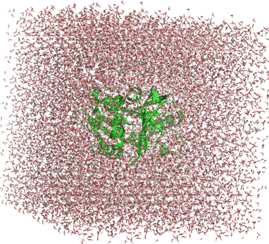

# Gromacs进行纯标准蛋白质体系分子动力学模拟
分子动力学模拟已成为研究生物大分子行为的重要工具，能够帮助我们从原子水平理解蛋白质的结构和动力学特性。在纯标准蛋白质体系中进行分子动力学模拟，是构建复杂生物体系模拟的基础，同时也是探索蛋白质折叠、稳定性、配体结合和构象变化等现象的起点。Gromacs 作为分子动力学模拟的主流软件，以其高效、灵活和开源的特点，广泛应用于生物物理和生物化学领域。掌握 Gromacs 进行纯蛋白质体系模拟的流程非常必要。  
## 纯标准蛋白质体系模拟流程
该流程包括蛋白质结构文件预处理（补链等），通过pdb2gmx建模以及加水加离子生成用于模拟的gro和top文件，能量最小化（em）、平衡模拟（nvt和npt）和最终的动力学模拟（md，产生随时间变化的长轨迹用于研究）。
### 结构文件预处理
在进行动力学模拟建模之前首先需要获取体系的pdb文件。大致有两种途径获取：RCSB数据库中下载实验解析的结构pdb文件；通过AlphaFold预测获得的结构pdb文件。通过结构预测得到的pdb文件基本不用处理直接建模即可。RCSB数据库中下载的pdb文件可能需要一些前处理：首先将结构中的一些无关紧要的水和有机溶剂分子去掉（这里需要注意的是并不是说晶体结构中的水分子不重要，而是本文先不考虑结晶水分子的处理，关于晶体中水分子用于动力学模拟将在后续更新补充）。其次检查下结构中有没有多状态的氨基酸构象，有的晶体结构中个别氨基酸会出现多个构象，去除occupancy小的氨基酸构象。最后需要检查下结构是否需要补链以及是否缺失重原子等，如果需要补链或是补原子可参考 [分子动力学模拟之前对蛋白晶体结构缺失残基进行补链](https://mp.weixin.qq.com/s/pM2pv-2UXREPdcodOJI69Q)。  
### pdb2gmx建模，加水，加离子
（1）使用charmm36力场和pdb2gmx根据pdb结构生成gro文件和top文件。gro文件里面是结构的坐标信息，top文件里面是结构的力场参数，键连方式等拓扑信息。     
```python
gmx pdb2gmx -f start.pdb -o build.gro -water tip3p -ignh   # -ignh忽略结构中氢重新加氢
# 该命令输入之后需要选择力场，charmm36是gmx自带的力场，选择其前面的编号即可
```
（2）构建水盒子。  
```python
gmx editconf -f build.gro -o newbox.gro -bt cubic -d 0.8   # 创建立方体cubic水盒子
```
（3）加水，加水之后的solv.gro如下图所示。
```python
gmx solvate -cp newbox.gro -cs spc216.gro -p topol.top -o solv.gro
```
  
（4）计算电势添加离子，加离子之后的solv_ions.gro如下图所示。
```python
gmx grompp -f ions.mdp -c solv.gro -p topol.top -o ions.tpr -maxwarn 2   # 计算电势
gmx genion -s ions.tpr -o solv_ions.gro -p topol.top -pname SOD -nname CLA -neutral -conc 0.15   # 这里添加离子时候需要选择溶剂分子，让离子将溶剂分子替换掉。添加离子中和体系并使得体系的离子浓度是0.15 M，charmm36中的钠离子名称是SOD，氯离子名称是CLA
```
   
ions.mdp文件如下：
```python
; ions.mdp - used as input into grompp to generate ions.tpr
; Parameters describing what to do, when to stop and what to save
integrator  = steep         ; Algorithm (steep = steepest descent minimization)
emtol       = 1000.0        ; Stop minimization when the maximum force < 1000.0 kJ/mol/nm
emstep      = 0.01          ; Minimization step size
nsteps      = 50000         ; Maximum number of (minimization) steps to perform

; Parameters describing how to find the neighbors of each atom and how to calculate the interactions
nstlist         = 1         ; Frequency to update the neighbor list and long range forces
cutoff-scheme   = Verlet    ; Buffered neighbor searching
ns_type         = grid      ; Method to determine neighbor list (simple, grid)
coulombtype     = cutoff    ; Treatment of long range electrostatic interactions
rcoulomb        = 1.0       ; Short-range electrostatic cut-off
rvdw            = 1.0       ; Short-range Van der Waals cut-off
pbc             = xyz       ; Periodic Boundary Conditions in all 3 dimensions
```
（5）生成索引index.ndx文件。   
```shell
echo q | gmx make_ndx -f solv_ions.gro -o index.ndx
```
（6）建模完成之后会生成solv_ions.gro（用于模拟的坐标信息gro文件），topol.top，posre.itp（位置限制文件），index.ndx。这几个文件是后续模拟必须文件。这里强烈建议每做一步都将生成的gro文件使用pymol等可视化软件打开检查一下，防止建模出错。  
### em，nvt，npt，md
（1）能量最小化（em）  
能量最小化输入文件em.mdp如下所示：  
```python
;====================================================
; Energy minimization
;====================================================
;----------------------------------------------------
; RUN CONTROL & MINIMIZATION
;----------------------------------------------------
define                 = -DFLEXIBLE
integrator             = steep
nsteps                 = 500000
emtol                  = 500
emstep                 = 0.01
nstcomm                = 1000

;----------------------------------------------------
; OUTPUT CONTROL
;----------------------------------------------------
nstxout                = 0          ; save coordinates to .trr every 250 steps
nstvout                = 0          ; don't save velocities to .trr
nstfout                = 0          ; don't save forces to .trr

nstxout-compressed     = 10000      ; xtc compressed trajectory output every 500 steps
compressed-x-precision = 1000
nstlog                 = 5000        ; update log file every 500 steps
nstenergy              = 5000        ; save energies every 500 steps
nstcalcenergy          = 5000

;----------------------------------------------------
; NEIGHBOR SEARCHING
;----------------------------------------------------
cutoff-scheme          = Verlet
ns-type                = grid
nstlist                = 1
rlist                  = 1.2

;----------------------------------------------------
; BONDS
;----------------------------------------------------
constraints            = h-bonds
constraint-algorithm     = lincs
lincs_iter               = 1
lincs-order              = 4
continuation             = no

;----------------------------------------------------
; ELECTROSTATICS
;----------------------------------------------------
coulombtype            = PME
rcoulomb               = 1.2
pme-order              = 4
fourierspacing         = 0.10
ewald-rtol             = 1e-6

;----------------------------------------------------
; VDW
;----------------------------------------------------
vdw-type                = cut-off
rvdw                    = 1.2
vdw-modifier            = Potential-Shift
ewald-rtol-lj           = 1e-3
lj-pme-comb-rule        = Geometric
DispCorr                = EnerPres

;----------------------------------------------------
; TEMPERATURE & PRESSURE COUPL
;----------------------------------------------------
Tcoupl              = no
Pcoupl              = no
gen_vel             = no                      
```
进行能量最小化：  
```shell
mkdir em
cd em
gmx grompp -f ../mdp/em.mdp -c ../solv_ions.gro -p ../topol.top -r ../solv_ions.gro -o em.tpr -maxwarn 2
gmx mdrun -s em.tpr -deffnm em -ntmpi 1 -nb gpu -gpu_id 0
cd ..
```

（2）nvt平衡  
nvt.mdp如下所示：
```python
;====================================================
; NVT equilibration
;====================================================
;----------------------------------------------------
; RUN CONTROL
;----------------------------------------------------
define       = -DPOSRES
integrator   = md            ; stochastic leap-frog integrator
nsteps       = 100000          ; 2 * 5,000 fs = 10 ps
dt           = 0.002         ; 2 fs
comm-mode    = Linear        ; remove center of mass translation
nstcomm      = 100           ; frequency for center of mass motion removal

;----------------------------------------------------
; OUTPUT CONTROL
;----------------------------------------------------
nstxout                = 0          ; don't save coordinates to .trr
nstvout                = 0          ; don't save velocities to .trr
nstfout                = 0          ; don't save forces to .trr
nstxout-compressed     = 50000      ; xtc compressed trajectory output every 5000 steps
compressed-x-precision = 1000       ; precision with which to write to the compressed trajectory file
nstlog                 = 5000       ; update log file every 10 ps
nstenergy              = 5000       ; save energies every 10 ps
nstcalcenergy          = 5000       ; calculate energies every 100 steps

;----------------------------------------------------
; BONDS
;----------------------------------------------------
constraint_algorithm   = lincs      ; holonomic constraints
constraints            = h-bonds  ; hydrogens only are constrained
lincs_iter             = 1          ; accuracy of LINCS (1 is default)
lincs_order            = 4          ; also related to accuracy (4 is default)
lincs-warnangle        = 30         ; maximum angle that a bond can rotate before LINCS will complain (30 is default)
continuation           = no         ; formerly known as 'unconstrained-start' - useful for exact continuations and reruns

;----------------------------------------------------
; NEIGHBOR SEARCHING
;----------------------------------------------------
cutoff-scheme   = Verlet
ns-type         = grid   ; search neighboring grid cells
nstlist         = 40     ; 20 fs (default is 10)
rlist           = 1.0    ; short-range neighborlist cutoff (in nm)
pbc             = xyz    ; 3D PBC

;----------------------------------------------------
; ELECTROSTATICS
;----------------------------------------------------
coulombtype      = PME      ; Particle Mesh Ewald for long-range electrostatics
rcoulomb         = 1.2      ; short-range electrostatic cutoff (in nm)
ewald_geometry   = 3d       ; Ewald sum is performed in all three dimensions
pme-order        = 4        ; interpolation order for PME (default is 4)
fourierspacing   = 0.10     ; grid spacing for FFT
ewald-rtol       = 1e-6     ; relative strength of the Ewald-shifted direct potential at rcoulomb

;----------------------------------------------------
; VDW
;----------------------------------------------------
vdw-type                = cut-off
rvdw                    = 1.2
vdw-modifier            = Potential-Shift
ewald-rtol-lj           = 1e-3
lj-pme-comb-rule        = Geometric
DispCorr                = EnerPres

;----------------------------------------------------
; TEMPERATURE & PRESSURE COUPL
;----------------------------------------------------
tcoupl     =  V-rescale
tc_grps    =  Protein non-Protein
tau_t      =  1.0     1.0
ref_t      =  310.0   310.0
pcoupl     =  no

;----------------------------------------------------
; VELOCITY GENERATION
;----------------------------------------------------
gen_vel      = yes      ; Velocity generation is on (if gen_vel is 'yes', continuation should be 'no')
gen_seed     = -1       ; Use random seed
gen_temp     = 310.0
```
进行nvt：
```shell
mkdir nvt
cd nvt
gmx grompp -f ../mdp/nvt.mdp -c ../em/em.gro -p ../topol.top -o nvt.tpr -r ../em/em.gro -maxwarn 4 -n ../index.ndx
gmx mdrun -s nvt.tpr -deffnm nvt -ntmpi 1 -nb gpu -bonded gpu -pme gpu -gpu_id 0
cd ..
```

（3）npt平衡   
npt.mdp如下所示：  
```python
;====================================================
; NPT equilibration
;====================================================
;----------------------------------------------------
; RUN CONTROL
;----------------------------------------------------
define       = -DPOSRES
integrator   = md            ; stochastic leap-frog integrator
nsteps       = 1000000       ; 2 * 50,000 fs = 100 ps
dt           = 0.002         ; 2 fs
comm-mode    = Linear        ; remove center of mass translation
nstcomm      = 100           ; frequency for center of mass motion removal

;----------------------------------------------------
; OUTPUT CONTROL
;----------------------------------------------------
nstxout                = 0          ; don't save coordinates to .trr
nstvout                = 0          ; don't save velocities to .trr
nstfout                = 0          ; don't save forces to .trr
nstxout-compressed     = 500000     ; xtc compressed trajectory output every 5000 steps
compressed-x-precision = 10000      ; precision with which to write to the compressed trajectory file
nstlog                 = 5000       ; update log file every 10 ps
nstenergy              = 5000       ; save energies every 10 ps
nstcalcenergy          = 1000        ; calculate energies every 100 steps

;----------------------------------------------------
; BONDS
;----------------------------------------------------
constraint_algorithm   = lincs      ; holonomic constraints
constraints            = h-bonds  ; hydrogens only are constrained
lincs_iter             = 1          ; accuracy of LINCS (1 is default)
lincs_order            = 4          ; also related to accuracy (4 is default)
lincs-warnangle        = 30         ; maximum angle that a bond can rotate before LINCS will complain (30 is default)
continuation           = yes         ; formerly known as 'unconstrained-start' - useful for exact continuations and reruns

;----------------------------------------------------
; NEIGHBOR SEARCHING
;----------------------------------------------------
cutoff-scheme   = Verlet
ns-type         = grid   ; search neighboring grid cells
nstlist         = 20     ; 20 fs (default is 10)
rlist           = 1.0    ; short-range neighborlist cutoff (in nm)
pbc             = xyz    ; 3D PBC

;----------------------------------------------------
; ELECTROSTATICS
;----------------------------------------------------
coulombtype      = PME      ; Particle Mesh Ewald for long-range electrostatics
rcoulomb         = 1.2      ; short-range electrostatic cutoff (in nm)
ewald_geometry   = 3d       ; Ewald sum is performed in all three dimensions
pme-order        = 4        ; interpolation order for PME (default is 4)
fourierspacing   = 0.10     ; grid spacing for FFT
ewald-rtol       = 1e-6     ; relative strength of the Ewald-shifted direct potential at rcoulomb

;----------------------------------------------------
; VDW
;----------------------------------------------------
vdw-type                = cut-off
rvdw                    = 1.2
vdw-modifier            = Potential-Shift
ewald-rtol-lj           = 1e-3
lj-pme-comb-rule        = Geometric
DispCorr                = EnerPres

;----------------------------------------------------
; TEMPERATURE & PRESSURE COUPL
;----------------------------------------------------
tcoupl     =  V-rescale
tc_grps    =  Protein non-Protein
tau_t      =  1.0     1.0
ref_t      =  310.0   310.0
pcoupl           = Berendsen
pcoupltype       = isotropic
tau_p            = 0.5                  ; time constant (ps)
ref_p            = 1.0                  ; reference pressure (bar)
compressibility  = 4.5e-05              ; isothermal compressibility of water (bar^-1)
refcoord-scaling = all

;----------------------------------------------------
; VELOCITY GENERATION
;----------------------------------------------------
gen_vel      = no
```
进行npt：
```shell
mkdir npt
cd npt
gmx grompp -f ../mdp/npt.mdp -c ../nvt/nvt.gro -t ../nvt/nvt.cpt -p ../topol.top -o npt.tpr -r ../nvt/nvt.gro -maxwarn 4 -n ../index.ndx
gmx mdrun -s npt.tpr -deffnm npt -ntmpi 1 -nb gpu -bonded gpu -gpu_id 0 -pme gpu
cd ..
```

（4）md模拟  
md.mdp如下所示：  
```python
;====================================================
; Production simulation
;====================================================
;----------------------------------------------------
; RUN CONTROL
;----------------------------------------------------
integrator   = md            ; stochastic leap-frog integrator
nsteps       = 50000000.0           ; 2 * 250,000 fs = 500 ps
dt           = 0.002         ; 2 fs
comm-mode    = Linear        ; remove center of mass translation
nstcomm      = 100           ; frequency for center of mass motion removal

;----------------------------------------------------
; OUTPUT CONTROL
;----------------------------------------------------
nstxout                = 0          ; don't save coordinates to .trr
nstvout                = 0          ; don't save velocities to .trr
nstfout                = 0          ; don't save forces to .trr
nstxout-compressed     = 50000        ; xtc compressed trajectory output every 1000 steps (2 ps)
compressed-x-precision = 1000       ; precision with which to write to the compressed trajectory file
nstlog                 = 50000        ; update log file every 2 ps
nstenergy              = 50000        ; save energies every 2 ps
nstcalcenergy          = 50000        ; calculate energies every 100 steps
;----------------------------------------------------
; BONDS
;----------------------------------------------------
constraint_algorithm   = lincs      ; holonomic constraints
constraints            = h-bonds  ; hydrogens only are constrained
lincs_iter             = 1          ; accuracy of LINCS (1 is default)
lincs_order            = 4          ; also related to accuracy (4 is default)
lincs-warnangle        = 30         ; maximum angle that a bond can rotate before LINCS will complain (30 is default)
continuation           = yes

;----------------------------------------------------
; NEIGHBOR SEARCHING
;----------------------------------------------------
cutoff-scheme   = Verlet
ns-type         = grid   ; search neighboring grid cells
nstlist         = 40     ; 20 fs (default is 10)
rlist           = 1.0    ; short-range neighborlist cutoff (in nm)
pbc             = xyz    ; 3D PBC

;----------------------------------------------------
; ELECTROSTATICS
;----------------------------------------------------
coulombtype      = PME      ; Particle Mesh Ewald for long-range electrostatics
rcoulomb         = 1.2      ; short-range electrostatic cutoff (in nm)
ewald_geometry   = 3d       ; Ewald sum is performed in all three dimensions
pme-order        = 4        ; interpolation order for PME (default is 4)
fourierspacing   = 0.10     ; grid spacing for FFT
ewald-rtol       = 1e-6     ; relative strength of the Ewald-shifted direct potential at rcoulomb

;----------------------------------------------------
; VDW
;----------------------------------------------------
vdw-type                = cut-off
rvdw                    = 1.2
vdw-modifier            = Potential-Shift
ewald-rtol-lj           = 1e-3
lj-pme-comb-rule        = Geometric
DispCorr                = EnerPres

;----------------------------------------------------
; TEMPERATURE & PRESSURE COUPL
;----------------------------------------------------
tcoupl           =  V-rescale
tc_grps          =  Protein non-Protein
tau_t            =  1.0     1.0
ref_t            =  310.0   310.0
pcoupl           = Parrinello-Rahman
pcoupltype       = isotropic            ; uniform scaling of box vectors
tau_p            = 1                    ; time constant (ps)
ref_p            = 1.0                  ; reference pressure (bar)
compressibility  = 4.5e-05              ; isothermal compressibility of water (bar^-1)

;----------------------------------------------------
; VELOCITY GENERATION
;----------------------------------------------------
gen_vel      = no       ; Velocity generation is off (if gen_vel is 'yes', continuation should be 'no')
gen_seed     = -1       ; Use random seed
gen_temp     = 310.0
```
进行MD模拟：  
```shell
mkdir prod
cd prod
gmx grompp -f ../mdp/prod.mdp -c ../npt/npt.gro -t ../npt/npt.cpt -p ../topol.top -o prod.tpr -r ../npt/npt.gro -maxwarn 4 -n ../index.ndx
gmx mdrun -s prod.tpr -deffnm prod -dhdl dhdl -ntmpi 1 -nb gpu -bonded gpu -gpu_id 0 -pme gpu
cd ..
```
## 脚本化模拟流程一键模拟
脚本化模拟流程分为三个部分的脚本，第一部分脚本用于建模生成gro和top文件。第二部分脚本用于生成mdp文件。第三部分用于生成模拟命令的文件。  
（1）第一部分Step1_generate_gro_top_command.py如下：
```python
import os
import sys

def ions_mdp():
    
    ions_mdp = open("ions.mdp", "w")
    ions_mdp.write(
'''; ions.mdp - used as input into grompp to generate ions.tpr
; Parameters describing what to do, when to stop and what to save
integrator  = steep         ; Algorithm (steep = steepest descent minimization)
emtol       = 1000.0        ; Stop minimization when the maximum force < 1000.0 kJ/mol/nm
emstep      = 0.01          ; Minimization step size
nsteps      = 50000         ; Maximum number of (minimization) steps to perform

; Parameters describing how to find the neighbors of each atom and how to calculate the interactions
nstlist         = 1         ; Frequency to update the neighbor list and long range forces
cutoff-scheme   = Verlet    ; Buffered neighbor searching
ns_type         = grid      ; Method to determine neighbor list (simple, grid)
coulombtype     = cutoff    ; Treatment of long range electrostatic interactions
rcoulomb        = 1.0       ; Short-range electrostatic cut-off
rvdw            = 1.0       ; Short-range Van der Waals cut-off
pbc             = xyz       ; Periodic Boundary Conditions in all 3 dimensions
'''
    )

def run(input_pdb):

    ions_mdp()

    run_sh = open("build.sh", "w")
    run_sh.write(
'''gmx pdb2gmx -f {0} -o build.gro -water tip3p -ignh << -EOF
    2
-EOF

gmx editconf -f build.gro -o newbox.gro -bt cubic -d 0.8
gmx solvate -cp newbox.gro -cs spc216.gro -p topol.top -o solv.gro
gmx grompp -f ions.mdp -c solv.gro -p topol.top -o ions.tpr -maxwarn 2
gmx genion -s ions.tpr -o solv_ions.gro -p topol.top -pname SOD -nname CLA -neutral -conc 0.15 << -EOF
    SOL
-EOF

gmx make_ndx -f solv_ions.gro -o index.ndx << -EOF
    q
-EOF
'''.format(input_pdb)
    )

    command = "sh build.sh"
    os.system(command)

def main():

    input_pdb = sys.argv[1]
    run(input_pdb)
    
if __name__=="__main__":
    main() 
```

（2）第二部分Step2_generate_mdp.py如下：
```python
import os
import shutil

class config:

    def __init__(self):

        self.time = 100        # unit: ns
        self.frames = 1000

def mdp_file():

    if os.path.exists(os.path.join(".", "mdp")):
        shutil.rmtree(os.path.join(".", "mdp"))
        os.makedirs(os.path.join(".", "mdp"))
    else:
        os.makedirs(os.path.join(".", "mdp"))

def em_mdp():
    
    em_mdp = open(os.path.join(".", "mdp", "em.mdp"), "w")
    em_mdp.write(
''';====================================================
; Energy minimization
;====================================================
;----------------------------------------------------
; RUN CONTROL & MINIMIZATION
;----------------------------------------------------
define                 = -DFLEXIBLE
integrator             = steep
nsteps                 = 500000
emtol                  = 500
emstep                 = 0.01
nstcomm                = 1000

;----------------------------------------------------
; OUTPUT CONTROL
;----------------------------------------------------
nstxout                = 0          ; save coordinates to .trr every 250 steps
nstvout                = 0          ; don't save velocities to .trr
nstfout                = 0          ; don't save forces to .trr

nstxout-compressed     = 10000      ; xtc compressed trajectory output every 500 steps
compressed-x-precision = 1000
nstlog                 = 5000        ; update log file every 500 steps
nstenergy              = 5000        ; save energies every 500 steps
nstcalcenergy          = 5000

;----------------------------------------------------
; NEIGHBOR SEARCHING
;----------------------------------------------------
cutoff-scheme          = Verlet
ns-type                = grid
nstlist                = 1
rlist                  = 1.2

;----------------------------------------------------
; BONDS
;----------------------------------------------------
constraints            = h-bonds
constraint-algorithm     = lincs
lincs_iter               = 1
lincs-order              = 4
continuation             = no

;----------------------------------------------------
; ELECTROSTATICS
;----------------------------------------------------
coulombtype            = PME
rcoulomb               = 1.2
pme-order              = 4
fourierspacing         = 0.10
ewald-rtol             = 1e-6

;----------------------------------------------------
; VDW
;----------------------------------------------------
vdw-type                = cut-off
rvdw                    = 1.2
vdw-modifier            = Potential-Shift
ewald-rtol-lj           = 1e-3
lj-pme-comb-rule        = Geometric
DispCorr                = EnerPres

;----------------------------------------------------
; TEMPERATURE & PRESSURE COUPL
;----------------------------------------------------
Tcoupl              = no
Pcoupl              = no
gen_vel             = no                                                                                                                                            
'''
    )

def nvt_mdp():
    
    nvt_mdp = open(os.path.join(".", "mdp", "nvt.mdp"), "w")
    nvt_mdp.write(
''';====================================================
; NVT equilibration
;====================================================
;----------------------------------------------------
; RUN CONTROL
;----------------------------------------------------
define       = -DPOSRES
integrator   = md            ; stochastic leap-frog integrator
nsteps       = 100000          ; 2 * 5,000 fs = 10 ps
dt           = 0.002         ; 2 fs
comm-mode    = Linear        ; remove center of mass translation
nstcomm      = 100           ; frequency for center of mass motion removal

;----------------------------------------------------
; OUTPUT CONTROL
;----------------------------------------------------
nstxout                = 0          ; don't save coordinates to .trr
nstvout                = 0          ; don't save velocities to .trr
nstfout                = 0          ; don't save forces to .trr
nstxout-compressed     = 50000      ; xtc compressed trajectory output every 5000 steps
compressed-x-precision = 1000       ; precision with which to write to the compressed trajectory file
nstlog                 = 5000       ; update log file every 10 ps
nstenergy              = 5000       ; save energies every 10 ps
nstcalcenergy          = 5000       ; calculate energies every 100 steps

;----------------------------------------------------
; BONDS
;----------------------------------------------------
constraint_algorithm   = lincs      ; holonomic constraints
constraints            = h-bonds  ; hydrogens only are constrained
lincs_iter             = 1          ; accuracy of LINCS (1 is default)
lincs_order            = 4          ; also related to accuracy (4 is default)
lincs-warnangle        = 30         ; maximum angle that a bond can rotate before LINCS will complain (30 is default)
continuation           = no         ; formerly known as 'unconstrained-start' - useful for exact continuations and reruns

;----------------------------------------------------
; NEIGHBOR SEARCHING
;----------------------------------------------------
cutoff-scheme   = Verlet
ns-type         = grid   ; search neighboring grid cells
nstlist         = 40     ; 20 fs (default is 10)
rlist           = 1.0    ; short-range neighborlist cutoff (in nm)
pbc             = xyz    ; 3D PBC

;----------------------------------------------------
; ELECTROSTATICS
;----------------------------------------------------
coulombtype      = PME      ; Particle Mesh Ewald for long-range electrostatics
rcoulomb         = 1.2      ; short-range electrostatic cutoff (in nm)
ewald_geometry   = 3d       ; Ewald sum is performed in all three dimensions
pme-order        = 4        ; interpolation order for PME (default is 4)
fourierspacing   = 0.10     ; grid spacing for FFT
ewald-rtol       = 1e-6     ; relative strength of the Ewald-shifted direct potential at rcoulomb

;----------------------------------------------------
; VDW
;----------------------------------------------------
vdw-type                = cut-off
rvdw                    = 1.2
vdw-modifier            = Potential-Shift
ewald-rtol-lj           = 1e-3
lj-pme-comb-rule        = Geometric
DispCorr                = EnerPres

;----------------------------------------------------
; TEMPERATURE & PRESSURE COUPL
;----------------------------------------------------
tcoupl     =  V-rescale
tc_grps    =  Protein non-Protein
tau_t      =  1.0     1.0
ref_t      =  310.0   310.0
pcoupl     =  no

;----------------------------------------------------
; VELOCITY GENERATION
;----------------------------------------------------
gen_vel      = yes      ; Velocity generation is on (if gen_vel is 'yes', continuation should be 'no')
gen_seed     = -1       ; Use random seed
gen_temp     = 310.0
'''
    )

def npt_mdp():
    
    npt_mdp = open(os.path.join(".", "mdp", "npt.mdp"), "w")
    npt_mdp.write(
''';====================================================
; NPT equilibration
;====================================================
;----------------------------------------------------
; RUN CONTROL
;----------------------------------------------------
define       = -DPOSRES
integrator   = md            ; stochastic leap-frog integrator
nsteps       = 1000000       ; 2 * 50,000 fs = 100 ps
dt           = 0.002         ; 2 fs
comm-mode    = Linear        ; remove center of mass translation
nstcomm      = 100           ; frequency for center of mass motion removal

;----------------------------------------------------
; OUTPUT CONTROL
;----------------------------------------------------
nstxout                = 0          ; don't save coordinates to .trr
nstvout                = 0          ; don't save velocities to .trr
nstfout                = 0          ; don't save forces to .trr
nstxout-compressed     = 500000     ; xtc compressed trajectory output every 5000 steps
compressed-x-precision = 10000      ; precision with which to write to the compressed trajectory file
nstlog                 = 5000       ; update log file every 10 ps
nstenergy              = 5000       ; save energies every 10 ps
nstcalcenergy          = 1000        ; calculate energies every 100 steps

;----------------------------------------------------
; BONDS
;----------------------------------------------------
constraint_algorithm   = lincs      ; holonomic constraints
constraints            = h-bonds  ; hydrogens only are constrained
lincs_iter             = 1          ; accuracy of LINCS (1 is default)
lincs_order            = 4          ; also related to accuracy (4 is default)
lincs-warnangle        = 30         ; maximum angle that a bond can rotate before LINCS will complain (30 is default)
continuation           = yes         ; formerly known as 'unconstrained-start' - useful for exact continuations and reruns

;----------------------------------------------------
; NEIGHBOR SEARCHING
;----------------------------------------------------
cutoff-scheme   = Verlet
ns-type         = grid   ; search neighboring grid cells
nstlist         = 20     ; 20 fs (default is 10)
rlist           = 1.0    ; short-range neighborlist cutoff (in nm)
pbc             = xyz    ; 3D PBC

;----------------------------------------------------
; ELECTROSTATICS
;----------------------------------------------------
coulombtype      = PME      ; Particle Mesh Ewald for long-range electrostatics
rcoulomb         = 1.2      ; short-range electrostatic cutoff (in nm)
ewald_geometry   = 3d       ; Ewald sum is performed in all three dimensions
pme-order        = 4        ; interpolation order for PME (default is 4)
fourierspacing   = 0.10     ; grid spacing for FFT
ewald-rtol       = 1e-6     ; relative strength of the Ewald-shifted direct potential at rcoulomb

;----------------------------------------------------
; VDW
;----------------------------------------------------
vdw-type                = cut-off
rvdw                    = 1.2
vdw-modifier            = Potential-Shift
ewald-rtol-lj           = 1e-3
lj-pme-comb-rule        = Geometric
DispCorr                = EnerPres

;----------------------------------------------------
; TEMPERATURE & PRESSURE COUPL
;----------------------------------------------------
tcoupl     =  V-rescale
tc_grps    =  Protein non-Protein
tau_t      =  1.0     1.0
ref_t      =  310.0   310.0
pcoupl           = Berendsen
pcoupltype       = isotropic
tau_p            = 0.5                  ; time constant (ps)
ref_p            = 1.0                  ; reference pressure (bar)
compressibility  = 4.5e-05              ; isothermal compressibility of water (bar^-1)
refcoord-scaling = all

;----------------------------------------------------
; VELOCITY GENERATION
;----------------------------------------------------
gen_vel      = no
'''
    )

def prod_mdp(time, frames):

    nsteps = time*1000000/2
    xtc_out = int(nsteps/frames)
    
    prod_mdp = open(os.path.join(".", "mdp", "prod.mdp"), "w")
    prod_mdp.write(
''';====================================================
; Production simulation
;====================================================
;----------------------------------------------------
; RUN CONTROL
;----------------------------------------------------
integrator   = md            ; stochastic leap-frog integrator
nsteps       = {0}           ; 2 * 250,000 fs = 500 ps
dt           = 0.002         ; 2 fs
comm-mode    = Linear        ; remove center of mass translation
nstcomm      = 100           ; frequency for center of mass motion removal

;----------------------------------------------------
; OUTPUT CONTROL
;----------------------------------------------------
nstxout                = 0          ; don't save coordinates to .trr
nstvout                = 0          ; don't save velocities to .trr
nstfout                = 0          ; don't save forces to .trr
nstxout-compressed     = {1}        ; xtc compressed trajectory output every 1000 steps (2 ps)
compressed-x-precision = 1000       ; precision with which to write to the compressed trajectory file
nstlog                 = {1}        ; update log file every 2 ps
nstenergy              = {1}        ; save energies every 2 ps
nstcalcenergy          = {1}        ; calculate energies every 100 steps
;----------------------------------------------------
; BONDS
;----------------------------------------------------
constraint_algorithm   = lincs      ; holonomic constraints
constraints            = h-bonds  ; hydrogens only are constrained
lincs_iter             = 1          ; accuracy of LINCS (1 is default)
lincs_order            = 4          ; also related to accuracy (4 is default)
lincs-warnangle        = 30         ; maximum angle that a bond can rotate before LINCS will complain (30 is default)
continuation           = yes

;----------------------------------------------------
; NEIGHBOR SEARCHING
;----------------------------------------------------
cutoff-scheme   = Verlet
ns-type         = grid   ; search neighboring grid cells
nstlist         = 40     ; 20 fs (default is 10)
rlist           = 1.0    ; short-range neighborlist cutoff (in nm)
pbc             = xyz    ; 3D PBC

;----------------------------------------------------
; ELECTROSTATICS
;----------------------------------------------------
coulombtype      = PME      ; Particle Mesh Ewald for long-range electrostatics
rcoulomb         = 1.2      ; short-range electrostatic cutoff (in nm)
ewald_geometry   = 3d       ; Ewald sum is performed in all three dimensions
pme-order        = 4        ; interpolation order for PME (default is 4)
fourierspacing   = 0.10     ; grid spacing for FFT
ewald-rtol       = 1e-6     ; relative strength of the Ewald-shifted direct potential at rcoulomb

;----------------------------------------------------
; VDW
;----------------------------------------------------
vdw-type                = cut-off
rvdw                    = 1.2
vdw-modifier            = Potential-Shift
ewald-rtol-lj           = 1e-3
lj-pme-comb-rule        = Geometric
DispCorr                = EnerPres

;----------------------------------------------------
; TEMPERATURE & PRESSURE COUPL
;----------------------------------------------------
tcoupl           =  V-rescale
tc_grps          =  Protein non-Protein
tau_t            =  1.0     1.0
ref_t            =  310.0   310.0
pcoupl           = Parrinello-Rahman
pcoupltype       = isotropic            ; uniform scaling of box vectors
tau_p            = 1                    ; time constant (ps)
ref_p            = 1.0                  ; reference pressure (bar)
compressibility  = 4.5e-05              ; isothermal compressibility of water (bar^-1)

;----------------------------------------------------
; VELOCITY GENERATION
;----------------------------------------------------
gen_vel      = no       ; Velocity generation is off (if gen_vel is 'yes', continuation should be 'no')
gen_seed     = -1       ; Use random seed
gen_temp     = 310.0
'''.format(nsteps, xtc_out)
    )

def run():

    settings = config()
    mdp_file()
    em_mdp()
    nvt_mdp()
    npt_mdp()
    prod_mdp(settings.time, settings.frames)                                                                                                                                                         

def main():

    run()
    
if __name__=="__main__":
    main() 
```

（3）第三部分Step3_generate_submit_sh.py如下：
```python
import os
import shutil

def submit_sh():
    
    submitsh = open(os.path.join(".", "job.sh"), "w")
    submitsh.write(
'''
mkdir em
cd em
if [ ! -f em.gro ]; then
    gmx grompp -f ../mdp/em.mdp -c ../solv_ions.gro -p ../topol.top -r ../solv_ions.gro -o em.tpr -maxwarn 2
    gmx mdrun -s em.tpr -deffnm em -ntmpi 1 -nb gpu -gpu_id 0
fi

mkdir ../nvt
cd ../nvt
if [ ! -f nvt.gro ]; then
    gmx grompp -f ../mdp/nvt.mdp -c ../em/em.gro -p ../topol.top -o nvt.tpr -r ../em/em.gro -maxwarn 4 -n ../index.ndx
    gmx mdrun -s nvt.tpr -deffnm nvt -ntmpi 1 -nb gpu -bonded gpu -pme gpu -gpu_id 0
fi

mkdir ../npt
cd ../npt
if [ ! -f npt.gro ]; then
    gmx grompp -f ../mdp/npt.mdp -c ../nvt/nvt.gro -t ../nvt/nvt.cpt -p ../topol.top -o npt.tpr -r ../nvt/nvt.gro -maxwarn 4 -n ../index.ndx
    gmx mdrun -s npt.tpr -deffnm npt -ntmpi 1 -nb gpu -bonded gpu -gpu_id 0 -pme gpu
fi

mkdir ../prod
cd ../prod
if [ ! -f prod.gro ]; then
    gmx grompp -f ../mdp/prod.mdp -c ../npt/npt.gro -t ../npt/npt.cpt -p ../topol.top -o prod.tpr -r ../npt/npt.gro -maxwarn 4 -n ../index.ndx
    gmx mdrun -s prod.tpr -deffnm prod -dhdl dhdl -ntmpi 1 -nb gpu -bonded gpu -gpu_id 0 -pme gpu
fi

cd ..                                                                                                                                        
''')

def run():

    submit_sh()                                                                                                                                                         

def main():

    run()
    
if __name__=="__main__":
    main() 
```
## 脚本化批量模拟
有时需要对很多结构进行模拟，则可在上述脚本化模拟流程基础上使用下述脚本进行批量建模模拟。   
```shell
generate_files(){
    ls *.pdb|awk -F "." '{print $1}' > lst
    for i in `cat lst`;do mkdir ${i};mv ${i}.pdb ${i};done
}

build_system(){
    for i in `cat lst`
    do
        cd ${i}
        python ../Step1_generate_gro_top_command.py ${i}.pdb   
        python ../Step2_generate_mdp.py    
        python ../Step3_generate_submit_sh.py 
        cd ..
    done
}

input=$*
generate_files
build_system
```
## 参考
1. [Step1_generate_gro_top_command.py](./Gromacs进行纯标准蛋白质体系分子动力学模拟/Step1_generate_gro_top_command.py)  
2. [Step2_generate_mdp.py](./Gromacs进行纯标准蛋白质体系分子动力学模拟/Step2_generate_mdp.py)  
3. [Step3_generate_submit_sh.py](./Gromacs进行纯标准蛋白质体系分子动力学模拟/Step3_generate_submit_sh.py)  
4. [Step4_Multitask.sh](./Gromacs进行纯标准蛋白质体系分子动力学模拟/Step4_Multitask.sh)  