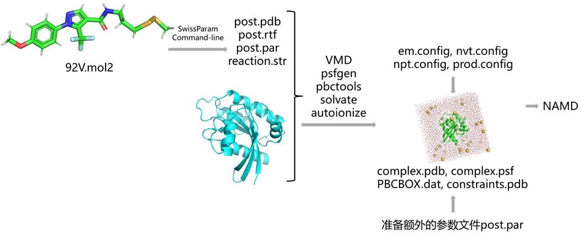
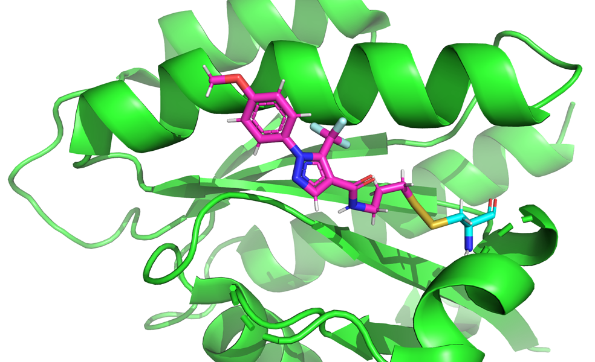
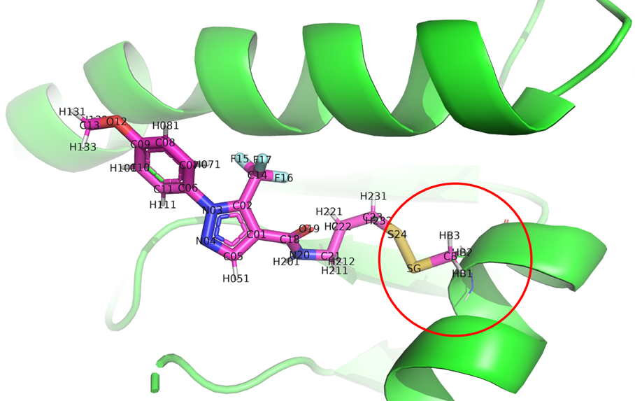
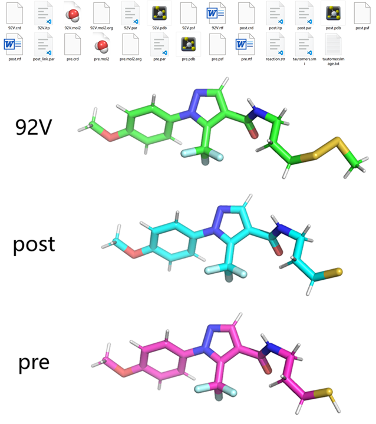
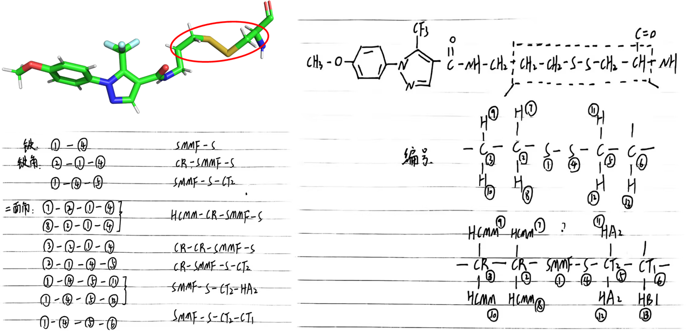
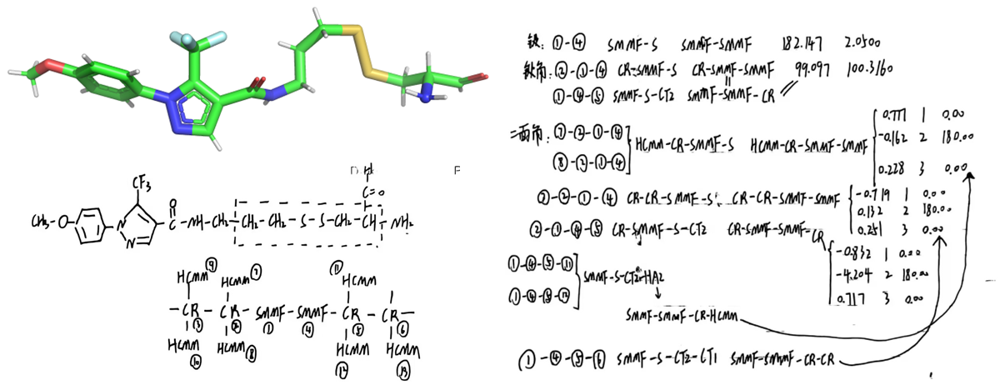

# NAMD进行共价体系蛋白配体动力学模拟，共价小分子配体参数由SwissParam生成
在分子动力学模拟领域，精准的力场参数化对于研究蛋白质与配体之间的相互作用至关重要。尤其是在共价体系中，配体与蛋白质残基通过共价键结合，传统的非共价模拟方法往往无法准确描述这种稳定且动态的结合过程。因此，如何为共价小分子配体提供合适的力场参数，成为推动这类模拟研究的关键。  

在这方面，SwissParam作为一个强大的工具，能够自动化地为共价小分子生成高质量的参数。通过结合NAMD分子动力学模拟平台，我们不仅能够准确模拟配体与蛋白质间的结合过程，还能深入探讨共价化学反应对蛋白质构象的影响。SwissParam生成的参数能够有效地反映共价反应中的电子效应和几何结构变化，使得动力学模拟的结果更具真实感和预测力。  

在本文中，我们将以PDBid：5VBM为例介绍如何利用SwissParam生成共价小分子的力场参数，并结合NAMD进行高效的蛋白配体动力学模拟。通过这一过程，研究者能够深入理解共价抑制剂在蛋白质活性位点的结合机制，为新药研发、分子设计以及化学反应机制的探索提供有力支持。  

  
## 使用SwissParam产生共价配体92V的MMFF力场参数
示例PDBid：5VBM中共价配体92V中的原子S24与蛋白的CYS残基形成了二硫键。  
  

首先准备输入的mol2格式文件。如下图所示，mol2文件是在配体的基础上向外延申了二硫键以及一个碳原子。其中向外延申的CYS残基部分的原子名称需要和残基中的原子名称一致。  
  

反应的配体原子名称是S24。反应类型是形成二硫键反应。形成共价的残基是CYS。输入结构文件的结构是共价反应后的结构。所以使用下述命令准备共价配体参数。该方式形成的力场参数是MMFF的。   
```shell
$ curl -s -F "myMol2=@92V.mol2" "swissparam.ch:5678/startparam?ligsite=S24&reaction=disulf_form&protres=CYS&topology=post-cap"
```

生成的文件如下所示。92V是含有二硫键以及延申的碳原子的结构的力场文件，post是反应后的配体部分的结构以及力场文件，pre是单单配体部分反应前的结构以及力场文件。  
  

## vmd共价建模
**（1）加载蛋白文件，加载共价配体文件，构建共价键生成结构拓扑文件。**   
```shell
$ ~/../../software/apps/vmd/1.9.3/vmd -dispdev text   # 启动vmd交互界面执行命令

vmd > package require psfgen   # 加载psfgen包建模
vmd > psfcontext reset

vmd > topology /public/home/yqyang/file/vegf-toppar/top_all36_prot.rtf   # 加载力场文件
vmd > topology /public/home/yqyang/file/vegf-toppar/toppar_water_ions.str

vmd > pdbalias residue HIS HSE
vmd > alias atom ILE CD1 CD
vmd > alias atom SER HG HG1
vmd > alias atom CYS HG HG1

vmd > segment PRO {pdb Protein.pdb}   # 加载蛋白文件
vmd > coordpdb Protein.pdb PRO

vmd > topology post.rtf   # 加载共价配体文件
vmd > segment LIG {pdb post.pdb}
vmd > coordpdb post.pdb LIG

vmd > topology reaction.str   # 构建共价键
vmd > patch REAC PRO:72 LIG:1

vmd > regenerate angles dihedrals   # 重新生成键角，二面角
vmd > guesscoord

vmd > writepsf merged.pdb
vmd > writepdb merged.psf

vmd > quit
```
**（2）确定PBC盒子尺寸。**  
```shell
cat > do.py << EOF
def set_watbox(file_in):
    with open(file_in) as f:
        f1 = f.readlines()
    x = []
    y = []
    z = []
    for i in f1:
        if i.startswith("ATOM"):
            x.append(float(i[30:38]))
            y.append(float(i[38:46]))
            z.append(float(i[46:54]))
    center = ((max(x)+min(x))/2, (max(y)+min(y))/2, (max(z)+min(z))/2)
    x_com = max(x) - min(x)
    y_com = max(y) - min(y)
    z_com = max(z) - min(z)
    radius = max(x_com, y_com, z_com)/2 + 12
    x_min = int(center[0] - radius)
    x_max = int(center[0] + radius)
    y_min = int(center[1] - radius)
    y_max = int(center[1] + radius)
    z_min = int(center[2] - radius)
    z_max = int(center[2] + radius)
    print("{{{{{0} {1} {2}}} {{{3} {4} {5}}}}}".format(x_min, y_min, z_min, x_max, y_max, z_max))
    return x_min, x_max, y_min, y_max, z_min, z_max

def main():
    import sys

    set_watbox(sys.argv[1])

if __name__=="__main__":
    main()
EOF
box_size=`python do.py merged.pdb`
rm do.py

echo ${box_size}
```
**（3）加水加离子。**    
```shell
$ ~/../../software/apps/vmd/1.9.3/vmd -dispdev text

vmd > package require pbctools   # 加载pbctools软件包

vmd > mol load psf merged.psf pdb merged.pdb   # 加载整个分子

vmd > package require solvate   # 加载solvate软件包进行溶剂化
vmd > solvate merged.psf merged.pdb -minmax {{-42 -35 -23} {26 32 44}} -o solvated
vmd > mol delete all

vmd > package require autoionize   # 加载autoionize软件包进行离子化
vmd > autoionize -psf solvated.psf -pdb solvated.pdb -sc 0.15 -o complex
vmd > pbc box -center centerofmass

vmd > exit
```
**（4）生成PBC盒子信息文件。**  
读取加水加离子之后的pdb文件输出PBC盒子信息，命令如下所示：  
```shell
cat > mk_pbcbox.tcl << EOF
#!/bin/bash
# vmd -dispdev text -e mk_pbcbox.tcl
package require psfgen
psfcontext reset
mol load psf complex.psf pdb complex.pdb
set everyone [atomselect top all]
set minmax [measure minmax \$everyone]
foreach {min max} \$minmax { break }
foreach {xmin ymin zmin} \$min { break }
foreach {xmax ymax zmax} \$max { break }
set file [open "PBCBOX.dat" w]
puts \$file "cellBasisVector1 [ expr \$xmax - \$xmin ] 0 0 "
puts \$file "cellBasisVector2 0 [ expr \$ymax - \$ymin ] 0 "
puts \$file "cellBasisVector3 0 0 [ expr \$zmax - \$zmin ] "
puts \$file "cellOrigin [ expr (\$xmax + \$xmin)/2 ] [ expr (\$ymax + \$ymin)/2 ] [ expr (\$zmax + \$zmin)/2 ] "
exit
EOF
vmd/1.9.3/vmd -dispdev text -e mk_pbcbox.tcl
rm mk_pbcbox.tcl
```
**（5）生成位置限制文件。** 如下所示：  
```shell
cat > constraints.tcl << EOF
mol new complex.pdb type pdb waitfor all
set all [atomselect top "all"]
\$all set beta 0
set sel [atomselect top "protein and noh"]
\$sel set beta 1
\$all writepdb constraints.pdb
quit
EOF
vmd/1.9.3/vmd -dispdev text -e constraints.tcl
rm constraints.tcl
```
## 准备键，键角，二面角等参数文件    
与标准残基或单独配体小分子模拟不同，配体与标准残基形成共价键之后，以共价键（对应的原子类型）为中心对应原子类型的键，键角，二面角参数是没有的，需要用户以 parameters .par 的形式自行添加进跑模拟的config文件中。所以需要找出哪些键类型，键角类型和二面角类型参数没有。   

如下图所示，首先找出涉及共价键的键类型，键角类型和二面角类型都有哪些。如下图红圈框出的所示，涉及共价键的所有原子包括共价键向两侧延申两个原子后所包含的所有原子。先确定共价键，然后共价键向外两侧延申一个原子即可得到键角，然后键角再向外两侧延申一个原子即可得到二面角。如下图键，键角，二面角的类型在原始的.par参数文件中是没有的，需要将这些参数补进去。    
  

但是共价反应产生的力场中仅延伸到CYS残基的CB原子，并没有延申到CA原子。所以根据上述已有的文件是没办法获得含有CA原子的二面角参数的。所以这里将分子结构mol2文件多保存一些然后使用SwissParam基于MMFF在产生一次力场参数。输入结构如下图所示，并根据参数文件将上述确实的参数匹配补齐。    
  

将需要补齐的下述参数加到post.par文件中。  
```text
BONDS
S    SMMF  182.147     2.0500 

ANGLES
CR   SMMF S      99.097    100.3160 
CT2  S    SMMF   99.097    100.3160

DIHEDRALS
S    SMMF CR   HCMM     0.777  1     0.00 
S    SMMF CR   HCMM    -0.162  2   180.00  
S    SMMF CR   HCMM     0.183  3     0.00 
SMMF S    CT2  HA2      0.777  1     0.00 
SMMF S    CT2  HA2     -0.162  2   180.00 
SMMF S    CT2  HA2      0.183  3     0.00 
CR   CR   SMMF S       -0.719  1     0.00 
CR   CR   SMMF S        0.132  2   180.00
CR   CR   SMMF S        0.251  3     0.00
CT1  CT2  S    SMMF    -0.719  1     0.00
CT1  CT2  S    SMMF     0.132  2   180.00
CT1  CT2  S    SMMF     0.251  3     0.00
CR   SMMF S    CT2     -0.832  1     0.00
CR   SMMF S    CT2     -4.204  2   180.00
CR   SMMF S    CT2      0.717  3     0.00
```
## 准备em，nvt，npt和md的config文件   
**em.config**    
```shell

#############################################################
## JOB DESCRIPTION                                         ##
#############################################################

# Minimization
# namd3 +p1 em.config > em.config.log

#############################################################
## ADJUSTABLE PARAMETERS                                   ##
#############################################################

structure          ../common/complex.psf
coordinates        ../common/complex.pdb
set outputbase     com

firsttimestep      0

# open names all, later will control
set ITEMP 310
set FTEMP 310
# if you do not want to open this option, assign 0
set INPUTNAME   0                      ;# use the former outputName, for restarting a simulation
set PSWITCH     1                      ;# whether to use langevinPiston pressure control
set FIXPDB      0
set CONSPDB     0
set CONSSCALE   1                      ;# default; initial value if you want to change
set parpath     ./toppar

#############################################################
## SIMULATION PARAMETERS                                   ##
#############################################################

# Input
paraTypeCharmm      on
parameters          ${parpath}/par_all36m_prot.prm
parameters          ../common/post.par
parameters          ${parpath}/toppar_water_ions_namd.str
mergeCrossterms yes

# restart or PBC
if { $INPUTNAME != 0 } {
    # restart
    BinVelocities $INPUTNAME.restart.vel.old
    BinCoordinates $INPUTNAME.restart.coor.old
    ExtendedSystem $INPUTNAME.restart.xsc.old
} else {
    # Periodic Boundary Conditionsc
    temperature $ITEMP
    source ../common/PBCBOX.dat
}

## Force-Field Parameters
exclude             scaled1-4;         # non-bonded exclusion policy to use "none,1-2,1-3,1-4,or scaled1-4"
                                    # 1-2: all atoms pairs that are bonded are going to be ignored
                                    # 1-3: 3 consecutively bonded are excluded
                                    # scaled1-4: include all the 1-3, and modified 1-4 interactions
                                    # electrostatic scaled by 1-4scaling factor 1.0
                                    # vdW special 1-4 parameters in charmm parameter file.
1-4scaling          1.0

# CUT-OFFS
switching                on
switchdist              10.0
cutoff                  12.0
pairlistdist            13.5

PME                     yes
PMEGridSpacing          1.0
PMETolerance            10e-6
PMEInterpOrder          4

wrapWater               on;                # wrap water to central cell
wrapAll                 on;                # wrap other molecules too
wrapNearest             off;               # use for non-rectangular cells (wrap to the nearest image)

# SPACE PARTITIONING
splitpatch              hydrogen
hgroupcutoff            2.8
stepspercycle           20
margin                  2
longSplitting           C2

# RESPA PROPAGATOR
# timestep                1.0
timestep                2.0
useSettle               on
fullElectFrequency      2
nonbondedFreq           1

# SHAKE
rigidbonds              all
rigidtolerance          0.000001
rigiditerations         400

# COM
ComMotion               no

# vdw
vdwForceSwitching       on

# Constant Temperature Control
if { $ITEMP == $FTEMP } {
    langevin                   on;         # do langevin dynamics
    langevinDamping             1;         # damping coefficient (gamma) of 1/ps
                                        # 5/ps by Junfan
    langevinTemp           $FTEMP;
    langevinHydrogen          off;         # don't couple langevin bath to hydrogens
} else {
    reassignFreq 1000;                     # use this to reassign velocity every 1000 steps
    if { $FTEMP > $ITEMP } {
        reassignIncr 10
    } else {
        reassignIncr -10
    }
    reassignTemp $ITEMP
    reassignHold $FTEMP
}

# Constant Pressure Control (variable volume)
if { $PSWITCH != 0 } {
    # if running G-actin remove/comment out these 3 lines
    # by Junfan
    # CONSTANT-P, not in tutorial
    useGroupPressure        yes;           # use a hydrogen-group based pseudo-molecular viral to calcualte pressure and
                                        # has less fluctuation, is needed for rigid bonds (rigidBonds/SHAKE)
    useFlexibleCell         no;            # yes for anisotropic system like membrane
    useConstantRatio        no;            # keeps the ratio of the unit cell in the x-y plane constant A=B
    #    useConstatntArea     yes;
    langevinPiston          on
    langevinPistonTarget    1.01325
    langevinPistonPeriod    100;         # 100? 2000?
    langevinPistonDecay     50;         # 50?
    langevinPistonTemp      $FTEMP
    StrainRate              0.0 0.0 0.0
}

# Output
outputname $outputbase-em;

#@ equilibration work flow. have to put in the end!
# run one step to get into scripting mode
minimize                0

# turn off until later
langevinPiston          off

# min all atoms
minimize                10000
```
**nvt.config**    
```shell

#############################################################
## JOB DESCRIPTION                                         ##
#############################################################

# NVT
# namd3 +p1 +devices 0 nvt.config 2 > nvt.config.log

#############################################################
## ADJUSTABLE PARAMETERS                                   ##
#############################################################

structure          ../common/complex.psf
coordinates        ../common/complex.pdb
set outputbase     com

firsttimestep      0

set                 ITEMP 310
set                 FTEMP 310
set                 INPUTNAME   0                      ;# use the former outputName, for restarting a simulation
set                 PSWITCH     0                      ;# whether to use langevinPiston pressure control
set                 CONSSCALE   1                      ;# default; initial value if you want to change
set                 CONSPDB     ../common/constraints
set parpath         ./toppar

#############################################################
## SIMULATION PARAMETERS                                   ##
#############################################################

# Input
paraTypeCharmm      on
parameters          ${parpath}/par_all36m_prot.prm
parameters          ../common/post.par
parameters          ${parpath}/toppar_water_ions_namd.str
mergeCrossterms yes

# restart or PBC
if { $INPUTNAME != 0 } {
    # restart
    BinVelocities $INPUTNAME.restart.vel.old
    BinCoordinates $INPUTNAME.restart.coor.old
    ExtendedSystem $INPUTNAME.restart.xsc.old
} else {
    bincoordinates      ${outputbase}-em.coor
    binvelocities       ${outputbase}-em.vel
    extendedSystem      ${outputbase}-em.xsc
}

## Force-Field Parameters
exclude             scaled1-4;         # non-bonded exclusion policy to use "none,1-2,1-3,1-4,or scaled1-4"
                                    # 1-2: all atoms pairs that are bonded are going to be ignored
                                    # 1-3: 3 consecutively bonded are excluded
                                    # scaled1-4: include all the 1-3, and modified 1-4 interactions
                                    # electrostatic scaled by 1-4scaling factor 1.0
                                    # vdW special 1-4 parameters in charmm parameter file.
1-4scaling              1.0

# CUT-OFFS
switching                on
switchdist              10.0
cutoff                  12.0
pairlistdist            13.5

PME                     yes
PMEGridSpacing          1.0
PMETolerance            10e-6
PMEInterpOrder          4

wrapWater               on;                # wrap water to central cell
wrapAll                 on;                # wrap other molecules too
wrapNearest             off;               # use for non-rectangular cells (wrap to the nearest image)

# SPACE PARTITIONING
splitpatch              hydrogen
hgroupcutoff            2.8
stepspercycle           20
margin                  2
longSplitting           C2

# RESPA PROPAGATOR
# timestep                1.0
timestep                2.0
useSettle               on
fullElectFrequency      2
nonbondedFreq           1

# SHAKE
rigidbonds              all
rigidtolerance          0.000001
rigiditerations         400

# vdw
vdwForceSwitching       on

# Constant Temperature Control
if { $ITEMP == $FTEMP } {
    langevin                   on;         # do langevin dynamics
    langevinDamping             1;         # damping coefficient (gamma) of 1/ps
                                        # 5/ps by Junfan
    langevinTemp           $FTEMP;
    langevinHydrogen          off;         # don't couple langevin bath to hydrogens
} else {
    reassignFreq 1000;                     # use this to reassign velocity every 1000 steps
    if { $FTEMP > $ITEMP } {
        reassignIncr 10
    } else {
        reassignIncr -10
    }
    reassignTemp $ITEMP
    reassignHold $FTEMP
}

# according to P. Blood use "no" for first NPT run
# then use "yes" for all NPT runs afterward
COMmotion no

#############################################################
## EXECUTION SCRIPT                                        ##
#############################################################

# Output
outputname $outputbase-nvt;

# 500steps = every 1ps
restartfreq         50000
dcdfreq             50000
xstFreq             50000
outputEnergies      50000
outputPressure      50000
outputTiming        50000

CUDASOAintegrate        on

# Positional restraints
# Write out a separate pdb file in which the B values for
# the backbone, the non-hydrogen nucleotide atoms, the ion,
# and the water oxygens within 2.5 A of magnesium are set to 2
if { $CONSPDB != 0 } {
    Constraints          yes
    ConsRef              $CONSPDB.pdb
    ConsKFile            $CONSPDB.pdb
    ConskCol             B
    constraintScaling    $CONSSCALE
}

# NVT
langevinPiston          off
run                     20000
```
**npt.config**    
```shell

#############################################################
## JOB DESCRIPTION                                         ##
#############################################################

# namd3 +p1 +devices 0 npt.config > npt.config.log

#############################################################
## ADJUSTABLE PARAMETERS                                   ##
#############################################################

structure          ../common/complex.psf
coordinates        ../common/complex.pdb
set outputbase     com

firsttimestep      0

set                 ITEMP 310
set                 FTEMP 310
set                 INPUTNAME   0                      ;# use the former outputName, for restarting a simulation
set                 PSWITCH     0                      ;# whether to use langevinPiston pressure control
set                 CONSSCALE   1                      ;# default; initial value if you want to change
set                 CONSPDB     ../common/constraints
set parpath         ./toppar

#############################################################
## SIMULATION PARAMETERS                                   ##
#############################################################

# Input
paraTypeCharmm      on
parameters          ${parpath}/par_all36m_prot.prm
parameters          ../common/post.par
parameters          ${parpath}/toppar_water_ions_namd.str
mergeCrossterms yes

# restart or PBC
if { $INPUTNAME != 0 } {
    # restart
    BinVelocities $INPUTNAME.restart.vel.old
    BinCoordinates $INPUTNAME.restart.coor.old
    ExtendedSystem $INPUTNAME.restart.xsc.old
} else {
    bincoordinates      ${outputbase}-nvt.coor
    binvelocities       ${outputbase}-nvt.vel
    extendedSystem      ${outputbase}-nvt.xsc
}

## Force-Field Parameters
exclude             scaled1-4;         # non-bonded exclusion policy to use "none,1-2,1-3,1-4,or scaled1-4"
                                    # 1-2: all atoms pairs that are bonded are going to be ignored
                                    # 1-3: 3 consecutively bonded are excluded
                                    # scaled1-4: include all the 1-3, and modified 1-4 interactions
                                    # electrostatic scaled by 1-4scaling factor 1.0
                                    # vdW special 1-4 parameters in charmm parameter file.
1-4scaling              1.0

# CUT-OFFS
switching                on
switchdist              10.0
cutoff                  12.0
pairlistdist            13.5

PME                     yes
PMEGridSpacing          1.0
PMETolerance            10e-6
PMEInterpOrder          4

wrapWater               on;                # wrap water to central cell
wrapAll                 on;                # wrap other molecules too
wrapNearest             off;               # use for non-rectangular cells (wrap to the nearest image)

# SPACE PARTITIONING
splitpatch              hydrogen
hgroupcutoff            2.8
stepspercycle           20
margin                  2
longSplitting           C2

# RESPA PROPAGATOR
# timestep                1.0
timestep                2.0
useSettle               on
fullElectFrequency      2
nonbondedFreq           1

# SHAKE
rigidbonds              all
rigidtolerance          0.000001
rigiditerations         400

# vdw
vdwForceSwitching       on

# Constant Temperature Control
if { $ITEMP == $FTEMP } {
    langevin                   on;         # do langevin dynamics
    langevinDamping             1;         # damping coefficient (gamma) of 1/ps
                                        # 5/ps by Junfan
    langevinTemp           $FTEMP;
    langevinHydrogen          off;         # don't couple langevin bath to hydrogens
} else {
    reassignFreq 1000;                     # use this to reassign velocity every 1000 steps
    if { $FTEMP > $ITEMP } {
        reassignIncr 10
    } else {
        reassignIncr -10
    }
    reassignTemp $ITEMP
    reassignHold $FTEMP
}

# according to P. Blood use "no" for first NPT run
# then use "yes" for all NPT runs afterward
COMmotion no

#############################################################
## EXECUTION SCRIPT                                        ##
#############################################################

# Output
outputname $outputbase-nptstep;

# 500steps = every 1ps
restartfreq         50000
dcdfreq             50000
xstFreq             50000
outputEnergies      50000
outputPressure      50000
outputTiming        50000

CUDASOAintegrate        on

# Positional restraints
# Write out a separate pdb file in which the B values for
# the backbone, the non-hydrogen nucleotide atoms, the ion,
# and the water oxygens within 2.5 A of magnesium are set to 2
if { $CONSPDB != 0 } {
        Constraints          yes
        ConsRef              $CONSPDB.pdb
        ConsKFile            $CONSPDB.pdb
        ConskCol             B
        constraintScaling    $CONSSCALE
}

set PSWITCH 1
# Constant Pressure Control (variable volume)
if { $PSWITCH != 0 } {
    # if running G-actin remove/comment out these 3 lines
    # by Junfan
    # CONSTANT-P, not in tutorial
    useGroupPressure        yes;           # use a hydrogen-group based pseudo-molecular viral to calcualte pressure and
                                        # has less fluctuation, is needed for rigid bonds (rigidBonds/SHAKE)
    useFlexibleCell         no;            # yes for anisotropic system like membrane
    useConstantRatio        no;            # keeps the ratio of the unit cell in the x-y plane constant A=B
    #    useConstatntArea     yes;
    langevinPiston          on
    langevinPistonTarget    1.01325
    langevinPistonPeriod    100;         # 100? 2000?
    langevinPistonDecay     100;         # 50?
    langevinPistonTemp      $FTEMP
    #StrainRate              0.0 0.0 0.0
}

run                     100000
```
**prod.config**    
```shell

#############################################################
## JOB DESCRIPTION                                         ##
#############################################################

# namd3 +p1 +devices 0 prod.config > prod.config.log

#############################################################
## ADJUSTABLE PARAMETERS                                   ##
#############################################################

structure          ../common/complex.psf
coordinates        ../common/complex.pdb     ;# or reports error
set outputbase     com               ;# consistent with equil
firsttimestep      0

#############################################################

set ITEMP 310
set FTEMP 310
set INPUTNAME       0                   ;# restart
set PSWITCH         1                   ;# whether to use langevinPiston pressure control
set FIXPDB          0
set CONSPDB         0
set CONSSCALE       0                   ;# default:1
set parpath         ./toppar

#############################################################
## SIMULATION PARAMETERS                                   ##
#############################################################

# Input
paraTypeCharmm      on
parameters          ${parpath}/par_all36m_prot.prm
parameters          ../common/post.par
parameters          ${parpath}/toppar_water_ions_namd.str
mergeCrossterms yes

if { $INPUTNAME != 0 } {
    # restart
    BinVelocities $INPUTNAME.restart.vel.old
    BinCoordinates $INPUTNAME.restart.coor.old
    ExtendedSystem $INPUTNAME.restart.xsc.old
} else {
    # from equil. use the former outputName
    bincoordinates          $outputbase-nptstep.coor
    binvelocities           $outputbase-nptstep.vel
    extendedSystem      $outputbase-nptstep.xsc
}

## Force-Field Parameters
exclude             scaled1-4;         # non-bonded exclusion policy to use "none,1-2,1-3,1-4,or scaled1-4"
                                    # 1-2: all atoms pairs that are bonded are going to be ignored
                                    # 1-3: 3 consecutively bonded are excluded
                                    # scaled1-4: include all the 1-3, and modified 1-4 interactions
                                    # electrostatic scaled by 1-4scaling factor 1.0
                                    # vdW special 1-4 parameters in charmm parameter file.
1-4scaling          1.0

# CUT-OFFS
switching                on
switchdist              10.0
cutoff                  12.0
pairlistdist            13.5

PME                     yes
PMEGridSpacing          1.0
PMETolerance            10e-6
PMEInterpOrder          4

wrapWater               on;                # wrap water to central cell
wrapAll                 on;                # wrap other molecules too
wrapNearest             off;               # use for non-rectangular cells (wrap to the nearest image)

# SPACE PARTITIONING
splitpatch              hydrogen
hgroupcutoff            2.8
stepspercycle           20
margin                  2
longSplitting           C2

# RESPA PROPAGATOR
# timestep                1.0
timestep                2.0
useSettle               on
fullElectFrequency      2
nonbondedFreq           1

# SHAKE
rigidbonds              all
rigidtolerance          0.000001
rigiditerations         400

# vdw
vdwForceSwitching       on

# Constant Temperature Control
if { $ITEMP == $FTEMP } {
    langevin                   on;         # do langevin dynamics
    langevinDamping             1;         # damping coefficient (gamma) of 1/ps
                                        # 5/ps by Junfan
    langevinTemp           $FTEMP;
    langevinHydrogen          off;         # don't couple langevin bath to hydrogens
} else {
    reassignFreq 1000;                     # use this to reassign velocity every 1000 steps
    if { $FTEMP > $ITEMP } {
        reassignIncr 10
    } else {
        reassignIncr -10
    }
    reassignTemp $ITEMP
    reassignHold $FTEMP
}

# Constant Pressure Control (variable volume)
if { $PSWITCH != 0 } {
    # if running G-actin remove/comment out these 3 lines
    # by Junfan
    # CONSTANT-P, not in tutorial
    useGroupPressure        yes;           # use a hydrogen-group based pseudo-molecular viral to calcualte pressure and
                                        # has less fluctuation, is needed for rigid bonds (rigidBonds/SHAKE)
    useFlexibleCell         no;            # yes for anisotropic system like membrane
    useConstantRatio        no;            # keeps the ratio of the unit cell in the x-y plane constant A=B
    #    useConstatntArea     yes;
    langevinPiston          on
    langevinPistonTarget    1.01325
    langevinPistonPeriod    100;         # 100? 2000?
    langevinPistonDecay     50;         # 50?
    langevinPistonTemp      $FTEMP
    StrainRate              0.0 0.0 0.0
}

# according to P. Blood use "no" for first NPT run
# then use "yes" for all NPT runs afterward
COMmotion yes

# Fixed atoms
# port first, h2o 2nd, 1 means not move
if { $FIXPDB != 0 } {
    fixedAtoms      yes
    fixedAtomsForces yes
    fixedAtomsFile  $FIXPDB.pdb
    fixedAtomsCol   B                   ;# beta
}

# Positional restraints
# Write out a separate pdb file in which the B values for
# the backbone, the non-hydrogen nucleotide atoms, the ion,
# and the water oxygens within 2.5 A of magnesium are set to 2
if { $CONSPDB != 0 } {
    Constraints          yes
    ConsRef              $CONSPDB.pdb
    ConsKFile            $CONSPDB.pdb
    ConskCol             B
    constraintScaling    $CONSSCALE
}

CUDASOAintegrate         on

# Output
outputName          $outputbase-prodstep

restartfreq         50000     ;# 500steps = every 1ps. name=default
dcdfreq             50000
xstFreq             50000
outputEnergies      50000
outputPressure      50000
outputTiming        50000

run                 50000
```
## 跑模拟的脚本文件  
```shell
source apps_namd_3.0alpha9.sh

NAMD="namd3 +p1 +devices 0"

## min
cd prod
base_em=em.config
$NAMD $base_em > $base_em.log

## nvt
base_nvt=nvt.config
$NAMD $base_nvt > $base_nvt.log

## npt
base_nptstep=npt.config
$NAMD $base_nptstep > $base_nptstep.log

## prod
base_prodstep=prod.config
$NAMD $base_prodstep > $base_prodstep.log
```