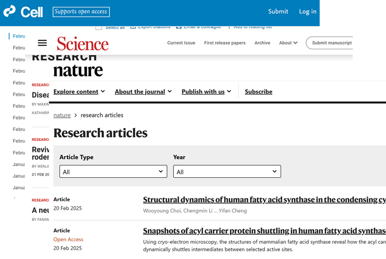

# NCS文献周览（2025.2.17-2025.2.23）
在熵增的宇宙里，打捞有序的星光。    
以逻辑织就经纬，用想象填补留白。  

  

## Nature
**1. Characterization of single neurons reprogrammed by pancreatic cancer**  
> 时间：2025-2-17  
> 链接：https://www.nature.com/articles/s41586-025-08735-3  

| **研究方向**       | **文章类型**       | **研究体系**       | **研究策略**       |
|--------------------|--------------------|--------------------|--------------------|
| PDAC 神经支配研究  | 实验研究 | PDAC 及相关神经元 | 开发 Trace-n-seq 方法分析 |

**文章概述**  
本文聚焦胰腺导管腺癌（PDAC），开发 Trace-n-seq 方法从单细胞层面表征支配胰腺和 PDAC 的神经元，揭示新型神经元类型和分子网络，构建神经 - 癌 - 微环境相互作用组，发现去神经相关作用，为 PDAC 治疗提供新思路。    

**2. Ambient-pressure superconductivity onset above 40 K in (La,Pr)3Ni2O7 films**  
> 时间：2025-2-17  
> 链接：https://www.nature.com/articles/s41586-025-08755-z  

| **研究方向**       | **文章类型**       | **研究体系**       | **研究策略**       |
|--------------------|--------------------|--------------------|--------------------|
| 双层镍酸盐超导电性研究 | 实验研究 | 双层镍酸盐外延薄膜 | 生长薄膜并进行多方法测量 |

**文章概述**  
双层镍酸盐超导体在高压下被发现，开启了高温超导新篇章，但高压和杂质相阻碍其研究。本文报道在常压下双层镍酸盐外延薄膜超导电性起始温度高于麦克米兰极限（40K），用特定方法生长纯相单晶薄膜，测量显示相关特性，还发现各向异性等，为常压研究及探索更高温超导奠基。   

**3. Vertical structure of an exoplanet’s atmospheric jet stream**  
> 时间：2025-2-18  
> 链接：https://www.nature.com/articles/s41586-025-08664-1  

| **研究方向**       | **文章类型**       | **研究体系**       | **研究策略**       |
|--------------------|--------------------|--------------------|--------------------|
| 超热木星大气环流研究 | 实验研究 | 超热木星大气 | 观测大气垂直结构并对比模型 |

**文章概述**  
超热木星是太阳系外的一类极端行星，为研究大气过程提供独特视角，其昼夜温差带来能量分布的气候谜题。本文发现超热木星大气环流有显著变化，存在从面向恒星热侧到背向空间冷侧的单侧流，且位于赤道超旋转急流之下。研究解析了大气动力学垂直结构，对比模型发现理论与观测差距，为开发更全面模型提供试验基础。  

**4. Community estimate of global glacier mass changes from 2000 to 2023**  
> 时间：2025-2-19  
> 链接：https://www.nature.com/articles/s41586-024-08545-z  

| **研究方向**       | **文章类型**       | **研究体系**       | **研究策略**       |
|--------------------|--------------------|--------------------|--------------------|
| 全球冰川质量变化研究 | 实验研究 | 全球冰川 | 多方法数据整合分析 |

**文章概述**  
冰川是气候变化的重要指标，其融化影响广泛，但此前全球冰川质量变化评估受数据限制。本文通过 GlaMBIE 项目整合多种观测方法数据，得出 2000 - 2023 年全球冰川年均质量损失 273 ± 16 亿吨，损失速率加快，明确各区域情况及观测方法差异，与 IPCC 对比并指出未来冰川质量损失严峻，呼吁减排。  

**5. Continuous-variable multipartite entanglement in an integrated microcomb**  
> 时间：2025-2-19  
> 链接：https://www.nature.com/articles/s41586-025-08602-1  

| **研究方向**       | **文章类型**       | **研究体系**       | **研究策略**       |
|--------------------|--------------------|--------------------|--------------------|
| 大规模纠缠态产生研究 | 实验研究 | 集成光学芯片量子微梳 | 多技术联用产生和验证纠缠态 |

**文章概述**  
大规模纠缠态的产生对量子技术至关重要，集成量子光子学提供了实现平台。本文报道在集成光学芯片上确定性地产生连续变量八模纠缠，利用量子微梳产生多模压缩真空光频梳，验证了八模态的不可分离性，表征了多体纠缠结构，展示了连续变量集成光子量子器件在量子计算等领域的潜力。  

**6. Plasmodium blood stage development requires the chromatin remodeller Snf2L**  
> 时间：2025-2-19  
> 链接：https://www.nature.com/articles/s41586-025-08595-x  

| **研究方向**       | **文章类型**       | **研究体系**       | **研究策略**       |
|--------------------|--------------------|--------------------|--------------------|
| 恶性疟原虫基因表达调控研究 | 实验研究 | 恶性疟原虫 | 多实验验证 PfSnf2L 功能及抑制剂 |

**文章概述**  
恶性疟原虫复杂生命周期各阶段需严格基因表达调控，其染色质结构和表观遗传修饰变化起关键作用。本文发现恶性疟原虫 Snf2L（PfSnf2L）是一种 ISWI 相关 ATP 酶，能在体外重定位核小体，对无性发育和有性分化至关重要，还找到抑制 PfSnf2L 的药物 NH125，可作为新型抗疟阻断传播药物。  

**7. A dual-pathway architecture for stress to disrupt agency and promote habit**  
> 时间：2025-2-19  
> 链接：https://www.nature.com/articles/s41586-024-08580-w  

| **研究方向**       | **文章类型**       | **研究体系**       | **研究策略**       |
|--------------------|--------------------|--------------------|--------------------|
| 慢性压力对学习和决策影响的神经机制研究 | 实验研究 | 雌雄小鼠 | 行为实验、神经示踪、光纤光度法、光遗传学和化学遗传学等 |

**文章概述**  
慢性压力会改变学习和决策方式，本文通过多方面系统神经科学方法在雌雄小鼠中研究其神经回路机制。发现慢性压力通过杏仁核 - 纹状体双通路神经元回路，减弱基底外侧杏仁核到背内侧纹状体通路活动以破坏行动 - 结果学习和自主性，增强中央杏仁核到背内侧纹状体通路活动来促进习惯形成，为理解压力影响提供神经回路层面见解。  

**8. Tumour-wide RNA splicing aberrations generate actionable public neoantigens**  
> 时间：2025-2-19  
> 链接：https://www.nature.com/articles/s41586-024-08552-0  

| **研究方向**       | **文章类型**       | **研究体系**       | **研究策略**       |
|--------------------|--------------------|--------------------|--------------------|
| 肿瘤内异质性肿瘤的免疫治疗新靶点研究 | 实验研究 | 多种癌症类型的细胞系和患者样本 | RNA 测序、质谱分析、基因编辑、体外致敏实验、流式细胞术等 |

**文章概述**  
基于 T 细胞的免疫疗法治疗癌症有前景，但对体细胞突变少、肿瘤内异质性高的肿瘤效果有限。本文发现由 RNA 剪接异常产生的肿瘤范围的公共新抗原，能被 T 细胞识别并杀伤癌细胞，且剪接因子表达失调与新抗原产生相关，为 T 细胞免疫疗法应对肿瘤内异质性挑战提供分子基础。  

**9. Dual regulation of mitochondrial fusion by Parkin–PINK1 and OMA1**  
> 时间：2025-2-19  
> 链接：https://www.nature.com/articles/s41586-025-08590-2  

| **研究方向**       | **文章类型**       | **研究体系**       | **研究策略**       |
|--------------------|--------------------|--------------------|--------------------|
| 线粒体应激生理作用 | 实验研究 | 多种基因敲除突变小鼠 | 多组学及形态学分析 |

**文章概述**  
本文通过对多种基因敲除和突变小鼠研究，发现 Parkin 和 OMA1 协同作用，通过线粒体融合维护线粒体结构和基因组。单独缺失不影响，但共同缺失致小鼠体小、早亡等，还影响线粒体形态，激活免疫反应，揭示其双重调控机制及生理条件下的重要性。  

**10. Endogenous DNA damage at sites of terminated transcripts**  
> 时间：2025-2-19  
> 链接：https://www.nature.com/articles/s41586-024-08578-4  

| **研究方向**       | **文章类型**       | **研究体系**       | **研究策略**       |
|--------------------|--------------------|--------------------|--------------------|
| DNA 损伤机制及来源 | 实验研究 | 大肠杆菌和人类细胞 | 构建蛋白标记及多组学分析 |

**文章概述**  
文章发现 DNA 损伤新来源，即转录终止处的内源性 DNA 损伤。通过构建 DExI 蛋白标记 3′-ssDNA 末端，在大肠杆菌和人类细胞中验证其功能。发现大肠杆菌中自发 3′-ssDNA 末端频繁出现，与复制相关，转录终止可致 DNA 损伤，提出 RNAP 停顿致 DNA 断裂的假说。  

**11. Cooperative nutrient scavenging is an evolutionary advantage in cancer**  
> 时间：2025-2-19  
> 链接：https://www.nature.com/articles/s41586-025-08588-w  

| **研究方向**       | **文章类型**       | **研究体系**       | **研究策略**       |
|--------------------|--------------------|--------------------|--------------------|
| 肿瘤细胞合作及治疗靶点 | 实验研究 | 肿瘤细胞、小鼠模型等 | 实验、建模、数据分析 |

**文章概述**  
本文探究肿瘤细胞合作能否成治疗靶点，发现肿瘤细胞在谷氨酰胺缺乏时合作利用细胞外寡肽，通过分泌氨肽酶 CNDP2 水解寡肽获取氨基酸。抑制 CNDP2 可减少肿瘤生长，且合作肿瘤在体内更具适应性，提示 CNDP2 介导的合作可作癌症治疗靶点。    

**12. Spontaneous ordering of identical materials into a triboelectric series**  
> 时间：2025-2-19  
> 链接：https://www.nature.com/articles/s41586-024-08530-6  

| **研究方向**       | **文章类型**       | **研究体系**       | **研究策略**       |
|--------------------|--------------------|--------------------|--------------------|
| 接触起电现象及机制 | 实验研究 | 聚二甲基硅氧烷样本 | 实验、建模、测试分析 |

**文章概述**  
文章探究接触起电现象，发现相同材料最初随机、非传递性地交换电荷，但经多次实验会形成摩擦电序列。接触行为驱动这一演变，接触次数多的样本带负电。研究还发现接触使样本表面纳米级形态改变，揭示接触历史在接触起电中的关键作用。  

**13. Human-correlated genetic models identify precision therapy for liver cancer**  
> 时间：2025-2-19  
> 链接：https://www.nature.com/articles/s41586-025-08585-z  

| **研究方向**       | **文章类型**       | **研究体系**       | **研究策略**       |
|--------------------|--------------------|--------------------|--------------------|
| 肝癌精准医疗及模型构建 | 实验研究 | 免疫活性小鼠肝癌模型 | 构建模型、分析验证、筛选药物 |

**文章概述**  
文章构建了一系列遗传驱动的免疫活性小鼠肝癌模型，整合小鼠与人类肝癌转录组数据，识别出四个亚型簇，验证了对标准治疗的反应，筛选出氯法拉滨可用于特定亚型治疗，为肝癌精准医疗提供了新平台。  

**14. An opponent striatal circuit for distributional reinforcement learning**  
> 时间：2025-2-19  
> 链接：https://www.nature.com/articles/s41586-024-08488-5  

| **研究方向**       | **文章类型**       | **研究体系**       | **研究策略**       |
|--------------------|--------------------|--------------------|--------------------|
| 纹状体编码奖励分布的机制 | 实验研究 | 小鼠大脑纹状体相关 | 实验、建模、多技术验证 |

**文章概述**  
文章探究大脑纹状体编码奖励分布高阶矩的机制。通过小鼠经典条件反射任务，发现纹状体存在奖励方差抽象编码，构建 REDRL 模型阐释机制，还证实多巴胺对分布表征重要，D1 和 D2 神经元分别编码奖励分布左右尾。  

**15. Hypotaxy of wafer-scale single-crystal transition metal dichalcogenides**  
> 时间：2025-2-19  
> 链接：https://www.nature.com/articles/s41586-024-08492-9  

| **研究方向**       | **文章类型**       | **研究体系**       | **研究策略**       |
|--------------------|--------------------|--------------------|--------------------|
| 2D 半导体 TMDs 的生长方法 | 实验研究 | 基于石墨烯模板生长 TMDs | 实验、表征、理论计算 |

**文章概述**  
文章介绍了一种名为 “hypotaxy” 的方法，可在多种衬底上直接生长晶圆级单晶过渡金属二硫属化物（TMDs）。该方法能精确控制厚度，所生长的 TMDs 性能优良，为半导体制造提供新途径。  

**16. Scale dichotomization reduces customer racial discrimination and income inequality**  
> 时间：2025-2-19  
> 链接：https://www.nature.com/articles/s41586-025-08599-7  

| **研究方向**       | **文章类型**       | **研究体系**       | **研究策略**       |
|--------------------|--------------------|--------------------|--------------------|
| 评分制对客户种族歧视的影响 | 实验研究 | 在线平台客户评价体系 | 实验、回归分析等 |

**文章概述**  
文章聚焦在线平台客户评价中的种族歧视问题，提出将五星评分制改为二分制可减少歧视。通过家政服务平台的准自然实验和三项在线实验，验证了二分制能消除评分和收入的种族差异，揭示其机制，为减少歧视提供新策略。  

**17. Reconstitution of SPO11-dependent double-strand break formation**  
> 时间：2025-2-19  
> 链接：https://www.nature.com/articles/s41586-025-08601-2  

| **研究方向**       | **文章类型**       | **研究体系**       | **研究策略**       |
|--------------------|--------------------|--------------------|--------------------|
| SPO11 引发 DSBs 的分子机制 | 实验研究 | 小鼠 SPO11-TOP6BL 复合物体系 | 体外重组、结构建模等 |

**文章概述**  
文章聚焦减数分裂中 SPO11 产生 DNA 双链断裂（DSBs）的机制。通过体外重组实验，发现小鼠 SPO11-TOP6BL 复合物的特性，如单体状态、DNA 结合、切割及重接活性等，还构建结构模型，揭示其活性受弱二聚化调控，为理解减数分裂 DSBs 提供依据。  

**18. In vitro reconstitution of meiotic DNA double-strand-break formation**  
> 时间：2025-2-19  
> 链接：https://www.nature.com/articles/s41586-024-08551-1 

| **研究方向**       | **文章类型**       | **研究体系**       | **研究策略**       |
|--------------------|--------------------|--------------------|--------------------|
| 减数分裂 DSB 形成机制 | 实验研究 | 小鼠 SPO11-TOP6BL 复合物体系 | 蛋白纯化、活性及结构分析 |

**文章概述**  
文章围绕减数分裂中 DNA 双链断裂展开，成功纯化小鼠 SPO11-TOP6BL 复合物，发现其可体外切割 DNA 并与 5′端共价结合，明确其高亲和力结合特性、底物偏好，证实切割需 Mg²⁺非 ATP，揭示其与祖先拓扑异构酶 VI 的差异，为理解减数分裂提供框架。  

**19. Interferometric single-shot parity measurement in InAs–Al hybrid devices**  
> 时间：2025-2-19  
> 链接：https://www.nature.com/articles/s41586-024-08445-2 

| **研究方向**       | **文章类型**       | **研究体系**       | **研究策略**       |
|--------------------|--------------------|--------------------|--------------------|
| 拓扑量子计算中宇称测量 | 实验研究 | 砷化铟 - 铝异质结构体系 | 搭建装置并测量分析数据 |

**文章概述**  
文章聚焦于拓扑量子计算，介绍能测融合规则的设备架构，通过砷化铟 - 铝异质结构实现费米子宇称单次干涉测量，基于量子电容测量呈现磁通周期性双峰性，解释测量结果并讨论，为拓扑量子比特实现带来进展。  

**20. SPO11 dimers are sufficient to catalyse DNA double-strand breaks in vitro**  
> 时间：2025-2-19  
> 链接：https://www.nature.com/articles/s41586-024-08574-8 

| **研究方向**       | **文章类型**       | **研究体系**       | **研究策略**       |
|--------------------|--------------------|--------------------|--------------------|
| 减数分裂 DSB 形成机制 | 实验研究 | 小鼠 SPO11 蛋白及相关体系 | 体外重构与多实验分析 |

**文章概述**  
文章围绕小鼠 SPO11 展开，首次体外重构其催化减数分裂 DSB 形成活性，证实其能独立切割 DNA 并与 5′端共价结合，发现切割受多因素影响，需二聚化形成活性位点，且 SPO11 - TOP6BL 复合物有类似活性，为理解 DSB 机制提供框架。  

**21. Global modules robustly emerge from local interactions and smooth gradients**  
> 时间：2025-2-19  
> 链接：https://www.nature.com/articles/s41586-024-08541-3 

| **研究方向**       | **文章类型**       | **研究体系**       | **研究策略**       |
|--------------------|--------------------|--------------------|--------------------|
| 模块化结构和功能的涌现机制 | 实验研究 | 大脑、生态系统等相关体系 | 理论推导结合模型模拟分析 |

**文章概述**  
文章提出峰值选择原理，结合位置信息和图灵模式形成机制，通过局部相互作用和梯度驱动模块自组织。应用于大脑网格细胞系统、生态系统等，能解释模块涌现、具拓扑鲁棒性，还对网格细胞多层面做出预测，为模块化结构和功能的出现提供新机制。  

**22. Perovskite heteroepitaxy for high-efficiency and stable pure-red LEDs**  
> 时间：2025-2-19  
> 链接：https://www.nature.com/articles/s41586-024-08503-9 

| **研究方向**       | **文章类型**       | **研究体系**       | **研究策略**       |
|--------------------|--------------------|--------------------|--------------------|
| 纯红钙钛矿发光二极管的研发 | 实验研究 | CsPbI₃量子点及相关体系 | 异质外延及多种表征分析 |

**文章概述**  
文章聚焦于超小 CsPbI₃钙钛矿量子点纯红发光二极管，提出通过构建 CsPbI₃ QD / 准二维钙钛矿异质外延，实现原位沉积稳定的导电固体，提升了量子点稳定性、光学性能，据此制备的纯红 PeLED 高效稳定，还兼容大面积制造。  

**23. Modulated ringdown comb interferometry for sensing of highly complex gases**  
> 时间：2025-2-19  
> 链接：https://www.nature.com/articles/s41586-024-08534-2 

| **研究方向**       | **文章类型**       | **研究体系**       | **研究策略**       |
|--------------------|--------------------|--------------------|--------------------|
| 多物种痕量气体高灵敏检测技术 | 实验研究 | 中红外光梳及气体样本体系 | MRCI 技术及多种实验测量 |

**文章概述**  
文章介绍调制衰荡梳干涉测量法（MRCI），该技术解决了光梳 - 腔增强对腔内强吸收或色散的脆弱性问题，通过测量衰荡动力学实现高灵敏度多物种检测，在人体呼气和环境空气测量中展现优势，可同时量化多种分子物种。  

**24. Thermal Ca2+/Mg2+ exchange reactions to synthesize CO2 removal materials**   
> 时间：2025-2-19  
> 链接：https://www.nature.com/articles/s41586-024-08499-2 

| **研究方向**       | **文章类型**       | **研究体系**       | **研究策略**       |
|--------------------|--------------------|--------------------|--------------------|
| 镁硅酸盐矿物用于 CDR 的研究 | 实验研究 | 镁硅酸盐及相关矿物体系 | 热化学反应转化及性能测试 |

**文章概述**  
文章旨在利用富含镁的硅酸盐矿物进行二氧化碳去除（CDR）。提出用 CaCO₃或 CaSO₄与镁硅酸盐反应生成高活性的 Ca₂SiO₄和 MgO，进而吸收二氧化碳。该过程能量需求低，可将镁硅酸盐转化为实用的 CDR 材料，为碳管理提供新途径。  

**25. Nociceptive neurons promote gastric tumour progression via a CGRP–RAMP1 axis**  
> 时间：2025-2-19  
> 链接：https://www.nature.com/articles/s41586-025-08591-1 

| **研究方向**       | **文章类型**       | **研究体系**       | **研究策略**       |
|--------------------|--------------------|--------------------|--------------------|
| 胃癌与感觉神经相互作用研究 | 实验研究 | 胃癌小鼠及人体相关体系 | 多模型实验及多种技术分析 |

**文章概述**  
文章发现胃癌与外周伤害性神经元存在直接相互作用。在胃癌小鼠模型中，CGRP + 感觉神经在 NGF 作用下扩张，与胃癌细胞形成连接并促进肿瘤生长转移。激活感觉神经元可释放 CGRP，通过 CGRP-RAMP1 轴影响肿瘤微环境，或成胃癌治疗靶点。  

**26. GABAergic neuron-to-glioma synapses in diffuse midline gliomas**  
> 时间：2025-2-19  
> 链接：https://www.nature.com/articles/s41586-024-08579-3 

| **研究方向**       | **文章类型**       | **研究体系**       | **研究策略**       |
|--------------------|--------------------|--------------------|--------------------|
| 胶质瘤与神经元突触作用研究 | 实验研究 | 患者及小鼠相关胶质瘤体系 | 多技术分析及多种实验方法 |

**文章概述**  
文章探究高级别胶质瘤，发现 H3K27M 突变的弥漫性中线胶质瘤（DMG）中存在功能性 GABA 能神经元到胶质瘤细胞的突触，GABA 能输入使 DMG 细胞去极化促进增殖，苯二氮卓类药物劳拉西泮增强此信号促肿瘤生长，而半球高级别胶质瘤中 GABA 能作用小。   

**27. De novo design of transmembrane fluorescence-activating proteins**  
> 时间：2025-2-19  
> 链接：https://www.nature.com/articles/s41586-025-08598-8 

| **研究方向**       | **文章类型**       | **研究体系**       | **研究策略**       |
|--------------------|--------------------|--------------------|--------------------|
| 跨膜蛋白的从头设计研究 | 实验研究 | 大肠杆菌、真核细胞等体系 | 结合深度学习与能量方法设计 |

**文章概述**  
文章通过整合深度学习和基于能量的方法，实现了配体结合跨膜蛋白的精准从头设计。先设计水溶性荧光激活蛋白，再转化为跨膜形式，所设计蛋白能特异性激活荧光，结构与模型接近，在活细胞中也有活性，应用前景广泛。  

**28. RNA neoantigen vaccines prime long-lived CD8+ T cells in pancreatic cancer**  
> 时间：2025-2-19  
> 链接：https://www.nature.com/articles/s41586-024-08508-4 

| **研究方向**       | **文章类型**       | **研究体系**       | **研究策略**       |
|--------------------|--------------------|--------------------|--------------------|
| 胰腺癌 mRNA 疫苗的疗效研究 | 实验研究 | 胰腺癌患者及相关细胞体系 | 临床试验结合多种测序分析 |

**文章概述**  
文章探究了胰腺癌 mRNA 脂质复合物疫苗的疗效。1 期试验随访显示，疫苗诱导 T 细胞的患者无复发生存期更长，疫苗可诱导长寿命、具效应功能的 CD8+ T 细胞克隆，且这些细胞具组织驻留记忆样表型，复发病例中疫苗免疫与肿瘤克隆演化相关，为癌症疫苗提供依据。  

**29. World and Human Action Models towards gameplay ideation**  
> 时间：2025-2-19  
> 链接：https://www.nature.com/articles/s41586-025-08600-3 

| **研究方向**       | **文章类型**       | **研究体系**       | **研究策略**       |
|--------------------|--------------------|--------------------|--------------------|
| 生成式 AI 助力创意实践研究 | 实验研究 | 游戏开发创意人员及模型 | 用户研究结合模型开发评估 |

**文章概述**  
生成式 AI 有望变革创意产业，但融入创意实践存挑战。文章以游戏开发为例，经用户研究确定模型需具备一致性、多样性和持久性，进而开发 WHAM 模型并验证其能力，还搭建概念原型，为生成式 AI 助力创意实践提供方向。  

**30. Clonal driver neoantigen loss under EGFR TKI and immune selection pressures**  
> 时间：2025-2-19  
> 链接：https://www.nature.com/articles/s41586-025-08586-y 

| **研究方向**       | **文章类型**       | **研究体系**       | **研究策略**       |
|--------------------|--------------------|--------------------|--------------------|
| 肺癌新抗原疫苗及耐药机制研究 | 实验研究 | 肺癌患者及相关样本 | 多组学分析结合免疫检测 |

**文章概述**  
文章报告了一名非吸烟女性肺腺癌患者案例，经多种治疗后，其肿瘤发生演变，追踪显示疫苗虽引发 T 细胞反应但未阻止病情进展，耐药肝转移灶中部分新抗原丢失，还分析了免疫失败机制，强调了追踪和 T 细胞分析的价值。  

**31. Mechanism for local attenuation of DNA replication at double-strand breaks**  
> 时间：2025-2-19  
> 链接：https://www.nature.com/articles/s41586-024-08557-9 

| **研究方向**       | **文章类型**       | **研究体系**       | **研究策略**       |
|--------------------|--------------------|--------------------|--------------------|
| DNA 双链断裂与复制调控研究 | 实验研究 | U2OS 等细胞系 | 实验检测结合测序分析 |

**文章概述**  
文章发现 DNA 双链断裂（DSBs）会诱导局部基因组维持机制，抑制含 DSBs 拓扑相关结构域（TADs）的复制起始，确定了相关调节因子 MRDs，揭示 DNA 复制机器脆弱性，或可用于癌症治疗靶向。    

**32. Snapshots of acyl carrier protein shuttling in human fatty acid synthase**  
> 时间：2025-2-20  
> 链接：https://www.nature.com/articles/s41586-025-08587-x 

| **研究方向**       | **文章类型**       | **研究体系**       | **研究策略**       |
|--------------------|--------------------|--------------------|--------------------|
| FASN 机制及靶向治疗研究 | 实验研究 | 人及小鼠 FASN 相关体系 | 冷冻电镜及生化实验分析 |

**文章概述**  
文章聚焦于哺乳动物脂肪酸合酶（FASN）。通过冷冻电镜解析人 FASN 多种构象结构，发现其有连续异质性，NADPH 氧化态影响结合，明确 ACP 在 DH 和 ER 结构域的穿梭机制，突变影响 FASN 活性，为靶向治疗提供新思路。  

**33. Structural dynamics of human fatty acid synthase in the condensing cycle**  
> 时间：2025-2-20  
> 链接：https://www.nature.com/articles/s41586-025-08782-w 

| **研究方向**       | **文章类型**       | **研究体系**       | **研究策略**       |
|--------------------|--------------------|--------------------|--------------------|
| 内源性人 FASN 结构动力学研究 | 实验研究 | HEK293 中内源性 FASN 体系 | 标记纯化结合电镜研究 |

**文章概述**  
长链脂肪酸是人体脂肪构成要素，哺乳动物中 FASN 含多酶结构域催化脂肪酸合成，但二聚体 FASN 如何持续催化反应尚不明。通过标记纯化 HEK293 中内源性 FASN 进行电镜研究，揭示其在缩合循环中无需大的转动，两单体反应不同步，提供新视角。  

## Science
**1. Nickel promotes selective ethylene epoxidation on silver**  
> 时间：2025-2-20  
> 链接：https://www.science.org/doi/10.1126/science.adt1213 

| **研究方向**       | **文章类型**       | **研究体系**       | **研究策略**       |
|--------------------|--------------------|--------------------|--------------------|
| 乙烯环氧化反应催化剂研究 | 实验研究 | Ag 基催化剂及相关反应体系 | 理论计算、实验表征 |

**文章概述**  
本文研究乙烯环氧化反应催化剂，以理论为指导，通过单原子合金方法发现镍（Ni）可作银（Ag）掺杂剂提升环氧乙烷（EO）选择性。表面实验和催化研究表明，Ni 能促进 O₂活化，与氯（Cl）协同作用，稳定亲核氧，降低非选择性反应速率。  

**2. Material-like robotic collectives with spatiotemporal control of strength and shape**  
> 时间：2025-2-20  
> 链接：https://www.science.org/doi/10.1126/science.ads7942 

| **研究方向**       | **文章类型**       | **研究体系**       | **研究策略**       |
|--------------------|--------------------|--------------------|--------------------|
| 机器人材料及集体行为研究 | 实验研究 | 机器人集合体及相关体系 | 模拟细胞行为、实验与建模 |

**文章概述**  
本文受胚胎组织细胞行为启发，通过在机器人单元中编码细胞关键行为，构建出机器人集合体。经控制单元重排实现局部流态化，从而调控形状与强度，展示了结构形成、愈合等功能，为机器人材料发展提供可能。  

**3. Base-modified nucleotides mediate immune signaling in bacteria**  
> 时间：2025-2-20  
> 链接：https://www.science.org/doi/10.1126/science.ads6055 

| **研究方向**       | **文章类型**       | **研究体系**       | **研究策略**       |
|--------------------|--------------------|--------------------|--------------------|
| 细菌抗噬菌体免疫信号通路研究 | 实验研究 | 孔明” 抗噬菌体系统及相关体系 | 基因克隆、生化分析、质谱检测 |

**文章概述**  
本文发现并解析了细菌抗噬菌体的 “孔明” 系统，该系统借助噬菌体核苷酸激酶和自身腺苷脱氨酶产生 dITP 作为免疫信号，激活效应复合物消耗 NAD⁺，实现群体防御。噬菌体则通过降解 dITP 前体 dAMP 来对抗免疫信号。  

**4. Spiro-C(sp3)-atom transfer: Creating rigid three-dimensional structures with Ph2SCN2**  
> 时间：2025-2-20  
> 链接：https://www.science.org/doi/10.1126/science.ads5974 

| **研究方向**       | **文章类型**       | **研究体系**       | **研究策略**       |
|--------------------|--------------------|--------------------|--------------------|
| 有机合成中 C (sp³) 原子转移研究 | 实验研究 | 重氮硫叶立德试剂相关体系 | 化学合成、结构表征、反应研究 |

**文章概述**  
文章报道了重氮硫叶立德试剂 Ph₂S=C=N₂的合成及应用，其结合硫叶立德和重氮化合物的反应性，能以分步或一步法安装 C (sp³) 原子形成三维结构，可构建含螺环的化合物，还能实现单步螺 C (sp³) 原子转移。  

**5. Interfacial bonding enhances thermoelectric cooling in 3D-printed materials**  
> 时间：2025-2-20  
> 链接：https://www.science.org/doi/10.1126/science.ads0426 

| **研究方向**       | **文章类型**       | **研究体系**       | **研究策略**       |
|--------------------|--------------------|--------------------|--------------------|
| 热电器件材料及制造技术研究 | 实验研究 | 3D 打印热电材料及器件体系 | 3D 打印、性能测试、结构分析 |

**文章概述**  
文章指出热电器件存在效率和制造问题，通过挤出式 3D 打印技术制备高性能热电材料。优化墨水配方使打印材料 zT 值创纪录，组装的热电器件在空气中温差达 50°C，该方法可规模化且避免传统耗能步骤。  

**6. Visible light–triggered depolymerization of commercial polymethacrylates**  
> 时间：2025-2-20  
> 链接：https://www.science.org/doi/10.1126/science.adr1637 

| **研究方向**       | **文章类型**       | **研究体系**       | **研究策略**       |
|--------------------|--------------------|--------------------|--------------------|
| 乙烯基聚合物解聚回收研究 | 实验研究 | 商业 PMMA 及相关聚合物体系 | 光触发、主链引发解聚实验 |

**文章概述**  
文章指出塑料回收问题严峻，传统方法有局限。通过主链引发、可见光触发的解聚方法，可使商业聚甲基丙烯酸甲酯（PMMA）近乎定量解聚，该方法不受端基、分子量、共聚单体影响，适用于含杂质的商业产品，还提出了可能的反应机理。   

**7. Deep-tissue transcriptomics and subcellular imaging at high spatial resolution**  
> 时间：2025-2-20  
> 链接：https://www.science.org/doi/10.1126/science.adq2084 

| **研究方向**       | **文章类型**       | **研究体系**       | **研究策略**       |
|--------------------|--------------------|--------------------|--------------------|
| 生物标本分子空间分析研究 | 实验研究 | RNA 和蛋白质的成像研究体系 | cycleHCR 技术及多轮成像策略 |

**文章概述**  
文章指出荧光显微镜颜色通道有限，限制生物标本空间分析。介绍了循环杂交链式反应（cycleHCR）技术，通过优化探针和引入条形码实现 RNA 和蛋白质高通量成像，用于全胚胎转录组学、细胞命运图谱等研究，展现其在空间分析的优势。  

**8. Neuronal FAM171A2 mediates α-synuclein fibril uptake and drives Parkinson’s disease**  
> 时间：2025-2-20  
> 链接：https://www.science.org/doi/10.1126/science.adp3645 

| **研究方向**       | **文章类型**       | **研究体系**       | **研究策略**       |
|--------------------|--------------------|--------------------|--------------------|
| 帕金森病发病机制相关研究 | 实验研究 | FAM171A2 与 α-syn 的关系体系 | 动物模型及多种实验方法研究 |

**文章概述**  
文章指出帕金森病与病理性 α- 突触核蛋白（α-syn）纤维有关，但其被神经元摄取机制不明。研究发现 FAM171A2 是风险基因，可促进 α-syn 纤维内吞，还找到阻断剂 bemcentinib，表明 FAM171A2 可作治疗靶点。  

**9. Magnetic modulation of keyhole instability during laser welding and additive manufacturing**  
> 时间：2025-2-20  
> 链接：https://www.science.org/doi/10.1126/science.ado8554 

| **研究方向**       | **文章类型**       | **研究体系**       | **研究策略**       |
|--------------------|--------------------|--------------------|--------------------|
| 激光焊接锁孔不稳定研究 | 实验研究 | 激光焊接及熔池相关体系 | 高速 X 射线成像与实验分析 |

**文章概述**  
文章研究激光焊接和激光粉末床融合中锁孔不稳定问题。利用高速 X 射线成像发现流涡引发的锁孔后壁突起是关键，外加横向磁场可通过热电磁流体动力学抑制不稳定，且效果与扫描方向有关，还量化了锁孔振荡并分析了熔池动力学。  

**10. Experimental evolution of evolvability**  
> 时间：2025-2-21  
> 链接：https://www.science.org/doi/10.1126/science.adr2756 

| **研究方向**       | **文章类型**       | **研究体系**       | **研究策略**       |
|--------------------|--------------------|--------------------|--------------------|
| 进化中突变与自然选择的关系 | 实验研究 | 细菌谱系进化相关体系 | 细菌实验与基因分析策略 |

**文章概述**  
文章探讨自然选择能否使突变偏向适应性结果。通过对荧光假单胞菌的实验，发现谱系选择可使细菌进化出局部超突变的高变位点，增强进化能力，还能促进获得额外适应性突变，表明进化能力可通过自然选择进化。  

**11. Antiviral signaling of a type III CRISPR-associated deaminase**  
> 时间：2025-2-21  
> 链接：https://www.science.org/doi/10.1126/science.adr0393 

| **研究方向**       | **文章类型**       | **研究体系**       | **研究策略**       |
|--------------------|--------------------|--------------------|--------------------|
| III 型 CRISPR-Cas 抗病毒机制 | 实验研究 | III 型 CRISPR-CAAD 系统体系 | 生化与结构分析策略 |

**文章概述**  
文章探究 III 型 CRISPR-Cas 相关腺苷脱氨酶（CAAD）抗病毒机制。发现 CAAD 可被 cA4 或 cA6 激活，将 ATP 转化为 ITP，经 Nudix 水解酶水解为 IMP 致 ATP 耗竭，使细胞生长停滞。还解析了 CAAD 结构，揭示其激活机制及六聚体协同激活方式。  

**12. A neural basis for prosocial behavior toward unresponsive individuals**  
> 时间：2025-2-21  
> 链接：https://www.science.org/doi/10.1126/science.adq2679 

| **研究方向**       | **文章类型**       | **研究体系**       | **研究策略**       |
|--------------------|--------------------|--------------------|--------------------|
| 小鼠对无反应同伴的行为及机制 | 实验研究 | 小鼠及 MeA 神经体系 | 行为实验与神经影像分析 |

**文章概述**  
文章研究小鼠对无反应同伴的行为及神经机制。发现小鼠对深度镇静的无反应同伴表现出救援行为，如头部接触和梳理，且加速其恢复。内侧杏仁核（MeA）编码同伴状态并调控该行为，且对无反应和应激同伴的行为及神经反应有差异。  

**13. Reviving-like prosocial behavior in response to unconscious or dead conspecifics in rodents**  
> 时间：2025-2-21  
> 链接：https://www.science.org/doi/10.1126/science.adq2677 

| **研究方向**       | **文章类型**       | **研究体系**       | **研究策略**       |
|--------------------|--------------------|--------------------|--------------------|
| 小鼠对无意识同伴的行为机制 | 实验研究 | 小鼠及相关脑区神经体系 | 行为实验与神经记录分析 |

**文章概述**  
文章探究小鼠对无意识同伴的行为反应及神经机制。发现小鼠对麻醉致无意识或死亡的熟悉同伴，会从嗅探、梳理升级到咬嘴、拉舌等行为，且有促苏醒效果。下丘脑室旁核催产素神经元参与其中，其激活和催产素信号传导对该行为必要。  

**14. Disease diagnostics using machine learning of B cell and T cell receptor sequences**  
> 时间：2025-2-21  
> 链接：https://www.science.org/doi/10.1126/science.adp2407 

| **研究方向**       | **文章类型**       | **研究体系**       | **研究策略**       |
|--------------------|--------------------|--------------------|--------------------|
| 免疫受体测序用于疾病诊断 | 实验研究 | 人体免疫受体及相关疾病体系 | 构建模型分析免疫受体序列 |

**文章概述**  
文章旨在探索免疫受体测序用于疾病诊断的潜力。通过开发 Mal-ID 模型，结合三种机器学习表示分析 593 名个体的 BCR 和 TCR 序列，能准确区分多种疾病状态，还发现其受批次效应、年龄、性别和种族影响小，且模型可反映免疫知识，有临床应用潜力。  

## Cell
**1. HypoxyStat, a small-molecule form of hypoxia therapy that increases oxygen-hemoglobin affinity**  
> 时间：2025-2-17  
> 链接：https://www.cell.com/cell/fulltext/S0092-8674(25)00098-4 

| **研究方向**       | **文章类型**       | **研究体系**       | **研究策略**       |
|--------------------|--------------------|--------------------|--------------------|
| 线粒体疾病的低氧疗法研究 | 实验研究 | Ndufs4 基因敲除小鼠等 | 实验检测结合建模分析 |

**文章概述**  
文章指出线粒体疾病致组织高氧，吸入性低氧有疗效但应用受限。研究发现小分子 HypoxyStat 能增加氧 - 血红蛋白结合亲和力致组织缺氧，可显著延长线粒体疾病模型小鼠寿命，逆转晚期病症，还探讨了其潜力与局限。  

**2. Bat-infecting merbecovirus HKU5-CoV lineage 2 can use human ACE2 as a cell entry receptor**  
> 时间：2025-2-18  
> 链接：https://www.cell.com/cell/fulltext/S0092-8674(25)00144-8 

| **研究方向**       | **文章类型**       | **研究体系**       | **研究策略**       |
|--------------------|--------------------|--------------------|--------------------|
| 蝙蝠冠状病毒的人畜共患病风险 | 实验研究 | 蝙蝠、细胞系、类器官等 | PCR、测序、结构分析等 |

**文章概述**  
本文发现蝙蝠中新型 HKU5 冠状病毒谱系（HKU5-CoV-2），其能利用人 ACE2 受体，有广泛宿主嗜性。结构分析显示其 RBD 与 hACE2 结合模式独特，还成功分离该病毒并证实其可感染表达人 ACE2 的细胞，提示潜在人畜共患病风险。  

**3. Reprogrammable RNA-targeting CRISPR systems evolved from RNA toxin-antitoxins**  
> 时间：2025-2-18  
> 链接：https://www.cell.com/cell/fulltext/S0092-8674(25)00103-5 

| **研究方向**       | **文章类型**       | **研究体系**       | **研究策略**       |
|--------------------|--------------------|--------------------|--------------------|
| Cas13 系统的进化起源研究 | 实验研究 | 细菌、蛋白、核酸等 | 序列及结构分析、实验验证 |

**文章概述**  
文章通过混合序列和结构搜索等方法，发现 Cas13 可能由 AbiF 进化而来，AbiF 是一种毒素 - 抗毒素系统。还鉴定出中间进化体 Cas13e，解析了 AbiF 结构，明确其作用机制，追溯了 Cas13 进化过程，揭示了 RNA 引导机制的演变。  

**4. Contextual computation by competitive protein dimerization networks**  
> 时间：2025-2-19  
> 链接：https://www.cell.com/cell/fulltext/S0092-8674(25)00105-9 

| **研究方向**       | **文章类型**       | **研究体系**       | **研究策略**       |
|--------------------|--------------------|--------------------|--------------------|
| 二聚化网络计算能力研究 | 实验研究 | 蛋白质二聚化网络 | 构建模型、模拟与优化 |

**文章概述**  
本文研究竞争性二聚化网络的计算能力。构建最小模型，发现该网络可计算多种函数，其计算能力随规模和连接性增加，还具多功能性。网络能处理多输入信号，适应噪声，随机网络也可通过调整单体表达水平执行多种功能，对合成生物学等有启示。  

**5. SecY translocon chaperones protein folding during membrane protein insertion**  
> 时间：2025-2-19  
> 链接：https://www.cell.com/cell/fulltext/S0092-8674(25)00106-0 

| **研究方向**       | **文章类型**       | **研究体系**       | **研究策略**       |
|--------------------|--------------------|--------------------|--------------------|
| 膜蛋白通过 SecY 的转运机制 | 实验研究 | SecY 转运体及膜蛋白体系 | 冷冻电镜、MD 模拟、实验突变 |

**文章概述**  
本文主要研究膜蛋白通过 SecY 转运体的插入和折叠过程。利用冷冻电镜确定转运复合物结构，发现 SecY 胞质腔促膜蛋白解折叠，胞外腔促折叠，其 TM3-4 形成的亲水凹槽可稳定跨膜片段，表明 SecY 兼具通道和伴侣功能。  

**6. Motor and vestibular signals in the visual cortex permit the separation of self versus externally generated visual motion**  
> 时间：2025-2-19  
> 链接：https://www.cell.com/cell/fulltext/S0092-8674(25)00101-1 

| **研究方向**       | **文章类型**       | **研究体系**       | **研究策略**       |
|--------------------|--------------------|--------------------|--------------------|
| 视皮层对运动源的分离机制 | 实验研究 | 小鼠初级视皮层等体系 | 构建装置、电生理记录 |

**文章概述**  
本文研究小鼠初级视皮层如何区分运动来源。通过构建装置发现，视皮层神经元可检测平移，视觉流表征依赖内部运动，运动与前庭信号交互影响视皮层活动，这种交互广泛存在于皮层，为运动源分离提供了机制。  

**7. A nucleosome switch primes hepatitis B virus infection**  
> 时间：2025-2-20  
> 链接：https://www.cell.com/cell/abstract/S0092-8674(25)00102-3 

| **研究方向**       | **文章类型**       | **研究体系**       | **研究策略**       |
|--------------------|--------------------|--------------------|--------------------|
| HBV 中 cccDNA 与 X 基因关系研究 | 实验研究 | HBV 及相关细胞体系 | 构建平台并进行实验研究 |

**文章概述**  
慢性乙肝病毒（HBV）感染难治愈且可致肝病和肝癌，感染时 HBV 形成含共价闭合环状 DNA（cccDNA）和宿主组蛋白的微型染色体，X 基因需及时表达。研究发现 cccDNA 上核小体占据调控 X 转录，CBL137 可抑制转录和感染，为治疗提供新思路。  
