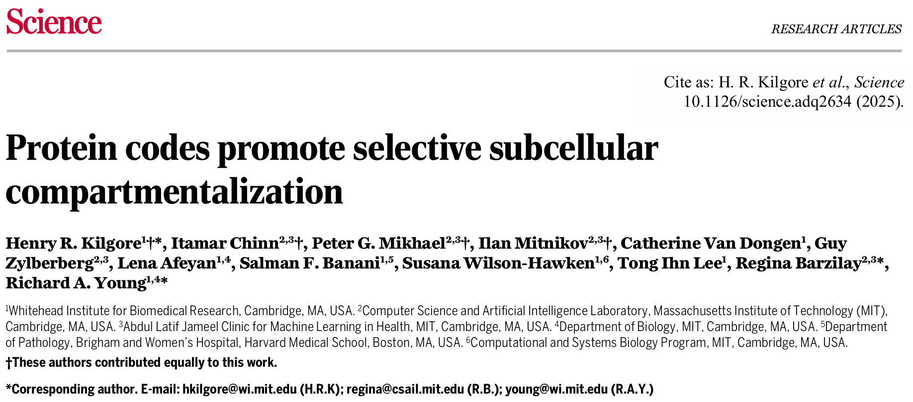

# ProtGPS：蛋白质语言模型预测人类蛋白质的亚细胞定位
| **研究方向**       | **文章类型**       | **研究体系**       | **研究策略**       |
|--------------------|--------------------|--------------------|--------------------|
| 蛋白质语言模型助力人类蛋白质亚细胞定位 | 方法-实验验证 | 细胞内蛋白质 | 人工智能模型预测与实验分析 |  

该文主要探讨蛋白质序列中包含的密码不仅指导其折叠，还控制其在亚细胞区室的选择性分布。作者开发了一个名为ProtGPS的蛋白质语言模型，能够预测蛋白质的区室定位，并通过生成新蛋白质序列和验证致病突变的影响来支持其假设。  

  
## 背景
**区室的重要性：** 细胞功能依赖蛋白质在特定区室（如转录凝聚体、核仁）的组装。传统模型强调特异性相互作用，但弱多价非共价相互作用的作用日益显著（如液-液相分离）。  

**现有局限：** 区室选择性分布的分子机制尚未完全解析，缺乏能够预测全局蛋白质分布的工具。  

**假设：** 蛋白质序列可能包含“分布密码”，类似折叠密码，可通过语言模型捕捉。  
##  ProtGPS模型的开发
文章开发了一个名为ProtGPS的蛋白质语言模型，能够高精度预测人类蛋白质的亚细胞区室定位。该模型基于进化尺度的蛋白质转换器模型（ESM2），并通过神经网络分类器进行训练，能够计算蛋白质在12个不同区室中的独立概率。  

**（1）数据来源：**  
**数据库：** 从UniProt和CD-Code收集5,480个人类蛋白质序列，标注12个区室（图1B）。  
**训练策略：** 将ESM2与神经网络分类器结合，输入全序列，输出各区室的概率（图1C）。  

**（2）模型性能：**  
**AUC-ROC：** 在测试集上，不同区室的AUC-ROC为0.83–0.95（图1D）。  
**特征分析：** 尝试解析模型学习的特征，发现物理化学性质（如pI、疏水性）和氨基酸组成部分相关。  

  

## 生成新蛋白质序列
为了验证ProtGPS是否学会了与区室定位相关的蛋白质密码，文章设计了新的蛋白质序列，这些序列在细胞中表达时能够选择性组装到目标区室。通过马尔可夫链蒙特卡罗（MCMC）算法，生成了10个目标为核仁的蛋白质序列，并在细胞中进行了验证。  

  

## 致病突变对蛋白质分布的影响
突变可能通过改变蛋白质的功能或其亚细胞区室分布来产生致病效应。文章使用ProtGPS预测了ClinVar数据库中的致病突变是否会导致蛋白质分布的改变，并通过实验验证了这些预测。  

  

## 讨论
文章总结指出，蛋白质进化出了至少两种密码，一种用于折叠，另一种用于细胞内区室化。ProtGPS模型不仅能够预测蛋白质的选择性组装，还能指导生成新的蛋白质序列，这些序列的细胞区室化可以通过实验验证。未来的研究将进一步提高区室注释、模型嵌套区室、大规模测试生成的蛋白质，并探索致病突变的影响。  

## 参考文献
Kilgore H R, Chinn I, Mikhael P G, et al. Protein codes promote selective subcellular compartmentalization[J]. Science, 2025: eadq2634.  