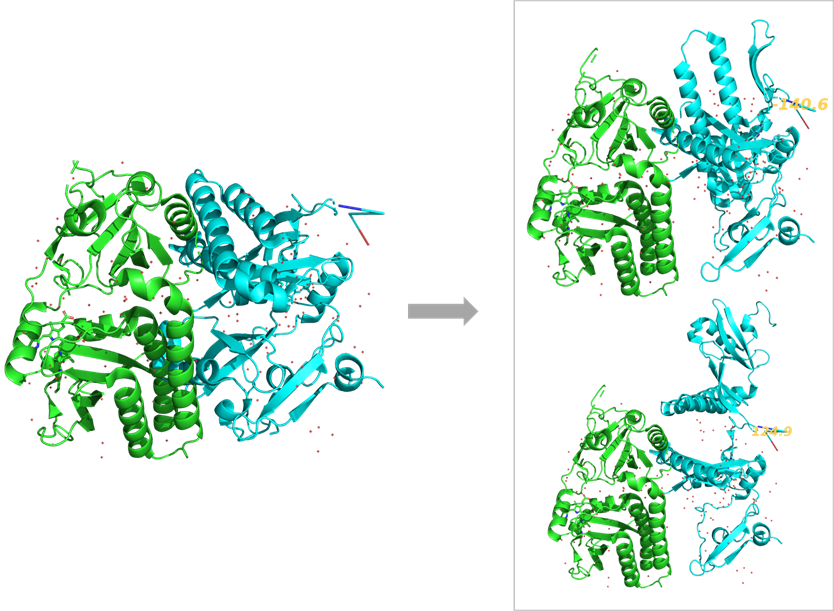

# Pymol界面编辑模式下的多种操作（坐标平移旋转等）
在分子可视化和结构分析中，精准地调整分子的位置和视角对于研究者至关重要，尤其是在准备发表的图片、对接结果的优化展示以及复杂分子体系的对比分析时。PyMOL 作为一款功能强大的分子可视化工具，不仅支持分子建模和图形生成，还提供了丰富的界面编辑功能，使用户可以通过鼠标和键盘的灵活组合实现分子的平移、旋转、缩放等操作。掌握这些编辑模式下的操作技巧，不仅能极大提高工作效率，还能更直观地展现分子结构的关键特征，为科研成果的展示与交流提供强有力的支持。本文将详细讲解 PyMOL 界面编辑模式下的多种操作方法及其实际应用价值，帮助读者充分挖掘这一工具的潜力。   

  
## 写在前面
分子模拟中有时候我们往往需要对分子对象坐标进行平移，旋转，或者单单移动某个原子坐标。这些操作Pymol中都可以实现。如下图所示，Pymol界面鼠标操作分为两种模式，默认是左图中的视图（Viewing）模式，该模式也是默认模式，在该模式下，用户可以使用鼠标对视图中的分子进行旋转平移等，该模式主要用于分子的观察、旋转、缩放、平移等非破坏性的操作，不会直接修改分子的坐标或结构。模式切换只需在 3-Button Viewing 上点击一下即可从视图模式切换到编辑模式。编辑模式用于对分子的具体结构进行修改，包括原子、键、分子的平移与旋转等操作，直接对分子的坐标或键联关系进行调整。  

  

Pymol中视图模式与编辑模式的具体区别如下表所示：  
  
## 编辑模式操作详解及示例说明
**（1）按钮说明**  
如下图，图中的按钮说明。这是当前鼠标的模式设置，表示当前是 “3-按钮编辑模式”，即通过鼠标的 左键 (L)、中键 (M) 和 右键 (R) 的组合，完成各种操作。  

**按钮 (Buttons) 和滚轮 (Wheel)：** L (Left Mouse Button，左键)；M (Middle Mouse Button，中键)；R (Right Mouse Button，右键)；Wheel (滚轮) ，这些是鼠标的基本操作元素。  

**修饰键 (Modifiers)：** & Keys 表示需要结合键盘上的修饰键（Shift、Ctrl 或 Ctrl+Shift）使用鼠标。  

  

**（2）默认操作（无修饰键）**   
**L (Rota)：** 左键用于旋转视图（旋转整个系统的角度），不改变坐标。  
  
 
**M (Move)：** 中键用于平移视图，不改变坐标。  
  

**R (MovZ)：** 右键用于缩放视图（沿 Z 轴移动），不改变坐标。  
  

**Wheel (Slab)：** 滚轮用于移动切片（调整裁剪平面的深度），不改变坐标。  
  

**（3）Shift 键配合鼠标操作**  
**L (RotO)：** 左键旋转对象（以独立对象为中心旋转），不改变视图，旋转左键点中的分子对象的坐标。  
  

**M (MovO)：** 中键移动对象，不改变视图，平移中键点中的分子对象的坐标。  
  

**R (MvOZ)：** 右键缩放对象（沿 Z 轴移动），不改变视图，前后移动右键点中的分子对象的坐标。  
    

**Wheel (MovS)：** 感觉和无修饰键时候的Wheel (Slab)效果一样。移动了切片（调整裁剪平面的深度），没有改变坐标。  

**（4）Ctrl 键配合鼠标操作**  
**L (MovA)：** 左键移动单个原子坐标。  
  

**M (+/-)：** 其实没太搞明白这个操作有什么效果，后面发现了再补充。  

**R (PkTB)：** 将分子对象绕着点中的键对分子对象坐标进行旋转。   
  

**Wheel (MvSZ)：** 感觉和无修饰键时候的R (MovZ)效果一样。用于缩放视图（沿 Z 轴移动），不改变坐标。  

**（5）Ctrl+Shift 键配合鼠标操作**   
**L (MvAZ)：** 左键移动原子坐标（带 Z 轴一起移动）。与Ctrl+左键的效果相似，不过该操作可以带动Z轴坐标一起移动。    

**M (Orig)：** 中键恢复视图到原点。Ctrl+Shift+中键点击分子对象中一个原子，后续左键进行视图旋转时候便会以该原子为对称中心进行旋转。   

**R (Clip)：** 右键滑动调整裁剪面位置。感觉和无修饰时候的Wheel (Slab)效果一样，不改变坐标。   

**Wheel (MovZ)：** 感觉和无修饰键时候的R (MovZ)效果一样。用于缩放视图（沿 Z 轴移动），不改变坐标。   

**（6）单击功能 (SnglClk)**   
**L (PkAt)：** 单击左键拾取原子。还提供了该原子所属分子，残基，链，对象的选择选项。  
   

**M (Cent)：** 中键将视图对焦到单击的原子或分子中心。  

**R (Menu)：** 右键打开菜单。  
  

**（7）双击功能 (DblClk)**  
**L (MovA)：** 双击左键移动原子。感觉和Ctrl+L移动单原子坐标操作类似。  

**M (DrgM)：** 没太搞明白这个操作有什么效果，后面发现了再补充。   

**R (PkTB)：** 双击右键拾取工具栏中的对象。感觉和单击功能 (SnglClk)中的左键单击原子功能类似，不过该点击仅有原子选择选项，没有其他涉及该原子的其他选择选项。  

  
