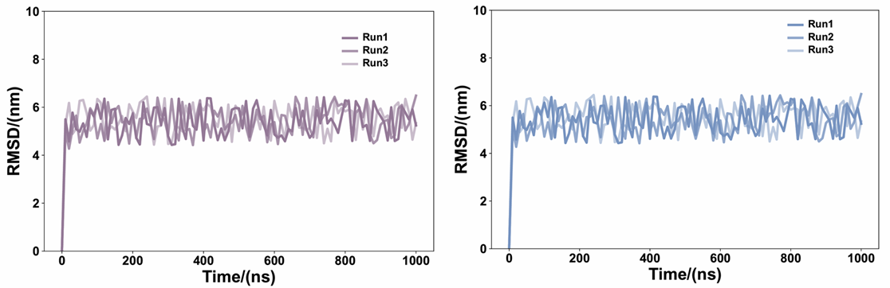
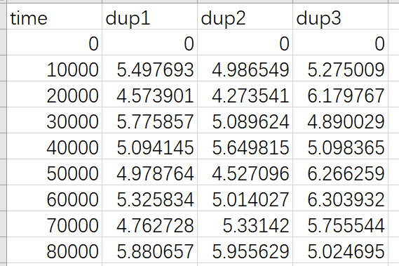

# Python绘图|Python绘制多曲线图（续一）：绘制多组重复的RMSD曲线图
**写在前面：**这篇推文是 [Python绘图|Python绘制多曲线图](https://mp.weixin.qq.com/s/Iooa4ff42_lmsgmHv9bOCw) 的进一步后续完善。一方面修改了曲线的配色，同一组别曲线之间颜色透明度不同，不同组别之间颜色形成红蓝对照。整体更加协调。另一方面修改了坐标以及标签的字体和字号，统一使用Arial字体，并且调整字号使整体更加协调，更加适合放在文章中。**下述仅是产生的随机数字方便用于绘图展示，若要使用需要将数据替换为自己的数据并根据实际情况调整坐标轴和字体大小等。**  

**图片效果：**对两个体系的RMSD曲线绘图。两个体系分别使用红蓝表示。每个体系重复三组，每个体系的三条曲线使用相同颜色不同的透明度进行显示。  
   

## 使用场景
（1）分析动力学模拟轨迹时候绘制RMSD曲线。  
（2）用于两个或者多个体系之间的动力学特征比较。分别使用红蓝绘制两个体系RMSD用于对比体系之间的结构稳定性。（红蓝是一种比较好的搭配方式，自古红蓝出CP，虹猫蓝兔~，哈哈）  
（3）一般动力学模拟需要保证结果的可重复性，所以每个体系使用多个透明度曲线绘制该体系的多组重复结果曲线。  

## 颜色选择
参考了 [Learned magnetic map cues and two mechanisms of magnetoreception in turtles](https://www.nature.com/articles/s41586-024-08554-y) 和 [UM171 glues asymmetric CRL3–HDAC1/2 assembly to degrade CoREST corepressors](https://www.nature.com/articles/s41586-024-08532-4) 中的如下图片中的红蓝配色。一般NCS中的图片配色都是很和谐的，绘图时候可以参考新的NCS文章中配色。后面也会陆续更新一些好用的配色推文作为储备。    
  

## 输入数据准备
对于每个体系，将体系中的多个重复模拟的RMSD曲线值汇总在一个csv文件中，文件格式如下所示：  
  

## 绘图脚本
将下述脚本文件保存为py文件，执行 python py input.csv 即可获得图的pdf文件。针对不同的体系需要更换颜色。  
```python
from matplotlib import pyplot as plt
import pandas as pd

df = pd.read_csv("input.csv")

time = df["time"]/1000

dup_1 = df["dup1"]
dup_2 = df["dup2"]
dup_3 = df["dup3"]

fig = plt.figure(figsize=(12,8))
plt.subplots_adjust(left=0.25, right=0.9, top=0.9, bottom=0.3)
ax = plt.gca()

b1, = plt.plot(time,dup_1,linewidth=3.5, label="Run1",color="#957A98",alpha=1.0)   # 另一个体系将color换为#7794C1即可。
b2, = plt.plot(time,dup_2,linewidth=3.5, label="Run2",color="#957A98",alpha=0.8)
b3, = plt.plot(time,dup_3,linewidth=3.5, label="Run3",color="#957A98",alpha=0.5)

plt.xlabel('Time/(ns)', fontproperties="Arial",fontsize=24,weight="bold")
plt.ylabel('RMSD/(nm)', fontproperties="Arial",fontsize=24,weight="bold")

plt.xticks(font="Arial",rotation=0,size=18,weight="bold")     
plt.yticks(font="Arial",size=18,weight="bold")

plt.ylim(0,10)

plt.legend(handles=[b1,b2,b3,],loc=(0.76,0.75),ncol=1,frameon=False,prop="Arial") 

leg = plt.gca().get_legend()
ltext = leg.get_texts()
plt.setp(ltext, fontsize=15, weight="bold")

plt.show()

fig.savefig('huitu.pdf')
```

## 获得最终图片
    
