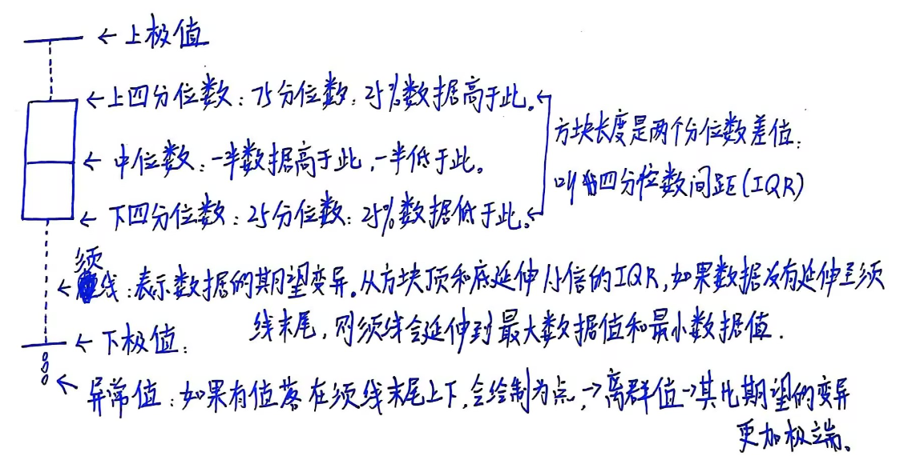
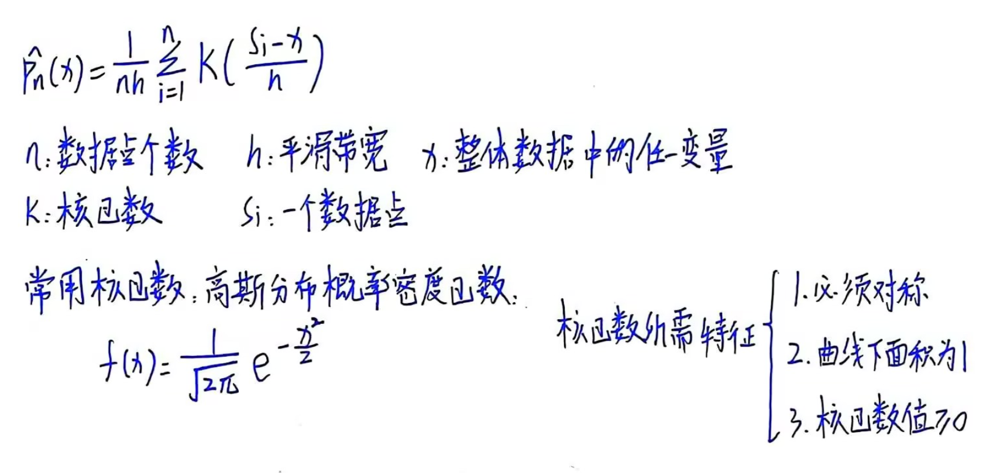
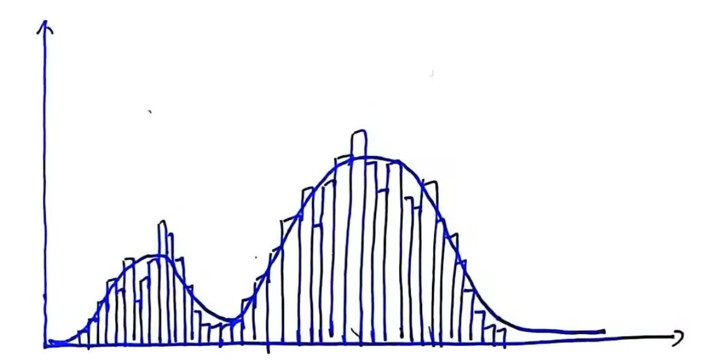
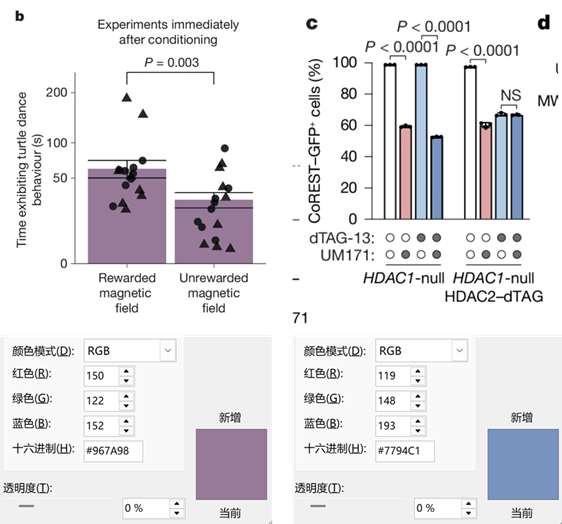
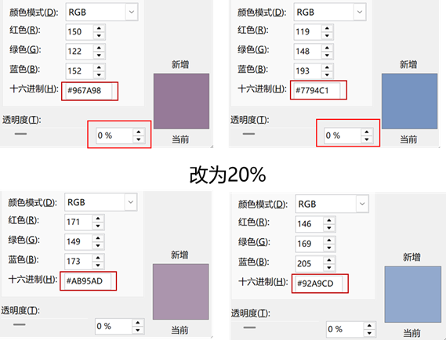
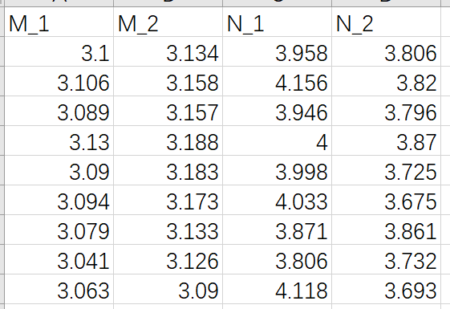

# Python绘图|Python绘制小提琴图：绘制多组分渐变色小提琴图
**写在前面：** 实验结果的数据分析和可视化是项目结果的重要部分。本文旨在使用动力学模拟结果的一些指标数据绘制小提琴图用于多个体系间的相互对比。小提琴图不仅反映了多组分数据的分布情况，还提供了许多其他信息，还很美观，是值得学习使用的一种数据可视化方式。   

**图片效果：** 这篇推文对两个体系进行对照分析，两个体系分别使用红色调和蓝色调。每个体系分别有两组数据，各个体系内使用同一色调的不同透明度进行显示。如下图所示：  
  

## 小提琴图解析
**小提琴图：** 从特征上看小提琴图可用于展示多组数据的分布状态以及概率密度，其同时结合了箱线图和核密度图的特征用来显示数据分布形状。从图形组成上看小提琴图是由核密度图和箱线图两种基本图组合来的。小提琴图的内部是箱线图（展示了分位数的位置），外部是核密度图（展示了任意位置的密度，某区域图形面积越大，某个值附近的分布概率越大）。将小提琴图的轮廓线左右分一半看，左轮廓和右轮廓对称。将左边轮廓线旋转90度查看，可以看到一条在二维坐标中的曲线。这条曲线就是核密度曲线，其反映了数据集中样本点的分布情况。如下图：  
  

**箱线图：**  
**定义：** 箱线图是一种能够通过5个数字对数据分布进行标准描述的方式。5个数字分别是下极值，下四分位数（25%分位数），中位数，上四分位数（75%分位数）和上极值。此外还能明确展示离群点的信息。箱线图可帮助查看数据的中心和散布范围。   
**图示：** 如下图所示箱线图的各个组成部分。  
   

**核密度图：**  
**定义：** 核密度图根据有限的数据样本运用核密度函数对整体数据密度进行估计。即已知有限的数据样本和核函数输出整体数据的概率密度进而使用曲线图形展示。其实质是一种对直方图的抽象表示，是概率密度曲线。公式如下所示：   
  
**用途：** 可以直观展示数据分布的形状，可以帮助识别异常值。相比柱状图，它所展示的数据分布并不受bins的影响。   
**特点：** 核密度图是一条平滑的曲线，描述了数据在特定值附近的密度。具有平滑性（不受特定数据点的影响，可以更好的捕捉数据分布特征），曲线下面积为1，具有峰值和谷值（峰代表数据集中的高密度区域，谷代表稀疏区域）的特点。  
**图示：**
  

**箱线图与核密度图的相辅相成：** 箱线图可以帮助查看偏态，可用于更好的识别25%和75%百分位数。核密度图则能够更好的查看数据的总体形状。  

## 使用场景
（1）分析多个体系的分子动力学模拟轨迹中关键残基间距离用于对比分析。  
（2）一张图中绘制多个小提琴图，每个小提琴图都是一条轨迹的数据分析。  
（3）分别使用红蓝颜色绘制两个体系的指标用于对比体系之间的关键残基间距离。  
（4）为保证数据的可重复性，每个体系使用多个透明度颜色绘制同一体系的多组重复结果曲线。  

## 颜色选择
参考了 [Learned magnetic map cues and two mechanisms of magnetoreception in turtles](https://www.nature.com/articles/s41586-024-08554-y) 和 [UM171 glues asymmetric CRL3–HDAC1/2 assembly to degrade CoREST corepressors](https://www.nature.com/articles/s41586-024-08532-4) 中的如下图片中的红蓝配色。一般NCS中的图片配色都是很和谐的，绘图时候可以参考新的NCS文章中配色。后面也会陆续更新一些好用的配色推文作为储备。    
  

上述两种颜色是选定的两种主色调。为了对同一体系使用不同透明度的颜色，可以在PPT中设置颜色以及透明度确定不同透明度下的十六进制颜色。如下图：  
  

## 输入数据准备
对于每个体系，将体系中的多个重复模拟的距离值汇总在一个csv文件中，文件格式如下所示：   
  

## 绘图脚本
将下述脚本文件保存为py文件，执行 python py input.csv 即可获得图的pdf文件。针对不同的体系需要更换颜色。   
```python
import sys
import pandas as pd
import seaborn as sns
import matplotlib.pyplot as plt

def plot_violin(infile):

    X = []
    Y =[]

    df = pd.read_csv(infile)
    
    sa_1 = df["M_1"]
    for i in range(len(sa_1)):
        X.append("M_1")
        Y.append(sa_1[i])

    sa_2 = df["M_2"]
    for i in range(len(sa_2)):
        X.append("M_2")
        Y.append(sa_2[i])

    sb_1 = df["N_1"]
    for i in range(len(sb_1)):
        X.append("N_1")
        Y.append(sb_1[i])

    sb_2 = df["N_2"]
    for i in range(len(sb_2)):
        X.append("N_2")
        Y.append(sb_2[i])

    my_pal = {"M_1": "#957A98", "M_2": "#AA95AD", "N_1": "#7794C1", "N_2": "#92A9CD",}

    fig = plt.figure(figsize=(12,8))
    plt.rcParams['xtick.direction']='in'
    plt.rcParams['ytick.direction']='in'
    plt.subplots_adjust(left=0.1, right=0.9, top=0.9, bottom=0.2)
    ax = plt.gca()

    sns.violinplot(x=X, y=Y, palette=my_pal)

    plt.ylabel('Y label', fontproperties="Arial",fontsize=28,weight="bold")

    plt.xticks(font="Arial",rotation=0,size=25,weight="bold")      # size must be after the font.
    plt.yticks(font="Arial",size=28,weight="bold")

    plt.show()
    fig.savefig('huitu.pdf')

def main():

    plot_violin(sys.argv[1])

if __name__=="__main__":
    main() 
```

## 获得最终图片
    