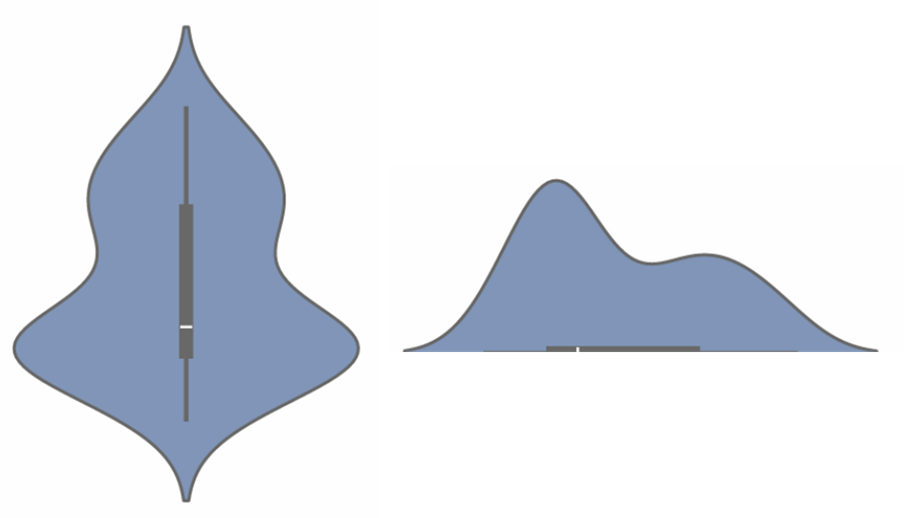

# Python绘图|Python绘制小提琴图：绘制多组分渐变色小提琴图
**写在前面：** 实验结果的数据分析和可视化是项目结果的重要部分。本文旨在使用动力学模拟结果的一些指标数据绘制小提琴图用于多个体系间的相互对比。小提琴图不仅反映了多组分数据的分布情况，还提供了许多其他信息，还很美观，是值得学习使用的一种数据可视化方式。   

**图片效果：** 这篇推文对两个体系进行对照分析，两个体系分别使用红色调和蓝色调。每个体系分别有两组数据，各个体系内使用同一色调的不同透明度进行显示。如下图所示：  
  

## 小提琴图解析
**小提琴图：** 从特征上看小提琴图可用于展示多组数据的分布状态以及概率密度，其同时结合了箱线图和核密度图的特征用来显示数据分布形状。从图形组成上看小提琴图是由核密度图和箱线图两种基本图组合来的。小提琴图的内部是箱线图（展示了分位数的位置），外部是核密度图（展示了任意位置的密度，某区域图形面积越大，某个值附近的分布概率越大）。将小提琴图的轮廓线左右分一半看，左轮廓和右轮廓对称。将左边轮廓线旋转90度查看，可以看到一条在二维坐标中的曲线。这条曲线就是核密度曲线，其反映了数据集中样本点的分布情况。如下图：  
  

**箱线图：**  

**核密度图：**  

## 使用场景

## 颜色选择

## 输入数据准备

## 绘图脚本

## 获得最终图片
