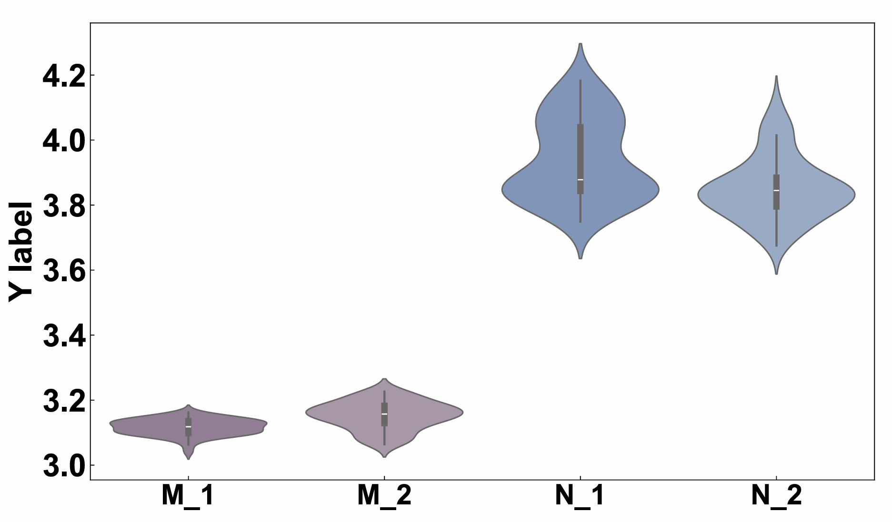

# Python绘图|Python绘制小提琴图：绘制多组分渐变色小提琴图
**写在前面：** 实验结果的数据分析和可视化是项目结果的重要部分。本文旨在使用动力学模拟结果的一些指标数据绘制小提琴图用于多个体系间的相互对比。小提琴图不仅反映了多组分数据的分布情况，还提供了许多其他信息，还很美观，是值得学习使用的一种数据可视化方式。   

**图片效果：** 这篇推文对两个体系进行对照分析，两个体系分别使用红色调和蓝色调。每个体系分别有两组数据，各个体系内使用同一色调的不同透明度进行显示。如下图所示：  
  

## 小提琴图解析

## 使用场景

## 颜色选择

## 输入数据准备

## 绘图脚本

## 获得最终图片
