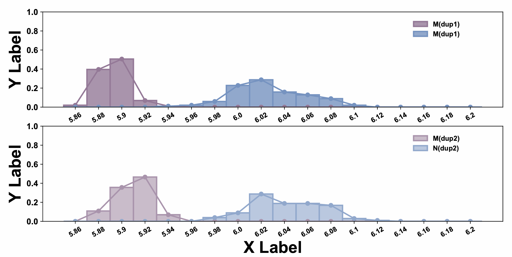
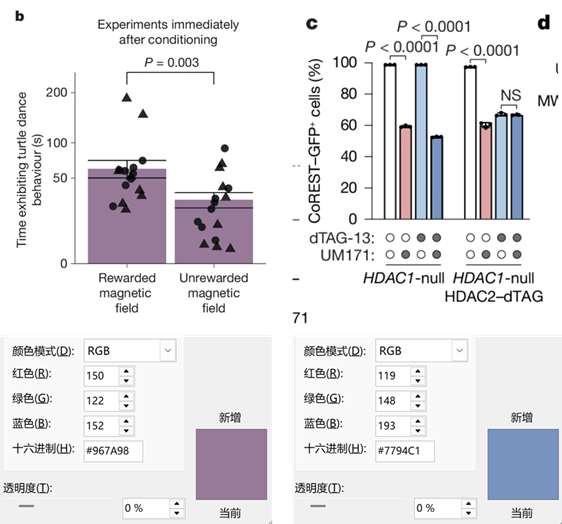
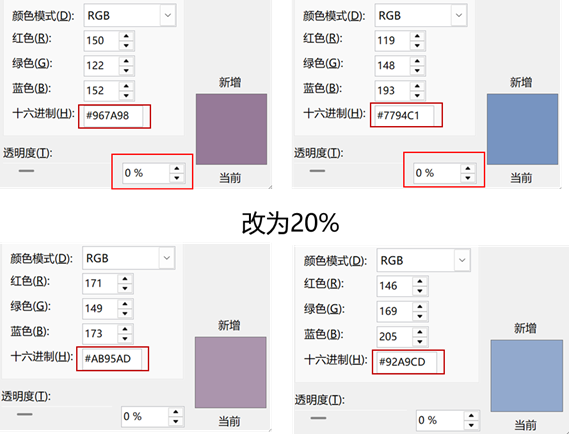
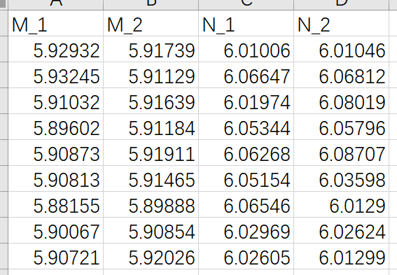

# Python绘图|Python绘制组合图（双组分柱状分布图+双组分折线图+2个子图）
**写在前面：** 两个体系分子动力学模拟数据的对比分析在机制解析中很重要。在科研工作中往往湿实验中会发现一个体系表现好，另一个体系表现差。对于这样两个体系的一些指标对比分析并且展示他们之间的数据差异很关键。本文为此类数据处理情况提供了一种双组分柱状分布图和双组分折线图绘制方法，用于对比两个体系的微观指标差异进而机制分析。柱状分布图和折线分布图结合反映了两个组分数据各自的分布及他们之间的分布差异，很实用美观，值得学习。    

**图片效果：** 这篇推文是对两个体系两组重复模拟间的对照分析。两个体系分别使用红色调和蓝色调。每个体系分别有两组数据，各个体系内使用同一色调的不同透明度进行显示。如下图所示：   
  

## 使用场景
（1）处理两个体系的分子动力学模拟轨迹中关键残基间距离用于对比分析。  
（2）一张子图中使用不同颜色绘制两个柱状分布图和折线图用于对照。  
（3）分别使用红蓝颜色绘制两个体系的指标用于对比体系之间的关键残基间距离。  
（4）为保证数据的可重复性，使用多个透明度颜色以及多张子图绘制同一体系的多组重复结果曲线。  

## 颜色选择
参考了 [Learned magnetic map cues and two mechanisms of magnetoreception in turtles](https://www.nature.com/articles/s41586-024-08554-y) 和 [UM171 glues asymmetric CRL3–HDAC1/2 assembly to degrade CoREST corepressors](https://www.nature.com/articles/s41586-024-08532-4) 中的如下图片中的红蓝配色。一般NCS中的图片配色都是很和谐的，绘图时候可以参考新的NCS文章中配色。后面也会陆续更新一些好用的配色推文作为储备。    
  

上述两种颜色是选定的两种主色调。为了对同一体系使用不同透明度的颜色，可以在PPT中设置颜色以及透明度确定不同透明度下的十六进制颜色。如下图：  
  

## 输入数据准备
柱状分布图和折线图的绘制需要对原始数据加以处理。原始数据是距离这个连续变量的多个数据点集合。为了绘制柱状分布图和折线图。首先需要根据原始数据进行分布区间划分，然后统计每个区间的数据点分布频率，最后以区间中点为横坐标，分布频率为纵坐标进行绘制。这些处理在后续脚本中实现。**不过用户在使用时需要根据自己的数据情况进行脚本中的参数修改。**   

对于每个体系，将体系中的多个重复模拟的距离值汇总在一个csv文件中，文件格式如下所示：  
  

## 绘图脚本
将下述脚本文件保存为py文件，执行 python py input.csv 即可获得图的pdf文件。针对不同的体系需要更换颜色。   
```python
import sys
from matplotlib import pyplot as plt
import numpy as np
import pandas as pd

#%matplotlib inline                   
plt.rcParams["font.sans-serif"]='SimHei'   #解决中文乱码问题
plt.rcParams['axes.unicode_minus']=False   #解决负号无法显示的问题
plt.rc('axes',axisbelow=True)  

def multibar_plot(file):
    
    df=pd.read_csv(file)

    sa_1 = df["M_1"]
    sa_2 = df["M_2"]
    sb_1 = df["N_1"]
    sb_2 = df["N_2"]

    X_label = [5.86, 5.88, 5.90, 5.92, 5.94, 5.96, 5.98, 6.00, 6.02, 6.04, 6.06, 6.08, 6.10, 6.12, 6.14, 6.16, 6.18, 6.20]   # 根据自己的数据需要划分区间
    X = np.arange(len(X_label))

    fig=plt.figure(figsize=(12,8))     # 创建子图时只需要创建一张画布即可。

    plt.subplot(2,1,1)     # 代表第二行第二列第一个图

    sa_1_Y = [0]*len(X)
    for i in sa_1:
        idx = int((i-5.85)//0.02)   # 需要改成最小值
        sa_1_Y[idx] += 1

    for i in range(len(sa_1_Y)):
        sa_1_Y[i] = sa_1_Y[i]/len(sa_1)

    sb_1_Y = [0]*len(X)
    for i in sb_1:
        idx = int((i-5.85)//0.02)    # 需要改成最小值
        sb_1_Y[idx] += 1

    for i in range(len(sb_1_Y)):
        sb_1_Y[i] = sb_1_Y[i]/len(sb_1)
    
    b1 = plt.bar(X,sa_1_Y,width=1,label='M(dup1)',edgecolor='#957A98',linewidth=2,color="#AA95AD")
    b2, = plt.plot(X,sa_1_Y,linewidth=2, label="M(dup1)",color="#957A98", marker='o')

    b3 = plt.bar(X,sb_1_Y,width=1,label='M(dup1)',edgecolor='#7794C1',linewidth=2,color="#92A9CD")
    b4, = plt.plot(X,sb_1_Y,linewidth=2, label="M(dup1)",color="#7794C1", marker='o')

    plt.xticks(X,X_label,font="Arial",size=12,weight="bold",rotation=0)

    plt.legend(handles=[b1,b3],loc=(0.80,0.70),ncol=1,frameon=False,prop="Arial")    #显示图例，loc图例显示位置(可以用坐标方法显示），ncol图例显示几列，默认为1列,frameon设置图形边框
    leg = plt.gca().get_legend()
    ltext = leg.get_texts()
    plt.setp(ltext, fontsize=10, weight="bold")

    plt.yticks(font="Arial",weight="bold",size=12) 
    plt.xticks(font="Arial",weight="bold",size=10,rotation=30)                                          #设置y轴刻度，位置,大小
    plt.ylabel('Y Label',fontproperties="Arial",fontsize=24,weight="bold")

    plt.ylim(0,1)                  
    
    
    
    plt.subplot(2,1,2)

    sa_2_Y = [0]*len(X)
    for i in sa_2:
        idx = int((i-5.85)//0.02)    # 需要改成最小值
        sa_2_Y[idx] += 1

    for i in range(len(sa_2_Y)):
        sa_2_Y[i] = sa_2_Y[i]/len(sa_2)

    sb_2_Y = [0]*len(X)
    for i in sb_2:
        idx = int((i-5.85)//0.02)     # 需要改成最小值
        sb_2_Y[idx] += 1

    for i in range(len(sb_2_Y)):
        sb_2_Y[i] = sb_2_Y[i]/len(sb_2)
    
    b1 = plt.bar(X,sa_2_Y,width=1,label='M(dup2)',edgecolor='#AA95AD',linewidth=2,color="#CABCCB")
    b2, = plt.plot(X,sa_2_Y,linewidth=2, label="M(dup2)",color="#AA95AD", marker='o')

    b3 = plt.bar(X,sb_2_Y,width=1,label='N(dup2)',edgecolor='#92A9CD',linewidth=2,color="#BBC9E0")
    b4, = plt.plot(X,sb_2_Y,linewidth=2, label="N(dup2)",color="#92A9CD", marker='o')

    plt.xticks(X,X_label,font="Arial",size=12,weight="bold",rotation=0)

    plt.legend(handles=[b1,b3,],loc=(0.80,0.70),ncol=1,frameon=False,prop="Arial")    #显示图例，loc图例显示位置(可以用坐标方法显示），ncol图例显示几列，默认为1列,frameon设置图形边框
    leg = plt.gca().get_legend()
    ltext = leg.get_texts()
    plt.setp(ltext, fontsize=10, weight="bold")

    plt.ylim(0,1)
    
    plt.yticks(font="Arial",weight="bold",size=12)                                          #设置y轴刻度，位置,大小
    plt.xticks(font="Arial",weight="bold",size=10,rotation=30) 
    plt.xlabel('X Label', fontproperties="Arial",fontsize=24,weight="bold")
    plt.ylabel('Y Label',fontproperties="Arial",fontsize=24,weight="bold")

    plt.show()
    fig.savefig('huitu.pdf')

def main():
    file = str(sys.argv[1])
    multibar_plot(file)
    
if __name__=="__main__":
    main()
```

## 获得最终图片
    