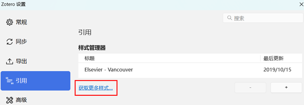

# Zotero文献管理|CSL样式规范
## Temp
找参考文献格式时候没有完全匹配的格式。可以在如下界面先寻找添加一个与目标参考文献格式最近的参考文献格式。  
  
然后在文献库的styles文件夹中对添加文献格式的.csl文件进行修改即可。  
比如，现在需要Science Bulletin的参考文献格式（如下），但是文献库里面没有完全符合要求的.csl文件。就在Elsevier-Vancouver的基础上进行修改。   
```text
[1] Van der Geer J, Hanraads JAJ, Lupton RA. The art of writing a scientific article. J Sci Commun 2000;163:51-9.

[2] Lei Y, Liu Y, Song H, et al. A wetness index derived from tree-rings in the Mt. Yishan area of China since 1755 AD and its agricultural implications. Sci Bull 2014;59:3449-56.
```
Elsevier-Vancouver的原始参考文献格式如下：
```text
Hawking S. Properties of expanding universes. Doctoral thesis. University of Cambridge, 1966. https://doi.org/10.17863/CAM.11283.
```
将其与Science Bulletin比较有以下几点格式需要修改：（1）需要将最后的doi信息去掉。（2）显示作者的数目，作者数目超过3个，就是前3个作者加et al.进行表示。所以进行如下修改。   
```xml
<?xml version="1.0" encoding="utf-8"?>
<style xmlns="http://purl.org/net/xbiblio/csl" page-range-format="minimal" class="in-text" version="1.0" demote-non-dropping-particle="sort-only" default-locale="en-US">
  <info>
    <title>Elsevier - Vancouver</title>
    <id>http://www.zotero.org/styles/elsevier-vancouver</id>
    <link href="http://www.zotero.org/styles/elsevier-vancouver" rel="self"/>
    <link href="http://www.elsevier.com/journals/energy/0360-5442/guide-for-authors#68000" rel="documentation"/>
    <author>
      <name>Richard Karnesky</name>
      <email>karnesky+zotero@gmail.com</email>
      <uri>http://arc.nucapt.northwestern.edu/Richard_Karnesky</uri>
    </author>
    <category citation-format="numeric"/>
    <category field="generic-base"/>
    <summary>A style for some Elsevier journals, resembles Vancouver style</summary>
    <updated>2019-10-15T15:13:52+00:00</updated>
    <rights license="http://creativecommons.org/licenses/by-sa/3.0/">This work is licensed under a Creative Commons Attribution-ShareAlike 3.0 License</rights>
  </info>
  <macro name="author">
    <names variable="author">
      <name initialize-with="" delimiter=", " delimiter-precedes-last="always" name-as-sort-order="all" sort-separator=" "/>
      <label form="long" prefix=", "/>
      <substitute>
        <names variable="editor"/>
        <names variable="translator"/>
      </substitute>
    </names>
  </macro>
  <macro name="editor">
    <names variable="editor">
      <name initialize-with="" delimiter=", " delimiter-precedes-last="always" name-as-sort-order="all" sort-separator=" "/>
      <label form="long" prefix=", " suffix="."/>
    </names>
  </macro>
  <macro name="year-date">
    <choose>
      <if variable="issued">
        <date variable="issued">
          <date-part name="year"/>
        </date>
      </if>
      <else>
        <text term="no date" form="short"/>
      </else>
    </choose>
  </macro>
  <macro name="publisher">
    <text variable="publisher-place" suffix=": " text-case="title"/>
    <text variable="publisher" suffix="; "/>
    <text macro="year-date"/>
  </macro>
  <macro name="edition">
    <choose>
      <if is-numeric="edition">
        <group delimiter=" ">
          <number variable="edition" form="ordinal"/>
          <text term="edition" form="short"/>
        </group>
      </if>
      <else>
        <text variable="edition"/>
      </else>
    </choose>
  </macro>
  <macro name="access">
    <choose>
      <if variable="DOI">
        <text variable="DOI" prefix="https://doi.org/"/>
      </if>
      <else-if type="webpage post-weblog" match="any">
        <choose>
          <if variable="URL">
            <text variable="URL"/>
            <group prefix=" (" suffix=")" delimiter=" ">
              <text term="accessed"/>
              <date variable="accessed" form="text"/>
            </group>
          </if>
        </choose>
      </else-if>
    </choose>
  </macro>
  <citation collapse="citation-number">
    <sort>
      <key variable="citation-number"/>
    </sort>
    <layout prefix="[" suffix="]" delimiter=",">
      <text variable="citation-number"/>
    </layout>
  </citation>
  <bibliography entry-spacing="0" second-field-align="flush" et-al-min="3" et-al-use-first="3">   <!--这里可以对显示作者的数目进行修改-->
    <layout suffix=".">
      <text variable="citation-number" prefix="[" suffix="]"/>
      <text macro="author" suffix=". "/>
      <choose>
        <if type="bill book graphic legal_case legislation motion_picture report song" match="any">   <!--这里使用if elif else语句对引用的类型进行分类，书籍，期刊以及其他不同类型有不同的引用格式-->
          <group delimiter=". ">
            <text variable="title"/>
            <text variable="volume" prefix="vol. "/>
            <text macro="edition"/>
            <text macro="publisher"/>
          </group>
        </if>
        <else-if type="chapter paper-conference" match="any">
          <group delimiter=", ">
            <group delimiter=". ">
              <text variable="title"/>
              <group>
                <text term="in" text-case="sentence" suffix=": "/>
                <text macro="editor"/>
              </group>
              <group delimiter=", ">
                <text variable="container-title" form="short"/>
                <text variable="volume" prefix="vol. "/>
              </group>
              <text macro="edition"/>
            </group>
            <text macro="publisher"/>
            <group delimiter=" ">
              <label variable="page" form="short" plural="never"/>
              <text variable="page"/>
            </group>
          </group>
        </else-if>
        <else-if type="patent">
          <group delimiter=", ">
            <group delimiter=". ">
              <text variable="title"/>
              <text variable="number"/>
            </group>
            <text macro="year-date"/>
          </group>
        </else-if>
        <else-if type="thesis">
          <group delimiter=". ">
            <text variable="title"/>
            <text variable="genre"/>
            <group delimiter=", ">
              <text variable="publisher"/>
              <text macro="year-date"/>
            </group>
          </group>
        </else-if>
        <else>   <!--这里开始便是对期刊引用的格式设置-->
          <group delimiter=":">
            <group delimiter=" ">
              <group delimiter=". ">
                <text variable="title"/>
                <text variable="container-title" form="short" text-case="title" strip-periods="true"/>
              </group>
              <group delimiter=";">
                <text macro="year-date"/>
                <text variable="volume"/>
              </group>
            </group>
            <text variable="page" form="short"/>
          </group>
        </else>
      </choose>
      <!-- <text macro="access" prefix=". "/> --> <!--这里对应的是doi号码的显示，不需显示所以将其注释掉-->
    </layout>
  </bibliography>
</style>

```