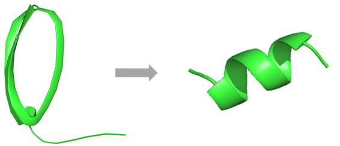
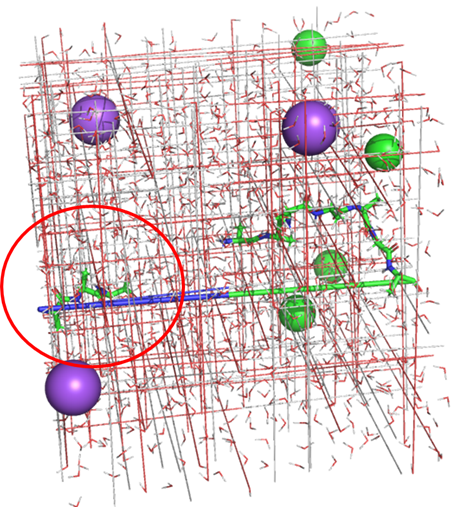
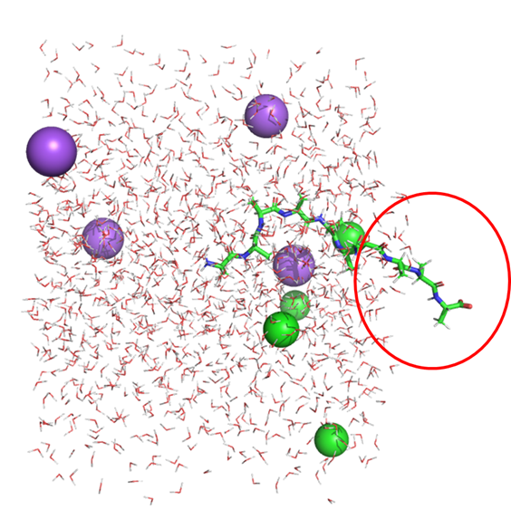
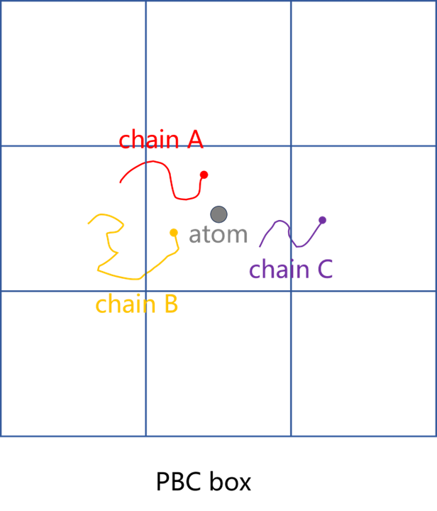
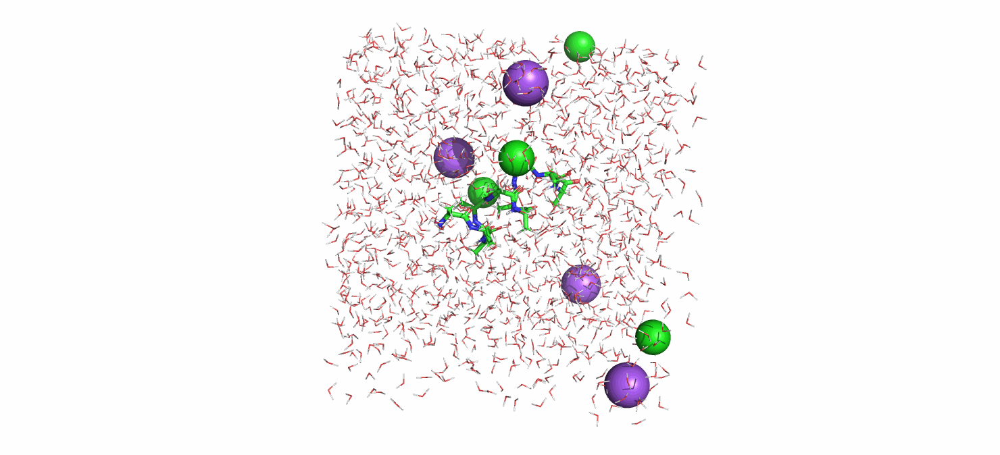
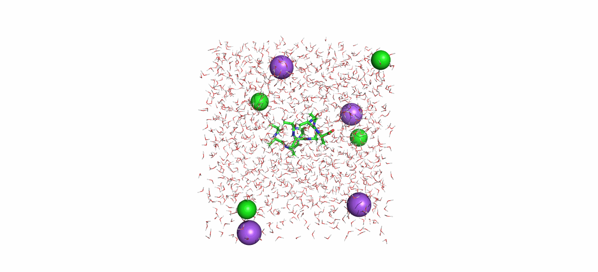

# gmx后处理|单链体系周期性边界条件处理生成平滑轨迹
写在前面，在gmx跑轨迹时候个人觉得比较麻烦一步就是原生轨迹的PBC处理了。由于模拟时候的PBC条件设置，所以原生轨迹往往会出现周期跳跃的情况，原生轨迹断断续续，跳来跳去，非常不利于观察。特别是涉及多链情况时候周期性处理不当就会得到破碎的轨迹。所以这里根据之前做过的一些项目为各种情况下的PBC处理尽量找一些通用的流程并剖析处理过程。本文仅介绍单链的PBC处理，后续也会更新介绍其他多种情况下的PBC处理流程。  

在分子动力学模拟中，周期性边界条件（PBC）是用来模拟无限大系统的常用技术，它通过在模拟盒中不断复制粒子，从而避免了边界效应对系统行为的干扰。然而，在处理单链体系时，尤其是链状分子（如蛋白质、RNA、聚合物等）时，周期性边界往往会导致链末端的接续问题，进而影响轨迹的平滑性和后续分析的准确性。尤其是当链条在模拟过程中穿越了边界，产生了不连续的轨迹数据，这些“断裂”会影响进一步的分析，比如计算二级结构、构象变化或相互作用等。  

本文将重点介绍如何在GROMACS中处理单链体系的周期性边界条件，并通过后处理方法生成平滑的轨迹。这一过程不仅能够消除由周期性边界引起的伪影，还能有效改善轨迹的连续性，从而提高分析结果的可靠性。掌握这种后处理技巧，对于分子动力学模拟中的链状分子体系研究具有重要价值，能够确保研究人员获得更加真实和精确的模拟数据，进而为分子设计和药物研发等领域提供有力支持。  

  
## PBC后处理的必要性
原生轨迹如下所示：  
    

PBC处理之后生成平滑轨迹效果如下：  
    
## gmx trjconv 一些PBC相关参数说明
gmx trjconv 是 GROMACS 中用于处理和转换轨迹文件的一个重要工具。它可以对模拟过程中的轨迹数据进行各种操作，如中心化、平滑、去除周期性边界效应、提取子集等。下述是该命令中一些与PBC处理相关的参数解析。    

**-pbc** 参数支持多种处理选项，用于修复和调整由于周期性边界条件导致的轨迹问题。-pbc 选项包括以下几种模式：（1）**mol** 将分子的质心放入盒子中，适用于大多数分子。这通常用于保持分子不被分开或穿越周期性边界。例如，当一个分子穿越边界时，它会被放回到盒子中，以保持其完整性。（2）**res** 将残基的质心放入盒子中。如果需要保证残基之间的相对位置连续性，使用此选项。（3）**atom** 将所有原子都放入盒子中。这个选项假设分子中所有的原子在周期性边界条件下都是独立移动的，因此原子被逐个移动以确保它们都在盒子内。这种处理方法可能会改变分子的结构，但有时可能需要使用该方法来修复异常的原子跳跃。（4）**nojump** 检查并修复原子穿越边界的问题，通常用于恢复整个分子。此选项会将分子从起始位置到终止位置的所有帧重新连接在一起，从而确保它们在周期性边界条件下的连贯性。请注意，这会使分子在箱子内重新定位，但可能会导致分子扩散出箱子。（5）**cluster** 根据选定的索引，将原子簇聚集到最近的质心位置，适用于存在簇结构的情况。如果分子被分开并且需要重新聚集到一起，可以使用此选项。注意，如果分子已经断裂，则该方法将不起作用。（6）**whole** 确保打破的分子重新组合为一个完整的分子。这对于那些在周期性边界条件下分裂的分子非常有用。这几个选项中atom和whole我会经常用，知道它们的作用，其余尚未用到，后续用到了解了其效果再更新。通俗说，如下图所示，atom选项会将定位于该周期中的链的所有原子都放在这个周期的盒子中，超出盒子边界的部分显示在另一侧中。  
  
又如下图所示，whole的作用就是将上述移到另一侧的原子还原回去，让其显示成一整个完整的分子。  
  

**-center** 选择一个group，将选择的原子组置于坐标轴的中心。  

**-fit rot+trans** 选择一个原子组对齐轨迹。将每一帧的分子结构与参考结构进行拟合，首先旋转分子，使其与参考结构的形状对齐；然后平移分子，使其中心与参考结构的中心重合。    

**-ur compact** 将轨迹输出为紧凑格式，这种格式会减少文件大小。  
## 单链体系PBC处理通用流程
### 处理思路
（1）首先需要明晰如下图所示的PBC盒子定位规则。体系中有多条链的时候，PBC处理时候判定每条链处于哪个周期里面是由其最开头原子定位的（如有不正确后续再更改）。如下图所示，假设以原子atom为参考进行体系center，即将atom置于盒子中心从而摆放整个体系。位置确定之后，chain A和chain B的头部原子位于同一个周期中，chain C的头部原子位于另一个周期中，从而后续的PBC处理操作就会将chain A和chain B放在同一个周期中，chain C将会与A和B错一个周期。所以在处理多条链时候比较麻烦，需要找一个原子参考，将每一帧的所有链的头部原子都放在同一个周期中才行。单链则比较简单，直接将头部原子放在盒子中心就好了。  
  

（2）明确周期盒子定位规则后，则选1号头部原子居中于盒子中心放置整个体系。并使用-pbc atom将体系中所有原子都置于同一个周期盒子里。  

（3）如前述-pbc atom和-pbc whole的解释。使用-pbc whole使整个分子完整显示。  

（4）使用-fit rot+trans将轨迹所有结构都叠合到第一帧，形成平滑的结构动画。  
### PBC处理命令集
```shell
mkdir analysis
cd analysis
mkdir pbc
cd pbc

cp ../../npt/npt.gro ../../prod/npt.gro
cp ../../index.ndx .

echo "[ atom ]" >> index.ndx
echo "1" >> index.ndx   # 这里选择1号原子，在PBC处理时候以该原子为参考，将其置于盒子中心。  

gmx trjconv -f ../../prod/npt.gro -s ../../prod/prod.tpr -o new.pdb -n index.ndx   # 选择需要输出的group，拿npt.gro生成的pdb文件作为参考结构便于可视化轨迹。这里输出的组别需要和后面要观察的轨迹输出组别一致，否则可视化时候原子数目不匹配。     
gmx trjconv -f ../../prod/prod.xtc -s ../../prod/prod.tpr -o md_pbcmol_new.xtc -pbc atom -ur compact -center -n index.ndx   # 首先选择group atom将1号原子放在盒子中心。然后选择输出整个system。
gmx trjconv -f md_pbcmol_new.xtc -s ../../prod/prod.tpr -o md_pbcwhole_new.xtc -pbc whole -n index.ndx   # 选择输出整个system。  
gmx trjconv -f md_pbcwhole_new.xtc -s ../../prod/prod.tpr -o md_pbcfit_all_new.xtc -fit rot+trans -n index.ndx   # 首先选择蛋白进行对齐。然后选择蛋白进行输出（这个最后输出部分可自定义，我一般输出蛋白，因为这里只用观察蛋白结构。如果需要观察水分子，离子或者体系中其他组别，可将其输出）。  
rm md_pbcmol_new.xtc md_pbcwhole_new.xtc
```
### 逐步分析效果
使用下述命令执行-center和-pbc atom之后。如下图所示：  
```shell
gmx trjconv -f ../../prod/prod.xtc -s ../../prod/prod.tpr -o md_pbcmol_new.xtc -pbc atom -ur compact -center -n index.ndx   # 首先选择group atom将1号原子放在盒子中心。然后选择输出整个system。
```
   

使用下述命令执行-pbc whole之后。如下图所示：  
```shell
gmx trjconv -f md_pbcmol_new.xtc -s ../../prod/prod.tpr -o md_pbcwhole_new.xtc -pbc whole -n index.ndx   # 选择输出整个system。  
```
    

使用下述命令执行-fit rot+trans之后。可得最终效果如下图所示：  
```shell
gmx trjconv -f md_pbcwhole_new.xtc -s ../../prod/prod.tpr -o md_pbcfit_all_new.xtc -fit rot+trans -n index.ndx   # 首先选择蛋白进行对齐。然后选择蛋白进行输出（这个最后输出部分可自定义，我一般输出蛋白，因为这里只用观察蛋白结构。如果需要观察水分子，离子或者体系中其他组别，可将其输出）。  
```
    