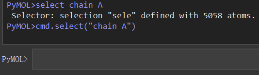

# pymol选择器语法
在分子可视化和分析中，PyMOL 是一个广泛使用的工具，它不仅能展示分子的三维结构，还能帮助我们深入分析分子的各种性质。PyMOL 选择器语法是其核心功能之一，它允许用户精确地选择分子中的特定原子、残基或区域，进行各种操作，如颜色设置、距离测量、计算分子间相互作用等。通过灵活运用选择器语法，我们能够高效地从复杂的分子结构中提取出感兴趣的部分，进行定制化的分析与可视化。无论是在药物设计、分子对接研究，还是在结构生物学领域，PyMOL 选择器语法都为研究人员提供了强有力的工具，提升了工作效率，简化了数据分析过程。  
  
## pymol选择器简介及语法
PyMOL的选择语言允许根据标识符和属性选择object中的特定原子。这种方式可以灵活选择和操作目标分子或原子，精确控制可视化和分析过程。许多命令（如 color、show 等）接受原子选择参数，仅对场景中的部分原子操作（改变显示类型，透明度，颜色等），非常方便。此外还可以通过逻辑运算符（如 and、or 和 not）将选择条件变得更精确或更具包容性，and表示选择同时具备所有指定属性的项目。or表示选择具备任意指定属性的项目。  

PyMol中可以使用两种方式执行选择器命令。方式一：如下在图形界面中使用select命令或者cmd.select()命令进行选择。

```python
select chain A
cmd.select("chain A")
```
方式二：可以在脚本中导入cmd，然后使用cmd.select()进行选择。
```python
from pymol import cmd

cmd.select("chain A")
```
## 选择操作符及示例
### 通用选择（Generic）
|运算符|别名|相关描述|
|:----|:----|:----|
|all|*|选择当前加载到 PyMOL 中的所有原子（无论多少个object，所有全被选中）|
|none||返回一个空选择，即不选择任何原子|
|enabled||选择所有启用（处于活动状态）的对象中的原子（只选中活动状态下即show在pymol界面中object的所有原子）|
```python
select all
select none
select enabled
```
### 命名的选择操作（Named selections）
|运算符|别名|相关描述|
|:----|:----|:----|
|sele||代表一个名为 "sele" 的选择或对象。但需要注意的是，如果 "sele" 名字与其他操作符冲突，它可能会引发歧义。|
|%sele||推荐的写法，明确地指定选择或对象为 "sele"。使用 % 可以避免歧义，确保选择的是用户自定义的 "sele" 对象，而不是其他可能冲突的操作符。|
|?sele||用于检查是否存在名为 "sele" 的选择或对象：如果存在，则返回对应的选择。如果不存在，则返回一个空的选择（不报错）|
```python
select sele
select %sele
select ?sele
```
### 逻辑选择运算符（Logical）
|运算符|别名|相关描述|
|:----|:----|:----|
|not S1|!|取反，选择不属于 S1 的所有原子|
|S1 and S2|&|交集，选择同时满足条件 S1 和 S2 的原子|
|S1 or S2|/|并集，选择满足条件 S1 或 S2 的原子|
|S1 S2||相当于 S1 or S2|
|S1 and (S2 or S3)||通过括号控制逻辑运算优先级|
|first S1||选择 S1 中的第一个原子（单原子选择）|
|last S1||选择 S1 中的最后一个原子（单原子选择）|
```python
select not chain A   # 选择不在链 A 中的所有原子。
select chain A and resi 50   # 选择链 A 中编号为 50 的残基原子。
select chain A or chain B   # 选择链 A 或链 B 中的原子。
select chain A chain B   # 等效于 chain A or chain B。
select chain A and (resi 50 or resi 100)   # 选择链 A 中编号为 50 或 100 的残基原子。
select first chain A   # 选择链 A 中的第一个原子。
select last chain A   # 选择链 A 中的最后一个原子。
```
### 标识符（Identifiers）
|运算符|别名|相关描述|
|:----|:----|:----|
|model 1ubq|m.|选择来自指定对象（分子模型）1ubq 的原子。用途：对特定模型的所有原子操作|
|chain C|c.|选择链标识符为 C 的所有原子。用途：用于选择特定链（如蛋白质的单条链或核酸链）|
|segi S|s.|选择段标识符为 S 的所有原子，通常对应 mmCIF 文件的 label_asym_id。用途：选择特定的分段结构|
|resn ALA|r.|选择残基名称为 ALA（丙氨酸）的所有原子。用途：对特定类型的残基（如氨基酸或核苷酸）进行选择|
|resi 100-200|i.|选择残基编号在 100 到 200 范围内的所有原子。用途：用于选择特定编号的残基区间|
|name CA|n.|选择名称为 CA 的原子（通常是主链的 α-碳原子）。用途：在结构分析中，常用来选择主链或关键原子|
|alt A||选择备用位置标识符为 A 的原子（如 X-ray 数据中的备用构象）。用途：用于选择特定构象的原子|
|index 123|idx.|选择对象中的内部原子索引为 123 的原子。用途：对于特定顺序排序的原子操作|
|id 123||选择来自 PDB 文件 ID 列中的编号为 123 的原子。用途：对 PDB 文件特定 ID 的操作|
|rank 123||选择加载时每个对象的原子索引为 123 的原子（与加载顺序相关）。用途：对加载时排序的原子进行选择|
|pepseq ACDEF|ps.|选择蛋白质序列中为 ACDEF 的残基。用途：快速定位特定序列模式|
|label "Hello World"||选择带有指定标签的原子（从 PyMOL 1.9 开始支持）。用途：用于标注操作或定位特定注释的原子|
```python
select model 1ubq
select chain C
select segi S
select resn ALA
select resi 100-200
select name CA
select alt A
select index 123
select id 123
select rank 123
select pepseq ACDEF
select label "Hello World"
```
### 标识符匹配（Identifier matching）
|运算符|别名|相关描述|
|:----|:----|:----|
|S1 in S2||选择 S1 中那些 name（原子名）、resi（残基号）、resn（残基名称）、chain（链名）、segi（段名） 全部匹配 S2 的原子。用途：用于严格匹配 S1 和 S2 中所有标识符一致的原子。场景：如果需要精确比较两个分子区域是否完全一致|
|S1 like S2||选择 S1 中那些 name（原子名）和 resi（残基号） 部分匹配 S2 的原子。用途：用于部分匹配，忽略链名或段名的影响。场景：比较不同链中是否有相同编号或原子名的原子，而不考虑其他细节|
```python
select (chain A and resi 100) in (chain A and resi 100 and name CA)   # 从链 A 的残基 100 中，选择与目标选择器中完全一致的 α-碳（CA）原子
select (chain A and resi 100) like (chain B and resi 100)   # 选择链 A 和链 B 中编号为 100 的残基中名字一致的原子
```
### 实体扩展（Entity expansion）
Entity expansion（实体扩展）是 PyMOL 中的一组操作，用于扩展选择的原子或结构到更高层次的实体，如整个对象、段、链、残基等。它可以帮助用户在选择特定范围的原子后，自动扩展选择范围，以方便进一步操作（如显示、着色等）。主要功能说明：每个操作符的作用是基于原子集合 S1（选择器指定的范围），扩展到更大范围的结构单元。例如，从单个原子扩展到其所属的整个残基或链。  

**需要注意的是：** PyMOL 中，所有 "by"-操作符具有弱优先级。例如 byres S1 or S2 会被解析为 byres (S1 or S2)，而不是 (byres S1) or S2。  
|运算符|别名|相关描述|
|:----|:----|:----|
|byobject S1||扩展选择到 S1 所在的整个对象（完整的分子结构或模型）|
|bysegi S1|bs.|扩展选择到 S1 所在的段（segment）|
|bychain S1|bc.|扩展选择到 S1 所在的链（chain）|
|byres S1|br.|扩展选择到 S1 所在的残基（residue）|
|bycalpha S1|bca.|扩展选择到含有 S1 原子的残基的 α 碳（Cα）|
|bymolecule S1|bm.|扩展选择到包含 S1 原子的整个分子（通过键连接）|
|byfragment S1|bf.|扩展选择到包含 S1 的片段（fragment，定义不常用）|
|byring S1||扩展选择到包含 S1 的所有环状结构，大小 ≤ 7（PyMOL 1.8.2 中引入）|
|bycell S1||扩展选择到单元格（unit cell）|
```python
select byobject chain A   # 扩展选择到链 A 所在的整个对象（例如，包含链 A 的整个分子结构）
select bs. chain A   # 扩展选择到链 A 所在的段（segment）
select bc. resn ALA   # 扩展选择到包含残基 ALA 的整个链
select br. name CA   # 扩展选择到包含 α 碳（CA）的完整残基
select bca. chain B   # 扩展选择到链 B 中所有含有原子的 α 碳（Cα）
select bm. resn ATP   # 扩展选择到包含 ATP 残基的整个分子（通过化学键连接的完整分子）
select bf. chain C   # 扩展选择到链 C 的所有片段（具体定义取决于分子中的断裂点或碎片划分）。
select byring name NZ   # 扩展选择到包含原子 NZ 的所有环状结构（限制为 ≤7 原子组成的环）
select bycell chain A   # 扩展选择到链 A 所在的单元格（unit cell）
```
### 键扩展（Bond expansion）
Bond expansion 操作符是 PyMOL 中用于通过键扩展选择范围的功能。它允许你根据原子之间的化学键关系扩展选定的原子集合。
|运算符|别名|相关描述|
|:----|:----|:----|
|bound_to S1|bto.|选择与 S1 直接键合的原子，可以包括 S1 本身|
|neighbor S1|nbr.|选择与 S1 直接键合的原子，但不包括 S1 本身|
|S1 extend 3|xt.|选择 S1 中原子所在的区域，扩展 3 个键连接的原子|
```python
select bto. resn GLY   # 选择所有与 GLY 残基中原子键合的原子，包括 GLY 自己的原子
select nbr. chain A   # 选择与链 A 中的原子直接键合的所有原子，但不包括链 A 中的原子本身
select xt. resn ALA   # 选择 ALA 残基及其与之直接相连的原子，再进一步扩展 3 个化学键连接的原子
```
### 接近度（Proximity）
在 PyMOL 中，Proximity（接近度）操作符用于基于原子之间的距离选择原子。这些操作符可以帮助用户选择位于某一特定距离范围内的原子或分子，例如从某个残基或分子中的原子出发，选择距离它们一定范围内的其他原子。   
|运算符|别名|相关描述|
|:----|:----|:----|
|S1 within 10 of S2|w.|选择与 S2 中任意原子距离小于 10 埃的 S1 中的原子，如果S2在S1中则包括S2|
|S1 around 10|a.|选择 S1 中原子的中心与任意原子之间距离小于 10 埃的所有原子，不包括S1|
|S1 expand 10|x.|选择 S1 中原子，并扩展选中区域 10 埃|
|S1 gap 10||选择与 S1 的范德华半径相隔至少 10 埃的原子|
|S1 near_to 10 of S2|nto.|选择与 S2 中的原子距离小于 12.3 埃的 S1 中的原子，但排除 S2 中的原子|
|S1 beyond 12.3 of S2|be.|选择与 S2 中的原子相隔至少 12.3 埃的 S1 中的原子|
```python
select all within 10 of resi 71   # 选择所有与 71 号残基中原子距离小于 10 埃的原子，如果 71 号残基在 all 中则包括 71 号残基
select resi 71 around 10   # 选择以 71 号残基为中心周围 10 埃的原子，一定不包括 71 号残基，与 near_to 等价
select resi 71 expand 10   # 选择以 71 号残基为中心向外扩展 10 埃的原子，一定包括 71 号残基
select resi 71 gap 10   # 选择所有与 71 号残基有至少 10 埃范德华半径间隔的原子
select all near_to 10 of resi 71   # 选择以 71 号残基为中心周围 10 埃的原子，一定不包括 71 号残基，与 around 等价
select all beyond 10 of resi 71   # 选择所有与 71 号残基中原子相隔至少 10 埃的原子
```
上述几个关于距离选择语法的命令非常接近，下面对这几个命令进行比较。主要有以下两种语法：  

> 语法一: s1 operator X of s2  
> 语法二: s1 and (s2 operator X)  

|操作符|距离|测量基准|是否包含s2|语法|备注|
|:----|:----|:----|:----|:----|:----|
|within|≤ X|center|如果s2在s1中则包含；否则不包含|语法一||
|around|≤ X|center|一定不包含s2|语法二|等同于near_to|
|expand|≤ X|center|一定包含s2|语法二||
|gap|> X|center+vdw|一定不包含s2|语法二||
|near_to|≤ X|center|一定不包含s2|语法一|等同于around|
|beyond|> X|center|一定不包含s2|语法一||
### 原子属性（Properties）
|运算符|别名|相关描述|
|:----|:----|:----|
|partial_charge < 1.2|pc.|选择部分电荷小于 1.2 的原子。通常用于选择电荷较小的原子（例如，部分电荷较低的原子在一些分子中可能是中性的或接近中性的）|
|formal_charge = 1|fc.|选择电荷等于 1 的原子，通常用于选择具有正电荷的原子（例如，离子形式的氨基酸残基的氮原子）。|
|b < 50.0||选择 B 因子（温度因子）小于 100.0 的原子。B 因子通常与原子的热运动有关，值较大的原子通常处于较高的温度或运动状态。|
|q < 1.0||选择占有率（occupancy）小于 1.0 的原子。占有率小于 1.0 表示该原子的位置没有完全被占据，通常用于标记部分占据的原子。|
|ss H+S||选择二级结构为螺旋（H）或β-折叠（S）的原子。二级结构是指蛋白质中的局部结构，如螺旋、折叠等。|
|elem C |e.|选择所有碳原子（元素符号为 C 的原子）。这是一个常见的选择操作符，用于选择某一元素类型的原子|
|p.foo = 12||选择某一属性 foo 的值等于 12 的原子。p.foo 是指 PyMOL 对象中自定义的属性（例如，来自于分子模拟的自定义数据）|
|p.foo < 12.3||选择某一属性 foo 的值小于 12.3 的原子|
|p.foo in 12+34||选择某一属性 foo 的值属于 12 和 34 之间的原子|
|stereo R||选择具有 R 配对中心（即具有特定立体化学配置的原子）。立体化学的 R/S 配对通常用于描述分子中手性中心的空间排列|
```python
select partial_charge < 1.2   # 选择部分电荷小于 1.2 的原子
select formal_charge < 1   # 选择形式电荷小于 1 的原子
select b < 50   # 选择 B 因子小于 50 的原子
select q < 1   # 选择占有率小于 1 的原子
select ss H+S   # 选择在螺旋或 β-折叠结构中的原子
select elem C   # 选择所有碳原子
select p.foo = 12   # 选择所有 foo 属性值为 12 的原子
select p.foo < 12.3   # 选择所有 foo 属性值小于 12.3 的原子
select p.foo < 12+34   # 选择所有 foo 属性值在 12 到 34 之间的原子
select stereo R   # 选择所有 R 配对的手性原子
```
### 标志（Flags）
用于选择具有特定“标志”或状态的原子的操作符。标志（flags）通常是指原子的某些特定状态或附加属性。
|运算符|别名|相关描述|
|:----|:----|:----|
|bonded||选择至少与一个原子有化学键的原子。该标志通常用于选择参与化学反应、配位或其他分子间相互作用的原子，之后用到了再详解更新补充|
|protected||该标志用于标记已经被“保护”或锁定的原子，通常是指在进行某些操作时不希望被修改的原子，之后用到了再详解更新补充|
|fixed|fxd.|选择那些已标记为“固定”的原子。固定的原子在某些模拟或计算中通常会保持不动，不参与位置更新，之后用到了再详解更新补充|
|restrained|rst.|选择那些受限制（即被“限制”）的原子。限制的原子通常是在模拟或计算中受到约束，以维持特定的空间位置或结构形态，之后用到了再详解更新补充|
|masked|msk.|选择那些被“屏蔽”的原子。屏蔽的原子通常指那些在某些操作中被忽略的原子，如在计算中不考虑这些原子的影响，之后用到了再详解更新补充|
|flag 25|f.|选择具有特定标志（如标志号 25）设置的原子。PyMOL 允许为原子设置自定义标志，标志 25 通常是一个用户定义的特定标志（该标志的具体意义由用户自定义），之后用到了再详解更新补充|
```python
select bonded   # 选择所有与至少一个原子有键的原子
select protected   # 选择所有被“保护”的原子。通常需要通过其他命令（如 protect）来设置保护状态
select fixed   # 选择所有固定的原子。通常通过其他命令（如 fix）来设置固定状态
select restrained   # 选择所有被限制的原子。通常通过其他命令（如 restrain）来设置限制
select masked   # 选择所有被屏蔽的原子。通常通过其他命令（如 mask）来设置屏蔽状态
select flag 25   # 选择所有标志 25 的原子。标志 25 通常是由用户在脚本或命令中设置的，具体含义需要参考脚本中的设定。
```
### 化学类（Chemical classes）
选择不同类型的原子或分子。使用这些类，可以选择所有水分子、蛋白质、核酸、配体、金属离子等，甚至选择聚合物的侧链或骨架部分。PyMOL通过这些分类帮助用户对结构进行精细选择，尤其是在处理复杂分子或蛋白质结构时。  
|运算符|别名|相关描述|
|:----|:----|:----|
|organic|org.|选择非聚合有机化合物，例如配体（ligands）、缓冲液（buffers）等有机分子|
|inorganic|ino.|选择非聚合无机原子/离子，例如金属离子、盐类等|
|solvent|sol.|选择水分子，通常用于分子模拟中的溶剂分子（例如水）|
|polymer|pol.|选择聚合物，例如蛋白质或核酸。聚合物是由单一类型的单体组成的大分子链|
|polymer.protein||选择蛋白质，这一类选择专门用于蛋白质的选择|
|polymer.nucleic||选择核酸，包括 DNA 和 RNA|
|guide|guide.|选择 蛋白质的CA原子和核酸的C4/C4'原子*，通常用于指导骨架显示和分析|
|hetatm||选择 从PDB文件中加载的HETATM记录中的原子。HETATM通常是非标准的原子或分子，如配体、离子等|
|hydrogens|h.|选择氢原子|
|backbone|bb.|选择聚合物的主链原子，即聚合物的骨架部分|
|sidechain|sc.|选择聚合物的侧链原子，即不属于骨架的部分|
|metals|metals.|选择 金属原子，这些通常是金属离子，可能与配体或分子结构相关|
|donors|don.|选择氢键供体原子，这些原子可以向其他分子提供氢原子|
|acceptors|acc.|选择氢键受体原子，这些原子可以接收氢原子，通常是氮或氧原子|
```python
select organic   # 选择所有的有机分子，这些分子可能是实验中的药物分子、配体或其他小分子
select inorganic   # 选择所有的无机原子或离子，通常包括金属离子（如钠、钙、镁等）或者其他无机元素
select solvent   # 选择所有的水分子（H2O），这些分子在分子动力学模拟中通常作为溶剂存在
select polymer   # 选择所有的聚合物，包括蛋白质或核酸分子
select polymer.protein   # 选择所有的蛋白质分子，蛋白质是由氨基酸组成的聚合物
select polymer.nucleic   # 选择所有的核酸分子，主要包括 DNA 和 RNA 分子
select guide   # 选择所有蛋白质的α碳（CA）原子和核酸的C4*（DNA）或C4'（RNA）原子，通常用于分析分子的主链结构
select hetatm   # 选择所有HETATM记录中的原子，通常用于选择配体、金属离子等非标准分子
select hydrogens   # 选择所有的氢原子，这在处理分子时有助于选择氢键或者其他分子间的相互作用
select backbone   # 选择所有聚合物的主链原子，通常用于蛋白质或核酸的骨架分析
select sidechain   # 选择所有聚合物的侧链原子，通常用于蛋白质的侧链分析
select metals   # 选择所有的金属原子，通常是金属离子，如锌、镁、钙等
select donors   # 选择所有氢键供体原子，用于分析氢键形成
select acceptors   # 选择所有氢键受体原子，用于分析氢键形成
```
### 样式（Style）
用于根据可视化的表示样式或属性选择原子。通过这些选择符，用户可以根据不同的样式属性来选择分子中与这些样式相关的原子。这些 样式选择符（Style） 使得用户可以基于可视化样式或属性（如是否可见、卡通表示、颜色设置等）来选择特定的原子。  
|运算符|别名|相关描述|
|:----|:----|:----|
|visible|v.|选择在启用的对象中，至少具有一个可见表示的原子。即选择那些在当前视图中可见的原子|
|rep cartoon||选择具有 卡通表示（cartoon representation）的原子。卡通表示通常用于显示蛋白质的二级结构，特别是α螺旋和β折叠|
|color blue||选择原子颜色为 蓝色 的原子。这个颜色是通过色标索引来定义的|
|cartoon_color blue||选择具有 卡通颜色设置为蓝色 的原子。这里的卡通颜色是设置在卡通表示中的，通常用于二级结构的不同部分|
|ribbon_color blue||选择具有 带状结构颜色为蓝色 的原子。带状结构常用于核酸或蛋白质的结构表示，其中带状结构的颜色可以被设置为不同的颜色|
```python
select visible   # 选择所有具有可见表示的原子，通常用于选择当前可视化中显示的原子
select rep cartoon   # 选择所有具有卡通表示的原子，常用于蛋白质二级结构的可视化
select color blue   # 选择所有颜色为蓝色的原子，通常用于选择那些在当前可视化中设置为蓝色的原子
select cartoon_color blue   # 选择所有卡通表示中颜色为蓝色的原子，常用于选择卡通表示中着色为蓝色的部分
select ribbon_color blue   # 选择所有带状结构中颜色为蓝色的原子，常用于显示在带状结构中设置为蓝色的部分
```
### 伪原子（Non molecular）
用于选择“非分子”类型的伪原子，这些伪原子不是实际的分子原子，而是用来帮助控制视图、定位或旋转等。center 代表场景的几何中心，通常用于调整视图，确保目标分子或结构位于可视化窗口的中心。origin 代表旋转的原点，它是视图旋转的参考点，用于控制视角和旋转。   
|运算符|别名|相关描述|
|:----|:----|:----|
|center||选择场景中心的伪原子。这个伪原子位于当前视图的几何中心，即所有对象或分子在视图中的重心。它并不是一个真实的原子，而是一个代表场景中心的虚拟点。用途：可以用于场景的定位或视图调整。当我们在PyMOL中调整视图时，有时需要将某些对象固定在屏幕中心，这时“center”伪原子就很有用|
|origin||选择旋转原点的伪原子。它位于旋转的中心位置（即坐标原点），它定义了视图旋转的参考点。PyMOL中的视图旋转通常是围绕这个点进行的。用途：在PyMOL中，旋转视图时，场景的原点通常是旋转的枢纽。这个伪原子代表的是视图旋转的“中心”，而不是实际存在于分子中的原子。它的作用通常与场景的交互或旋转效果有关|
```python
zoom center
zoom origin
```
### 坐标（Coordinates）
用来选择与原子坐标相关的原子。这些选择符可以通过原子的空间坐标（如 x, y, z）来筛选原子。
|运算符|别名|相关描述|
|:----|:----|:----|
|state 123||选择在状态 123 中具有坐标的原子。用途：PyMOL 允许用户处理多状态（multi-state）分子模型。在这种情况下，每个模型的原子都有多个状态（如不同的构象），这个选择符可以选择处于指定状态下的原子。状态通常用于处理不同的构象或模拟数据中的不同帧|
|present|pr.|选择当前状态下有坐标的原子，这个选择符用于选择当前显示或正在被加载的状态中的原子。通常用来选择当前视图中的所有原子。|
|x < 10||选择模型中 x 坐标小于 10 的原子|
|y < 10||选择模型中 y 坐标小于 10 的原子|
|z > 10||选择模型中 z 坐标大于 10 的原子|
```python
select state 123   # 选择状态为 123 的所有原子
select present   # 选择当前状态下的所有原子
select x < 10   # 选择所有 x 坐标小于 10 埃的原子
select y < 10   # 选择所有 y 坐标小于 10 埃的原子
select z > 10   # 选择所有 z 坐标大于 10 埃的原子
```
### 原子类型（Atom typing）
根据原子的类型进行选择。
|运算符|别名|相关描述|
|:----|:----|:----|
|text_type TT|tt.|这是一个自动分配的类型，适用于 Incentive PyMOL 1.4-1.8 版本中的某些特殊情况。它用于选择某些类型的文本标签或者特定的字符串类型。用途：这种选择符是基于原子或者分子的一些特殊标签（如 text_type）来筛选原子。它可能用于识别某些通过 PyMOL 的自动化过程或脚本分配的类型。|
|numeric_type 123|nt.|这是根据数字类型来选择原子。数字类型选择符是指那些自动分配了 numeric_type 标识符的原子。123 是代表数字类型的标识符，通常会基于原子的某些数值属性进行筛选。用途：这种选择符通常用于选择根据某个数字属性（如某个分子特征值）自动分配的原子。数字类型的选择符可以帮助用户按数值范围选择原子，或者筛选具有特定数值标识的原子|
```python
select text_type TT  # 选择具有 text_type 类型的所有原子，适用于与文本标签相关的原子
select numeric_type 123   # 选择所有具有数字类型标识的原子，适用于某些数值属性的自动分配或标识
```
## 个人常用的一些选择语句
```python
cmd.select("chain A")   # 选择蛋白的某一条链
cmd.select("resn F90")   # F90是残基名称，选择某个残基
cmd.select("(br. all within 1 of resn %s) and (not resn %s)"%(i[2],i[2]))   # 选择某残基一定距离范围内的所有残基
cmd.select("(model %s and resn %s) or (model %s)"%(i[1], i[2], i[0]))   # 选择一个object中的一个残基和另一个object
cmd.select("(br. all within 4 of (mode object_a or mode object_b))")   # 3个object (object_a, object_b, object_c)，寻找 object_c 上与 object_a 和 object_b 残基距离在4埃内的残基
cmd.select("resi 1-7 and mode object_b")   # 选择某个object中的一段连续残基
cmd.select("resi 3-7+23-34+45-49 and lig_1.pdb")   # 选择某个object中的多段残基
cmd.select("resi 1 and (name OP1 or name P or name OP2)")   # 选择残基上某些特定原子
cmd.select("polymer.nucleic within 4 of polymer.protein")   # 选择蛋白4埃范围内的所有RNA原子，选择一个object附近一定距离内的所有其他object的所有原子
```
## 参考
（1）https://pymolwiki.org/index.php/Selection_Algebra  
（2）https://www.compchems.com/pymol-selection-tool/#combining-selection-rules-with-logical-operators  
（3）https://pymol.org/dokuwiki/doku.php?id=selection   