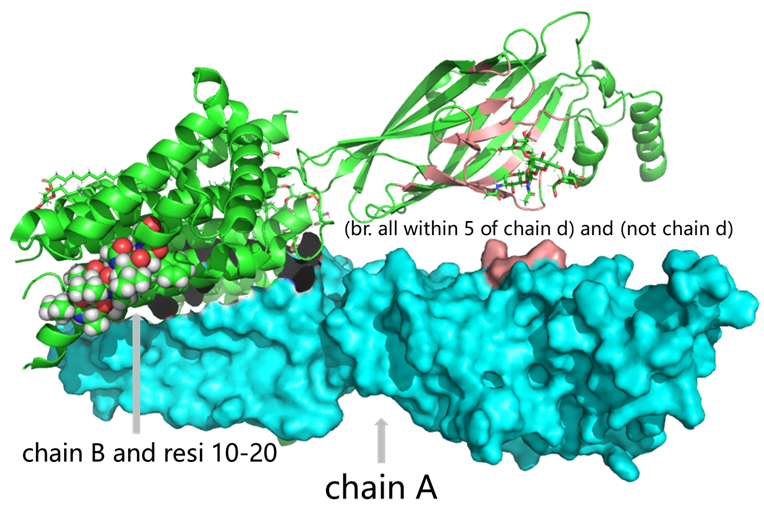

# pymol选择器语法
在分子可视化和分析中，PyMOL 是一个广泛使用的工具，它不仅能展示分子的三维结构，还能帮助我们深入分析分子的各种性质。PyMOL 选择器语法是其核心功能之一，它允许用户精确地选择分子中的特定原子、残基或区域，进行各种操作，如颜色设置、距离测量、计算分子间相互作用等。通过灵活运用选择器语法，我们能够高效地从复杂的分子结构中提取出感兴趣的部分，进行定制化的分析与可视化。无论是在药物设计、分子对接研究，还是在结构生物学领域，PyMOL 选择器语法都为研究人员提供了强有力的工具，提升了工作效率，简化了数据分析过程。  
  
## 参考
（1）https://pymolwiki.org/index.php/Selection_Algebra  
（2）https://www.compchems.com/pymol-selection-tool/#combining-selection-rules-with-logical-operators  
（3）https://pymol.org/dokuwiki/doku.php?id=selection   