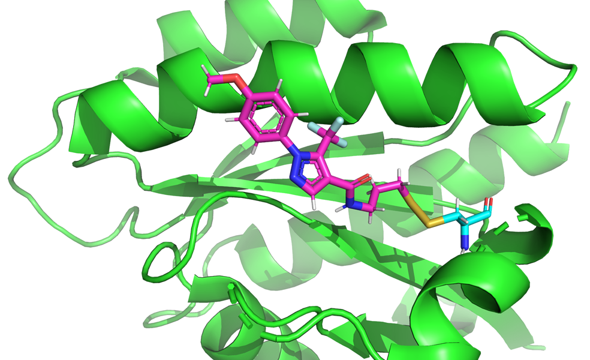
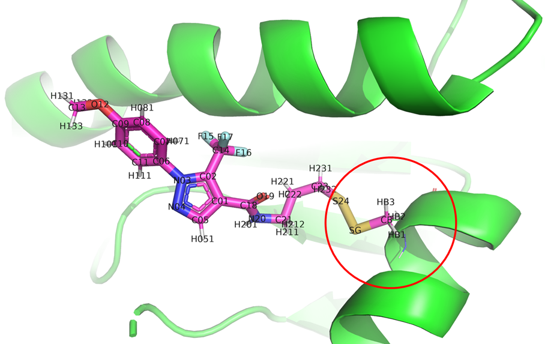
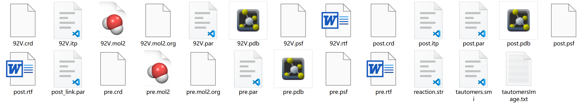
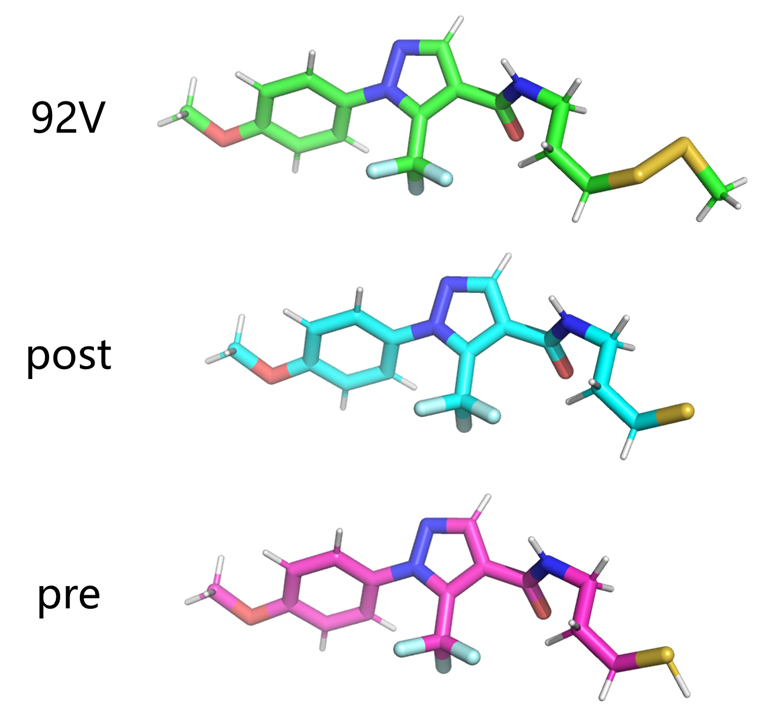
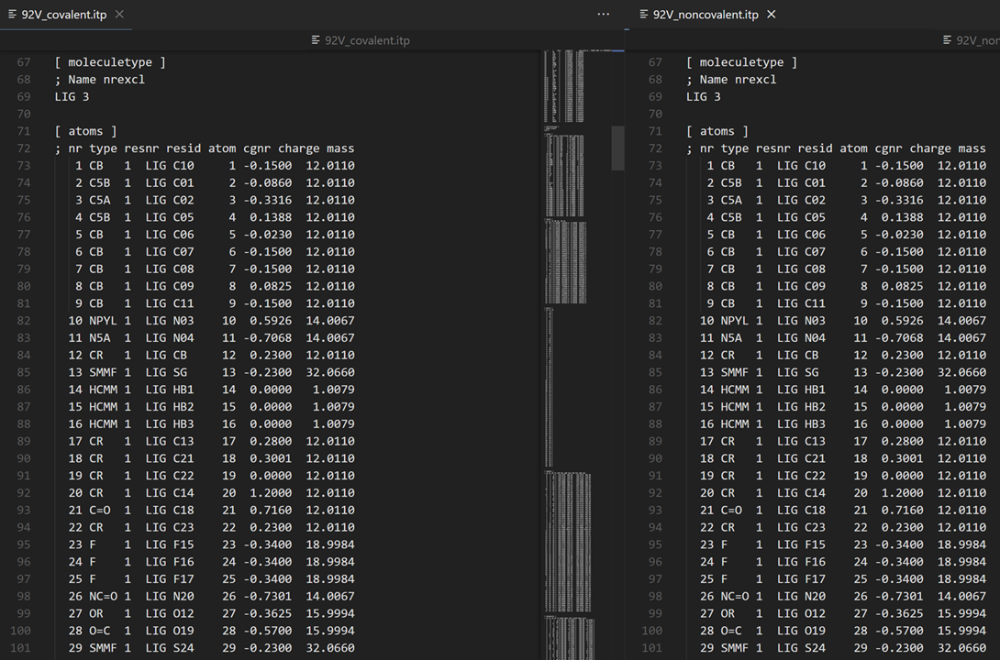
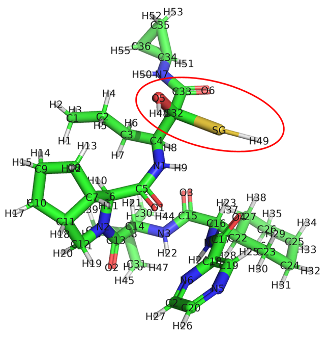

# swissparam生成小分子力场参数的命令行使用
在分子动力学模拟研究中，小分子的力场参数生成是至关重要的一环。力场参数的准确性直接决定了模拟结果的可靠性和可信度，尤其是在研究配体与靶标分子相互作用时。SwissParam 是一个专为 CHARMM 力场开发的小分子参数化工具，能够快速生成与 CHARMM 力场兼容的小分子参数文件。相比于传统的手动参数化方法，SwissParam 提供了便捷的命令行接口，既节省了时间，又降低了出错概率，特别适用于需要高通量处理的小分子研究场景。本文将聚焦于 SwissParam 命令行工具的使用，结合具体操作步骤和实用技巧，帮助科研工作者快速、高效地生成可靠的小分子力场参数，从而推动分子动力学模拟研究的顺利开展。

  
## 检查服务器是否已启动并运行
SwissParam命令行的原理是，在联网情况下使用SwissParam网站的API接口将分子通过本地命令提交到网站上进行计算。所以首先需要检查SwissParam网站是否正常运行以及本地是否正常连接至SwissParam网站。如下所示，如果SwissParam网站服务器正常运行，将收到一个 "Hello World!" 的消息。则可继续进行后续操作。    
```shell
$ curl -s swissparam.ch:5678/
Hello World!
```
## 命令行提交分子获取力场参数
### 非共价小分子
以下述分子为例，分子结构如下图所示，分子的SMILES是 CCC(=O)NC1=C2C=CC=CC2=CN=C1。  
  

**（1）使用mol2文件分子作为输入。** **写在前面，我一般推荐用户使用不加氢的mol2文件作为输入，并在PH=7.4条件下加氢计算生成力场参数文件。因为SwissParam会计算PH=7.4时候的配体质子化状态。** 当然上述只是建议，如果需要其他PH条件，用户也可以将自己需要的完整加氢结构的mol2文件进行计算。使用下述一些示例对其使用方法解析。    
**示例一：以非加氢mol2文件作为输入，SwissParam在PH=7.4加氢后生成两种方式（MMFF和MATCH）的力场参数。** 其中myMol2指定输入文件（myMol2=@LIG.mol2）。approach指定生成力场参数的方式（approach=both），approach有以下几种选择参数：both (default), mmff-based, match。并进行加氢（approach=both&addH）。其实每运行一步，命令行就会自动提示下一步应该怎么进行查询计算状态以及获取计算结果。根据提示进行后续操作即可。   
```shell
# 以LIG.mol2输入，产生力场的方式选择both（MMFF和MATCH），并使用&addH进行加氢。  
$ curl -s -F "myMol2=@LIG.mol2" "swissparam.ch:5678/startparam?approach=both&addH"
Session number: 48059380
To check your session status, please run the following command:
curl "swissparam.ch:5678/checksession?sessionNumber=48059380"

# 查询提交的任务的计算状态。
$ curl "swissparam.ch:5678/checksession?sessionNumber=48059380"

Your parameters:
        Query: mol2
        Input: LIG.mol2
        AddH: True
        Approach: both
        Date: Sun 19 Jan 2025 09:40:38

Calculation is finished.
To retrieve the results, please run the following command:
curl "swissparam.ch:5678/retrievesession?sessionNumber=48059380" -o results.tar.gz

# 将计算结果打包下载。
$ curl "swissparam.ch:5678/retrievesession?sessionNumber=48059380" -o results.tar.gz
  % Total    % Received % Xferd  Average Speed   Time    Time     Time  Current
                                 Dload  Upload   Total   Spent    Left  Speed
100 13336    0 13336    0     0  20685      0 --:--:-- --:--:-- --:--:-- 20675
``` 

**示例二：以完整mol2文件作为输入，不加氢生成两种方式（MMFF和MATCH）的力场参数。** 将&addH去掉即可。  
```shell
curl -s -F "myMol2=@LImol2" "swissparam.ch:5678/startparam?approach=both"  
```
**示例三：以完整mol2文件作为输入，不加氢仅生成一种方式（MMFF或MATCH）的力场参数。** 使用approach指定力场计算方式。有以下几种选择参数：both (default), mmff-based, match。  
```shell
# 生成MMFF方式的参数
curl -s -F "myMol2=@LIG.mol2" "swissparam.ch:5678/startparam?approach=mmff-based"

# 生成MATCH方式的参数
curl -s -F "myMol2=@LIG.mol2" "swissparam.ch:5678/startparam?approach=match"
```
**示例四：在使用基于MMFF的方法进行参数化时，可以选择不同版本的CHARMM力场来生成参数。** 默认情况下，使用的是CHARMM36力场，但你可以通过在命令行中添加 &c22 或 &c27 来指定使用CHARMM22或CHARMM27版本。  
```shell
# 默认情况下使用的是MMFF的CHARMM36
# 使用MMFF的CHARMM22
curl -s -F "myMol2=@LIG.mol2" "swissparam.ch:5678/startparam?approach=mmff-based&c22"

# 使用MMFF的CHARMM27
curl -s -F "myMol2=@LIG.mol2" "swissparam.ch:5678/startparam?approach=mmff-based&c27"
```
**（2）使用SMILES作为输入。** 使用mySMILES指定SMILES进行参数生成。   
**示例五：以SMILES作为输入，自动加氢生成两种方式（MMFF和MATCH）的力场参数。**  
```shell
# SMILES作为输入生成参数文件
curl -s -g "swissparam.ch:5678/startparam?mySMILES=CCC(=O)NC1=C2C=CC=CC2=CN=C1&approach=both"
```
### 共价小分子
**写在前面：Swissparam提供了一些反应类型的共价配体MMFF力场参数生成方式。但是没有提及如何在Gromacs中使用这些参数进行蛋白-共价配体动力学模拟。并且对比发现采用该方式生成的共价配体化合物参数与将残基-共价配体的复合mol2文件以上述非共价形式使用MMFF生成的参数一致。但是我们大多时候之所以需要共价配体参数是要进一步动力学模拟。所以个人感觉以此方式生成的共价参数方便用于NAMD模拟建模，具体可参考文章 [NAMD进行共价体系蛋白配体动力学模拟，共价小分子配体参数由SwissParam生成](https://mp.weixin.qq.com/s/NoNAdhYkwiPOOVD9wjk8AQ)。但这些文件对Gromacs建模参考不大，如何应用Swissparam产生的MMFF力场使用Gromacs进行蛋白-共价配体的动力学模拟可参考文章 [Gromacs进行共价体系蛋白配体动力学模拟：蛋白使用pdb2gmx charmm36，共价小分子使用swissparam](https://mp.weixin.qq.com/s/XviJngVdoknjWkTdj-mqbQ) 和 [Gromacs进行共价体系蛋白配体动力学模拟：蛋白使用pdb2gmx charmm36，共价小分子使用swissparam（续）](https://mp.weixin.qq.com/s/y10bvAXalgE1iDcJJsTVEg)。** 

首先介绍一下为共价小分子进行参数化的SwissParam命令结构。命令格式如下所示，其中**molecule.mol2**是输入的共价分子的mol2格式文件。**ligsite=l**是共价连接的配体位置（即配体分子的原子名称）。**reaction=r**是选择的反应类型。**protres=p**是执行共价连接的蛋白质残基，可以是 CYS、SER、LYS、ASP、GLU、THR、TYR。**topology=t**是配体的拓扑结构类型，可以是 "post-cap" 或 "pre-reactive"。   
可使用的反应类型有：**aziridine_open**：对氮杂环的开环机制；**blac_open**：对β-内酰胺的开环机制；**carbonyl_add**：对羰基的加成反应；**disulf_form**：形成二硫键；**epoxide_open**：对环氧化物的开环机制；**glac_open**：对ɣ-内酰胺的开环机制；**imine_form**：形成亚胺；**michael_add**：对Michael受体的加成反应；**nitrile_add**：对腈的加成反应；**nucl_subst**：亲核取代反应。   
```shell
$ curl -s -F "myMol2=@molecule.mol2" "swissparam.ch:5678/startparam?ligsite=l&reaction=r&protes=p&topology=t" 
```

这里还是以几个例子介绍一下使用SwissParam命令行生成共价配体MMFF参数的方式。  
**示例六：以如下图所示PDBid：5VBM中的共价配体92V为例，使用SwissParam命令行生成配体参数。** 该示例是蛋白的CYS残基与配体的巯基形成了二硫键。  
   
首先准备输入的mol2格式文件。如下图所示，mol2文件是在配体的基础上向外延申了二硫键以及一个碳原子。其中向外延申的CYS残基部分的原子名称需要和残基中的原子名称一致。
   
反应的配体原子名称是S24。反应类型是形成二硫键反应。形成共价的残基是CYS。输入结构文件的结构是共价反应后的结构。所以使用下述命令准备共价配体参数。该方式形成的力场参数是MMFF的。  
```shell
# MMFF CHARMM36
$ curl -s -F "myMol2=@92V.mol2" "swissparam.ch:5678/startparam?ligsite=S24&reaction=disulf_form&protres=CYS&topology=post-cap"

# MMFF CHARMM22
$ curl -s -F "myMol2=@92V.mol2" "swissparam.ch:5678/startparam?ligsite=S24&reaction=disulf_form&protres=CYS&topology=post-cap&c22"

# MMFF CHARMM27
$ curl -s -F "myMol2=@92V.mol2" "swissparam.ch:5678/startparam?ligsite=S24&reaction=disulf_form&protres=CYS&topology=post-cap&c27"
```
生成的文件如下所示。92V是含有二硫键以及延申的碳原子的结构的力场文件，post是反应后的配体部分的结构以及力场文件，pre是单单配体部分反应前的结构以及力场文件。  
  
  

**这里我比较好奇该共价方式产生的92V的MMFF参数是否和非共价方式产生的92V的MMFF参数一致。所以将92V使用非共价方式又产生了一遍参数并与共价方式产生的参数进行比较。如下图所示，产生的参数一模一样。**  
  

**示例七：指定删除原子以转换拓扑：post-cap 到 pre-reactive。** 在使用 post 拓扑时，可以指定需要删除的原子，以转换为 pre 拓扑。如果这些原子没有“官方 PDB 名称”，可以通过添加 &delete=atom1,atom2 来指定它们。以下图分子为例，下图中的共价反应是CYS的巯基和配体分子中的羰基加成而得。其中的SG原子属于CYS。所以反应后仅配体部分结构应该要将下图中的SG原子和H49原子删除。  
  
使用下述命令准备配体力场参数并删除SG原子和H49原子。  
```shell
curl -s -F "myMol2=@CB0000002.mol2" "swissparam.ch:5678/startparam?delete=SG,H49&reaction=carbonyl_add&topology=post-cap&protres=CYS&ligsite=C32"  
```

## 任务状态查询与进度跟踪
使用提交时获得的会话编号（Session Number）检查任务的状态。如果计算任务正在排队等待执行将看到相关信息，并提供排队任务的数量。如果任务正在运行将看到任务的当前运行状态和运行时间。如果参数化任务已经完成也会看到任务完成的通知。其实分子提交之后界面会提示命令。    
```shell
$ curl -s "swissparam.ch:5678/checksession?sessionNumber=48059380"
```
## 取消正在进行的参数化任务
可以取消当前正在运行或排队等待的参数化任务。使用下述命令可以将计算任务从服务器队列中移除。  
```shell
$ curl -s "swissparam.ch:5678/cancelsession?sessionNumber=48059380"
```
## 获取参数化任务结果
在确认提交的任务已完成后（见上文），可以通过下述命令获取结果文件。   
```shell
$ curl "swissparam.ch:5678/retrievesession?sessionNumber=48059380" -o results.tar.gz
```
## 参考
1. http://swissparam.ch/command-line.php  