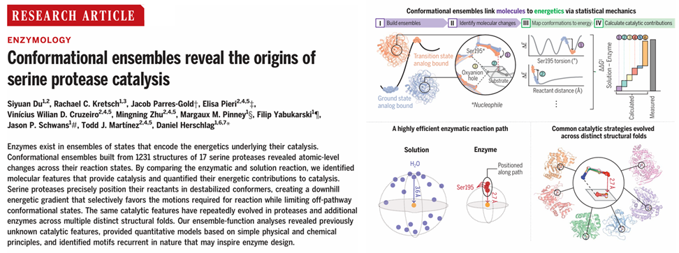

# 丝氨酸蛋白酶构象集合的统计分析揭示其催化起源
酶并非以单一状态存在，而是以一系列状态的集合形式发挥作用，这些状态中蕴含着催化过程背后的能量学奥秘。研究人员构建了由 17 种丝氨酸蛋白酶的 1231 个结构组成的构象集合，从中清晰地揭示了这些蛋白酶在不同反应状态下原子层面的微妙变化。通过细致对比酶促反应和溶液反应，不仅成功确定了发挥催化作用的关键分子特征，还对其对催化的能量贡献进行了精确量化。   
丝氨酸蛋白酶展现出了独特的催化机制，它能够将反应物精准地定位在不稳定的构象中，从而形成一个能量逐渐降低的下坡梯度。这个梯度就像是为反应 “导航”，有选择地促进反应所需的分子运动，同时有效限制了偏离反应路径的构象状态。值得注意的是，相同的催化特征在多种不同结构折叠的蛋白酶以及其他各类酶中不断重复进化，这一现象令人惊叹。    
通过对构象集合与功能关系的深入分析，研究人员发现了一些此前从未知晓的催化特征，并且基于简单而基础的物理和化学原理，建立了定量模型。此外，研究还识别出了自然界中反复出现的基序，这些基序极有可能为酶的设计提供全新的灵感与方向，助力生物技术领域迈向新的高度。   

  

## 