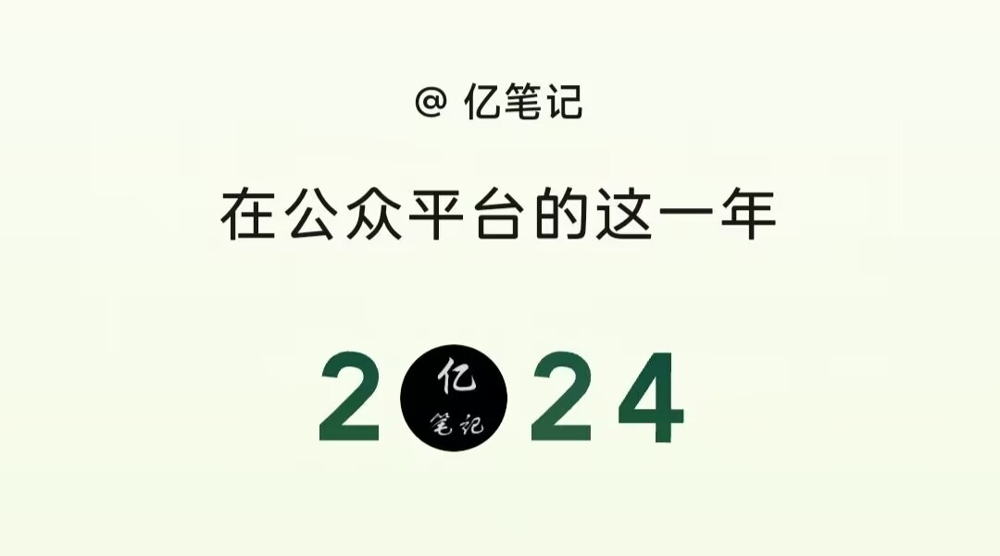
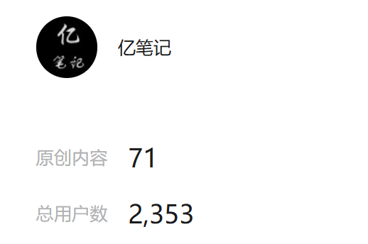
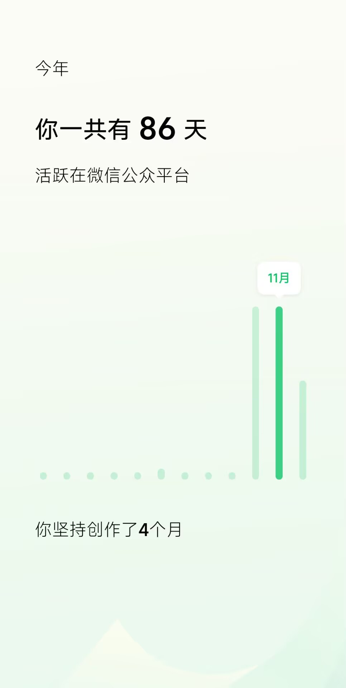
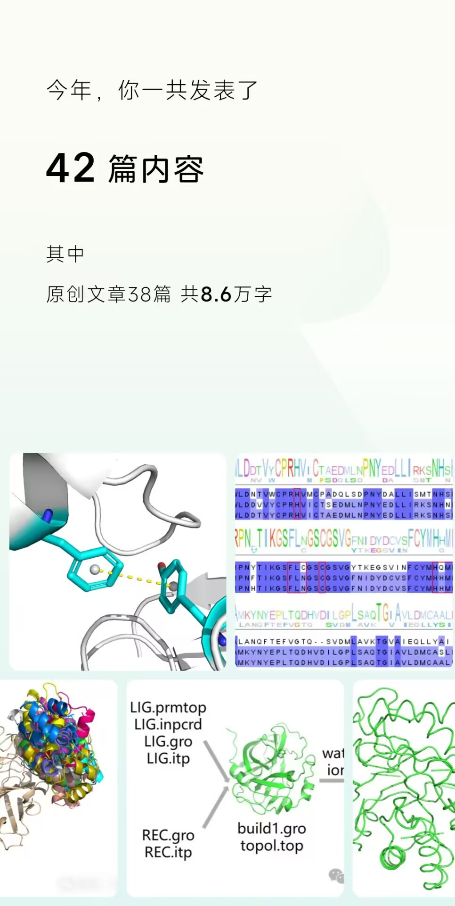
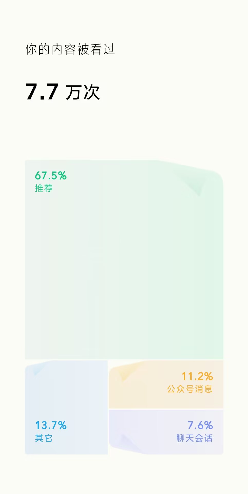
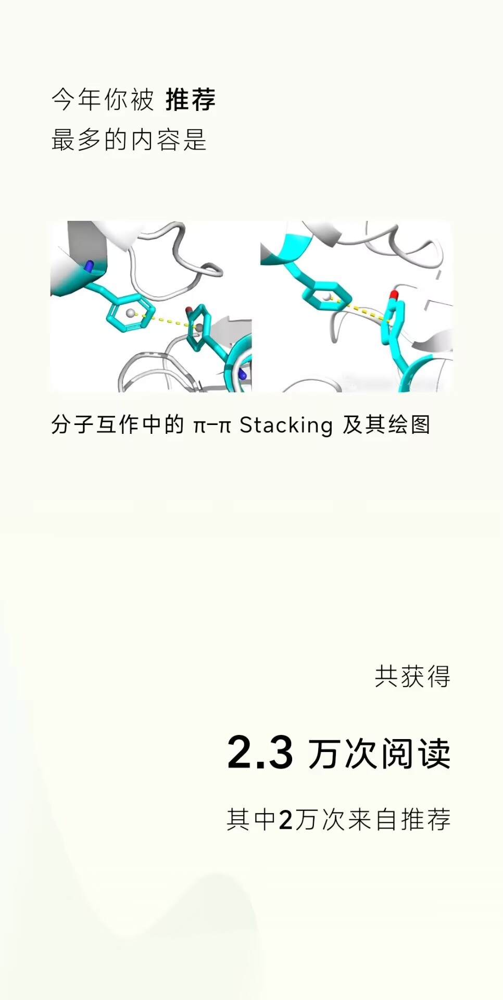
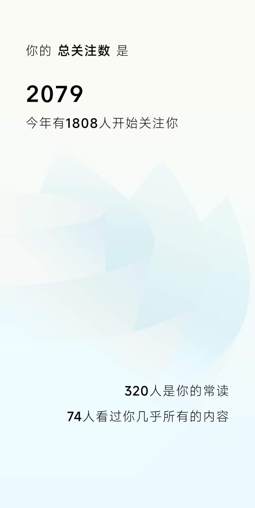
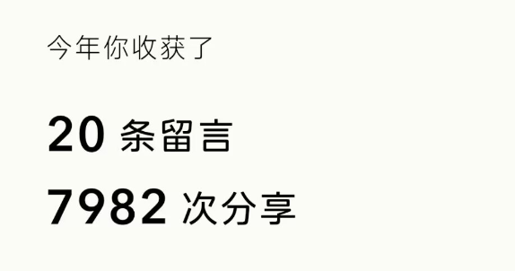

# 亿笔记公众号文章2024年总结（截至2025.1.29/春节）
这个公众号其实早在2018年就注册了，原本想着随便写点东西练习文笔，哈哈，其实一直什么都没写过。直到读了研究生，学习笔记整理很麻烦，常常找不到以前明明做过的流程脚本等，又得重新学习，非常浪费时间。俗话说得好，好记性不如烂笔头。所以就想着将一些日常的学习笔记整理记录在公众号中方便查询。从2021年10月份开始更新一些技术文章，文献阅读等。  
  
不过当时是想起来写一写，三天打鱼两天晒网的状态。期间一直在探索记录笔记的好用方法，试过很多。但是依旧会遇到熟悉的事情，遗忘的方法。所以下定决心将笔记认真做一下。公众号文章手机电脑上都能查阅，并且格式规范，是一个不错的选择。写篇文章还是需要耗费不少时间精力的，拉了几个人一起好了。从2021年10月份开始有规律的更新。一周少则一篇，多则三篇的样子。以后也会继续坚持。  
  
## 2024年数据（截至2025.1.1）
截至2025.1.29/春节，公众号共有71篇原创文章，2353个用户。  
  

其他数据直接展示下公众号后台自动生成的2024年数据。  
  
  
  
  
  
  
## 文章总目录
公众号的互动栏目对文章进行了大致分类。每年年末我也会对所有文章进行更加详细的内容划分，方便查阅。2024年的如下：  
[教程合集文章精选（截至2025年春节/2025.1.29）](https://mp.weixin.qq.com/s/YzvvgaE8RYmaVlZDT3Vp-Q)  
  
## 后续计划
1. 持续更新高质量的公众号推文。  
2. 不仅更新技术教程，也增加一些经典算法的更新。  
3. 增加一些软件教程专栏，例如RDKit，Pymol，学术版薛定谔等等。  
4. 增加更多前沿领域的经典文献。  
5. 增加人工智能领域的文章内容。  

2025年年底再来看计划完成的如何，哈哈。   
## 推荐阅读
1. https://mp.weixin.qq.com/mp/creatorannual?lang=zh_CN&token=460874805&action=template&__biz=Mzg2OTA2NTY3Mg==&year=2024&auth_code=f3938c44c3688b522e5866f0893bc1ce&devicetype=android-33&version=2800373d&ascene=1#wechat_redirect  