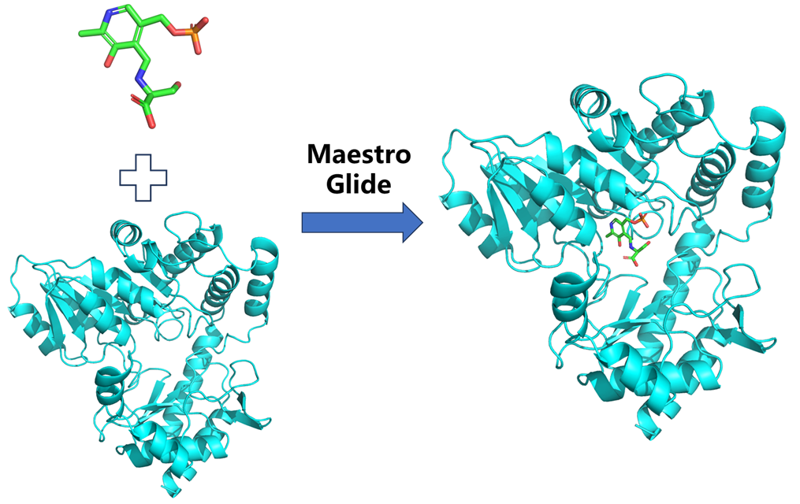
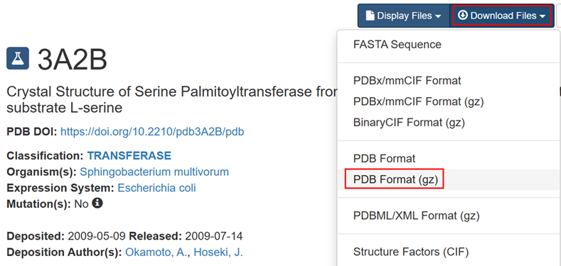

# 使用Maestro中的Glide模块进行蛋白-配体小分子对接
在药物研发领域，蛋白-配体相互作用的精准预测是理性药物设计的核心挑战之一。传统的实验方法虽可靠，但耗时耗力；而计算模拟技术凭借其高效、低成本的优势，正逐渐成为新药发现的重要工具。Schrödinger Maestro作为计算化学领域的标杆平台，其Glide模块凭借独特的算法与高精度对接能力，在虚拟筛选、结合模式预测及先导化合物优化中展现了强大的应用价值。  

本文将以实战为导向，深入解析Glide模块的操作流程、参数优化策略及结果分析方法，旨在为药物化学研究者、计算生物学从业者及学生提供一份 **“即学即用”的对接指南**。无论您是初探分子对接的新手，还是希望提升现有研究效率的资深用户，本文都将帮助您解锁Glide的核心功能，加速从靶点结构到活性分子的转化之旅。  

  

## 体系准备
本文以PDBID为3A2B的结构为例进行分子对接。对接位点是晶体结构配体所在的位置，对接的配体即晶体结构中的配体。

（1）在RCSB数据库中搜索3A2B并下载结构。
  

（2）Pymol打开3A2B，将其中的蛋白部分保存为rec.pdb。配体部分检查结构，必要时候可以使用Pymol的Builder模块编辑分子结构，确保小分子结构正确（特别是单双键正确）后将配体小分子保存为lig.mol2。  

（3）准备好的文件如下所示，rec.pdb 是对接所需的蛋白受体文件，lig.mol2 是对接所需的配体小分子文件。  
  

## 蛋白准备
**（1）为什么进行蛋白准备？**  
从PDB晶体结构数据库中下载下来的晶体结构不适合直接用于分子对接。PDB数据库中的晶体结构仅含有重原子，并且可能含有共结晶配体、水分子、金属离子和辅因子等。多聚体结构则可能需要取出单体结构。另外，PDB数据库中的结构可能缺少连接信息，因此必须重新分配连接信息、键序和形式电荷。Maestro的**Protein Preparation Wizard模块**便是用于准备蛋白结构以解决上述问题。  

**（2）官方版本的蛋白准备流程。**   
下面列出了蛋白准备的基本流程，在该流程中假设初始的蛋白结构是PDB格式，里面含有共结晶的配体分子，不含氢原子。在其他的蛋白结构准备过程中**需要针对具体问题具体分析**，在一些案例中，并不需要把下面所有步骤都走一遍。官方版本是将RCSB中下载的晶体结构（含水，离子，以及其他有机小分子）直接扔进来蛋白准备。我个人更喜欢先将蛋白配体分开单独准备后进行对接，一般情况下我不考虑水分子。    

1. 将PDB晶体结构库中的蛋白配体复合物结构导入Maestro中。  
2. 定位需要保留的水分子，删掉其他水分子。通常和金属原/离子有相互作用的以及桥连蛋白和配体的水分子需要保留，其他的水分子删掉。
3. 简化多聚复合物。如果PDB数据库中蛋白结构是多聚体，查看是否该多聚体有重复的结合位点和重复的链，如果有的话仅保留一个，删掉其他冗余的结构。
4. 调整蛋白、金属离/原子和辅因子。修补缺失的残基，如果缺失的残基距离结合位点比较远则一般不影响对接结果，如果缺失的残基在结合位点附近则一定要补全；检查蛋白结构中的金属原/离子；如果有键连着金属离子，则要将键删掉，并调整与金属离子相连原子和金属离子的形式电荷；设置金属原子的电荷并且纠正原子类型；设置辅因子的键序和形式电荷；修正摆向错误基团的方向。
5. 调整配体的键序和形式电荷。
6. 如果需要的话，调整蛋白和配体的离子化状态和互变异构状态。
7. 精炼结构。能量最小化，调整基团摆向。
8. 检查准备好的结构。检查整体结构的形式电荷和质子化状态，并根据需要进行调整。检查水分子以及其他基团的取向，如酰胺、羟基的取向等。

**（3）个人常用的蛋白准备流程及操作。**   
简介：Protein Preparation Wizard模块可以帮助用户自动进行蛋白准备。经过该模块准备后的蛋白结构可用于后续的其他计算任务，如Glide、Prime、QSite和MacroModel。Protein Preparation Wizard模块的打开方式如下图：  
  

Protein Preparation Wizard模块的主界面简介如下所示：  
  

我一般使用的是交互式的，一个步骤进行完成成功后再进行下一个步骤。  

1. 蛋白结构输入。  
  
2. 蛋白结构预处理。  
  
3. 结构检查和分析。  
  
4. 优化氢键网络。  
  
5. 能量最小化。  
  

完成上述几个结构处理步骤后即可在界面中获得如下结构。  
  

**具体操作总结：导入蛋白结构并打开Protein Preparation Wizard模块；INTERACTIVE切换到交互模式；点击Preprocess进行结构预处理（一般默认参数即可）；点击Check Structure进行结构检查；点击Optimize进行氢键网络优化；点击Clean Up进行能量最小化即可。往往需要具体问题具体分析，针对不同的结构需要调整不同的参数，可参照上述的参数解析。一般选用默认的就可以。**  

## 对接盒子生成
以上述准备完成的蛋白结构作为输入，使用**Receptor Grid Generation模块**生成对接盒子。   
**（1）设置用于生成盒子的受体参数。**   
  

**（2）选择对接盒子中心并设置盒子尺寸。**  
   
这里我使用输入坐标方式确定盒子中心。将蛋白配体拖入pymol中使用下述命令获取质心坐标。如下：  
```python
PyMOL>centerofmass
 Center of Mass: [  37.031,   6.535,  46.374]
```

**（3）为对接盒子生成设置约束条件。**  
  

**（4）为对接盒子生成设置可旋转基团。**  
   

SER、THR、TYR等残基中的羟基和CYS中的硫醇基可以采用不同的配体取向。Glide 可以让这些基团在配体对接时采用不同的方向，以产生最有利的相互作用。    

**（5）为对接盒子生成设置排除体积。**  
在某些情况下，您可能希望防止配体占据某些空间区域。例如，如果您在已知配体不结合的活性位点附近有一个口袋，您可能希望阻止配体占据该口袋。另一种情况是蛋白质的某些部分缺失，而您想要防止配体占据该区域。在Excluded Volumes 选项卡中，您可以设置在对接期间将排除配体的空间区域。选择原子来定义这些球体，然后设置球体的半径。    

  

**（6）生成盒子。**  
  

## 配体准备
LigPrep是薛定谔中用于准备配体高质量、全原子的三维结构的软件集。LigPrep最简单的用法是去产生单一的低能量并且手性正确的三维结构。LigPrep还可以用于产生各种电离状态、拓扑异构状态、立体化学和环构象的分子。并且还可以i指定条件来过滤分子。  

**（1）官方版本的配体准备流程。**   
转换分子格式：将输入分子的格式 (sdf, mol, mol2) 转换为mae格式；加氢；移除不想要的原子：去除盐；中和带电基团；产生质子化状态；产生互变异构结构；设置条件过滤结构；产生正确的手性结构；产生三维结构并且能量最小化；转换输出文件格式。  

**（2）LigPrep实际操作。**   
  

配体准备完成之后可生成ligprep_1文件夹，文件夹下即配体准备完成之后的文件。  

## 分子对接
Ligand Docking模块用于进行分子对接。  

**（1）加载对接盒子。**  
  

**（2）加载配体。**  
  

**（3）对接设置。**  
  

**（4）限制设置。**  
  

**（5）设置输出。**   
  

**（6）对接具体操作总结。**  
一般需要导入对接盒子和配体，然后设置对接精度，设置输出选项，其他默认即可，具体问题需要具体分析。最后如下设置核数和子任务进行对接即可。  

  

**（7）run 执行对接即可。**  

## 结果可视化及分析
对接完成之后可在界面中看到如下的对接结果以及对接打分。  
  

另外还可参考文章 [蛋白配体互作图|使用薛定谔的 2D Sketcher 模块绘制蛋白配体2D相互作用图](https://mp.weixin.qq.com/s/VxPK1BET1YB4O8wXL4_Bqg) 绘制蛋白-配体的2D相互作用。  