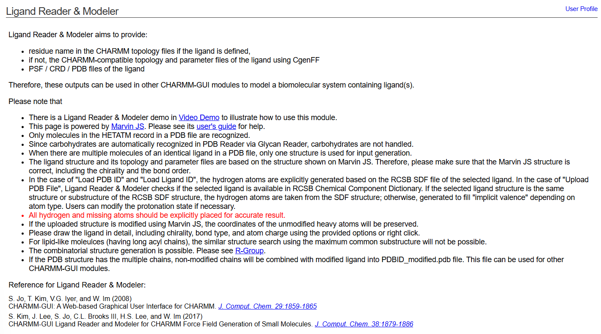
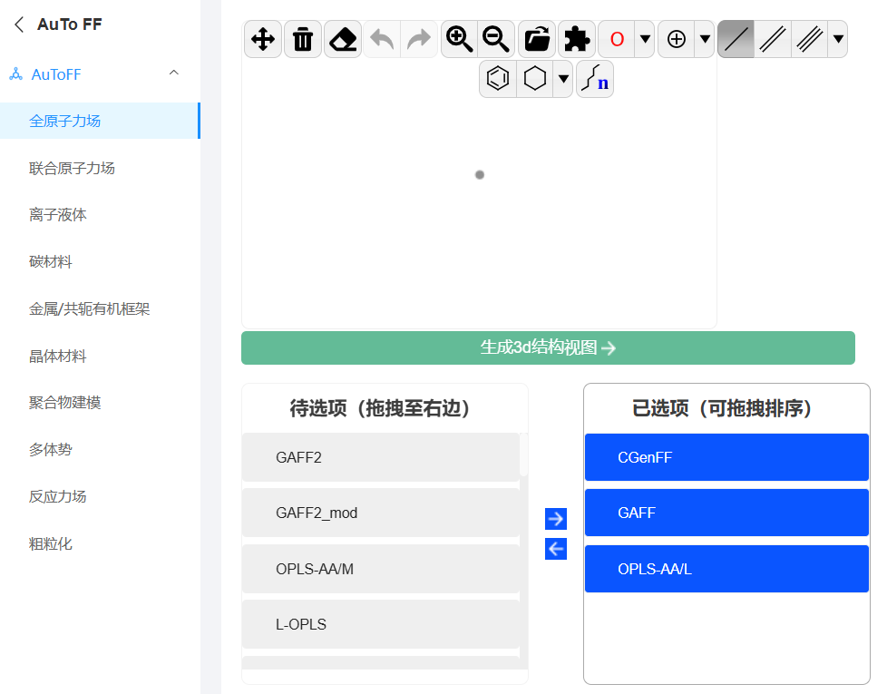

# 几个使用过的用于动力学模拟的小分子力场以及小分子力场生成工具
在分子动力学模拟中，小分子力场参数的生成是精确描述分子行为的关键步骤，尤其是涉及蛋白-小分子相互作用或药物设计研究时，合理的力场参数能够显著提高模拟的可信度和结果的可靠性。尽管目前已有多种通用力场（如 CHARMM 和 AMBER）用于蛋白质等生物大分子的研究，但小分子力场的构建因其化学结构的多样性而更加复杂，需要额外的参数化工具来保证与标准力场的兼容性。  

本文将介绍几种常用的小分子力场及其参数生成工具，包括 CGenFF，GAFF 和 MMFF 力场，以及与之配套的工具平台（如 CHARMM-GUI、CGenFF 网站、AuToFF 和 SwissParam）。其中：CGenFF（CHARMM General Force Field）是基于 CHARMM 力场的通用力场，广泛应用于小分子和生物分子的混合体系研究。GAFF（General AMBER Force Field）是 AMBER 力场的扩展，用于处理多样化的小分子。SwissParam 提供了快速生成与 CHARMM 力场兼容的小分子 MMFF 力场参数的能力。这些工具和力场为研究者在建模和动力学模拟中提供了便捷的解决方案。例如，CHARMM-GUI 的 Ligand Reader & Modeler 模块以及 AuToFF 网站能轻松生成 CGenFF 力场参数；而 SwissParam 提供了基于 MMFF94 和 MATCH 方法的力场生成选项，适合快速处理大规模分子体系。这些工具的结合能够显著提升从分子建模到动力学模拟的效率，为生物分子与小分子相互作用研究、药物开发以及材料科学中的分子行为分析提供强有力的技术支持。  
## cgenff
CGenFF（CHARMM General Force Field）是 CHARMM 力场家族的一个重要扩展，专为处理生物大分子（如蛋白质、核酸）和小分子体系的相互作用而设计。它能够为多样化的有机小分子生成合理的参数，与标准 CHARMM 力场无缝兼容，因此被广泛应用于分子动力学模拟中的混合体系研究。CGenFF 提供了一种自动化的力场参数生成流程。通过 CGenFF 网站或 CHARMM-GUI 的 Ligand Reader & Modeler 模块，用户只需输入小分子的结构信息（如 SMILES 或 MOL 文件），即可快速生成参数和拓扑文件。这些参数基于 CGenFF 的力场数据库，采用类似分子片段匹配的方法，同时允许对未知分子进行初步预测，并根据分子环境优化分子行为的描述。CGenFF 的优势在于其适用范围广，覆盖了多种化学官能团和拓扑结构，特别适合含有复杂官能团的小分子建模。配合 CHARMM 力场，它可以有效用于蛋白-小分子相互作用的研究、药物分子设计以及复杂生物体系的动力学模拟。  
### CHARMM-GUI的Ligand Reader & Modeler模块生成小分子cgenff力场参数
CHARMM-GUI的Ligand Reader & Modeler模块如下所示，该模块可根据用户上传的小分子调用CgenFF生成小分子的cgenff力场参数相关文件，包括坐标pdb文件，拓扑psf文件和rtf文件，以及参数par文件等。这些文件可直接用于vmd+namd的分子动力学模拟。也可将这些文件再使用Force Field Converter转换成可用于gmx适配文件用于gmx的分子动力学模拟（该部分具体可参考文章 [蛋白-配体小分子动力学模拟：蛋白使用pdb2gmx charmm36，小分子使用cgenff生成力场参数](https://mp.weixin.qq.com/s/tUzBB9eQRDQHMnC7uaI_yA)）。  
  
### CGenFF网站生成小分子cgenff力场参数
[CGenFF](https://cgenff.com/)网站是用于生成小分子cgenff力场拓扑和参数的重要网站。前述介绍的CHARMM-GUI的Ligand Reader & Modeler模块内部也是调用的CGenFF生成cgenff参数。网站提供了详细的教程，需要先行注册才能使用。我一直没注册成功，所以一直使用的是CHARMM-GUI的Ligand Reader & Modeler模块。后面注册成功具体使用时候再详细更新补充。  
## GAFF
GAFF（General AMBER Force Field）是一种专为小分子设计的通用力场，用于模拟生物分子与小分子配体的相互作用。它是 AMBER 力场家族的重要扩展，能够为含有复杂官能团的小分子生成准确的参数。GAFF 通过广泛的化学类型和灵活的原子描述（例如原子类型、键长、键角和二面角参数），支持对药物化学和分子对接研究中的小分子配体进行动力学模拟和结合能评估。它能与与 AMBER 力场高度兼容，允许在同一体系中同时描述蛋白质、核酸和小分子配体。其可以通过工具（如 Antechamber）根据小分子的输入结构快速生成参数文件。  
## AuToFF网站建模工具
[AuToFF](https://cloud.hzwtech.com/web/product-service?id=36)网站是之前用过的一个用于准备大小分子各种力场拓扑和参数的网站工具，还是挺好用的。正如其使用手册介绍，AuToFF (Auxiliary Tools of Force Field) 是一个可视化力场辅助工具。AuToFF能实现2D分子建模、模型三维显示、支持现有的所有主流力场和二流力场形式、支持基于机器学习的第一性原理精度的RESP原子电荷、支持生成多款分子动力学程序或建模工具的输入格式（包括gromacs、lammps、amber、moltemplate、openmm、tinker、charmm、raspa、NAMD、GOMC、Gaussian、ORCA、Gear）、支持多种碳材料/聚合物的建模、支持周期性晶体结构、MOFs/COFs材料的力场拓扑文件生成。我一般上传完整正确的小分子mol2文件在此网站上用于小分子的各种力场参数化用于gmx模拟。    
   
## SwissParam网站建模工具
### MMFF94
### MATCH
## 一些个人使用经验
（1）根据之前的模拟经验，cgenff生成的小分子力场与MMFF生成的小分子力场相比，cgenff在模拟时候小分子的柔性更大，产生的构象更多。MMFF在模拟时候小分子的刚性较强，非常适合共轭体系的模拟。  
（2）cgenff是基于其力场数据库，采用类似分子片段匹配的方法生成多样分子的力场，生成的小分子力场参数是基于片段组合的。所以在为两个近似分子（仅有个别基团不同）准备力场参数时候，两个分子相同的片段参数是一样的，只不同的基团参数不同。该种性质使得其非常适合用于小分子的FEP计算。  