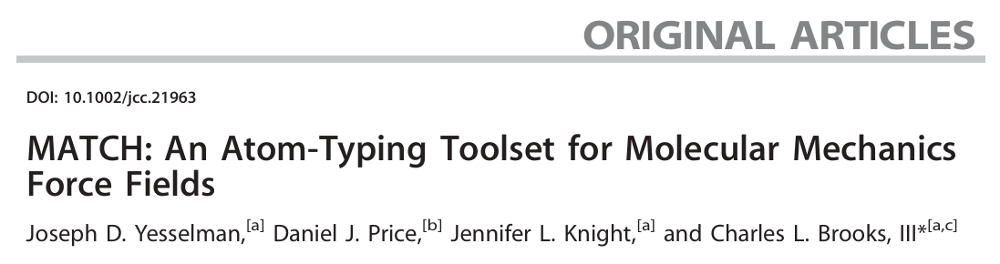

# 力场工具|为有机分子自动分配原子类型和力场参数的工具集MATCH
写在前面：不像蛋白与核酸（蛋白和核酸是由有限个元素排列而成），有机小分子的化学空间很大，无法量化计算或者实验数据拟合每个分子。所以从已有的准确的分子力场中外推陌生分子的力场参数是对有机小分子力场参数化的一个重要科学问题。该MATCH工具则提供了一个方案可以从现有的力场中进行基于片段的归纳总结用于对陌生分子进行力场参数化（原子类型，原子部分电荷，键/角度/二面角参数）。简单来说就是先从一个力场文件中比如Cgenff力场文件出发，对一种原子类型都创建一个专属于该原子类型周边环境的分子片段库。当有一个新分子时候，遍历新分子中的每个原子，将新分子中每个原子的周围环境和分子片段库中的所有进行比对，找出相同的来为该原子赋予原子类型。然后使用学到的BCI规则来确定原子的部分电荷。有了原子类型，则键，角度，二面角参数从力场参数中匹配取出即可。若是相同的不存在，则取出和其最相近的参数代替。  

MATCH工具主要用于根据已知的化学片段和对应的力场参数对小分子进行原子类型化和力场参数分配。MATCH通过以分子图的形式比较输入分子的原子与一系列预定义的化学片段能为新分子提供与现有力场兼容的原子类型、化学键和电荷参数。MATCH的核心优势在于它能够处理各种化学结构，包括那些在传统力场中未明确优化的分子。MATCH刚开始只是用于CHARMM，但其可被扩展至其他任何力场和程序，甚至可被用于基于片段的分子性质预测。  
  
## 背景
生物分子力场开发时，开发者采用各种方法优化键和非键参数，使这些参数能重现实验数据或量子力学模型的数据。因此特定生物分子力场与任意配体力场结合不太可能产生平衡良好的互作。相反，关键在于小分子参数须遵循与开发生物分子力场时使用的参数化方案类似的方案，这就需要力场的可迁移性。直接可以推广到新化合物的参数是与分子内能量项相关的参数，如键长，角度的平衡值与力常数，最佳扭转角及相应的势垒高度。范德华参数、原子半径和能量井深度也可成功在类似原子类型之间转移，它们通常不特别依赖于分子的键合环境。相比之下，与每个原子相关的部分电荷是电静能量项的主要组成部分，它们的转移非常具有挑战性，因为它们不仅依赖于分子的键合环境，还依赖于非键合环境。  

目前关于分子电荷分配有两种主流策略。一是Amber中使用从头计算或模仿电荷分布的参数化方法分配电荷。二是CHARMM/OPLS系列力场使用的基于分子片段电荷分配的方法。MMFF开发时候提出的键电荷增量（BCI）规则是通过为分子片段确定最优电荷然后将这些片段组合起来构建新化合物的电荷分布。  

该文章开发的MATCH初步目标是为新分子生成与CHARMM参数化方案一致的参数。该方法通过提取现有生物分子力场的拓扑和参数文件库中的规则来进行电荷分配的参数化。该方法使现有参数中的片段可以与给定生物分子力场的参数化策略或理念一致的方式应用或外推到新分子上。MATCH将分子结构表示为数学图，可用于化学结构库的结构和子结构搜索。定义原子类型的独特化学环境也可以通过图形表示，从而实现已知原子类型定义库与新化合物中原子之间的化学特征比较。  

后续详尽讨论了MATCH如何构建包含通过力场拓扑文件描述的化学环境定义的库，以及如何为这些原子类型定义分配部分电荷的方案。  
## MATCH策略和组件
MATCH旨在构建基于分子片段的库和BCI规则用于扩展给定生物分子力场的应用，便于进一步参数化新分子。MATCH算法的流程图如下所示：  
  

基于特定力场创建原子类型的分子片段库流程如下图所示：  
     

基于特定力场提取BCI规则流程如下图所示：  
  
### 分子图
根据pdb，mol2以及rtf等文件中的连接信息，以原子为顶点化学键为边构建分子图。将分子图以广度优先算法扩展为树结构，具体来说以一个原子开始，每个与其键合的原子都被添加到树中，接着添加与这些原子键合且尚未包括在树中的原子，直到所有原子都出现在树中或者距离大于10个键的原子不再包含。最终分子图会形成树状结构，从而允许分子之间进行以树结构为基础的比较及操作。  

如上所示，分子结构间比较可转换为分子图比较进一步转换为树数据结构的比较。因此在匹配两个分子时，首先较小图中节点特征必须包含在较大图的节点中。其次每个节点的元素和键数须一致。这个过程会持续进行直到较小图中的所有节点都匹配或者某个节点无法匹配到另一个图中的节点。  
### 环检测
环成员身份的识别在MATCH的原子类型赋值过程中至关重要，因为某些原子类型仅在环中存在。如下图所示，这里开发的算法在很大程度上依赖于之前的分子图，并基于Tiernan关于数学图回路检测的工作。环检测算法如下：每个具有多个键的重原子都将依次考虑，除非该原子已经被检测为环的一部分。该环检测算法是一个广度优先搜索，它遍历当前原子所在的分子图。在每次搜索迭代中，每个路径都会扩展到新的重原子，当前最接近起始点的路径总是首先被选择跟踪。当路径经过超过两个原子的起始原子时，成功终止，所有沿路径遍历的原子将标记为环成员。如果每个路径覆盖超过50%的分子并且与起始点的深度差距超过50%，则无法成功返回起点，此时终止失败。  
  
### 基于分子片段的原子类型分配
将分子转化为数学图形式使得可以直接比较一个原子的局部化学环境与另一个原子的局部化学环境，并对它们之间的相似性进行定量评估。**定义原子类型的化学空间可以表示为分子片段。** 将分子片段定义为一组连接的原子节点，这些节点包含描述原子类型化学空间所需的原子特征（例如原子元素、键的数量、环的成员身份等）。这些分子片段具有与实际分子构建的图相同的属性，因此可以通过类似的程序进行比较。如下图所示，这里将原子类型的分子片段库保存为“超级SMILES字符串格式”。  
  
### BCI规则
常用力场中的原子电荷遵循BCI规则（键增量规则）。该规则描述了两个原子之间共价键的电荷大小和方向。将分子中的原子电荷分解为这些增量，得到一组基于原子类型的通用规则，确立这些规则后可将其扩展并应用到新分子中。    

力场中的原子类型通常被重复使用于键参数分配，尽管不同原子环境下电荷分布略有差异。例如，在CHARMM蛋白力场中，大多数亚甲基中的两个脂肪族氢原子向相邻碳原子转移0.09电子单位的电荷。然而，对于与一级铵根相邻的亚甲基，这一增量为0.05电子单位。尽管用于描述这些碳和氢原子的原子类型是相同的。针对这一问题，MATCH中通过次级原子类型分配过程解决了这种差异。在开发来自力场的BCI规则时，如果某一对键原子类型的多个解决方案存在，则最常用的增量规则存储为默认规则，而较少用的规则作为精细增量规则单独存储。这些精细增量规则与化学环境（通过原子类型过程发现的分子片段）相关联。在分配电荷时候，MATCH会检查这些精细增量规则是否与当前分子的局部化学环境匹配；如果匹配，则应用这些精细规则，而非默认规则。  
### 参数生成
如前所述，原子类型通过片段库进行匹配，原子部分电荷通过BCI规则生成，目前还剩下键，角度，二面角，非键相互作用等参数。因为原子类型已经分配，则只需要从原始力场参数中将和这些匹配的参数取出来即可。先取键参数，键的两侧添加原子即为键角，键角的两侧添加原子即为二面角。需要特别处理的是父力场中不存在的参数，则替换为最相近参数。对力场文件观察发现原子类型之间存在相关性，基于此可以创建一个得分，该得分可以描述一种类型与另一种类型之间的关系。MATCH比较原子类型的分子片段，计算两者的重叠部分。特殊的惩罚机制用于区分仅出现在环中的原子类型与仅出现在脂肪族链中的原子类型，以及相反的情况。这些评分被保存为文本格式，用户可根据需要修改。然后进行赋予参数，举例来说，如果原子类型A和B成键，但对应的键参数在力场参数文件中不存在，则查询相关性矩阵。每个现有的键参数会根据其第一个原子类型与A的相关性及第二个原子类型与B的相关性进行评分；也会考虑相反的情况。当两原子类型完全相同时，相关性得分为1；当两者既不属于同一元素也没有相同的键数时，得分为0。将每对原子类型的相关性得分求和，即为该键参数的总分数。分数最高的键参数被选为新键参数类型的替代参数。  
## 方法
### 使用MATCH构建特定力场的MATCH库
该库是通过MATCH基于CHARMM36拓扑文件构建的。对于每个力场，分子片段根据每个原子类型通过迭代优化程序构建。原子类型首先根据原子元素和键的数量进行分组，同时开发这些分组。每次修改分子片段后，对该组的所有原子进行测试。如果误分类减少，则接受该修改。此过程重复进行，直到没有误分类为止。  

### 通过MATCH库外推和内插力场参数
为评估MATCH库在新分子上下文中的外推和内插能力，使用力场A的MATCH库为力场B中的每个分子分配电荷。然后评估分子原始的力场参数与MATCH生成的力场参数间的差别。  
## 结果与讨论
结果中作者对BCI电荷分配规则，参数分配进行了多种交叉验证。此外还进行了参数替代验证MATCH生成力场的外推和内插能力。  

BCI规则验证和参数分配验证。使用力场中的一种类型文件训练对另外一种类型文件中的分子进行参数化，比如拿蛋白力场的itp文件生成库，对核酸或者cgenff的itp中的分子进行参数化，然后看其外推效果。在相互验证时，Cgenff是最具化学多样性的力场，由于它包含了来自其他力场的模型化合物。以Cgenff作为训练库，外推其他如蛋白，脂质力场时效果还挺好的。此外参数验证的结果显示效果还挺好。  

参数替代。为了证明原子类型替代程序能够产生准确的结果，系统地移除Cgenff参数文件中的一个键、角度或二面角参数，或者从基于Cgenff的MATCH库中移除一个键增量规则，并根据剩余参数确定“最佳匹配”或“最邻近”参数。原子类型替代策略通过外推或内插极大地增加了力场所能覆盖的化学空间，而没有显著牺牲准确性。  
## 参考
1. Yesselman J D, Price D J, Knight J L, et al. MATCH: An atom‐typing toolset for molecular mechanics force fields[J]. Journal of computational chemistry, 2012, 33(2): 189-202.  
2. [MATCH program](https://brooks.chem.lsa.umich.edu/index.php?page=match&subdir=articles/resources/software)  