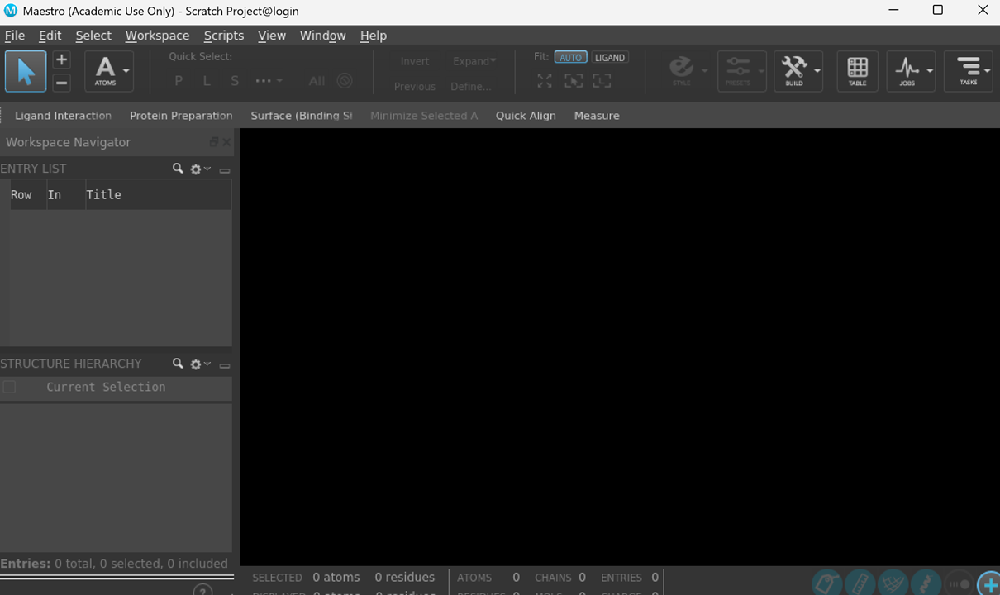

# 学术版Desmond申请及在Linux系统中安装
在分子模拟领域，薛定谔软件及其旗下的Desmond是计算机辅助药物设计不可或缺的工具之一。无论是研究蛋白质-配体相互作用、药物设计，还是探索生物大分子的动态行为，Desmond都能提供强大的计算支持。然而，对于许多科研新手或Linux系统用户来说，如何申请学术版Desmond并在Linux系统中正确安装，仍然是一个充满挑战的过程。本文旨在提供一份详细的指南，辅助大家顺利完成学术版Desmond的申请以及在Linux系统中的安装与配置。  

  

## 学术版Desmond申请
打开 D E Shaw Research 网站 https://www.deshawresearch.com/downloads/download_desmond.cgi/ ，按要求填写申请注册提交即可，后续会发来邮件提供下载。我下载的是Desmond_Maestro_2022.1.tar。但听说现在貌似国内申请不了了。      

## 在Linux系统中安装
**（1）软件包解压缩。** 将软件包传到服务器上，然后解压缩。  
```shell
tar -vxf Desmond_Maestro_2022.1.tar
```
压缩包中文件如下所示，其中INSTALL是安装脚本，README.FIRST.txt中记录了安装方法。    
  

**（2）安装。**   
执行INSTALL安装。   
```shell
./INSTALL
```
选择安装的目录（默认的目录大概率没有权限，所以需要改）还有临时文件存储的文件夹Scratch。并且这些目录文件夹需要提前创建完成。    
```shell
SCHRODINGER directory:  (/opt/schrodinger2022-1)  # 这里不要默认，输入要安装的目录，需要输入绝对路径，其余的根据提示输入y。/home/usrname/software/Desmond_Maestro_2022-1-installed/  
Scratch directory?  (/usr/tmp)  # /home/usrname/software/Desmond_Maestro_2022-1-installed/Scratch/
```
安装了下述组件。  
  

安装完成之后便如下所示，到此整个软件就安装完成了。  
  
  

**（3）启动界面。**   
软件安装成功之后，还需要设置软件的环境变量。  

方式一：将软件目录的环境变量设置放入~/.bashrc文件中进行source，这样设置后，每次连接服务器，都会自动加载此变量，也就能立即调用软件。    
```shell
echo 'export PATH="/home/usrname/software/Desmond_Maestro_2022-1-installed:$PATH"' > ~/.bashrc
source ~/.bashrc
```

方式二：于使用的时候在界面中export即可。先export才能调用。   
```shell
export PATH="/home/usrname/software/Desmond_Maestro_2022-1-installed:$PATH"
```

启动，设置好环境变量之后，使用maestro即可启动界面。**这里强调下，并不是所有终端都能启动，使用MobaXterm是可以启动GUI界面的。**  
```shell
maestro
```
  
  