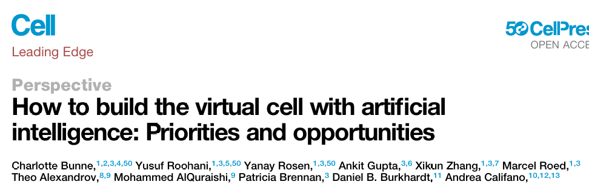
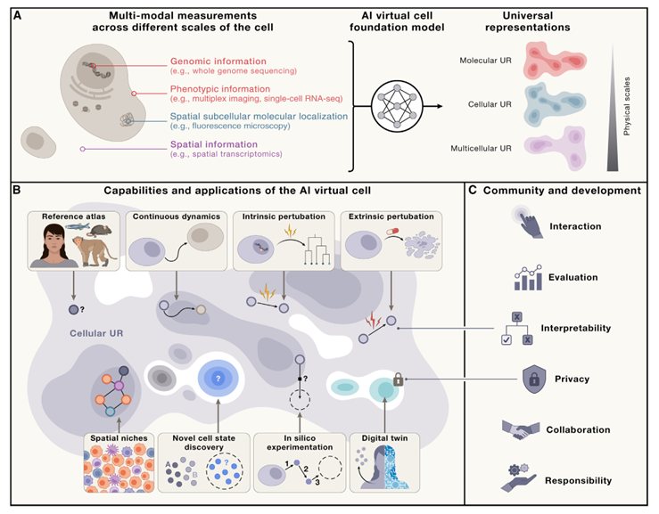
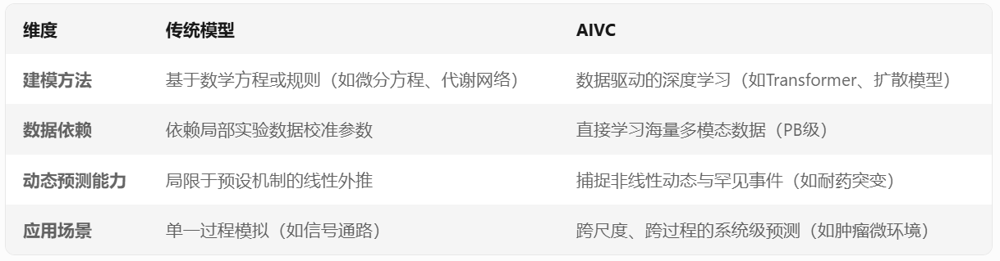
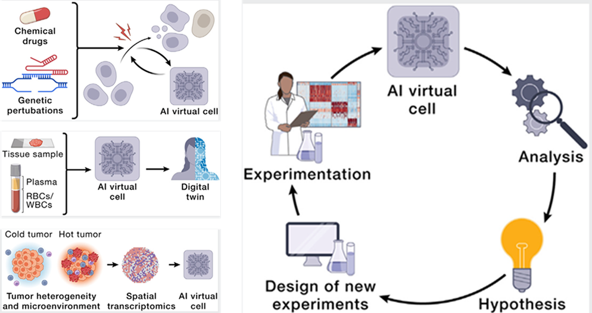
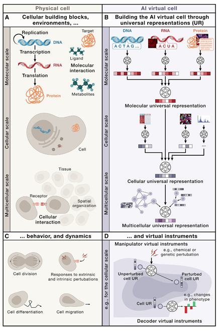

# 展望使用人工智能构建虚拟细胞
传统细胞模型在解析跨尺度生命活动（如分子互作网络到组织微环境动态耦合）时面临显著挑战，其简化假设难以捕捉生物系统的时空异质性和非线性动力学特征。针对这一瓶颈，《Cell》最新Perspective文章提出人工智能虚拟细胞（Artificial Intelligence Virtual Cell, AIVC）​的突破性框架。该框架通过集成多模态生物数据（包括单细胞多组学、超高分辨空间成像及动态蛋白质构象数据），用于构建首个可跨越埃米级分子结构到毫米级组织微环境的数字孪生模型。  

  

## 初窥AIVC
### AIVC是什么？
**AIVC（人工智能虚拟细胞，Artificial Intelligence Virtual Cell）​**​ 是一种基于人工智能技术的计算生物学模型，旨在通过数据驱动的方式，跨尺度模拟和预测细胞从分子到组织水平的动态行为。它整合了多模态生物数据（如基因组学、蛋白质组学、影像学）和深度学习算法，构建数字化的“细胞孪生体”，以突破传统模型的局限，推动生命科学研究和医学应用的革新。  

  

### AIVC的核心特性
**（1）​跨尺度建模：** 覆盖​埃米级（分子结构）到毫米级（组织微环境）的时空动态，例如同时模拟蛋白质构象变化（如AlphaFold预测的3D结构）与细胞迁移行为。融合​时间序列数据（如活细胞成像、单细胞测序时序分析），捕捉细胞分裂、分化或癌变的动态轨迹。  
**​（2）多模态数据融合：** 整合​单细胞多组学（scRNA-seq、空间转录组）、结构生物学数据（冷冻电镜、X射线晶体学）、生物物理参数​（膜电位、代谢通量）等，构建统一的“细胞状态表征空间”。  
**（3）​通用性与可迁移性：** 构建跨物种通用模型：从大肠杆菌到人类细胞，利用进化保守性原理迁移知识（如酵母细胞周期调控机制用于人类干细胞研究）。支持虚拟实验：模拟CRISPR编辑、药物扰动等操作，预测试验结果，减少实验室试错成本。

### AIVC与传统细胞模型的区别
  

### AIVC的关键技术支撑
**（1）​AI算法创新**。**​几何深度学习**：处理分子结构、细胞形态等几何数据（如等变神经网络）。**​生成式模型**：合成虚拟细胞状态（如扩散模型生成未观测的细胞分化路径）。**​联邦学习**：跨机构协作训练模型，保护数据隐私（如联合多家医院的单细胞数据库）。  
**（2）​高通量实验技术**。**​空间组学​**：解析细胞在组织中的空间定位与互作。**​冷冻电子断层扫描**​：捕获分子机器的动态构象变化。**​微流控活细胞成像**：实时记录细胞行为的高分辨率时序数据。  
**（3）​计算基础设施**。**​超算与量子计算**：加速分子动力学模拟（如百万原子系统纳秒级计算）。**​自动化实验平台**：机器人实验室与AIVC闭环验证（如自主优化实验方案）。  

### AIVC的应用场景
**（1）​药物研发**。**​虚拟筛选**：在计算机中测试10万种化合物组合，仅需数小时，成本降低90%（传统实验需数月）。**​毒性预测**：通过模拟肝脏细胞代谢路径，提前排除具有肝毒性的候选药物。  

**（2）​疾病机制解析**。**​癌症免疫逃逸**：整合肿瘤单细胞数据与免疫细胞互作网络，识别PD-1/PD-L1阻断疗法的耐药机制。**​神经退行性疾病**：模拟tau蛋白异常折叠的动力学过程，筛选抑制纤维形成的分子。

**（3）个性化医疗**。**​数字孪生患者**：基于个体基因组与病理数据，预测化疗响应（如卵巢癌患者的铂类药物敏感性）。**​细胞治疗设计**：优化CAR-T细胞的基因编辑方案，降低移植物抗宿主病（GVHD）风险。  

  

## 如何构建AIVC？
### 核心架构设计
AIVC的构建围绕两个核心组件展开：**​通用表征（UR）**​和**虚拟仪器（VI）**。UR是多模态、多尺度的嵌入表征，VIs则是操作UR的神经网络工具，分为**解码器**​和**操控器**​。   

  

### 分层建模策略
**（1）分子尺度**   
**数据输入**  
**​序列数据**：DNA、RNA、蛋白质的核苷酸/氨基酸序列。**​动态数据**：分子构象变化（如冷冻电镜捕捉的酶催化动态）。  
**​模型设计**  
​**语言模型驱动**：利用自然语言处理架构（如Transformer）处理生物序列，预测突变功能（如基因编辑效应）。**​几何深度学习**：等变神经网络处理分子结构数据，捕捉旋转平移不变性（如抗体-抗原结合位点预测）。**​混合建模**：结合分子动力学模拟与强化学习，预测药物-靶标结合自由能。  
**（2）细胞尺度**  
**数据输入**  
**​单细胞组学**：scRNA-seq、scATAC-seq、单细胞蛋白质组。**​成像数据**：活细胞动态成像（如T细胞迁移轨迹）、超分辨显微（如STED成像的线粒体网络）。  
**​模型设计**  
**​多模态对齐**：对比学习对齐转录组与形态学数据（如基因表达与细胞迁移速度相关性）。**​扩散模型生成**：模拟细胞状态演化（如造血干细胞分化为红细胞的分子开关）。**时空建模**：物理引擎模拟亚细胞结构动态（如细胞分裂时染色体分离的力学机制）。  
**（3）多细胞尺度**  
**数据输入**  ​
**​空间组学**：（解析细胞间通信网络）。**组织病理学**：H&E染色图像、3D类器官成像（如肿瘤微环境的空间异质性）。  
​**模型设计​**  
​**图神经网络**​：构建细胞互作图谱（如CAF细胞通过IL-6信号促进免疫逃逸）。**​点云与体素建模**：处理3D组织体积数据（如肝脏小叶的空间结构）。**​条件生成模型**：预测组织损伤后的再生响应（如肝切除后的代偿性增生）。  
### 虚拟仪器的功能实现
**（1）解码器**  ​
​**功能**：将UR转换为可解释输出。例如 **​细胞类型标注**：从UR预测CD8+ T细胞耗竭状态（如PD-1表达水平）。**​图像生成**：基于分子数据生成虚拟显微图像（分辨率媲美共聚焦显微镜）。  
​**（2）操控器**    ​
​**功能**：UR作为输入生成另一个输出UR，通过UR操作模拟扰动效应。例如模拟扰动后的细胞状态，**虚拟CRISPR编辑**：预测双基因敲除后的细胞凋亡阈值。**​药物响应预测**：模拟10万种药物组合对胰腺癌类器官的杀伤效果。  
### 数据与训练策略
**（1）数据整合原则**  
​**跨物种对齐**：利用进化保守性（如酵母与人类细胞周期调控网络的对比学习）。  
​**联邦学习框架**：保护隐私前提下联合多机构数据（如50家医院的单细胞数据库）。  
​**动态数据增强**：通过生成对抗网络（GANs）补全时间序列数据缺口（如细胞分裂的毫秒级成像）。  
**（​2）模型训练与优化**  
​**分层预训练**。​分子层：使用UniRef90数据集预训练蛋白质语言模型。​细胞层：基于Human Cell Atlas的3000万单细胞数据微调。​多细胞层：利用TCGA和HPA的空间组学数据联合训练。  
**​损失函数设计**。**​多任务学习**：联合优化结构预测（如RMSD误差）与功能预测（如基因表达相关性）。**​不确定性建模**：通过贝叶斯神经网络估计预测置信度（如药物毒性的风险评分）。  
### 验证与迭代
**（1）虚拟实验验证**  
​**跨尺度一致性**：验证分子突变（如KRAS G12D）如何逐级影响组织表型（如胰腺癌肝转移）。  
​**动态过程验证**：通过活细胞成像数据检验模型预测的细胞迁移轨迹。  
​**（2）真实实验闭环**   
​**自动化实验室**：AIVC与液体处理机器人联动，实现“预测-实验-反馈”闭环（如每周优化1000个基因编辑方案）。  
​**主动学习优化**：根据模型不确定性引导数据采集（如优先测序高变异基因）。  