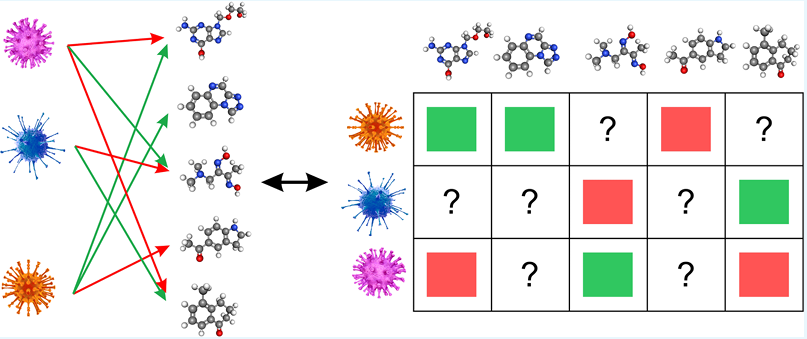
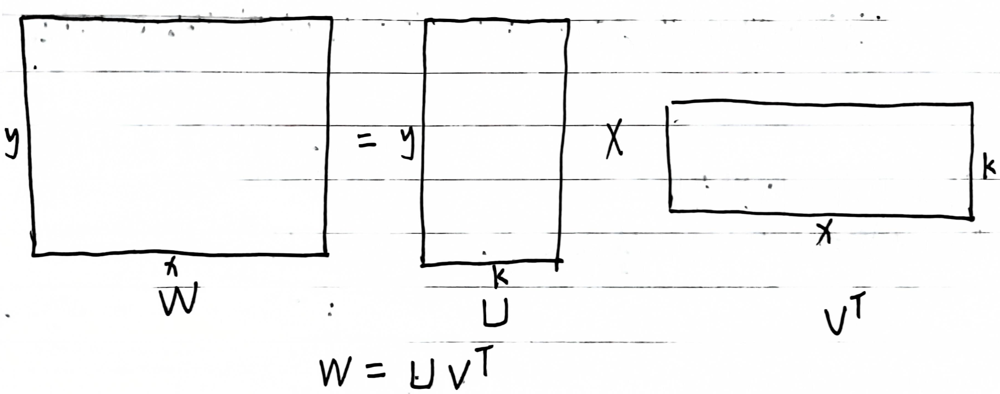
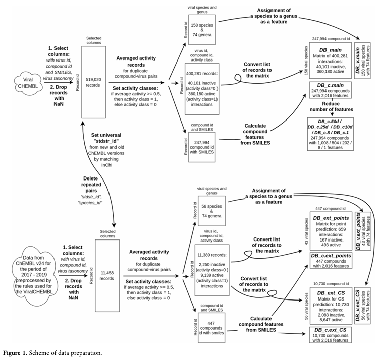
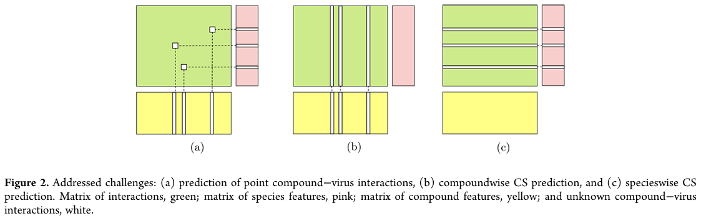
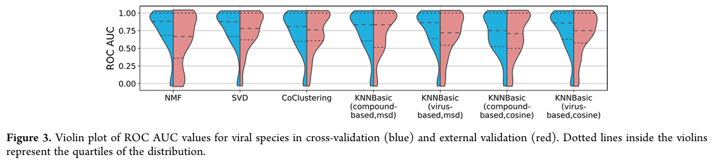
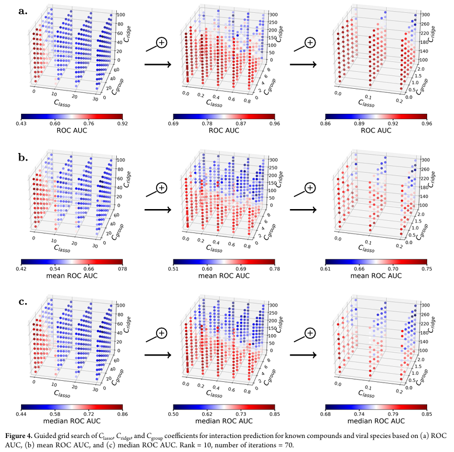
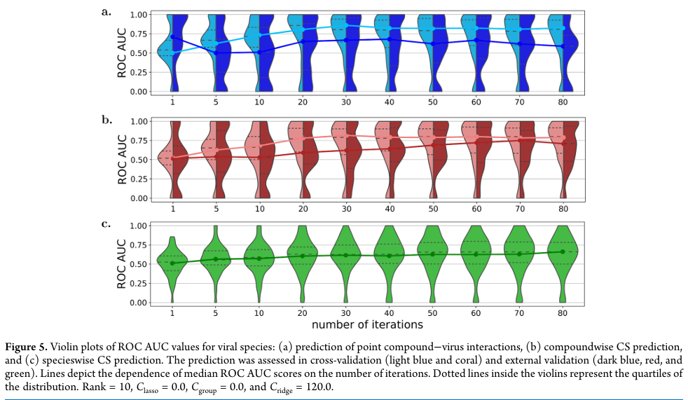
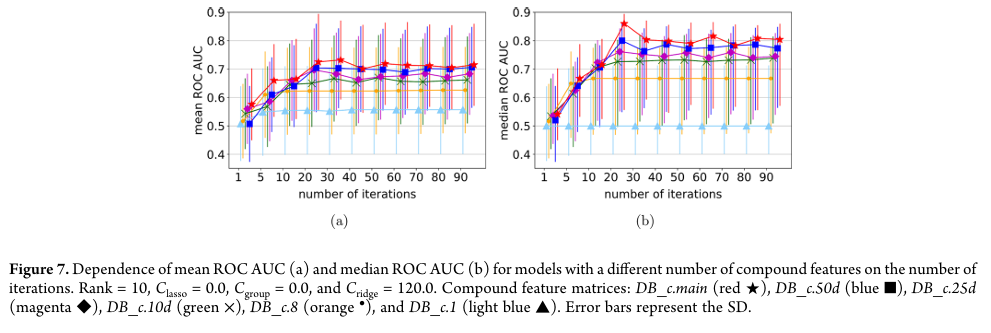

# 推荐系统|推荐系统算法用于抗病毒药物发现
最近感兴趣研究一下推荐系统算法。推荐系统在电子商务中发挥着至关重要的作用，通过分析用户行为和偏好，智能推荐个性化商品或服务，不仅提升用户体验，还能显著提高转化率和销售额，帮助企业实现精准营销与客户需求的高效匹配，它也有潜力成为一个有用的药物发现工具。本文使用推荐系统中的协同过滤算法和基于内容过滤算法对ChEMBL中化合物的抗病毒活性进行预测。交叉验证和外部测试均表明推荐系统的有效性。  
  
## 背景
多任务学习的优势在于它能够利用相关任务的额外信息来帮助预测那些信息不足的任务，从而不仅提升预测性能，还可以处理在药物研发领域中常见的小规模或不平衡数据集。推荐系统是基于多任务学习的常用方法之一，允许实现多任务预测（有时也被称为多目标预测）。  

推荐系统根据用于创建模型的信息不同，可分为协同过滤和基于内容的过滤。协同过滤简单易行，如果用户有相似的偏好，那么他们有相似的资料。协同过滤推荐系统模型根据对具有相似偏好资料的其他用户评估向用户推荐新内容。在药物发现中，协同过滤方法可能依赖于化合物或靶标相互作用之间的相似性来预测相互作用值并选择相互作用分值更高的化合物-靶标对。该方法容易实现但有很多局限性：（1）冷启动问题。无法计算新化合物或新靶标的相互作用的相似性，因此无法可靠地预测这些新化合物或新靶标的相互作用值。（2）稀疏性问题。已知的相互作用值越少，计算相似性就越困难。（3）扩展性问题。协同过滤算法的计算和内存复杂性通常是二次方的。  

基于内容的过滤推荐系统方法更为高级，能够基于化合物和靶标的额外特征信息（也称为辅助信息或边信息）预测相互作用值。基于内容过滤根据特征相似性评估，推荐与用户过去喜欢的项目相似的项目。药物发现中该方法可以利用化合物或靶标的特征或描述符的相似性。该方法可以弥补协同过滤的不足。此外，该方法一个重要优势是可以通过分析重要特征来解释模型。但是该方法可能发生过拟合，以及需要计算特征，尤其是在描述靶标时，特征计算可能相当复杂。  

推荐系统在药物发现中的应用其实不多，主要用于已批准药物的分析及其可能的副作用、药物重定位、药物相互作用、毒理基因组学预测或治疗建议。临床医学中推荐系统被用于改进治疗方案推荐。例如，推荐系统被用于自动检测用药清单中的遗漏条目，以及在信息过载问题的背景下，通过向临床医生推荐针对特定疾病的知识点来优化治疗方案。  

本文尝试将推荐系统方法用于抗病毒药物研发。主要聚焦三个问题：（1）考虑到数据稀疏性和靶标（病毒）的不寻常复杂性，推荐系统方法在抗病毒活性预测中的有效性如何？（2）哪种推荐系统方法能够提供更准确的预测？（3）能否针对未用于模型构建的新化合物或新病毒，获得可靠的预测结果？  
## 方法
### 推荐系统方法
协同过滤。使用了三种协同过滤方式操作相互作用矩阵。（1）K最近邻算法（KNN），基于化合物和病毒交互特征的相似性来识别邻居。（2）聚类算法，将化合物/病毒分组到共同的聚类中来识别邻域。即对矩阵行聚类，也对列聚类，并基于平均交互值生成预测。（3）矩阵分解算法。  

基于内容过滤。如下所示，将互作信息矩阵分解为用户矩阵和物品矩阵的乘积。W矩阵（y\*x）描述的是用户与物品之间的互作关系。U是一个y\*k的矩阵，该矩阵是用户的描述符，表示用户的特征。y是用户的数量，k是用户的特征维度。同理，V是一个x\*k的矩阵，该矩阵是物品的描述符，表示物品的特征。x是物品的数量，k是物品的特征维度。SGIMC算法基于诱导矩阵补全方法，通过结合侧特征和低秩矩阵补全交互矩阵的缺失值。同时使用稀疏组惩罚来选择重要特征。与传统矩阵分解相比，SGIMC提高了特征选择的准确度，减少了过拟合。    
   
### 数据准备
如下图，从ChEMBLv.20中提取抗病毒活性数据组成ViralChEMBL作为化合物-病毒相互作用信息的来源，使用这些数据进行训练，验证以及外部测试。此外还进行了化合物以及病毒的特征提取。  
  
### 预测场景
（1）对用于模型构建的化合物和病毒进行新相互作用预测：此场景的重点是预测训练数据集中已知化合物和已知病毒种类之间的未知相互作用。协同过滤算法仅依赖于相互作用矩阵，因此适用于此场景，但无法处理冷启动预测所需的辅助信息。

（2）对新化合物进行相互作用预测：在这一挑战中，需要对训练集中不存在的新化合物与已知病毒种类之间的相互作用进行预测。SGIMC（特征指导的相互作用矩阵补全）算法能够利用化合物和病毒的特征信息解决此问题。  

（3）对新病毒种类进行相互作用预测：此场景针对的是对训练集中未出现的新病毒种类与已知化合物之间的相互作用预测。SGIMC 算法通过整合化合物和病毒特征矩阵来解决这一挑战。  
  

此外还探究了特征数量对于模型性能的影响。  
### 性能评估
使用网格搜索优化算法的超参数。使用交叉验证和外部测试验证模型的性能。主要用到以下几种评测指标：  
（1）模型评估：ROC AUC 分数及其衍生指标；标准差（SD）；模型对比与中位数 ROC AUC。    
（2）模型稳健性评估：通过y-打乱法进行评估，将正常模型的中位数ROC AUC分数与基于y-打乱数据集的模型中位数ROC AUC分数进行比较。  
（3）模型适用性评估：通过训练集和测试集中化合物的相似性距离评估模型的适用性。基于化合物特征值计算训练集和测试集之间每对化合物的距离。  
## 结果
### 点交互预测（已知病毒与已知化合物间的潜在未知互作）
（1）协同过滤。  
**k最近邻（kNN）**：原理是相似化合物具有相似的相互作用。该方法依赖于相似性矩阵的计算。对于大型数据集，该方法复杂度较高（O($N^2$)）。基于化合物KNN具有较高的预测性能，但是计算成本高，资源有限时候可使用共聚类代替。  
**共聚类**：原理是通过对交互矩阵的行和列进行分组来比较交互配置文件，并补全缺失值。外部测试集上与KNN性能近似。所需资源少，时间短。  
**矩阵分解**：原理是通过识别化合物-病毒相互作用背后的潜在特征来解决矩阵补全问题。   
  

（2）基于内容过滤（SGIMC）。  
将化合物和病毒的特征向量引入矩阵补全框架中。通过结合外部特征和矩阵补全，表现出较好的鲁棒性。与 kNN 和矩阵分解方法相比，SGIMC 在计算效率和预测能力之间达成了较好的平衡，适用于具有丰富特征信息的场景。  
  
### 基于内容过滤的冷启动预测
冷启动问题是指当推荐系统应用于一个全新的化合物或病毒时，由于缺乏实验数据，系统的性能可能受到影响。这一问题在仅基于交互矩阵的协同过滤方法中尤为关键。为解决此问题，可以使用基于外部特征信息（如化合物和病毒特征）的内容过滤方法（如 SGIMC），以实现冷启动模式下的可靠预测。分为化合物层面的冷启动预测（新化合物）和病毒层面的冷启动预测（新病毒）。    
  
### 特征数量对模型性能的影响
矩阵中化合物特征信息存在冗余，因此假设即使随机移除部分特征，也不会显著降低预测质量。进行了一系列实验后发现随着特征数量的逐步减少至 50%、25% 和 10%，模型的预测质量略有下降，但幅度不大。当特征数量减少到仅剩 8 个时，模型的预测质量显著下降。  
  
## 参考文献
1. Sosnina E A, Sosnin S, Nikitina A A, et al. Recommender systems in antiviral drug discovery[J]. ACS omega, 2020, 5(25): 15039-15051.  