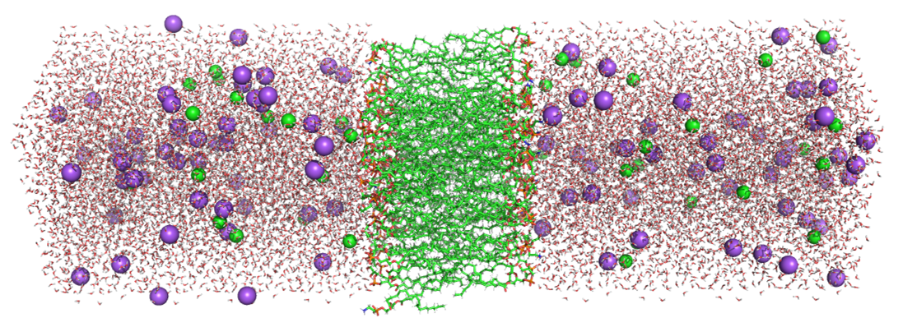
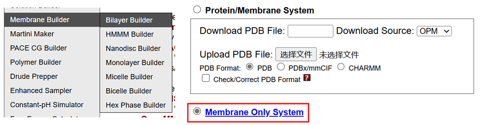
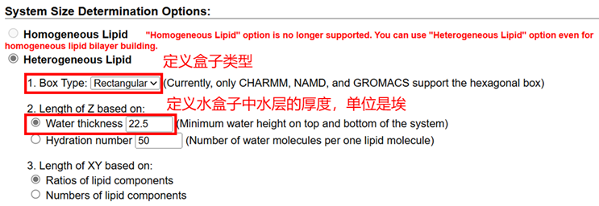
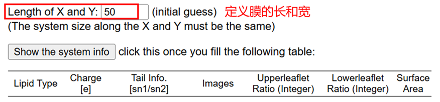
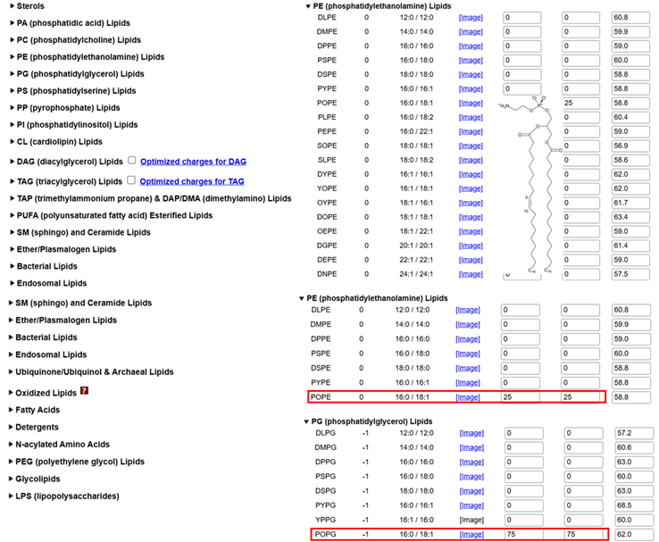
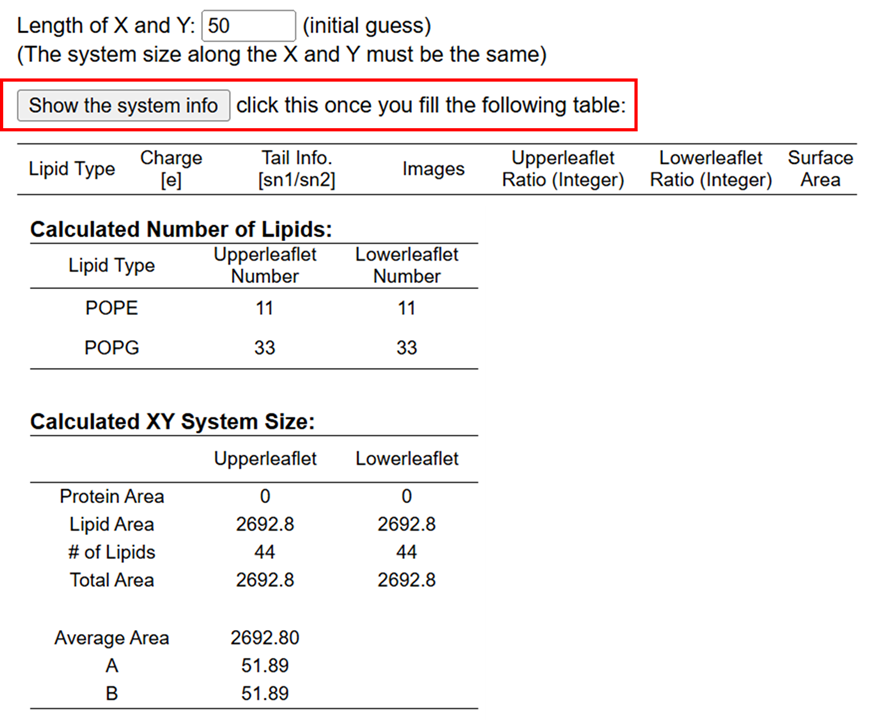

# 细胞膜体系动力学模拟：CHARMM-GUI构建脂质双分子层
细胞膜是生命活动的重要界面，其复杂的脂质双分子层结构在物质运输、信号传递以及细胞识别中发挥着核心作用。研究细胞膜的结构与动态行为，对于揭示细胞功能机制、药物分子与膜蛋白的相互作用以及膜相关疾病的分子机制具有重要意义。分子动力学模拟作为一种强大的计算工具，为研究细胞膜的分子组装、相行为以及与其他分子体系的相互作用提供了精准的视角。然而，细胞膜体系的构建因脂质种类的多样性和双分子层的复杂性，常常成为研究的技术瓶颈。  

CHARMM-GUI 是一个专为分子模拟研究设计的图形化用户界面工具，其强大的膜构建模块可以快速、高效地生成具有生物学相关性的脂质双分子层体系，并提供与主流分子动力学软件兼容的输入文件。通过 CHARMM-GUI 构建的细胞膜体系，研究者可以高效开展动力学模拟，深入探索细胞膜的物理化学特性及其与分子间的相互作用机制，为细胞膜相关领域的研究提供了极具价值的解决方案。本文将介绍使用 CHARMM-GUI 构建脂质双分子层的方法和技巧，帮助研究者快速上手并提升模拟效率。  

  

## 建模流程
（1）使用Membrane Builder模块中的Bilayer Builder构建脂质双分子层。  
  

（2）定义盒子尺寸以及膜成分比例。    
定义盒子类型以及水层的厚度：  
  

（3）定义膜的长和宽：  
  

（4）指定膜的组分，首先需要文献调研确定膜的组成成分以及比例。将鼠标放在脂质名称上面可以看到其化学结构。以革兰氏阳性菌的细胞膜为例，POPE/POPG：1/3。  
  

（5）显示膜的组成信息。进行上述设定之后，点击显示系统信息即可获得体系的组成成分信息。  
    

（6）然后加水，加离子，生成Gromacs兼容的参数，设置好index.ndx文件即可。  

## 准备膜体系模拟mdp文件
膜体系向来都是比较难平衡的。所以将其分成多个步骤进行一点点的放开限制进行平衡。直接用下述脚本 python do.py 生成即可：  
```python
import os
import shutil

class config:

    def __init__(self):

        self.time = 1000           # unit: ns
        self.frame_steps = 500000

def mdp_file():

    if os.path.exists(os.path.join(".", "mdp")):
        shutil.rmtree(os.path.join(".", "mdp"))
        os.makedirs(os.path.join(".", "mdp"))
    else:
        os.makedirs(os.path.join(".", "mdp"))

def step6_0_minimizationmdp():

    step6_0_mdp = open(os.path.join(".", "mdp", "step6.0_minimization.mdp"), "w")
    step6_0_mdp.write(
'''define                  = -DPOSRES -DPOSRES_FC_BB=4000.0 -DPOSRES_FC_SC=2000.0 -DPOSRES_FC_LIPID=1000.0 -DDIHRES -DDIHRES_FC=1000.0 
integrator              = steep
emtol                   = 1000.0
nsteps                  = 5000
nstlist                 = 10
cutoff-scheme           = Verlet
rlist                   = 1.2
vdwtype                 = Cut-off
vdw-modifier            = Force-switch
rvdw_switch             = 1.0
rvdw                    = 1.2
coulombtype             = PME
rcoulomb                = 1.2
;
constraints             = h-bonds
constraint_algorithm    = LINCS
nstxout                = 0          ; save coordinates to .trr every 250 steps
nstvout                = 0          ; don't save velocities to .trr
nstfout                = 0          ; don't save forces to .trr

nstxout-compressed     = 0      ; xtc compressed trajectory output every 500 steps
compressed-x-precision = 1000
nstlog                 = 500        ; update log file every 500 steps
nstenergy              = 500        ; save energies every 500 steps
nstcalcenergy          = 500                                           
'''
    )

def step6_1_equilibrationmdp():

    step6_1_mdp = open(os.path.join(".", "mdp", "step6.1_equilibration.mdp"), "w")
    step6_1_mdp.write(
'''define                  = -DPOSRES -DPOSRES_FC_BB=4000.0 -DPOSRES_FC_SC=2000.0 -DPOSRES_FC_LIPID=1000.0 -DDIHRES -DDIHRES_FC=1000.0 
integrator              = md
dt                      = 0.001
nsteps                  = 125000
;nstxtcout               = 0
nstvout                 = 0
nstfout                 = 0
nstcalcenergy           = 1000
nstenergy               = 10000
nstlog                  = 10000
nstxout-compressed     = 0      ; xtc compressed trajectory output every 5000 steps
compressed-x-precision = 1000       ; precision with which to write to the compressed trajectory file
;
cutoff-scheme           = Verlet
nstlist                 = 20
rlist                   = 1.2
vdwtype                 = Cut-off
vdw-modifier            = Force-switch
rvdw_switch             = 1.0
rvdw                    = 1.2
coulombtype             = PME
rcoulomb                = 1.2
;
tcoupl                  = berendsen
tc_grps                 = MEMB SOLV
tau_t                   = 1.0 1.0
ref_t                   = 310.15 310.15
;
constraints             = h-bonds
constraint_algorithm    = LINCS
;
nstcomm                 = 100
comm_mode               = linear
comm_grps               = MEMB SOLV
;
gen-vel                 = yes
gen-temp                = 310.15
gen-seed                = -1
'''
    )

def step6_2_equilibrationmdp():

    step6_2_mdp = open(os.path.join(".", "mdp", "step6.2_equilibration.mdp"), "w")
    step6_2_mdp.write(
'''define                  = -DPOSRES -DPOSRES_FC_BB=2000.0 -DPOSRES_FC_SC=1000.0 -DPOSRES_FC_LIPID=400.0 -DDIHRES -DDIHRES_FC=400.0 
integrator              = md
dt                      = 0.001
nsteps                  = 125000
;nstxtcout               = 0
nstvout                 = 0
nstfout                 = 0
nstcalcenergy           = 1000
nstenergy               = 10000
nstlog                  = 10000
nstxout-compressed     = 0      ; xtc compressed trajectory output every 5000 steps
compressed-x-precision = 1000       ; precision with which to write to the compressed trajectory file
;
cutoff-scheme           = Verlet
nstlist                 = 20
rlist                   = 1.2
vdwtype                 = Cut-off
vdw-modifier            = Force-switch
rvdw_switch             = 1.0
rvdw                    = 1.2
coulombtype             = PME
rcoulomb                = 1.2
;
tcoupl                  = berendsen
tc_grps                 = MEMB SOLV
tau_t                   = 1.0 1.0
ref_t                   = 310.15 310.15
;
constraints             = h-bonds
constraint_algorithm    = LINCS
continuation            = yes
;
nstcomm                 = 100
comm_mode               = linear
comm_grps               = MEMB SOLV
'''
    )

def step6_3_equilibrationmdp():

    step6_3_mdp = open(os.path.join(".", "mdp", "step6.3_equilibration.mdp"), "w")
    step6_3_mdp.write(
'''define                  = -DPOSRES -DPOSRES_FC_BB=1000.0 -DPOSRES_FC_SC=500.0 -DPOSRES_FC_LIPID=400.0 -DDIHRES -DDIHRES_FC=200.0 
integrator              = md
dt                      = 0.001
nsteps                  = 125000
;nstxtcout               = 0
nstvout                 = 0
nstfout                 = 0
nstcalcenergy           = 1000
nstenergy               = 10000
nstlog                  = 10000
nstxout-compressed     = 0      ; xtc compressed trajectory output every 5000 steps
compressed-x-precision = 1000       ; precision with which to write to the compressed trajectory file
;
cutoff-scheme           = Verlet
nstlist                 = 20
rlist                   = 1.2
vdwtype                 = Cut-off
vdw-modifier            = Force-switch
rvdw_switch             = 1.0
rvdw                    = 1.2
coulombtype             = PME
rcoulomb                = 1.2
;
tcoupl                  = berendsen
tc_grps                 = MEMB SOLV
tau_t                   = 1.0 1.0
ref_t                   = 310.15 310.15
;
pcoupl                  = berendsen
pcoupltype              = semiisotropic
tau_p                   = 5.0
compressibility         = 4.5e-5  4.5e-5
ref_p                   = 1.0     1.0
refcoord_scaling        = com
;
constraints             = h-bonds
constraint_algorithm    = LINCS
continuation            = yes
;
nstcomm                 = 100
comm_mode               = linear
comm_grps               = MEMB SOLV
'''
    )

def step6_4_equilibrationmdp():

    step6_4_mdp = open(os.path.join(".", "mdp", "step6.4_equilibration.mdp"), "w")
    step6_4_mdp.write(
'''define                  = -DPOSRES -DPOSRES_FC_BB=500.0 -DPOSRES_FC_SC=200.0 -DPOSRES_FC_LIPID=200.0 -DDIHRES -DDIHRES_FC=200.0 
integrator              = md
dt                      = 0.002
nsteps                  = 250000
;nstxtcout               = 0
nstvout                 = 0
nstfout                 = 0
nstcalcenergy           = 1000
nstenergy               = 10000
nstlog                  = 10000
nstxout-compressed     = 0      ; xtc compressed trajectory output every 5000 steps
compressed-x-precision = 1000       ; precision with which to write to the compressed trajectory file
;
cutoff-scheme           = Verlet
nstlist                 = 20
rlist                   = 1.2
vdwtype                 = Cut-off
vdw-modifier            = Force-switch
rvdw_switch             = 1.0
rvdw                    = 1.2
coulombtype             = PME
rcoulomb                = 1.2
;
tcoupl                  = berendsen
tc_grps                 = MEMB SOLV
tau_t                   = 1.0 1.0
ref_t                   = 310.15 310.15
;
pcoupl                  = berendsen
pcoupltype              = semiisotropic
tau_p                   = 5.0
compressibility         = 4.5e-5  4.5e-5
ref_p                   = 1.0     1.0
refcoord_scaling        = com
;
constraints             = h-bonds
constraint_algorithm    = LINCS
continuation            = yes
;
nstcomm                 = 100
comm_mode               = linear
comm_grps               = MEMB SOLV
'''
    )

def step6_5_equilibrationmdp():

    step6_5_mdp = open(os.path.join(".", "mdp", "step6.5_equilibration.mdp"), "w")
    step6_5_mdp.write(
'''define                  = -DPOSRES -DPOSRES_FC_BB=200.0 -DPOSRES_FC_SC=50.0 -DPOSRES_FC_LIPID=40.0 -DDIHRES -DDIHRES_FC=100.0 
integrator              = md
dt                      = 0.002
nsteps                  = 250000
;nstxtcout               = 0
nstvout                 = 0
nstfout                 = 0
nstcalcenergy           = 1000
nstenergy               = 10000
nstlog                  = 10000
nstxout-compressed     = 0      ; xtc compressed trajectory output every 5000 steps
compressed-x-precision = 1000       ; precision with which to write to the compressed trajectory file
;
cutoff-scheme           = Verlet
nstlist                 = 20
rlist                   = 1.2
vdwtype                 = Cut-off
vdw-modifier            = Force-switch
rvdw_switch             = 1.0
rvdw                    = 1.2
coulombtype             = PME
rcoulomb                = 1.2
;
tcoupl                  = berendsen
tc_grps                 = MEMB SOLV
tau_t                   = 1.0 1.0
ref_t                   = 310.15 310.15
;
pcoupl                  = berendsen
pcoupltype              = semiisotropic
tau_p                   = 5.0
compressibility         = 4.5e-5  4.5e-5
ref_p                   = 1.0     1.0
refcoord_scaling        = com
;
constraints             = h-bonds
constraint_algorithm    = LINCS
continuation            = yes
;
nstcomm                 = 100
comm_mode               = linear
comm_grps               = MEMB SOLV
'''
    )

def step6_6_equilibrationmdp():

    step6_6_mdp = open(os.path.join(".", "mdp", "step6.6_equilibration.mdp"), "w")
    step6_6_mdp.write(
'''define                  = -DPOSRES -DPOSRES_FC_BB=50.0 -DPOSRES_FC_SC=0.0 -DPOSRES_FC_LIPID=0.0 -DDIHRES -DDIHRES_FC=0.0 
integrator              = md
dt                      = 0.002
nsteps                  = 250000
;nstxtcout               = 0
nstvout                 = 0
nstfout                 = 0
nstcalcenergy           = 1000
nstenergy               = 1000
nstlog                  = 1000
nstxout-compressed     = 0      ; xtc compressed trajectory output every 5000 steps
compressed-x-precision = 1000       ; precision with which to write to the compressed trajectory file
;
cutoff-scheme           = Verlet
nstlist                 = 20
rlist                   = 1.2
vdwtype                 = Cut-off
vdw-modifier            = Force-switch
rvdw_switch             = 1.0
rvdw                    = 1.2
coulombtype             = PME
rcoulomb                = 1.2
;
tcoupl                  = berendsen
tc_grps                 = MEMB SOLV
tau_t                   = 1.0 1.0
ref_t                   = 310.15 310.15
;
pcoupl                  = berendsen
pcoupltype              = semiisotropic
tau_p                   = 5.0
compressibility         = 4.5e-5  4.5e-5
ref_p                   = 1.0     1.0
refcoord_scaling        = com
;
constraints             = h-bonds
constraint_algorithm    = LINCS
continuation            = yes
;
nstcomm                 = 100
comm_mode               = linear
comm_grps               = MEMB SOLV
'''
    )

def step7_productionmdp(time, frame_steps):

    nsteps = int(time*1000000/2)

    prod_mdp = open(os.path.join(".", "mdp", "step7_production.mdp"), "w")
    prod_mdp.write(
'''integrator              = md
dt                      = 0.002
nsteps                  = {0}
nstxout                 = 0
nstvout                 = 0
nstfout                 = 0
nstcalcenergy           = 1000
nstenergy               = {1}
nstlog                  = {1}
nstxout-compressed     = {1}      ; xtc compressed trajectory output every 5000 steps
compressed-x-precision = 1000       ; precision with which to write to the compressed trajectory file
;
cutoff-scheme           = Verlet
nstlist                 = 20
rlist                   = 1.2
vdwtype                 = Cut-off
vdw-modifier            = Force-switch
rvdw_switch             = 1.0
rvdw                    = 1.2
coulombtype             = PME
rcoulomb                = 1.2
;
tcoupl                  = V-rescale
tc_grps                 = MEMB SOLV
tau_t                   = 1.0 1.0
ref_t                   = 310.15 310.15
;
pcoupl                  = Parrinello-Rahman
pcoupltype              = semiisotropic
tau_p                   = 5.0
compressibility         = 4.5e-5  4.5e-5
ref_p                   = 1.0     1.0
;
constraints             = h-bonds
constraint_algorithm    = LINCS
continuation            = yes
;
nstcomm                 = 100
comm_mode               = linear
comm_grps               = MEMB SOLV
'''.format(nsteps, frame_steps)
    )

def run():

    settings = config()
    mdp_file()
    step6_0_minimizationmdp()
    step6_1_equilibrationmdp()
    step6_2_equilibrationmdp()
    step6_3_equilibrationmdp()
    step6_4_equilibrationmdp()
    step6_5_equilibrationmdp()
    step6_6_equilibrationmdp()
    step7_productionmdp(settings.time, settings.frame_steps)                                                                           

def main():

    run()

if __name__=="__main__":
    main()
```

## 准备跑模拟的提交脚本文件
提交模拟脚本文件的 job.sh 如下所示：  
```shell
init=step5_input
rest_prefix=step5_input
mini_prefix=step6.0_minimization
prod_prefix=step7_production
prod_step=step7

# Minimization
mkdir em
cd em
gmx grompp -f ../mdp/${mini_prefix}.mdp -o ${mini_prefix}.tpr -c ../${init}.gro -r ../${rest_prefix}.gro -p ../topol.top -n ../index.ndx -maxwarn 4
gmx mdrun -s ${mini_prefix}.tpr -deffnm ${mini_prefix} -nb gpu -gpu_id 0 -ntmpi 1
cd ..

## Equilibration
mkdir equil
cd equil
cnt=1
cntmax=6
cp ../em/${mini_prefix}.gro .
while [ `echo "${cnt} <= ${cntmax}" |bc` -eq 1 ]
do
    pcnt=`echo "${cnt}-1"|bc`
    if [ `echo "${cnt} == 1" |bc` -eq 1 ];then pstep=${mini_prefix};else pstep=step6.${pcnt}_equilibration;fi

    gmx grompp -f ../mdp/step6.${cnt}_equilibration.mdp -o step6.${cnt}_equilibration.tpr -c ${pstep}.gro -r ${pstep}.gro -p ../topol.top -n ../index.ndx -maxwarn 4
    gmx mdrun -s step6.${cnt}_equilibration.tpr -deffnm step6.${cnt}_equilibration -nb gpu -bonded gpu -gpu_id 0 -pme gpu -ntmpi 1
    cnt=`echo "${cnt}+1"|bc`
done
cd ..

# Production
mkdir prod
cd prod
cnt=1
cntmax=1
cp ../equil/step6.6_equilibration.gro .
while [ `echo "${cnt} <= ${cntmax}" |bc` -eq 1 ]
do
    pcnt=`echo "${cnt}-1"|bc`
    istep=${prod_step}_${cnt}
    pstep=${prod_step}_${pcnt}

    if [ `echo "${cnt} == 1" |bc` -eq 1 ];then
        pstep=step6.6_equilibration
        gmx grompp -f ../mdp/${prod_prefix}.mdp -o ${istep}.tpr -c ${pstep}.gro -r ${pstep}.gro -p ../topol.top -n ../index.ndx -maxwarn 4
    else
        gmx grompp -f ../mdp/${prod_prefix}.mdp -o ${istep}.tpr -c ${pstep}.gro -r ${pstep}.gro -t ${pstep}.cpt -p ../topol.top -n ../index.ndx -maxwarn 4
    fi
    gmx mdrun -s ${istep}.tpr -deffnm ${istep} -nb gpu -bonded gpu  -gpu_id 0 -pme gpu -ntmpi 1 -nsteps 500000000
    cnt=`echo "${cnt}+1"|bc`
done
cd ..
```

## 参考
1. [Step2_generate_mdp.py](./细胞膜体系动力学模拟CHARMM-GUI构建脂质双分子层/Step2_generate_mdp.py)  
2. [Step3_generate_submit_sh.py](./细胞膜体系动力学模拟CHARMM-GUI构建脂质双分子层/Step3_generate_submit_sh.py)  