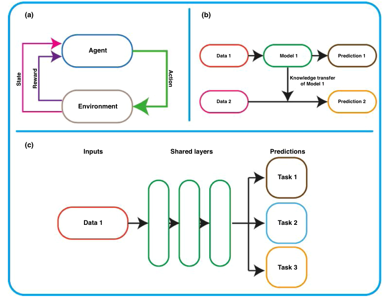
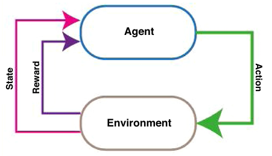
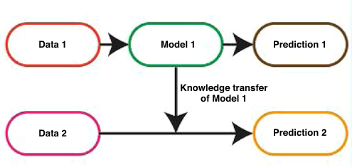
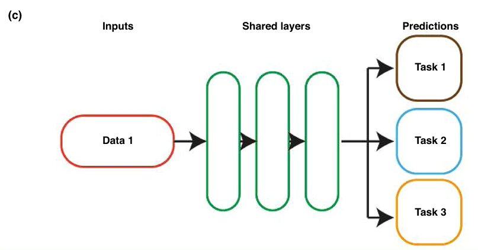

# 药物发现中先进的机器学习技术综述
机器学习在药物发现领域取得了显著成果，但其仍有数据需求量大；数据稀疏性和缺乏可解释的局限性。这篇综述中介绍了强化学习，迁移学习，多任务学习，贝叶斯网络，可解释性算法，混合量子机器学习和推荐系统等技术用于克服这些局限并举例说明了它们在药物发现中的应用。**这里概览一下这些技术，后面会仔细调研以及学习理解一下这些技术的基础原理以及应用实例。从细微处入手尽量将自己的专业做的专业。**    
  
## 背景
机器学习的成功在于它能够从复杂和大规模数据集中辨识出模式。机器学习的目标是减少药物发现过程中的资源和劳动密集度，尤其是高通量筛选（HTS）技术的高成本。另一个目标是通过机器学习避免动物实验。  

传统的机器学习技术包括监督学习和无监督学习，如k近邻（kNN）、决策树、随机森林、支持向量机（SVM）、人工神经网络（ANN）、主成分分析（PCA）和k均值聚类等。这些传统方法简单，底层机制易理解，计算需求低。但是它们在处理高维空间数据时候容易出现维度灾难。机器学习的子集深度学习在处理结构化和非结构化数据方面很有优势，能够处理大数据以及高维度数据。机器学习和深度学习受到了广泛关注。  

该综述中重点介绍了除了上述之外的具有强大潜力的先进技术。包括强化学习，迁移学习，多任务学习，贝叶斯网络，可解释性算法，混合量子机器学习和推荐系统。  
## 强化学习
强化学习的独特之处在于，它是一种持续学习的形式，同时也是自我学习的。与监督学习和无监督学习不同，强化学习算法生成判断，而不是仅仅做出预测。**最吸引人的是强化学习能够在最少的人类干预下持续学习，这使得它非常有前景。**  

强化学习中，系统并不会直接给出目标策略，而是通过与环境的互动，基于奖励信号来经验性地学习最佳决策。强化学习的主要组成部分包括代理（agent）、环境（environment）、状态（state）、策略（policy）和奖励函数（reward function）。代理通过与环境互动进行训练，环境可以有多个状态（即不同的情景）。代理会为给定状态选择一个行动，并根据行动获得正向或负向的奖励（即惩罚）。代理会继续在每个不同的状态下采取行动，旨在增加其获得的累计奖励。强化学习的现代应用主要集中在新分子设计或分子优化，还被应用于“组学”研究、生物影像学和其他医学研究等。如下图。  
   
## 迁移学习
迁移学习是一种应对数据不足的有效技术。它的基本思想是将从一个任务中获得的知识转移到另一个相关任务上，帮助解决数据匮乏的问题。近年来，迁移学习在医学影像分类等领域得到了广泛应用。迁移学习的关键在于通过转移知识来改进新任务的学习。

深度学习中模型学习的权重先在大数据集上进行训练，然后再转移到与之相关的任务中进行建模。这一方法已被证明能比传统的机器学习技术在较小数据集上训练的模型有更好的表现。迁移学习的优势还在于其部署速度，因其优化过程已经在原任务中完成。迁移学习假设大数据集中的预测特征可以应用到一个不同但相关的任务中。迁移学习已被用于预测多发性骨髓瘤患者的药物敏感性，药物不良反应的识别，全新药物分子设计等。如下图。  
    
## 多任务学习
多任务学习是在同一个模型中同时学习不同任务。研究表明多个相关任务同时学习能够显著提升预测性能，而单独学习每个任务则难以达到同样的效果。多任务学习的优势在于它对低数据量和高噪声数据集特别有效。  

在多任务学习中，模型通过共享特征来优化多个损失函数，从而实现任务之间的归纳知识转移。这种共享信息的能力帮助模型在多个任务上实现更好的泛化能力。多任务学习有以下几个方面的优势：（1）数据放大效应：通过共享信息，不同任务的数据相互补充，从而有效扩大了数据集的信息量。（2）特征筛选：多任务学习有助于从多任务数据中区分相关和不相关的特征，尤其是在数据稀少或噪声显著的情况下。（3）减少偏差与过拟合：由于多个任务协同学习，共享的信息能够帮助模型减少偏差，并避免过拟合到某些特定特征。多任务学习已被成功应用于解决多靶点药物的问题。如下图。  
    
## 主动学习
主动学习是一种独特的半自动化机器学习方法，旨在通过用户反馈来解决标注数据不足的问题。主动学习特别适用于无监督数据丰富但标注代价高昂的数据集。在这种方法中研究者只需对一小部分数据进行实验和标注，其余未标注数据则通过主动学习模型进行预测。  
## 生成模型
生成模型是能够生成新数据样本的机器学习技术，其可单独使用，也可以与其他技术结合（如在强化学习的全新药物设计中使用）。与判别模型不同，生成模型直接从输入数据中学习，并通过估计数据分布的概率来生成新样本，而无需显式的编码规则。主要用于全新药物分子设计。  
## 贝叶斯神经网络
贝叶斯神经网络是一种集成模型，通过贝叶斯推理将多个神经网络模型结合在一起。与传统神经网络不同，BNN能够处理小规模数据集，并通过独特的方式**避免过拟合**问题，这使其在需要高鲁棒性和小数据情况下表现优异。贝叶斯神经网络有以下几个特点：（1）避免了过拟合。贝叶斯神经网络通过在训练中使用先验概率分布计算多个模型的平均值，从而对网络进行正则化。这种方法使得神经元的权重和偏置不再是单一值，而是来源于一个不断更新的分布。（2）稳健性与精确性。BNN的权重和偏置是概率分布，这种不确定性建模方式增强了模型对新数据的预测能力，尤其是在数据稀疏的情况下。（3）尽管BNN能够应对传统神经网络的一些不足，但其设计复杂性较高，训练过程也更为耗时。此外，为网络设计有效的先验分布可能需要显著的编程经验和领域知识。可用于分子活性预测，抗癌基因识别和分子类药性预测中。   
## 混合量子-机器学习技术
混合量子-机器学习结合了量子计算和机器学习技术，已成为一种强大的预测分析工具。量子计算的主要优势在于其能够高效地解决传统计算机难以处理的复杂问题。在经典计算模型中，处理器计算的是二进制比特（0或1）；而在量子计算中，量子比特可以处于0和1的叠加态。量子逻辑门与传统逻辑门不同，其可逆性不仅防止信息丢失，还能实现更快的分析速度和更低的能耗。量子比特和量子门是量子电路的基本组成部分，能够在某些任务上以比经典计算机快数倍甚至指数级的速度完成计算。目前，混合量子-机器学习尚无统一的定义，但通常包括以下两种方式：（1）使用量子计算机执行机器学习算法。（2）将量子信息处理引入机器学习算法中。  
## 推荐系统
推荐系统是一种基于用户和产品之间关联数据的机器学习框架。推荐系统的应用广泛，尤其在电子商务领域通过提高用户满意度来促进销售。推荐系统的优势包括：（1）能够处理稀疏数据。（2）在缺乏先验信息时仍能进行预测。（3）具有透明性，能够解释推荐决策的来源。推荐系统已经被探索用于医疗领域，例如根据患者病史推荐最合适的治疗方案。在药物发现中，推荐系统的应用尚处于早期阶段。   
## 参考
1. Elbadawi M, Gaisford S, Basit A W. Advanced machine-learning techniques in drug discovery[J]. Drug Discovery Today, 2021, 26(3): 769-777.  