# 蛋白-配体小分子动力学模拟：完全使用CHARMM-GUI建模
之前几篇文章介绍了多种蛋白-配体分子动力学建模方式。包括：[蛋白-配体小分子动力学模拟：蛋白使用pdb2gmx 14sb，小分子使用antechamber生成力场参数](https://mp.weixin.qq.com/s/6sapf8OH2KlLeV4I4ohsCg)；[蛋白-配体小分子动力学模拟：蛋白使用pdb2gmx charmm36，小分子使用cgenff生成力场参数](https://mp.weixin.qq.com/s/tUzBB9eQRDQHMnC7uaI_yA)；[蛋白-配体小分子动力学模拟：蛋白使用pdb2gmx charmm36，小分子使用swissparm生成的MMFF94力场参数](https://mp.weixin.qq.com/s/O7vRQ5AHHSrNtDAoCsiZWw)；[蛋白-配体小分子动力学模拟：蛋白使用pdb2gmx charmm36，小分子使用MATCH生成力场参数（Gromacs版）](https://mp.weixin.qq.com/s/DMMZ7kOgD8uWidgyHH6NTQ)等。上述几篇文章在建模时候均是使用了包括Gromacs，VMD和SwissParam在内的多种软件辅助建模，这些方式使用本地软件或者调用命令行建模非常有利于后续创建脚本集合进行自动化建模以及批量执行。但是这些方式对于新手来说要求较高，需要熟练的掌握多种软件技能。为此本文介绍CHARMM-GUI一站式进行蛋白-配体小分子体系的动力学模拟建模。  

CHARMM-GUI是一个能够通过交互方式为复杂体系准备分子动力学模拟输入文件的网络平台。该平台中集成了多个功能模块，可用于构建广泛的分子模拟体系。目前它已支持多种主流模拟软件的建模文件准备：Gromacs，NAMD，Amber，OpenMM和CHARMM等。该建模方式方便操作，值得入门学习。    


## 文件准备
这里以 PDBid:2BQV 的蛋白配体复合物晶体结构为例进行CHARMM-GUI的建模演示。（1）从RCSB数据库中下载该复合物结构。（2）Pymol中将复合物结构中的蛋白部分单独保存为 protein.pdb 文件。（3）复合物中配体一般是不带氢的并且有的单双键模糊，所以需要在pymol中的编辑模式下将配体结构进行修改保证配体结构的正确性，修改前后结构如下所示：  
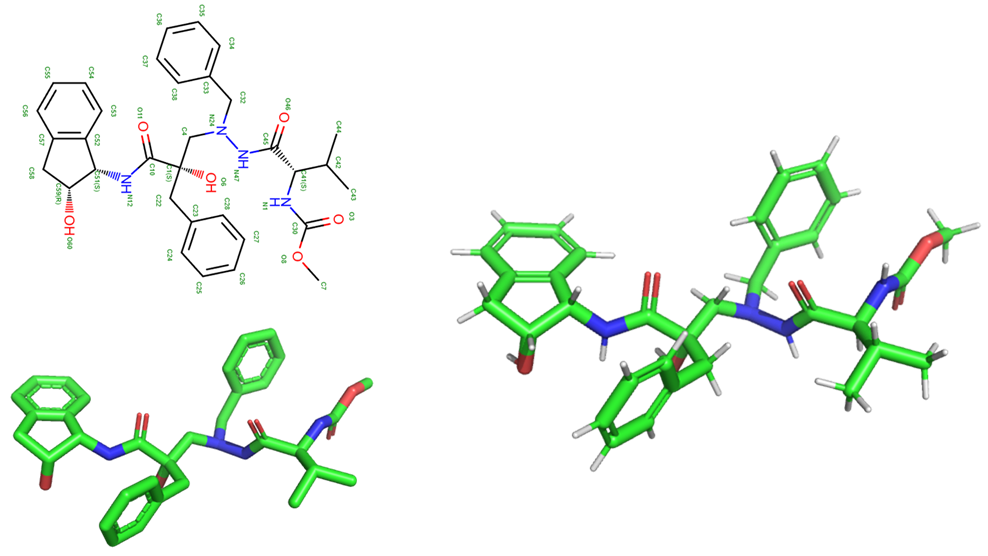  
（4）将修改之后结构正确的配体结构保存为lig.mol2文件。  

## 使用Ligand Reader & Modeler生成配体力场文件
（1）打开CHARMM-GUI的Ligand Reader & Modeler模块。  
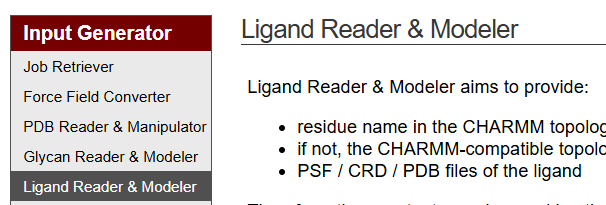  
（2）将前述文件准备中的lig.mol2上传该模块并下一步生成该配体分子的力场文件。  
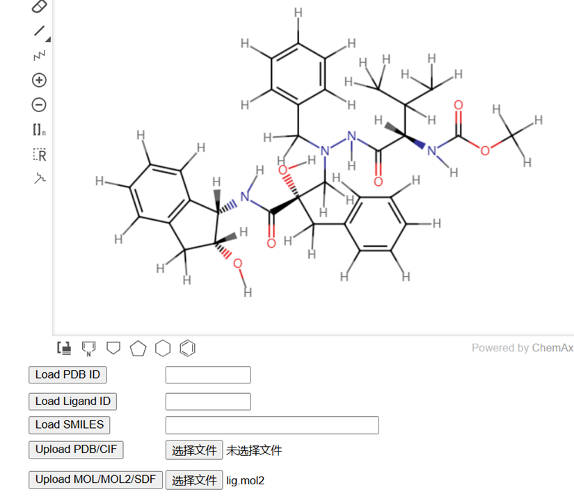  
（3）下载配体的力场文件，后续用到的文件如下图中红框框出来的文件所示：  
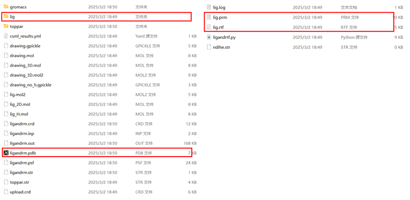  

## 使用Solution Builder生成gmx所需的模拟输入文件
（1）合并蛋白配体形成复合物文件。**为了保证复合物中配体原子与力场中原子一致性。这里必须是将配体力场文件中的ligandrm.pdb加到蛋白文件中形成复合物文件。** 将ligandrm.pdb中所有原子行复制到protein.pdb文件末尾即可。形成下图复合物结构：  
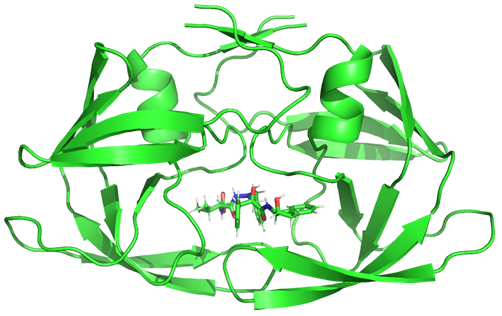    
（2）打开CHARMM-GUI网站的Solution Builder进行建模。  
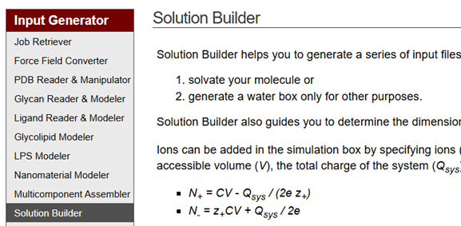  
（3）上传（1）中准备完成的复合物结构文件并下一步。  
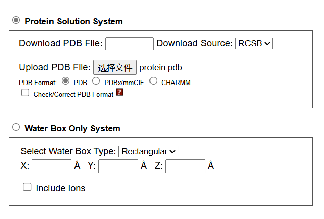  
（4）将配体部分也选中并下一步。  
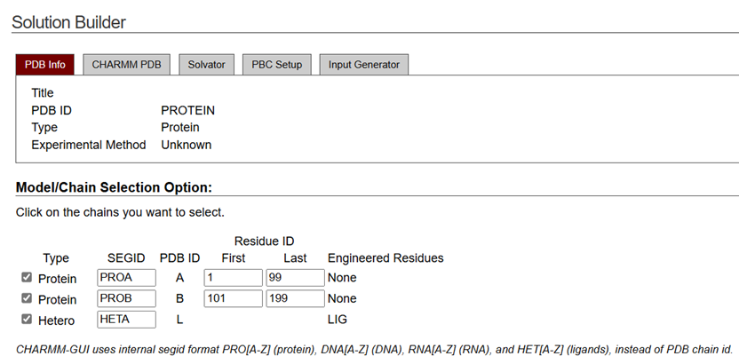  
（5）这一步是关键，将前述配体力场中的rtf文件和prm文件对应上传，其他选项视情况而定并下一步。如下图：  
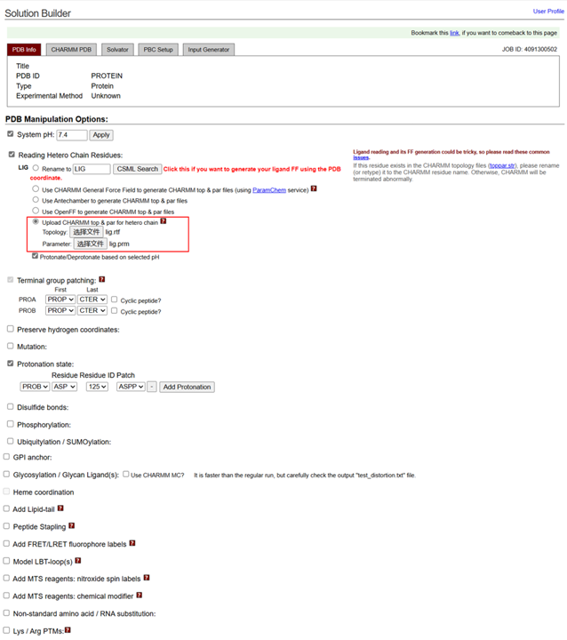  
（6）加水加离子并下一步。  
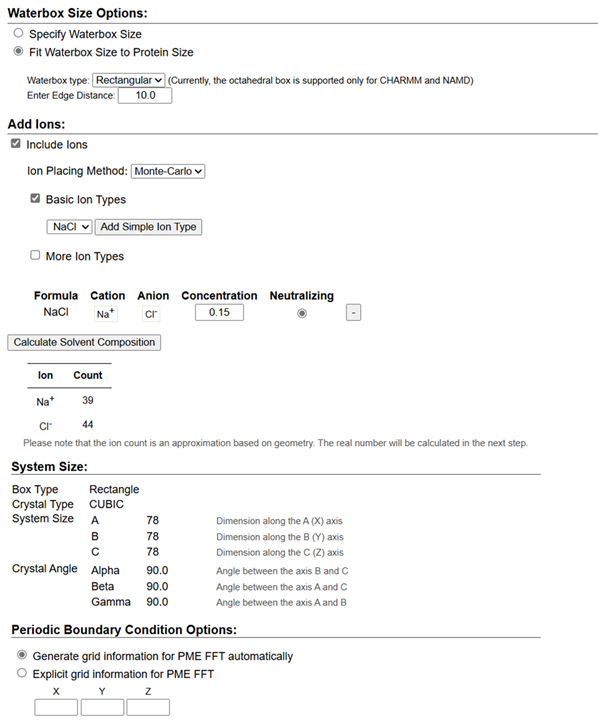  
（7）生成与md软件适配的建模文件用于模拟，这里选择GROMACS，其他用户视情况而定。  
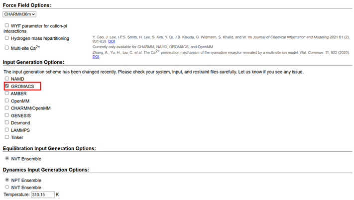  
（8）下载Gromacs模拟所需文件。  
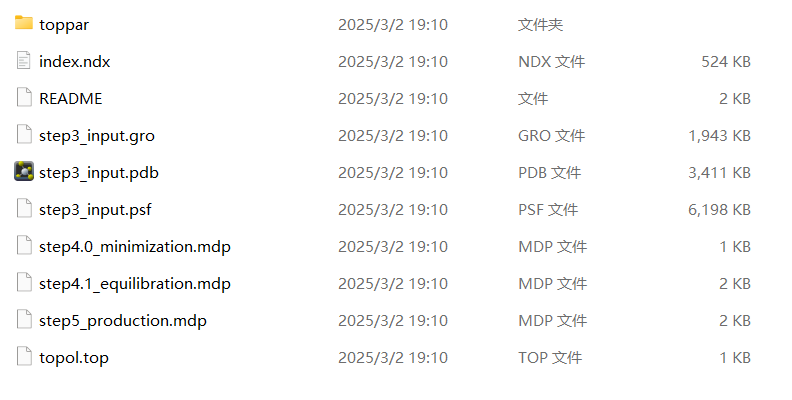  

## 准备模拟所需的mdp文件
上述Solution Builder准备时候生成的其实有mdp文件，但是我个人一般倾向使用之前自己经常使用的mdp文件，用户可视情况而定。我这里使用的mdp文件由下述脚本 python Step2_generate_mdp.py 生成。   
```python
import os
import shutil

class config:

    def __init__(self):

        self.time = 100000        # unit: ns
        self.frames = 1000

def mdp_file():

    if os.path.exists(os.path.join(".", "mdp")):
        shutil.rmtree(os.path.join(".", "mdp"))
        os.makedirs(os.path.join(".", "mdp"))
    else:
        os.makedirs(os.path.join(".", "mdp"))

def em_mdp():

    em_mdp = open(os.path.join(".", "mdp", "em.mdp"), "w")
    em_mdp.write(
''';====================================================
; Energy minimization
;====================================================
;----------------------------------------------------
; RUN CONTROL & MINIMIZATION
;----------------------------------------------------
define                 = -DFLEXIBLE -DPOSRES -DPOSRES_FC_BB=400.0 -DPOSRES_FC_SC=40.0
integrator             = steep
nsteps                 = 500000
emtol                  = 500
emstep                 = 0.01
nstcomm                = 1000

;----------------------------------------------------
; OUTPUT CONTROL
;----------------------------------------------------
nstxout                = 0          ; save coordinates to .trr every 250 steps
nstvout                = 0          ; don't save velocities to .trr
nstfout                = 0          ; don't save forces to .trr

nstxout-compressed     = 10000      ; xtc compressed trajectory output every 500 steps
compressed-x-precision = 1000
nstlog                 = 5000        ; update log file every 500 steps
nstenergy              = 5000        ; save energies every 500 steps
nstcalcenergy          = 5000

;----------------------------------------------------
; NEIGHBOR SEARCHING
;----------------------------------------------------
cutoff-scheme          = Verlet
ns-type                = grid
nstlist                = 1
rlist                  = 1.2

;----------------------------------------------------
; BONDS
;----------------------------------------------------
constraints            = h-bonds
constraint-algorithm     = lincs
lincs_iter               = 1
lincs-order              = 4
continuation             = no

;----------------------------------------------------
; ELECTROSTATICS
;----------------------------------------------------
coulombtype            = PME
rcoulomb               = 1.2
pme-order              = 4
fourierspacing         = 0.10
ewald-rtol             = 1e-6

;----------------------------------------------------
; VDW
;----------------------------------------------------
vdw-type                = cut-off
rvdw                    = 1.2
vdw-modifier            = Potential-Shift
ewald-rtol-lj           = 1e-3
lj-pme-comb-rule        = Geometric
DispCorr                = EnerPres

;----------------------------------------------------
; TEMPERATURE & PRESSURE COUPL
;----------------------------------------------------
Tcoupl              = no
Pcoupl              = no
gen_vel             = no                                                                                 
'''
    )

def nvt_mdp():

    nvt_mdp = open(os.path.join(".", "mdp", "nvt.mdp"), "w")
    nvt_mdp.write(
''';====================================================
; NVT equilibration
;====================================================
;----------------------------------------------------
; RUN CONTROL
;----------------------------------------------------
define       = -DPOSRES -DPOSRES_FC_BB=400.0 -DPOSRES_FC_SC=40.0
integrator   = md            ; stochastic leap-frog integrator
nsteps       = 100000          ; 2 * 5,000 fs = 10 ps
dt           = 0.002         ; 2 fs
comm-mode    = Linear        ; remove center of mass translation
nstcomm      = 100           ; frequency for center of mass motion removal

;----------------------------------------------------
; OUTPUT CONTROL
;----------------------------------------------------
nstxout                = 0          ; don't save coordinates to .trr
nstvout                = 0          ; don't save velocities to .trr
nstfout                = 0          ; don't save forces to .trr
nstxout-compressed     = 0      ; xtc compressed trajectory output every 5000 steps
compressed-x-precision = 1000       ; precision with which to write to the compressed trajectory file
nstlog                 = 5000       ; update log file every 10 ps
nstenergy              = 5000       ; save energies every 10 ps
nstcalcenergy          = 5000       ; calculate energies every 100 steps

;----------------------------------------------------
; BONDS
;----------------------------------------------------
constraint_algorithm   = lincs      ; holonomic constraints
constraints            = h-bonds  ; hydrogens only are constrained
lincs_iter             = 1          ; accuracy of LINCS (1 is default)
lincs_order            = 4          ; also related to accuracy (4 is default)
lincs-warnangle        = 30         ; maximum angle that a bond can rotate before LINCS will complain (30 is default)
continuation           = no         ; formerly known as 'unconstrained-start' - useful for exact continuations and reruns

;----------------------------------------------------
; NEIGHBOR SEARCHING
;----------------------------------------------------
cutoff-scheme   = Verlet
ns-type         = grid   ; search neighboring grid cells
nstlist         = 40     ; 20 fs (default is 10)
rlist           = 1.0    ; short-range neighborlist cutoff (in nm)
pbc             = xyz    ; 3D PBC

;----------------------------------------------------
; ELECTROSTATICS
;----------------------------------------------------
coulombtype      = PME      ; Particle Mesh Ewald for long-range electrostatics
rcoulomb         = 1.2      ; short-range electrostatic cutoff (in nm)
ewald_geometry   = 3d       ; Ewald sum is performed in all three dimensions
pme-order        = 4        ; interpolation order for PME (default is 4)
fourierspacing   = 0.10     ; grid spacing for FFT
ewald-rtol       = 1e-6     ; relative strength of the Ewald-shifted direct potential at rcoulomb

;----------------------------------------------------
; VDW
;----------------------------------------------------
vdw-type                = cut-off
rvdw                    = 1.2
vdw-modifier            = Potential-Shift
ewald-rtol-lj           = 1e-3
lj-pme-comb-rule        = Geometric
DispCorr                = EnerPres

;----------------------------------------------------
; TEMPERATURE & PRESSURE COUPL
;----------------------------------------------------
tcoupl     =  V-rescale
tc_grps    =  SOLU    SOLV
tau_t      =  1.0     1.0
ref_t      =  310.15   310.15
pcoupl     =  no

;----------------------------------------------------
; VELOCITY GENERATION
;----------------------------------------------------
gen_vel      = yes      ; Velocity generation is on (if gen_vel is 'yes', continuation should be 'no')
gen_seed     = -1       ; Use random seed
gen_temp     = 310.15
'''
    )

def npt_mdp():

    npt_mdp = open(os.path.join(".", "mdp", "npt.mdp"), "w")
    npt_mdp.write(
''';====================================================
; NPT equilibration
;====================================================
;----------------------------------------------------
; RUN CONTROL
;----------------------------------------------------
define       = -DPOSRES -DPOSRES_FC_BB=400.0 -DPOSRES_FC_SC=40.0
integrator   = md            ; stochastic leap-frog integrator
nsteps       = 1000000       ; 2 * 50,000 fs = 100 ps
dt           = 0.002         ; 2 fs
comm-mode    = Linear        ; remove center of mass translation
nstcomm      = 100           ; frequency for center of mass motion removal

;----------------------------------------------------
; OUTPUT CONTROL
;----------------------------------------------------
nstxout                = 0          ; don't save coordinates to .trr
nstvout                = 0          ; don't save velocities to .trr
nstfout                = 0          ; don't save forces to .trr
nstxout-compressed     = 0     ; xtc compressed trajectory output every 5000 steps
compressed-x-precision = 10000      ; precision with which to write to the compressed trajectory file
nstlog                 = 5000       ; update log file every 10 ps
nstenergy              = 5000       ; save energies every 10 ps
nstcalcenergy          = 1000        ; calculate energies every 100 steps

;----------------------------------------------------
; BONDS
;----------------------------------------------------
constraint_algorithm   = lincs      ; holonomic constraints
constraints            = h-bonds  ; hydrogens only are constrained
lincs_iter             = 1          ; accuracy of LINCS (1 is default)
lincs_order            = 4          ; also related to accuracy (4 is default)
lincs-warnangle        = 30         ; maximum angle that a bond can rotate before LINCS will complain (30 is default)
continuation           = yes         ; formerly known as 'unconstrained-start' - useful for exact continuations and reruns

;----------------------------------------------------
; NEIGHBOR SEARCHING
;----------------------------------------------------
cutoff-scheme   = Verlet
ns-type         = grid   ; search neighboring grid cells
nstlist         = 20     ; 20 fs (default is 10)
rlist           = 1.0    ; short-range neighborlist cutoff (in nm)
pbc             = xyz    ; 3D PBC

;----------------------------------------------------
; ELECTROSTATICS
;----------------------------------------------------
coulombtype      = PME      ; Particle Mesh Ewald for long-range electrostatics
rcoulomb         = 1.2      ; short-range electrostatic cutoff (in nm)
ewald_geometry   = 3d       ; Ewald sum is performed in all three dimensions
pme-order        = 4        ; interpolation order for PME (default is 4)
fourierspacing   = 0.10     ; grid spacing for FFT
ewald-rtol       = 1e-6     ; relative strength of the Ewald-shifted direct potential at rcoulomb

;----------------------------------------------------
; VDW
;----------------------------------------------------
vdw-type                = cut-off
rvdw                    = 1.2
vdw-modifier            = Potential-Shift
ewald-rtol-lj           = 1e-3
lj-pme-comb-rule        = Geometric
DispCorr                = EnerPres

;----------------------------------------------------
; TEMPERATURE & PRESSURE COUPL
;----------------------------------------------------
tcoupl     =  V-rescale
tc_grps    =  SOLU    SOLV
tau_t      =  1.0     1.0
ref_t      =  310.15  310.15
pcoupl           = Berendsen
pcoupltype       = isotropic
tau_p            = 0.5                  ; time constant (ps)
ref_p            = 1.0                  ; reference pressure (bar)
compressibility  = 4.5e-05              ; isothermal compressibility of water (bar^-1)
refcoord-scaling = all

;----------------------------------------------------
; VELOCITY GENERATION
;----------------------------------------------------
gen_vel      = no
'''
    )

def prod_mdp(time, frames):

    nsteps = int(time*1000000/2)
    xtc_out = 500000

    prod_mdp = open(os.path.join(".", "mdp", "prod.mdp"), "w")
    prod_mdp.write(
''';====================================================
; Production simulation
;====================================================
;----------------------------------------------------
; RUN CONTROL
;----------------------------------------------------
integrator   = md            ; stochastic leap-frog integrator
nsteps       = {0}           ; 2 * 250,000 fs = 500 ps
dt           = 0.002         ; 2 fs
comm-mode    = Linear        ; remove center of mass translation
nstcomm      = 100           ; frequency for center of mass motion removal

;----------------------------------------------------
; OUTPUT CONTROL
;----------------------------------------------------
nstxout                = 0          ; don't save coordinates to .trr
nstvout                = 0          ; don't save velocities to .trr
nstfout                = 0          ; don't save forces to .trr
nstxout-compressed     = {1}        ; xtc compressed trajectory output every 1000 steps (2 ps)
compressed-x-precision = 1000       ; precision with which to write to the compressed trajectory file
nstlog                 = {1}        ; update log file every 2 ps
nstenergy              = {1}        ; save energies every 2 ps
nstcalcenergy          = {1}        ; calculate energies every 100 steps
;----------------------------------------------------
; BONDS
;----------------------------------------------------
constraint_algorithm   = lincs      ; holonomic constraints
constraints            = h-bonds  ; hydrogens only are constrained
lincs_iter             = 1          ; accuracy of LINCS (1 is default)
lincs_order            = 4          ; also related to accuracy (4 is default)
lincs-warnangle        = 30         ; maximum angle that a bond can rotate before LINCS will complain (30 is default)
continuation           = yes

;----------------------------------------------------
; NEIGHBOR SEARCHING
;----------------------------------------------------
cutoff-scheme   = Verlet
ns-type         = grid   ; search neighboring grid cells
nstlist         = 40     ; 20 fs (default is 10)
rlist           = 1.0    ; short-range neighborlist cutoff (in nm)
pbc             = xyz    ; 3D PBC

;----------------------------------------------------
; ELECTROSTATICS
;----------------------------------------------------
coulombtype      = PME      ; Particle Mesh Ewald for long-range electrostatics
rcoulomb         = 1.2      ; short-range electrostatic cutoff (in nm)
ewald_geometry   = 3d       ; Ewald sum is performed in all three dimensions
pme-order        = 4        ; interpolation order for PME (default is 4)
fourierspacing   = 0.10     ; grid spacing for FFT
ewald-rtol       = 1e-6     ; relative strength of the Ewald-shifted direct potential at rcoulomb

;----------------------------------------------------
; VDW
;----------------------------------------------------
vdw-type                = cut-off
rvdw                    = 1.2
vdw-modifier            = Potential-Shift
ewald-rtol-lj           = 1e-3
lj-pme-comb-rule        = Geometric
DispCorr                = EnerPres

;----------------------------------------------------
; TEMPERATURE & PRESSURE COUPL
;----------------------------------------------------
tcoupl           =  V-rescale
tc_grps          =  SOLU    SOLV
tau_t            =  1.0     1.0
ref_t            =  310.15   310.15
pcoupl           = Parrinello-Rahman
pcoupltype       = isotropic            ; uniform scaling of box vectors
tau_p            = 1                    ; time constant (ps)
ref_p            = 1.0                  ; reference pressure (bar)
compressibility  = 4.5e-05              ; isothermal compressibility of water (bar^-1)

;----------------------------------------------------
; VELOCITY GENERATION
;----------------------------------------------------
gen_vel      = no       ; Velocity generation is off (if gen_vel is 'yes', continuation should be 'no')
gen_seed     = -1       ; Use random seed
gen_temp     = 310.15
'''.format(nsteps, xtc_out)
    )

def run():

    settings = config()
    mdp_file()
    em_mdp()
    nvt_mdp()
    npt_mdp()
    prod_mdp(settings.time, settings.frames)                                                             

def main():

    run()

if __name__=="__main__":
    main()
```

## 模拟运行脚本
提交脚本如下所示：  
```shell
#!/bin/bash
#SBATCH -J aaa
#SBATCH -p multi
#SBATCH --time=168:00:00
#SBATCH --nodes=1
#SBATCH --ntasks=1
#SBATCH --cpus-per-task=11
#SBATCH --gres=gpu:1

echo "Start time: $(date)"
echo "SLURM_JOB_NODELIST: $SLURM_JOB_NODELIST"
echo "hostname: $(hostname)"
echo "CUDA_VISIBLE_DEVICES: $CUDA_VISIBLE_DEVICES"
echo "Job directory: $(pwd)"

# Decide the software version
source /public/software/profile.d/apps_gromacs_2023.2.sh

export OMP_NUM_THREADS=$SLURM_CPUS_PER_TASK

#############################
mkdir em
cd em
if [ ! -f em.gro ]; then
    gmx grompp -f ../mdp/em.mdp -c ../step3_input.gro -p ../topol.top -r ../step3_input.gro -o em.tpr -maxwarn 2
    gmx mdrun -s em.tpr -deffnm em -ntmpi 1 -nb gpu -gpu_id 0
fi
###########################
mkdir ../nvt
cd ../nvt
if [ ! -f nvt.gro ]; then
    gmx grompp -f ../mdp/nvt.mdp -c ../em/em.gro -p ../topol.top -o nvt.tpr -r ../em/em.gro -maxwarn 4 -n ../index.ndx
    gmx mdrun -s nvt.tpr -deffnm nvt -ntmpi 1 -nb gpu -bonded gpu -pme gpu -gpu_id 0
fi
##########################
mkdir ../npt
cd ../npt
if [ ! -f npt.gro ]; then
    gmx grompp -f ../mdp/npt.mdp -c ../nvt/nvt.gro -t ../nvt/nvt.cpt -p ../topol.top -o npt.tpr -r ../nvt/nvt.gro -maxwarn 4 -n ../index.ndx
    gmx mdrun -s npt.tpr -deffnm npt -ntmpi 1 -nb gpu -bonded gpu -gpu_id 0 -pme gpu
fi
###################################
mkdir ../prod
cd ../prod
if [ ! -f prod.gro ]; then
    gmx grompp -f ../mdp/prod.mdp -c ../npt/npt.gro -t ../npt/npt.cpt -p ../topol.top -o prod.tpr -r ../npt/npt.gro -maxwarn 4 -n ../index.ndx
    gmx mdrun -s prod.tpr -deffnm prod -dhdl dhdl -ntmpi 1 -nb gpu -bonded gpu -gpu_id 0 -pme gpu -nsteps 500000
fi
###################################
cd ..                                                                       
```

## 模拟文件架构
模拟所需文件如下图所示：  
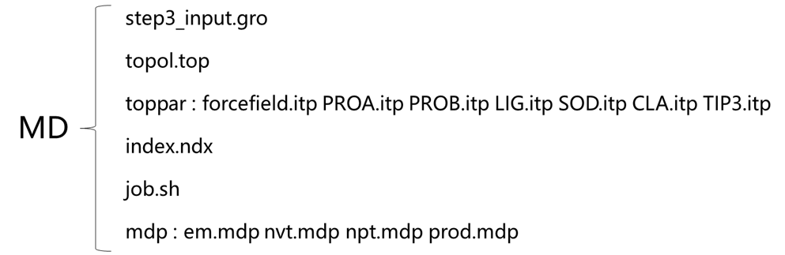  