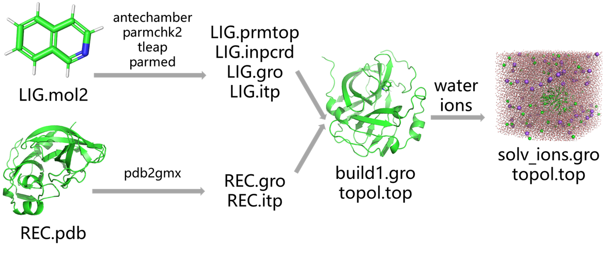

# 蛋白-配体小分子动力学模拟：蛋白使用pdb2gmx 14sb，小分子使用antechamber生成力场参数
在分子模拟领域，蛋白-配体相互作用的研究至关重要，特别是在药物设计、分子识别以及蛋白质功能研究中尤为关键。蛋白-配体小分子动力学模拟作为一种精确预测分子相互作用的重要工具，已经广泛应用于药物筛选和优化过程中。本文将详细介绍如何使用 GROMACS 和 Antechamber 工具进行蛋白质和小分子的动力学模拟。具体而言，我们将使用 GROMACS 中的 pdb2gmx 命令和14SB力场生成蛋白质的拓扑文件，并利用 Antechamber 为小分子生成适合的力场参数。具体思路是：（1）使用AmberTools中的antechamber计算配体小分子的bcc电荷并使用parmchk2生成小分子的力场参数。（2）使用tleap建模小分子生成适配amber的小分子prmtop和inpcrd文件。（3）使用parmed等将prmtop和inpcrd文件转成gro和top文件。（4）使用gmx的pdb2gmx建模受体蛋白的gro和top文件。（5）将配体小分子和受体蛋白的gro和top文件合并生成蛋白-配体复合物的gro和top文件。（6）后续就跟常规模拟文件准备差不多了。加水加离子，准备mdp文件和gmx命令run即可。  
  
## 准备配体小分子gro和itp文件
（1）首先需要获得小分子的mol2文件。**注意一下：** 最好将获得的mol2文件放到pymol中检查下结构对不对，特别是看加氢了没有，氢加的对不对等。另外需要知道小分子整体带几个单位的电荷。然后使用下述命令使用bcc计算小分子电荷并生成其模拟参数。  
```shell
antechamber -i LIG.mol2 -fi mol2 -o LIG-1.mol2 -fo mol2 -c bcc -nc 0 -pf y   # -nc 指定的是小分子的整体电荷
parmchk2 -i LIG-1.mol2 -f mol2 -o LIG.frcmod   # LIG.frcmod 是配体的参数文件
```
（2）使用tleap建模配体小分子生成其适配amber的prmtop和inpcrd文件。  
```shell
cat << EOL > tleap.in
source oldff/leaprc.ff14SB
source leaprc.water.tip3p
source leaprc.gaff2
loadamberparams frcmod.ionsjc_tip3p
loadamberparams LIG.frcmod
LIG = loadmol2 LIG-1.mol2
saveamberparm LIG LIG.prmtop LIG.inpcrd
quit
EOL

tleap -f tleap.in
```
（3）使用parmed将amber适配的prmtop和inpcrd文件转换成gmx适配的gro和top文件。
```shell
cat <<EOL > do1.py
import parmed as pmd

parm = pmd.load_file('LIG.prmtop', 'LIG.inpcrd')
parm.save('gromacs.top', format='gromacs')
parm.save('gromacs.gro')
EOL

python do1.py
```
## 准备受体蛋白gro和itp文件
使用pdb2gmx生成受体蛋白的gro和top文件。   
```shell
echo 1|gmx pdb2gmx -f complex.pdb -o build.gro -water tip3p -ignh   # 1就是14sb力场，对了这里说明一下，gmx里面没有自带14sb力场，需要先从官网上下载14sb力场进行安装才能使用。
```
## 合并生成蛋白配体复合物gro和top文件
（1）根据上述流程已经获得了配体小分子的gromacs.gro和gromacs.top文件以及受体蛋白的build.gro和topol.top文件。接下来我们需要从这四个文件出发对蛋白和配体的gro文件合并生成复合物的gro文件，对他们的top文件进行处理生成各自的itp文件以及创建总的包含蛋白和配体itp的topol.top文件。   
（2）合并配体小分子和蛋白的gro文件生成复合物gro文件。需要进行原子数目合并（gro文件第二行），坐标合并以及盒子信息（最后一行）。这里强调下对合并完成的复合物gro文件使用pymol打开检查，若能正常显示就没啥问题，若不能显示则gro文件不对。可以手动合并也可以参考下述脚本：
```shell
cat <<EOL > do2.py
def merge_gro_files(gro_file1, gro_file2, output_file):
    with open(gro_file1, 'r') as file1, open(gro_file2, 'r') as file2:
        # 读取第一个文件的内容
        lines1 = file1.readlines()
        # 读取第二个文件的内容
        lines2 = file2.readlines()

        # 合并注释行和总原子数
        header = lines1[0]
        atom_count1 = int(lines1[1].strip())
        atom_count2 = int(lines2[1].strip())
        total_atoms = atom_count1 + atom_count2
        
        # 获取坐标数据并去掉最后一行的box尺寸信息
        coords1 = lines1[2:-1]
        coords2 = lines2[2:-1]
        
        # 获取box尺寸信息
        box_size = lines1[-1].strip()  # 假设两个文件的box尺寸相同

        # 写入合并后的文件
        with open(output_file, 'w') as output:
            output.write(header)  # 写入注释行
            output.write(f'{total_atoms}\n')  # 写入总原子数
            output.writelines(coords1)  # 写入第一个文件的坐标
            output.writelines(coords2)  # 写入第二个文件的坐标
            output.write(f'{box_size}\n')  # 写入box尺寸信息

# 使用示例
merge_gro_files('build.gro', 'gromacs.gro', 'build1.gro')
EOL

python do2.py
```
（3）生成小分子和蛋白各自的itp文件并创建复合物的topol.top文件。.top 文件和 .itp 文件是描述分子拓扑信息的重要文件。两者都用于定义分子的拓扑结构，包括分子内的原子类型、键、角、二面角、非键相互作用等信息。.top 文件定义整个系统的拓扑结构，包括分子清单、力场信息和其他全局设置，.itp 文件描述单个分子或分子组（如蛋白质、配体、水分子等）的拓扑信息，通常用于模块化复用。可以通过 #include 命令将 .itp 文件包含到 .top 文件中，实现拓扑文件的模块化组织。总之，.top 文件是整体的“系统描述”，涵盖所有分子和全局设置。.itp 文件是“模块化分子描述”，可以方便地被引入多个 .top 文件中。 在实际操作中，.top 和 .itp 的结合使用可以简化系统拓扑文件的管理，提高可维护性和复用性。   
```shell
head -n -20 topol.top > Protein_chain_A.itp
sed -i '1,27d' Protein_chain_A.itp

head -n -7 gromacs.top > LIG.itp
sed -i '1,19d' LIG.itp

echo 0 |gmx genrestr -f gromacs.gro -o posre_LIG.itp -fc 1000 1000 1000

echo -e "\n; Include Position restraint file\n#ifdef POSRES\n#include \"posre_LIG.itp\"\n#endif" >> LIG.itp

rm topol.top
cat <<EOL >> topol.top
;
;       File 'topol.top' was generated
;       By user: yqyang (1032)
;       On host: tc6000
;       At date: Thu May 16 15:05:39 2024
;
;       This is a standalone topology file
;
;       Created by:
;                           :-) GROMACS - gmx pdb2gmx, 2023.2 (-:
;
;       Executable:   /public/software/apps/gromacs/2023.2/bin/gmx
;       Data prefix:  /public/software/apps/gromacs/2023.2
;       Working dir:  /public/home/yqyang/SerpinB9/SerpinB9-SMS/SMS-peps-MMGBSA/pep_1/dup1
;       Command line:
;         gmx pdb2gmx -f complex.pdb -o build.gro -water tip3p -ignh
;       Force field data was read from:
;       /public/home/yqyang/software/forcefield
;
;       Note:
;       This might be a non-standard force field location. When you use this topology, the
;       force field must either be present in the current directory, or the location
;       specified in the GMXLIB path variable or with the 'include' mdp file option.
;

; Include forcefield parameters
#include "/public/home/yqyang/software/forcefield/amber14sb_OL15.ff/forcefield.itp"

; Include chain topologies
#include "LIG.itp"
#include "Protein_chain_A.itp"

; Include water topology
#include "/public/home/yqyang/software/forcefield/amber14sb_OL15.ff/tip3p.itp"

#ifdef POSRES_WATER
; Position restraint for each water oxygen
[ position_restraints ]
;  i funct       fcx        fcy        fcz
   1    1       1000       1000       1000
#endif

; Include topology for ions
#include "/public/home/yqyang/software/forcefield/amber14sb_OL15.ff/ions.itp"

[ system ]
; Name
Protein in water

[ molecules ]
; Compound        #mols
Protein_chain_A     1
LIG     1
EOL
```
## 加水，加离子，em，nvt，npt，md
（1）加水加离子   
```shell
gmx editconf -f build1.gro -o newbox.gro -bt cubic -d 0.8
gmx solvate -cp newbox.gro -cs spc216.gro -p topol.top -o solv.gro
gmx grompp -f ~/file/gmx_file/ions.mdp -c solv.gro -p topol.top -o ions.tpr -maxwarn 2
echo 15|gmx genion -s ions.tpr -o solv_ions.gro -p topol.top -pname NA -nname CL -neutral -conc 0.15
echo -e "1|13\nname 24 SOLU\nname 23 SOLV\nq\n"|gmx make_ndx -f solv_ions.gro -o index.ndx
```
（2）em，nvt，npt，md   
该部分可以参考文章
## 一键式流程化脚本
该流程化脚本是我在做项目时候针对特定的项目写定的成功运行的脚本。但并不一定适用于所有体系的一键化建模。该脚本只是提供一个样例作为记录，针对具体的项目，需要具体问题具体分析。可在该样例脚本中进行修改使用即可。   
```shell
antechamber -i LIG.mol2 -fi mol2 -o LIG-1.mol2 -fo mol2 -c bcc -nc 0 -pf y
parmchk2 -i LIG-1.mol2 -f mol2 -o LIG.frcmod

cat << EOL > tleap.in
source oldff/leaprc.ff14SB
source leaprc.water.tip3p
source leaprc.gaff2
loadamberparams frcmod.ionsjc_tip3p
loadamberparams LIG.frcmod
LIG = loadmol2 LIG-1.mol2
saveamberparm LIG LIG.prmtop LIG.inpcrd
quit
EOL

tleap -f tleap.in

cat <<EOL > do1.py
import parmed as pmd

parm = pmd.load_file('LIG.prmtop', 'LIG.inpcrd')
parm.save('gromacs.top', format='gromacs')
parm.save('gromacs.gro')
EOL

python do1.py

sed -i 's/HSD/HIS/g' complex.pdb
sed -i 's/HSE/HIS/g' complex.pdb

echo 1|gmx pdb2gmx -f complex.pdb -o build.gro -water tip3p -ignh

cat <<EOL > do2.py
def merge_gro_files(gro_file1, gro_file2, output_file):
    with open(gro_file1, 'r') as file1, open(gro_file2, 'r') as file2:
        # 读取第一个文件的内容
        lines1 = file1.readlines()
        # 读取第二个文件的内容
        lines2 = file2.readlines()

        # 合并注释行和总原子数
        header = lines1[0]
        atom_count1 = int(lines1[1].strip())
        atom_count2 = int(lines2[1].strip())
        total_atoms = atom_count1 + atom_count2
        
        # 获取坐标数据并去掉最后一行的box尺寸信息
        coords1 = lines1[2:-1]
        coords2 = lines2[2:-1]
        
        # 获取box尺寸信息
        box_size = lines1[-1].strip()  # 假设两个文件的box尺寸相同

        # 写入合并后的文件
        with open(output_file, 'w') as output:
            output.write(header)  # 写入注释行
            output.write(f'{total_atoms}\n')  # 写入总原子数
            output.writelines(coords1)  # 写入第一个文件的坐标
            output.writelines(coords2)  # 写入第二个文件的坐标
            output.write(f'{box_size}\n')  # 写入box尺寸信息

# 使用示例
merge_gro_files('build.gro', 'gromacs.gro', 'build1.gro')
EOL

python do2.py

head -n -20 topol.top > Protein_chain_A.itp
sed -i '1,27d' Protein_chain_A.itp

head -n -7 gromacs.top > LIG.itp
sed -i '1,19d' LIG.itp

echo 0 |gmx genrestr -f gromacs.gro -o posre_LIG.itp -fc 1000 1000 1000

echo -e "\n; Include Position restraint file\n#ifdef POSRES\n#include \"posre_LIG.itp\"\n#endif" >> LIG.itp

rm topol.top
cat <<EOL >> topol.top
;
;       File 'topol.top' was generated
;       By user: yqyang (1032)
;       On host: tc6000
;       At date: Thu May 16 15:05:39 2024
;
;       This is a standalone topology file
;
;       Created by:
;                           :-) GROMACS - gmx pdb2gmx, 2023.2 (-:
;
;       Executable:   /public/software/apps/gromacs/2023.2/bin/gmx
;       Data prefix:  /public/software/apps/gromacs/2023.2
;       Working dir:  /public/home/yqyang/SerpinB9/SerpinB9-SMS/SMS-peps-MMGBSA/pep_1/dup1
;       Command line:
;         gmx pdb2gmx -f complex.pdb -o build.gro -water tip3p -ignh
;       Force field data was read from:
;       /public/home/yqyang/software/forcefield
;
;       Note:
;       This might be a non-standard force field location. When you use this topology, the
;       force field must either be present in the current directory, or the location
;       specified in the GMXLIB path variable or with the 'include' mdp file option.
;

; Include forcefield parameters
#include "/public/home/yqyang/software/forcefield/amber14sb_OL15.ff/forcefield.itp"

; Include chain topologies
#include "LIG.itp"
#include "Protein_chain_A.itp"

; Include water topology
#include "/public/home/yqyang/software/forcefield/amber14sb_OL15.ff/tip3p.itp"

#ifdef POSRES_WATER
; Position restraint for each water oxygen
[ position_restraints ]
;  i funct       fcx        fcy        fcz
   1    1       1000       1000       1000
#endif

; Include topology for ions
#include "/public/home/yqyang/software/forcefield/amber14sb_OL15.ff/ions.itp"

[ system ]
; Name
Protein in water

[ molecules ]
; Compound        #mols
Protein_chain_A     1
LIG     1
EOL

gmx editconf -f build1.gro -o newbox.gro -bt cubic -d 0.8
gmx solvate -cp newbox.gro -cs spc216.gro -p topol.top -o solv.gro
gmx grompp -f ~/file/gmx_file/ions.mdp -c solv.gro -p topol.top -o ions.tpr -maxwarn 2
echo 15|gmx genion -s ions.tpr -o solv_ions.gro -p topol.top -pname NA -nname CL -neutral -conc 0.15
echo -e "1|13\nname 24 SOLU\nname 23 SOLV\nq\n"|gmx make_ndx -f solv_ions.gro -o index.ndx

python Step2_generate_mdp.py
python Step3_generate_submit_sh.py
sh job.sh
```
## 参考
1. [build_pipline.sh](./蛋白-配体小分子动力学模拟蛋白使用pdb2gmx14sb小分子使用antechamber生成力场参数/build_pipline.sh)  
2. [Step2_generate_mdp.py](./Gromacs进行纯标准蛋白质体系分子动力学模拟/Step2_generate_mdp.py)  
3. [Step3_generate_submit_sh.py](./Gromacs进行纯标准蛋白质体系分子动力学模拟/Step3_generate_submit_sh.py)  