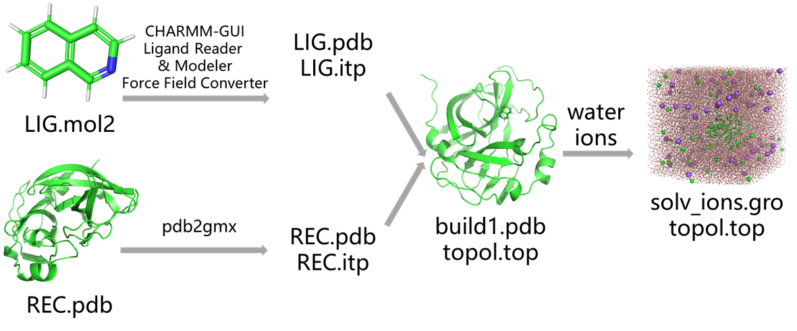
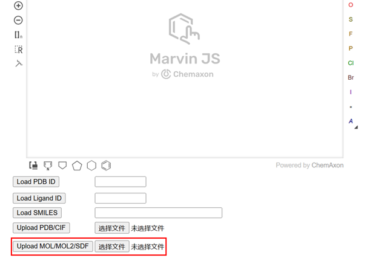
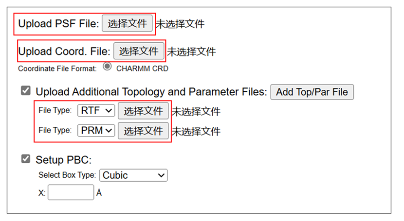

# 蛋白-配体小分子动力学模拟：蛋白使用pdb2gmx charmm36，小分子使用cgenff生成力场参数
在现代生物分子模拟中，蛋白-配体相互作用的研究为药物发现与设计提供了重要的理论依据。分子动力学（MD）模拟作为一种强有力的工具，通过精确地模拟分子的运动和相互作用，能够揭示蛋白质和小分子之间的结合机制，帮助我们深入理解其生物学功能。然而，进行蛋白-配体小分子动力学模拟时，准确的力场参数设置至关重要，特别是在蛋白质和小分子的模拟中。本文我们将介绍如何使用GROMACS工具进行蛋白-配体小分子动力学模拟。对于蛋白质部分，采用pdb2gmx与CHARMM36力场进行模拟，以确保模拟的高准确性和可靠性；对于小分子部分，则使用cgenff生成力场参数，以适应小分子的多样性和复杂性。
  
## 使用charmmgui的Ligand Reader & Modeler模块准备配体小分子参数文件
（1）准备配体小分子mol2文件，这里仅说一下我的个人习惯，我一般将小分子放在pymol中进行编辑（包括加氢，保证单双键的正确性，保证结构的正确性），然后将其保存成mol2格式文件。  
（2）将（1）中的配体mol2文件上传charmmgui的Ligand Reader & Modeler模块生成参数（下载整个压缩包）。
    
## 使用charmmgui的Force Field Converter模块将力场转为gmx使用的力场文件
将上述（2）中的ligandrm.psf，ligandrm.crd，lig.rtf和lig.prm文件上传charmmgui的Force Field Converter模块生成gmx所需的pdb和itp文件（下载整个压缩包）。  
  
## 生成蛋白的pdb文件和top文件
使用pdb2gmx生成受体蛋白的pdb和top文件。   
```shell
echo 2|gmx pdb2gmx -f complex.pdb -o build.pdb -water tip3p -ignh   # 2就是charmm36力场
```
## 合并蛋白配体的pdb文件和top文件
（1）根据上述流程已经获得了配体小分子压缩包中的step3_input.pdb文件，LIG.itp文件和forcefield.itp文件以及受体蛋白的build.pdb和topol.top文件。接下来我们需要从这几个文件出发对蛋白和配体的pdb文件合并生成复合物的pdb文件，对他们的top文件进行处理生成包含蛋白和配体itp的topol.top文件。   
（2）合并配体小分子和蛋白的pdb文件生成复合物pdb文件。pdb文件的合并比gro文件的合并更简单一些，只需要将配体step3_input.pdb文件内容加到蛋白build.pdb文件末尾即可，不需要合并两个文件的原子数目。可以手动合并也可以参考下述命令：  
```shell
head -n -2 build.pdb > build1.pdb
cat step3_input.pdb >> build1.pdb
```
（3）创建复合物的topol.top文件。之前已经生成了LIG.itp文件，只需要将该LIG.itp文件加入到总的topol.top文件即可。这里需要注意两点：（a）使用pdb2gmx准备的受体蛋白topol.top文件时候里面已经#include了完整的charmm36力场，里面已经包含了cgenff生成的小分子配体的所有参数，所以不需要另外#include其他力场参数。（b）[ molecules ]字段里面的分子顺序要和pdb里面的分子顺序要一致。比如pdb中的蛋白在前小分子在后，topol.top文件中的[ molecules ]字段里面也需要保证蛋白分子在前，小分子在后。可手动修改也可以参考下述命令：   
```shell
cat << EOL > do.py
import os

class topol_file():

    def __init__(self, top):

        self.title = list()
        self.forcefield = list()
        self.watertop = list()
        self.ionstop = list()
        self.system = list()
        self.molecules = list()
        
        identifier = {"; Include forcefield parameters":1, "; Include water topology":2, "; Include topology for ions":3, "[ system ]":4, "[ molecules ]":5,}
        index = 0
        flag = 0
        with open(top) as f:
            lines = f.readlines()

        while index < len(lines):
            line = lines[index]
            
            if line.strip() in identifier.keys():
                flag = identifier[line.strip()]
            if flag == 0:
                self.title.append(line)
            elif flag == 1:
                self.forcefield.append(line)
            elif flag == 2:
                self.watertop.append(line)                  
            elif flag == 3:
                self.ionstop.append(line) 
            elif flag == 4:
                self.system.append(line)
            elif flag == 5:
                self.molecules.append(line)

            index += 1

    def lig_add(self):

        rt = open("topol.top1", "w")
        rt.write("".join(self.title))
        rt.write("".join(self.forcefield) + "#include \"LIG.itp\"\n\n")
        rt.write("".join(self.watertop))
        rt.write("".join(self.ionstop))
        rt.write("".join(self.system))
        rt.write("".join(self.molecules)+"LIG       1\n")
        os.remove("topol.top")
        os.renames("topol.top1", "topol.top")

topol_file("topol.top").lig_add()
EOL
python do.py
```
## 加水加离子，em，nvt，npt，md
（1）加水加离子   
```shell
gmx editconf -f build1.pdb -o newbox.gro -bt cubic -d 0.8
gmx solvate -cp newbox.gro -cs spc216.gro -p topol.top -o solv.gro
gmx grompp -f ~/file/gmx_file/ions.mdp -c solv.gro -p topol.top -o ions.tpr -maxwarn 2
echo 15 | gmx genion -s ions.tpr -o solv_ions.gro -p topol.top -pname SOD -nname CLA -neutral -conc 0.15
echo -e "1|13\nname 19 SOLU\n14|15|16\nname 20 SOLV\nq\n"|gmx make_ndx -f solv_ions.gro -o index.ndx   # 设置SOLU和SOLV
```
（2）em，nvt，npt，md   
该部分可以参考文章 [Gromacs进行纯标准蛋白质体系分子动力学模拟](https://mp.weixin.qq.com/s/WZORa3lOA3H4tBjaFQ3mSA)  
## 一键式流程化脚本
同样，该流程化脚本是我在做项目时候针对特定的项目写定的成功运行的脚本。但并不一定适用于所有体系的一键化建模。该脚本只是提供一个样例作为记录，针对具体的项目，需要具体问题具体分析。可在该样例脚本中进行修改使用即可。   
```shell
echo 2 | gmx pdb2gmx -f complex.pdb -o build.pdb -water tip3p -ignh   # 选择charmm36力场
head -n -2 build.pdb > build1.pdb
cat step3_input.pdb >> build1.pdb
cat << EOL > do.py
import os

class topol_file():

    def __init__(self, top):

        self.title = list()
        self.forcefield = list()
        self.watertop = list()
        self.ionstop = list()
        self.system = list()
        self.molecules = list()
        
        identifier = {"; Include forcefield parameters":1, "; Include water topology":2, "; Include topology for ions":3, "[ system ]":4, "[ molecules ]":5,}
        index = 0
        flag = 0
        with open(top) as f:
            lines = f.readlines()

        while index < len(lines):
            line = lines[index]
            
            if line.strip() in identifier.keys():
                flag = identifier[line.strip()]
            if flag == 0:
                self.title.append(line)
            elif flag == 1:
                self.forcefield.append(line)
            elif flag == 2:
                self.watertop.append(line)                  
            elif flag == 3:
                self.ionstop.append(line) 
            elif flag == 4:
                self.system.append(line)
            elif flag == 5:
                self.molecules.append(line)

            index += 1

    def lig_add(self):

        rt = open("topol.top1", "w")
        rt.write("".join(self.title))
        rt.write("".join(self.forcefield) + "#include \"LIG.itp\"\n\n")
        rt.write("".join(self.watertop))
        rt.write("".join(self.ionstop))
        rt.write("".join(self.system))
        rt.write("".join(self.molecules)+"LIG       1\n")
        os.remove("topol.top")
        os.renames("topol.top1", "topol.top")

topol_file("topol.top").lig_add()
EOL
python do.py
gmx editconf -f build1.pdb -o newbox.gro -bt cubic -d 0.8
gmx solvate -cp newbox.gro -cs spc216.gro -p topol.top -o solv.gro
gmx grompp -f ~/file/gmx_file/ions.mdp -c solv.gro -p topol.top -o ions.tpr -maxwarn 2
echo 15 | gmx genion -s ions.tpr -o solv_ions.gro -p topol.top -pname SOD -nname CLA -neutral -conc 0.15
echo -e "1|13\nname 19 SOLU\n14|15|16\nname 20 SOLV\nq\n"|gmx make_ndx -f solv_ions.gro -o index.ndx   # 设置SOLU和SOLV

python Step2_generate_mdp.py
python Step3_generate_submit_sh.py
sh job.sh
```
## 参考
1. [build_pipline.sh](./蛋白-配体小分子动力学模拟蛋白使用pdb2gmxcharmm36小分子使用cgenff生成力场参数/build_pipline.sh)  
2. [Step2_generate_mdp.py](./Gromacs进行纯标准蛋白质体系分子动力学模拟/Step2_generate_mdp.py)  
3. [Step3_generate_submit_sh.py](./Gromacs进行纯标准蛋白质体系分子动力学模拟/Step3_generate_submit_sh.py)  