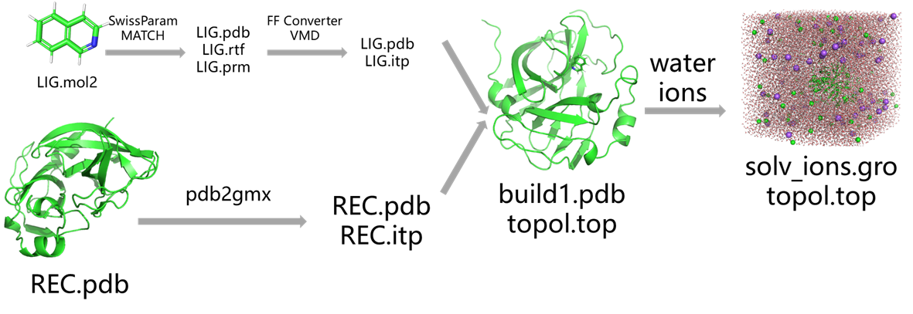
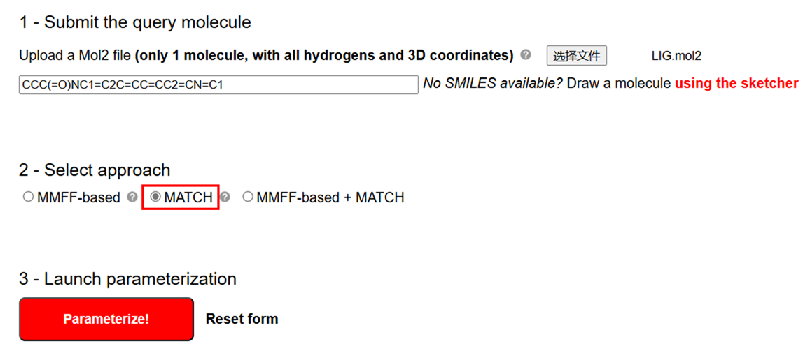
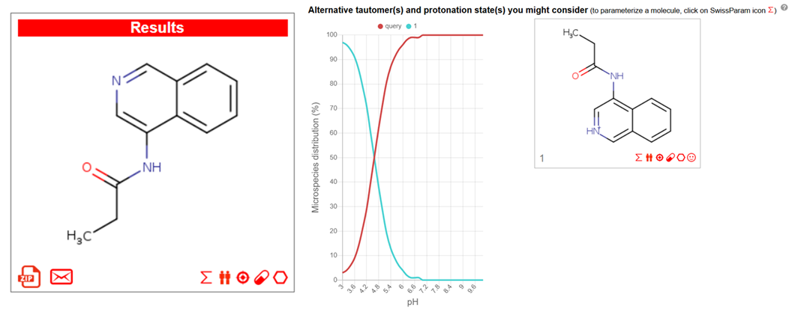
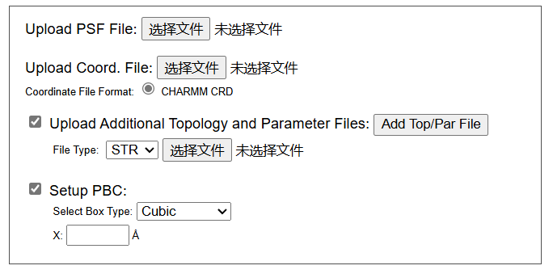

# 蛋白-配体小分子动力学模拟：蛋白使用pdb2gmx charmm36，小分子使用swissparm生成的MATCH力场参数（Gromacs版）
在药物研发领域，蛋白-配体小分子动力学模拟是研究分子互作机制、预测结合自由能以及优化先导化合物的重要工具。精准的分子动力学模拟依赖于高质量的力场参数，尤其是在处理复杂的蛋白-配体体系时。对于蛋白质，CHARMM36 力场因其广泛的适用性和准确性而成为主流选择；而对于小分子，准确生成与蛋白兼容的力场参数则是一个常见的技术难点。  

MATCH 是一种能够自动生成小分子 CHARMM 力场参数的工具，其与 SwissParam 数据库结合，可以高效完成复杂小分子参数化工作。结合 GROMACS 的强大模拟功能，这一流程不仅简化了蛋白-配体体系的准备步骤，还提升了模拟的可靠性和精度，为深入探究生物分子间的相互作用提供了坚实的基础。本文将详细介绍如何使用 pdb2gmx 为蛋白质生成 CHARMM36 力场，以及通过 MATCH 和 SwissParam 为小分子生成相匹配的力场参数，最终构建完整的动力学模拟体系。这一方法具有高效、便捷和通用的优势，为研究者提供了值得借鉴的思路。  

## 使用SwissParam中的MATCH准备配体小分子力场参数文件
小分子结构是来自RCSB数据库中晶体结构的pdb文件。需要根据此pdb文件准备模拟体系的小分子mol2格式文件，检查其正确性。个人一般在pymol中对小分子结构进行仔细检查，特别是检查它的单双键，加氢情况以及质子化状态等。然后将此mol2文件上传至SwissParam网站使用其中的MATCH对其进行参数化，如下图所示：  
  
结果页面如下所示，结果页面不仅提供了上传的mol2分子的参数化文件，还提供了其在所有PH范围的其他潜在质子化状态的参数化文件。可根据使用的PH选择合适的质子化参数文件。  
  
下载的压缩包中有配体分子的pdb文件，rtf文件和prm文件。没有Gromacs兼容的itp文件。所以需要根据这些文件生成Gromacs兼容的itp文件。  
## 将小分子力场参数文件转换成Gromacs兼容的itp文件
使用CHARMM-GUI中的Force Field Converter模块将CHARMM力场转成Gromacs兼容的itp文件。如下图，Force Field Converter模块需要psf文件，crd文件，rtf文件和prm文件。所以需要使用vmd根据配体分子的pdb文件，rtf文件和prm文件生成psf文件和crd文件。    
    

**生成psf文件：** 使用vmd读取配体的rtf文件和pdb文件，然后建模生成配体的psf文件和pdb文件。  
```shell
cat > pipline.tcl << EOF
package require psfgen   ;# 加载psfgen模块
psfcontext reset

topology LIG.rtf

segment LIG {
  pdb LIG.pdb
}

coordpdb LIG.pdb LIG

guesscoord

writepdb merged.pdb
writepsf x-plor merged.psf

exit
EOF

vmd/1.9.3/vmd -dispdev text -e pipline.tcl
```

**生成crd文件：** 使用merged.psf，merged.pdb和write_charmm_crd.tcl生成crd文件。  
write_charmm_crd.tcl文件内容如下所示：  
```tcl
proc writecharmmcoor {filename usemolid outtype} {
        # Requirements: PSF and coordinates loaded in VMD
        # Arguments: filename (string), molid to use (int), and type of charmm coordinate file to write (string: normal/expanded)
        # can take a while on files with >50,000 atoms

        set numatoms [molinfo $usemolid get numatoms]
        set all [atomselect top "all"]

        # check if normal-format compatible
        if {[string match $outtype "normal"]==1} {
                if { $numatoms > 99999 } {
                        puts "Using expanded format, number of atoms is greater than 99999"
                        set outtype "expanded"
                }
                set maxseg 0
                foreach {segname} [lsort -unique [$all get segname]] {
                        set current [string length $segname]
                        if { $current > $maxseg } {
                                set maxseg $current
                        }
                }
                if { $maxseg > 4 } {
                        puts "Using expanded format, at least one VMD segment name is more than 4 characters"
                        set outtype "expanded"
                }
                set maxres 0
                foreach {resname} [lsort -unique [$all get resname]] {
                        set current [string length $resname]
                        if { $current > $maxres } {
                                set maxres $current
                        }
                }
                if { $maxres > 4 } {
                        puts "Using expanded format, at least one VMD residue name is more than 4 characters"
                        set outtype "expanded"
                }
        }
        unset maxres
        unset maxseg
        $all delete


        # Begin writing CHARMM file
        set output [open $filename "w"]

        # header
        puts $output "* CHARMM coordinates generated from VMD"
        if {[string match $outtype "normal"]==1} {
                puts $output "[format "%5i" $numatoms]"
        }
        if {[string match $outtype "expanded"]==1} {
                puts $output "[format "%10i" $numatoms]  EXT"
        }

        # atom lines
        set weighting "0"
        set countres "1"
        for {set i 0} {$i < $numatoms} {incr i} {
                # gather atom information
                set selection [atomselect $usemolid "index $i"]

                set segmentid [$selection get segname]
                set residueid [$selection get resid]
                # increment CHARMM residue number as segment ID or residue ID changes
                if {$i > 0} {
                        if {$prevresid != $residueid || $prevsegmentid != $segmentid} {
                                set countres [expr "$countres + 1"]
                        }
                }
                set resno "$countres"
                set prevresid [$selection get resid]
                set prevsegmentid [$selection get segname]

                # output
                if {[string match $outtype "normal"]==1} {
                        puts $output "[format "%5i" [expr "$i + 1"]][format "%5i" $resno] [format "%-4s" [$selection get resname]] [format "%-4s" [$selection get name]][format "%10.5f" [$selection get x]][format "%10.5f" [$selection get y]][format "%10.5f" [$selection get z]] [format "%-4s" $segmentid] [format "%-4s" $residueid][format "%10.5f" $weighting]"
        }

                if {[string match $outtype "expanded"]==1} {
                        puts $output "[format "%10i" [expr "$i + 1"]][format "%10i" $resno]  [format "%-8s" [$selection get resname]]  [format "%-8s" [$selection get name]][format "%20.10f" [$selection get x]][format "%20.10f" [$selection get y]][format "%20.10f" [$selection get z]]  [format "%-8s" $segmentid]  [format "%-8s" $residueid][format "%20.10f" $weighting]"
                }

                # cleanup
                $selection delete
                unset selection
                unset resno
                unset segmentid
                unset residueid
        }
        close $output
        puts "Done with conversion"
}
```
运行如下命令获取crd文件：  
```shell
vmd -dispdev text

mol new merged.psf
mol addfile merged.pdb
source write_charmm_crd.tcl
writecharmmcoor "output.crd" 0 "normal"
quit
```

**Force Field Converter进行力场转换：** 将上述准备完成的psf文件，crd文件，rtf文件和prm文件上传到Force Field Converter进行力场转换。下载压缩包即可获得Gromacs兼容的pdb文件，gro文件和itp文件。    
## 生成蛋白的pdb文件和top文件
使用pdb2gmx生成受体蛋白的pdb和top文件。  
```shell
echo 2|gmx pdb2gmx -f complex.pdb -o build.pdb -water tip3p -ignh   # 2就是charmm36力场
```
## 合并蛋白配体的pdb文件和top文件
该部分也可参考文章 [蛋白-配体小分子动力学模拟：蛋白使用pdb2gmx charmm36，小分子使用cgenff生成力场参数](https://mp.weixin.qq.com/s/tUzBB9eQRDQHMnC7uaI_yA)。  

（1）根据上述流程已经获得了配体小分子压缩包中的step3_input.pdb文件，LIG.itp文件和forcefield.itp文件以及受体蛋白的build.pdb和topol.top文件。接下来我们需要从这几个文件出发对蛋白和配体的pdb文件合并生成复合物的pdb文件，对他们的top文件进行处理生成包含蛋白和配体itp的topol.top文件。   
（2）合并配体小分子和蛋白的pdb文件生成复合物pdb文件。pdb文件的合并比gro文件的合并更简单一些，只需要将配体step3_input.pdb文件内容加到蛋白build.pdb文件末尾即可，不需要合并两个文件的原子数目。可以手动合并也可以参考下述命令：  
```shell
head -n -2 build.pdb > build1.pdb
cat step3_input.pdb >> build1.pdb
```
（3）创建复合物的topol.top文件。之前已经生成了LIG.itp文件，只需要将该LIG.itp文件加入到总的topol.top文件即可。这里需要注意两点：（a）使用pdb2gmx准备的受体蛋白topol.top文件时候里面已经#include了完整的charmm36力场，里面已经包含了cgenff生成的小分子配体的所有参数，所以不需要另外#include其他力场参数。（b）[ molecules ]字段里面的分子顺序要和pdb里面的分子顺序要一致。比如pdb中的蛋白在前小分子在后，topol.top文件中的[ molecules ]字段里面也需要保证蛋白分子在前，小分子在后。可手动修改也可以参考下述命令：   
```shell
cat << EOL > do.py
import os

class topol_file():

    def __init__(self, top):

        self.title = list()
        self.forcefield = list()
        self.watertop = list()
        self.ionstop = list()
        self.system = list()
        self.molecules = list()
        
        identifier = {"; Include forcefield parameters":1, "; Include water topology":2, "; Include topology for ions":3, "[ system ]":4, "[ molecules ]":5,}
        index = 0
        flag = 0
        with open(top) as f:
            lines = f.readlines()

        while index < len(lines):
            line = lines[index]
            
            if line.strip() in identifier.keys():
                flag = identifier[line.strip()]
            if flag == 0:
                self.title.append(line)
            elif flag == 1:
                self.forcefield.append(line)
            elif flag == 2:
                self.watertop.append(line)                  
            elif flag == 3:
                self.ionstop.append(line) 
            elif flag == 4:
                self.system.append(line)
            elif flag == 5:
                self.molecules.append(line)

            index += 1

    def lig_add(self):

        rt = open("topol.top1", "w")
        rt.write("".join(self.title))
        rt.write("".join(self.forcefield) + "#include \"LIG.itp\"\n\n")
        rt.write("".join(self.watertop))
        rt.write("".join(self.ionstop))
        rt.write("".join(self.system))
        rt.write("".join(self.molecules)+"LIG       1\n")
        os.remove("topol.top")
        os.renames("topol.top1", "topol.top")

topol_file("topol.top").lig_add()
EOL
python do.py
```
## 加水加离子，em，nvt，npt，md
（1）加水加离子   
```shell
gmx editconf -f build1.pdb -o newbox.gro -bt cubic -d 0.8
gmx solvate -cp newbox.gro -cs spc216.gro -p topol.top -o solv.gro
gmx grompp -f ~/file/gmx_file/ions.mdp -c solv.gro -p topol.top -o ions.tpr -maxwarn 2
echo 15 | gmx genion -s ions.tpr -o solv_ions.gro -p topol.top -pname SOD -nname CLA -neutral -conc 0.15
echo -e "1|13\nname 19 SOLU\n14|15|16\nname 20 SOLV\nq\n"|gmx make_ndx -f solv_ions.gro -o index.ndx   # 设置SOLU和SOLV
```
（2）em，nvt，npt，md   
该部分可以参考文章 [Gromacs进行纯标准蛋白质体系分子动力学模拟](https://mp.weixin.qq.com/s/WZORa3lOA3H4tBjaFQ3mSA)  
## 一键式流程化脚本
同样，该流程化脚本是我在做项目时候针对特定的项目写定的成功运行的脚本。但并不一定适用于所有体系的一键化建模。该脚本只是提供一个样例作为记录，针对具体的项目，需要具体问题具体分析。可在该样例脚本中进行修改使用即可。   
```shell
echo 2 | gmx pdb2gmx -f complex.pdb -o build.pdb -water tip3p -ignh   # 选择charmm36力场
head -n -2 build.pdb > build1.pdb
cat step3_input.pdb >> build1.pdb
cat << EOL > do.py
import os

class topol_file():

    def __init__(self, top):

        self.title = list()
        self.forcefield = list()
        self.watertop = list()
        self.ionstop = list()
        self.system = list()
        self.molecules = list()
        
        identifier = {"; Include forcefield parameters":1, "; Include water topology":2, "; Include topology for ions":3, "[ system ]":4, "[ molecules ]":5,}
        index = 0
        flag = 0
        with open(top) as f:
            lines = f.readlines()

        while index < len(lines):
            line = lines[index]
            
            if line.strip() in identifier.keys():
                flag = identifier[line.strip()]
            if flag == 0:
                self.title.append(line)
            elif flag == 1:
                self.forcefield.append(line)
            elif flag == 2:
                self.watertop.append(line)                  
            elif flag == 3:
                self.ionstop.append(line) 
            elif flag == 4:
                self.system.append(line)
            elif flag == 5:
                self.molecules.append(line)

            index += 1

    def lig_add(self):

        rt = open("topol.top1", "w")
        rt.write("".join(self.title))
        rt.write("".join(self.forcefield) + "#include \"LIG.itp\"\n\n")
        rt.write("".join(self.watertop))
        rt.write("".join(self.ionstop))
        rt.write("".join(self.system))
        rt.write("".join(self.molecules)+"LIG       1\n")
        os.remove("topol.top")
        os.renames("topol.top1", "topol.top")

topol_file("topol.top").lig_add()
EOL
python do.py
gmx editconf -f build1.pdb -o newbox.gro -bt cubic -d 0.8
gmx solvate -cp newbox.gro -cs spc216.gro -p topol.top -o solv.gro
gmx grompp -f ~/file/gmx_file/ions.mdp -c solv.gro -p topol.top -o ions.tpr -maxwarn 2
echo 15 | gmx genion -s ions.tpr -o solv_ions.gro -p topol.top -pname SOD -nname CLA -neutral -conc 0.15
echo -e "1|13\nname 19 SOLU\n14|15|16\nname 20 SOLV\nq\n"|gmx make_ndx -f solv_ions.gro -o index.ndx   # 设置SOLU和SOLV

python Step2_generate_mdp.py
python Step3_generate_submit_sh.py
sh job.sh
```
## 参考
1. [build_pipline.sh](./蛋白-配体小分子动力学模拟蛋白使用pdb2gmxcharmm36小分子使用cgenff生成力场参数/build_pipline.sh)  
2. [Step2_generate_mdp.py](./Gromacs进行纯标准蛋白质体系分子动力学模拟/Step2_generate_mdp.py)  
3. [Step3_generate_submit_sh.py](./Gromacs进行纯标准蛋白质体系分子动力学模拟/Step3_generate_submit_sh.py) 