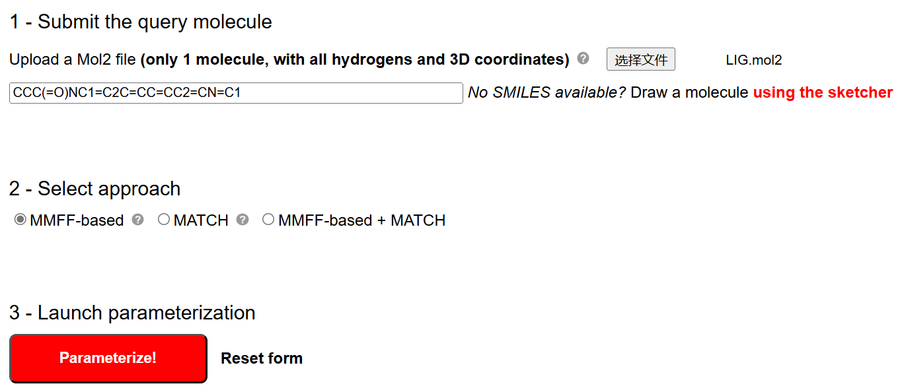
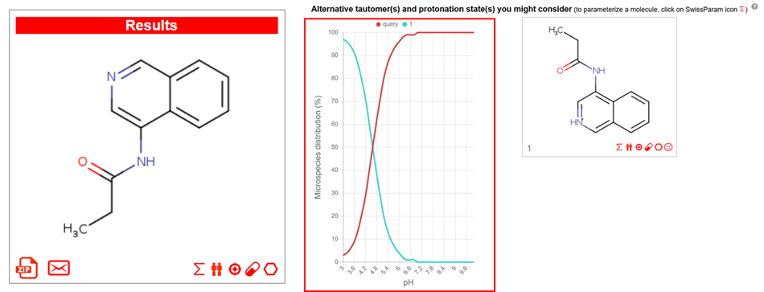
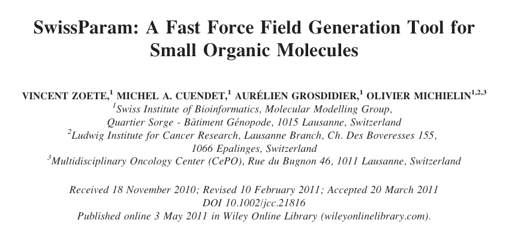
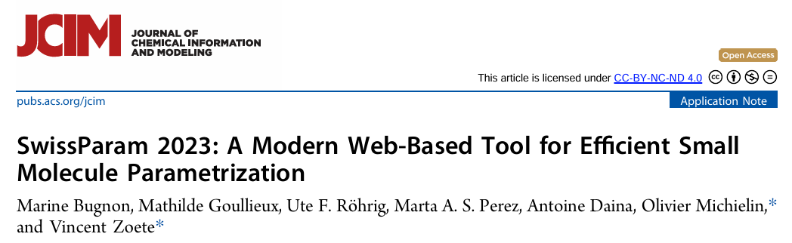

# 蛋白-配体小分子动力学模拟：蛋白使用pdb2gmx charmm36，小分子使用swissparm生成的MMFF94力场参数
在分子模拟中，蛋白-配体相互作用的研究是药物发现和分子机制解析中的关键环节。动力学模拟能够深入揭示配体在蛋白结合位点的行为及其对蛋白构象的影响，为优化药物分子提供可靠依据。然而，为实现模拟的精确性和可信性，准确的力场参数是必不可少的。本文采用 pdb2gmx 工具以 CHARMM36 力场处理蛋白部分，而配体部分则借助 SwissParam 生成基于 MMFF94 力场的参数。这种结合策略不仅能够有效处理小分子的多样性，还能保持与蛋白力场的良好兼容性，从而实现更加精确的模拟结果。通过该流程，研究人员能够高效地探索小分子在靶蛋白中的结合模式及其潜在优化方向，为药物开发和精准分子设计提供科学指导。  
## 使用SwissParam准备配体小分子MMFF94力场参数文件
SwissParam提供了多项输入形式，可以输入SMILES，也可以在页面绘制结构，也可以上传mol2格式文件。当然作者最推荐的是上传mol2格式文件。我一般的习惯是在pymol中对配体结构进行仔细检查，检查它的单双键，加氢情况以及质子化状态等。在确保其结构完全正确后将其保存为mol2文件。然后将此mol2文件上传至SwissParam网站进行参数化，如下图所示：  
   
结果页面如下所示，结果页面不仅提供了上传的mol2分子的参数化文件，还提供了其在所有PH范围的其他潜在质子化状态的参数化文件。可根据使用的PH选择合适的质子化参数文件。    
  
下载的压缩包中有很多文件，其中后续gmx建模需要的是.pdb文件和.itp文件。.itp文件示例如下，其主要包括两部分内容，前面的是原子参数定义和原子间非键相互作用参数定义（atomtypes，pairtypes）；后面的是该分子的拓扑结构，包括分子内的原子类型、键、角、二面角、非键相互作用等信息（moleculetype，atoms，bonds，pairs，angles，dihedrals，position_restraints）。swissparm生成与charmm36力场兼容的该配体参数时，为配体定义了新的原子类型以及非键作用（不同于charmm36里面的）。并且直接将分子的拓扑结构参数信息写在了每行的后面（gmx计算时候会优先识别写在同一行后面的参数信息，比如Ambertools的tleap建模转出来的top文件中参数信息都是写在同一行后面，若是同一行没有参数信息，会从前面的力场参数比如forcefield.itp中进行检索对应的参数信息）。很方便。  
```text
;  ----
; Built RTF for LIG_corr_0.mol2
;    by user SwissParam     Sun 15 Dec 2024 03:52:29 CEST
; ---- 
;

[ atomtypes ] 
; name at.num  mass   charge  ptype    sigma            epsilon 
NC=O    7   14.0067  0.0  A         0.329632    0.836800  
O=C     8   15.9994  0.0  A         0.302905    0.502080  
NPYD    7   14.0067  0.0  A         0.329632    0.836800  
CR      6   12.0110  0.0  A         0.358141    0.234304  
C=O     6   12.0110  0.0  A         0.356359    0.460240  
CB      6   12.0110  0.0  A         0.355005    0.292880  
HCMM    1    1.0079  0.0  A         0.235197    0.092048  
HNCO    1    1.0079  0.0  A         0.040001    0.192464  

[ pairtypes ] 
;  i     j    func     sigma1-4       epsilon1-4 ; THESE ARE 1-4 INTERACTIONS
NC=O     NC=O   1      0.276179    0.836800 
NC=O     O=C    1      0.262815    0.648182 
NC=O     NPYD   1      0.302905    0.836800 
NC=O     CR     1      0.307360    0.187114 
NC=O     C=O    1      0.316269    0.620587 
NC=O     CB     1      0.315592    0.495058 
NC=O     HCMM   1      0.255688    0.277535 
NC=O     HNCO   1      0.158090    0.401315 
O=C      O=C    1      0.249452    0.502080 
O=C      NPYD   1      0.289542    0.648182 
O=C      CR     1      0.293997    0.144938 
O=C      C=O    1      0.302905    0.480705 
O=C      CB     1      0.302228    0.383470 
O=C      HCMM   1      0.242324    0.214978 
O=C      HNCO   1      0.144726    0.310857 
CR       NPYD   1      0.334087    0.187114 
CR       CR     1      0.338541    0.041840 
CR       C=O    1      0.347450    0.138768 
CR       CB     1      0.346773    0.110698 
CR       HCMM   1      0.286869    0.062059 
CR       HNCO   1      0.189271    0.089737 


[ moleculetype ]
; Name nrexcl 
LIG 3

[ atoms ] 
; nr type resnr resid atom cgnr charge mass
   1 NC=O 1  LIG N2      1 -0.5470  14.0067 
   2 O=C  1  LIG O2      2 -0.5700  15.9994 
   3 NPYD 1  LIG N3      3 -0.6200  14.0067 
   4 CR   1  LIG C10     4  0.0610  12.0110 
   5 C=O  1  LIG C11     5  0.5690  12.0110 
   6 CB   1  LIG C13     6  0.1170  12.0110 
   7 CB   1  LIG C14     7  0.1600  12.0110 
   8 CB   1  LIG C15     8  0.1600  12.0110 
   9 CB   1  LIG C17     9  0.0000  12.0110 
  10 CB   1  LIG C18    10 -0.1500  12.0110 
  11 CB   1  LIG C19    11 -0.1500  12.0110 
  12 CB   1  LIG C20    12 -0.1500  12.0110 
  13 CB   1  LIG C21    13 -0.1500  12.0110 
  14 CB   1  LIG C22    14  0.0000  12.0110 
  15 CR   1  LIG C23    15  0.0000  12.0110 
  16 HCMM 1  LIG H09    16  0.0000   1.0079 
  17 HCMM 1  LIG H16    17  0.0000   1.0079 
  18 HCMM 1  LIG H17    18  0.0000   1.0079 
  19 HCMM 1  LIG H18    19  0.0000   1.0079 
  20 HCMM 1  LIG H19    20  0.0000   1.0079 
  21 HNCO 1  LIG H6     21  0.3700   1.0079 
  22 HCMM 1  LIG H01    22  0.1500   1.0079 
  23 HCMM 1  LIG H02    23  0.1500   1.0079 
  24 HCMM 1  LIG H03    24  0.1500   1.0079 
  25 HCMM 1  LIG H04    25  0.1500   1.0079 
  26 HCMM 1  LIG H05    26  0.1500   1.0079 
  27 HCMM 1  LIG H06    27  0.1500   1.0079 

[ bonds ]
; ai aj fu b0 kb, b0 kb
  1   5 1 0.13690  351030.1  0.13690  351030.1 
  1   6 1 0.13950  330133.5  0.13950  330133.5 
  1  21 1 0.10150  401254.8  0.10150  401254.8 
  2   5 1 0.12220  779866.6  0.12220  779866.6 
  3   7 1 0.13330  345489.6  0.13330  345489.6 
  3   8 1 0.13330  345489.6  0.13330  345489.6 
  4   5 1 0.14920  252327.8  0.14920  252327.8 
  4  15 1 0.15080  256422.3  0.15080  256422.3 
  4  17 1 0.10930  287014.9  0.10930  287014.9 
  4  18 1 0.10930  287014.9  0.10930  287014.9 
  6   7 1 0.13740  335613.7  0.13740  335613.7 
  6  14 1 0.13740  335613.7  0.13740  335613.7 
  7  27 1 0.10840  319534.6  0.10840  319534.6 
  8   9 1 0.13740  335613.7  0.13740  335613.7 
  8  26 1 0.10840  319534.6  0.10840  319534.6 
  9  10 1 0.13740  335613.7  0.13740  335613.7 
  9  14 1 0.13740  335613.7  0.13740  335613.7 
 10  11 1 0.13740  335613.7  0.13740  335613.7 
 10  25 1 0.10840  319534.6  0.10840  319534.6 
 11  12 1 0.13740  335613.7  0.13740  335613.7 
 11  24 1 0.10840  319534.6  0.10840  319534.6 
 12  13 1 0.13740  335613.7  0.13740  335613.7 
 12  22 1 0.10840  319534.6  0.10840  319534.6 
 13  14 1 0.13740  335613.7  0.13740  335613.7 
 13  23 1 0.10840  319534.6  0.10840  319534.6 
 15  16 1 0.10930  287014.9  0.10930  287014.9 
 15  19 1 0.10930  287014.9  0.10930  287014.9 
 15  20 1 0.10930  287014.9  0.10930  287014.9 


[ pairs ]
; ai aj fu
  1  15 1  
  1  17 1  
  1  18 1  
  1   3 1  
  1  27 1  
  1   9 1  
  1  13 1  
  2   6 1  
  2  21 1  
  2  15 1  
  2  17 1  
  2  18 1  
  3  14 1  
  3  10 1  
  4   6 1  
  4  21 1  
  5   7 1  
  5  14 1  
  5  16 1  
  5  19 1  
  5  20 1  
  6   8 1  
  6  10 1  
  6  12 1  
  6  23 1  
  7   9 1  
  7  26 1  
  7  21 1  
  7  13 1  
  8  27 1  
  8  11 1  
  8  25 1  
  8  13 1  
  9  12 1  
  9  24 1  
  9  23 1  
 10  26 1  
 10  13 1  
 10  22 1  
 11  14 1  
 11  23 1  
 12  25 1  
 13  24 1  
 14  21 1  
 14  27 1  
 14  26 1  
 14  25 1  
 14  22 1  
 16  17 1  
 16  18 1  
 17  19 1  
 17  20 1  
 18  19 1  
 18  20 1  
 22  24 1  
 22  23 1  
 24  25 1  


[ angles ] 
; ai aj ak fu th0 kth ub0 kub th0 kth ub0 kub
  5   1   6 1  118.5960  616.06    118.5960  616.06 
  5   1  21 1  120.2770  346.27    120.2770  346.27 
  6   1  21 1  118.2270  378.18    118.2270  378.18 
  7   3   8 1  115.4060  653.40    115.4060  653.40 
  5   4  15 1  107.5170  467.91    107.5170  467.91 
  5   4  17 1  108.3850  391.44    108.3850  391.44 
  5   4  18 1  108.3850  391.44    108.3850  391.44 
 15   4  17 1  110.5490  383.00    110.5490  383.00 
 15   4  18 1  110.5490  383.00    110.5490  383.00 
 17   4  18 1  108.8360  310.74    108.8360  310.74 
  1   5   2 1  127.1520  546.20    127.1520  546.20 
  1   5   4 1  112.7350  592.57    112.7350  592.57 
  2   5   4 1  124.4100  564.87    124.4100  564.87 
  1   6   7 1  117.9180  617.27    117.9180  617.27 
  1   6  14 1  117.9180  617.27    117.9180  617.27 
  7   6  14 1  119.9770  402.88    119.9770  402.88 
  3   7   6 1  126.1390  358.92    126.1390  358.92 
  3   7  27 1  115.5880  417.33    115.5880  417.33 
  6   7  27 1  120.5710  339.05    120.5710  339.05 
  3   8   9 1  126.1390  358.92    126.1390  358.92 
  3   8  26 1  115.5880  417.33    115.5880  417.33 
  9   8  26 1  120.5710  339.05    120.5710  339.05 
  8   9  10 1  119.9770  402.88    119.9770  402.88 
  8   9  14 1  119.9770  402.88    119.9770  402.88 
 10   9  14 1  119.9770  402.88    119.9770  402.88 
  9  10  11 1  119.9770  402.88    119.9770  402.88 
  9  10  25 1  120.5710  339.05    120.5710  339.05 
 11  10  25 1  120.5710  339.05    120.5710  339.05 
 10  11  12 1  119.9770  402.88    119.9770  402.88 
 10  11  24 1  120.5710  339.05    120.5710  339.05 
 12  11  24 1  120.5710  339.05    120.5710  339.05 
 11  12  13 1  119.9770  402.88    119.9770  402.88 
 11  12  22 1  120.5710  339.05    120.5710  339.05 
 13  12  22 1  120.5710  339.05    120.5710  339.05 
 12  13  14 1  119.9770  402.88    119.9770  402.88 
 12  13  23 1  120.5710  339.05    120.5710  339.05 
 14  13  23 1  120.5710  339.05    120.5710  339.05 
  6  14   9 1  119.9770  402.88    119.9770  402.88 
  6  14  13 1  119.9770  402.88    119.9770  402.88 
  9  14  13 1  119.9770  402.88    119.9770  402.88 
  4  15  16 1  110.5490  383.00    110.5490  383.00 
  4  15  19 1  110.5490  383.00    110.5490  383.00 
  4  15  20 1  110.5490  383.00    110.5490  383.00 
 16  15  19 1  108.8360  310.74    108.8360  310.74 
 16  15  20 1  108.8360  310.74    108.8360  310.74 
 19  15  20 1  108.8360  310.74    108.8360  310.74 


[ dihedrals ] 
; ai aj ak al fu phi0 kphi mult phi0 kphi mult
  1   5   4  15 9   0.00  -1.9414 1     0.00  -1.9414 1 
  1   5   4  15 9 180.00   2.3263 2   180.00   2.3263 2 
  1   5   4  15 9   0.00   2.9037 3     0.00   2.9037 3 
  1   5   4  17 9   0.00  -0.8619 1     0.00  -0.8619 1 
  1   5   4  17 9 180.00   1.4477 2   180.00   1.4477 2 
  1   5   4  17 9   0.00   0.1799 3     0.00   0.1799 3 
  1   5   4  18 9   0.00  -0.8619 1     0.00  -0.8619 1 
  1   5   4  18 9 180.00   1.4477 2   180.00   1.4477 2 
  1   5   4  18 9   0.00   0.1799 3     0.00   0.1799 3 
  1   6   7   3 9 180.00  14.6440 2   180.00  14.6440 2 
  1   6   7  27 9 180.00  14.6440 2   180.00  14.6440 2 
  1   6  14   9 9 180.00  14.6440 2   180.00  14.6440 2 
  1   6  14  13 9 180.00  14.6440 2   180.00  14.6440 2 
  2   5   1   6 9 180.00  12.5520 2   180.00  12.5520 2 
  2   5   1  21 9   0.00   3.0041 1     0.00   3.0041 1 
  2   5   1  21 9 180.00  10.4056 2   180.00  10.4056 2 
  2   5   1  21 9   0.00  -0.9498 3     0.00  -0.9498 3 
  2   5   4  15 9   0.00   1.7238 1     0.00   1.7238 1 
  2   5   4  15 9 180.00   0.2929 2   180.00   0.2929 2 
  2   5   4  15 9   0.00   0.6820 3     0.00   0.6820 3 
  2   5   4  17 9   0.00   1.3807 1     0.00   1.3807 1 
  2   5   4  17 9 180.00  -2.9455 2   180.00  -2.9455 2 
  2   5   4  17 9   0.00   0.6443 3     0.00   0.6443 3 
  2   5   4  18 9   0.00   1.3807 1     0.00   1.3807 1 
  2   5   4  18 9 180.00  -2.9455 2   180.00  -2.9455 2 
  2   5   4  18 9   0.00   0.6443 3     0.00   0.6443 3 
  3   7   6  14 9 180.00  14.6440 2   180.00  14.6440 2 
  3   8   9  10 9 180.00  14.6440 2   180.00  14.6440 2 
  3   8   9  14 9 180.00  14.6440 2   180.00  14.6440 2 
  4   5   1   6 9 180.00  12.5520 2   180.00  12.5520 2 
  4   5   1  21 9   0.00  -0.6150 1     0.00  -0.6150 1 
  4   5   1  21 9 180.00  12.1420 2   180.00  12.1420 2 
  4   5   1  21 9   0.00   2.8075 3     0.00   2.8075 3 
  5   1   6   7 9 180.00  12.5520 2   180.00  12.5520 2 
  5   1   6  14 9 180.00  12.5520 2   180.00  12.5520 2 
  5   4  15  16 9   0.00  -0.5356 1     0.00  -0.5356 1 
  5   4  15  16 9 180.00   0.1213 2   180.00   0.1213 2 
  5   4  15  19 9   0.00  -0.5356 1     0.00  -0.5356 1 
  5   4  15  19 9 180.00   0.1213 2   180.00   0.1213 2 
  5   4  15  20 9   0.00  -0.5356 1     0.00  -0.5356 1 
  5   4  15  20 9 180.00   0.1213 2   180.00   0.1213 2 
  6   7   3   8 9 180.00  14.6440 2   180.00  14.6440 2 
  6  14   9   8 9 180.00  14.6440 2   180.00  14.6440 2 
  6  14   9  10 9 180.00  14.6440 2   180.00  14.6440 2 
  6  14  13  12 9 180.00  14.6440 2   180.00  14.6440 2 
  6  14  13  23 9 180.00  14.6440 2   180.00  14.6440 2 
  7   3   8   9 9 180.00  14.6440 2   180.00  14.6440 2 
  7   3   8  26 9 180.00  14.6440 2   180.00  14.6440 2 
  7   6   1  21 9 180.00  12.5520 2   180.00  12.5520 2 
  7   6  14   9 9 180.00  14.6440 2   180.00  14.6440 2 
  7   6  14  13 9 180.00  14.6440 2   180.00  14.6440 2 
  8   3   7  27 9 180.00  14.6440 2   180.00  14.6440 2 
  8   9  10  11 9 180.00  14.6440 2   180.00  14.6440 2 
  8   9  10  25 9 180.00  14.6440 2   180.00  14.6440 2 
  8   9  14  13 9 180.00  14.6440 2   180.00  14.6440 2 
  9  10  11  12 9 180.00  14.6440 2   180.00  14.6440 2 
  9  10  11  24 9 180.00  14.6440 2   180.00  14.6440 2 
  9  14  13  12 9 180.00  14.6440 2   180.00  14.6440 2 
  9  14  13  23 9 180.00  14.6440 2   180.00  14.6440 2 
 10   9   8  26 9 180.00  14.6440 2   180.00  14.6440 2 
 10   9  14  13 9 180.00  14.6440 2   180.00  14.6440 2 
 10  11  12  13 9 180.00  14.6440 2   180.00  14.6440 2 
 10  11  12  22 9 180.00  14.6440 2   180.00  14.6440 2 
 11  10   9  14 9 180.00  14.6440 2   180.00  14.6440 2 
 11  12  13  14 9 180.00  14.6440 2   180.00  14.6440 2 
 11  12  13  23 9 180.00  14.6440 2   180.00  14.6440 2 
 12  11  10  25 9 180.00  14.6440 2   180.00  14.6440 2 
 13  12  11  24 9 180.00  14.6440 2   180.00  14.6440 2 
 14   6   1  21 9 180.00  12.5520 2   180.00  12.5520 2 
 14   6   7  27 9 180.00  14.6440 2   180.00  14.6440 2 
 14   9   8  26 9 180.00  14.6440 2   180.00  14.6440 2 
 14   9  10  25 9 180.00  14.6440 2   180.00  14.6440 2 
 14  13  12  22 9 180.00  14.6440 2   180.00  14.6440 2 
 16  15   4  17 9   0.00   0.5941 1     0.00   0.5941 1 
 16  15   4  17 9 180.00  -2.8995 2   180.00  -2.8995 2 
 16  15   4  17 9   0.00   0.6569 3     0.00   0.6569 3 
 16  15   4  18 9   0.00   0.5941 1     0.00   0.5941 1 
 16  15   4  18 9 180.00  -2.8995 2   180.00  -2.8995 2 
 16  15   4  18 9   0.00   0.6569 3     0.00   0.6569 3 
 17   4  15  19 9   0.00   0.5941 1     0.00   0.5941 1 
 17   4  15  19 9 180.00  -2.8995 2   180.00  -2.8995 2 
 17   4  15  19 9   0.00   0.6569 3     0.00   0.6569 3 
 17   4  15  20 9   0.00   0.5941 1     0.00   0.5941 1 
 17   4  15  20 9 180.00  -2.8995 2   180.00  -2.8995 2 
 17   4  15  20 9   0.00   0.6569 3     0.00   0.6569 3 
 18   4  15  19 9   0.00   0.5941 1     0.00   0.5941 1 
 18   4  15  19 9 180.00  -2.8995 2   180.00  -2.8995 2 
 18   4  15  19 9   0.00   0.6569 3     0.00   0.6569 3 
 18   4  15  20 9   0.00   0.5941 1     0.00   0.5941 1 
 18   4  15  20 9 180.00  -2.8995 2   180.00  -2.8995 2 
 18   4  15  20 9   0.00   0.6569 3     0.00   0.6569 3 
 22  12  11  24 9 180.00  14.6440 2   180.00  14.6440 2 
 22  12  13  23 9 180.00  14.6440 2   180.00  14.6440 2 
 24  11  10  25 9 180.00  14.6440 2   180.00  14.6440 2 


[ dihedrals ]
; ai aj ak al fu xi0 kxi xi0 kxi
  1   5   6  21 2   0.00 -12.0416     0.00 -12.0416
  5   4   1   2 2   0.00  77.6885     0.00  77.6885
  6  14   1   7 2   0.00  21.0790     0.00  21.0790
  7   3   6  27 2   0.00  27.6981     0.00  27.6981
  8   9   3  26 2   0.00  27.6981     0.00  27.6981
  9  14   8  10 2   0.00  21.0790     0.00  21.0790
 10  11   9  25 2   0.00   9.0291     0.00   9.0291
 11  12  10  24 2   0.00   9.0291     0.00   9.0291
 12  13  11  22 2   0.00   9.0291     0.00   9.0291
  4  15   5  17 2   0.00   0.0000     0.00   0.0000
  4  15   5  18 2   0.00   0.0000     0.00   0.0000
 15  16   4  19 2   0.00   0.0000     0.00   0.0000
 15  16   4  20 2   0.00   0.0000     0.00   0.0000
 13  14  12  23 2   0.00   9.0291     0.00   9.0291


#ifdef POSRES_LIGAND 
[ position_restraints ] 
; atom  type      fx      fy      fz
   1 1 1000 1000 1000 
   2 1 1000 1000 1000 
   3 1 1000 1000 1000 
   4 1 1000 1000 1000 
   5 1 1000 1000 1000 
   6 1 1000 1000 1000 
   7 1 1000 1000 1000 
   8 1 1000 1000 1000 
   9 1 1000 1000 1000 
  10 1 1000 1000 1000 
  11 1 1000 1000 1000 
  12 1 1000 1000 1000 
  13 1 1000 1000 1000 
  14 1 1000 1000 1000 
  15 1 1000 1000 1000 
#endif 
```
## 生成蛋白的pdb文件和top文件
使用pdb2gmx生成受体蛋白的pdb和top文件。   
```shell
echo 2|gmx pdb2gmx -f complex.pdb -o build.pdb -water tip3p -ignh   # 2就是charmm36力场
```
## 合并蛋白配体的pdb文件和top文件
该部分也可参考文章 。
（1）根据上述流程已经获得了配体小分子压缩包中的LIG.pdb文件，LIG.itp文件以及受体蛋白的build.pdb和topol.top文件。接下来我们需要从这几个文件出发对蛋白和配体的pdb文件合并生成复合物的pdb文件，对他们的top文件进行处理生成包含蛋白和配体itp的topol.top文件。   
（2）合并配体小分子和蛋白的pdb文件生成复合物pdb文件。pdb文件的合并比gro文件的合并更简单一些，只需要将配体LIG.pdb文件内容加到蛋白build.pdb文件末尾即可，不需要合并两个文件的原子数目。可以手动合并也可以参考下述命令：  
```shell
head -n -2 build.pdb > build1.pdb
cat step3_input.pdb >> build1.pdb
```
（3）创建复合物的topol.top文件。之前已经生成了LIG.itp文件，只需要将该LIG.itp文件加入到总的topol.top文件即可。这里需要注意两点：（a）使用pdb2gmx准备的受体蛋白topol.top文件时候里面已经#include了完整的charmm36力场，里面已经包含了cgenff生成的小分子配体的所有参数，所以不需要另外#include其他力场参数。（b）[ molecules ]字段里面的分子顺序要和pdb里面的分子顺序要一致。比如pdb中的蛋白在前小分子在后，topol.top文件中的[ molecules ]字段里面也需要保证蛋白分子在前，小分子在后。可手动修改也可以参考下述命令：   
```shell
cat << EOL > do.py
import os

class topol_file():

    def __init__(self, top):

        self.title = list()
        self.forcefield = list()
        self.watertop = list()
        self.ionstop = list()
        self.system = list()
        self.molecules = list()
        
        identifier = {"; Include forcefield parameters":1, "; Include water topology":2, "; Include topology for ions":3, "[ system ]":4, "[ molecules ]":5,}
        index = 0
        flag = 0
        with open(top) as f:
            lines = f.readlines()

        while index < len(lines):
            line = lines[index]
            
            if line.strip() in identifier.keys():
                flag = identifier[line.strip()]
            if flag == 0:
                self.title.append(line)
            elif flag == 1:
                self.forcefield.append(line)
            elif flag == 2:
                self.watertop.append(line)                  
            elif flag == 3:
                self.ionstop.append(line) 
            elif flag == 4:
                self.system.append(line)
            elif flag == 5:
                self.molecules.append(line)

            index += 1

    def lig_add(self):

        rt = open("topol.top1", "w")
        rt.write("".join(self.title))
        rt.write("".join(self.forcefield) + "#include \"LIG.itp\"\n\n")
        rt.write("".join(self.watertop))
        rt.write("".join(self.ionstop))
        rt.write("".join(self.system))
        rt.write("".join(self.molecules)+"LIG       1\n")
        os.remove("topol.top")
        os.renames("topol.top1", "topol.top")

topol_file("topol.top").lig_add()
EOL
python do.py
```
（4）上述仅是对一个蛋白一个配体形成的复合物的建模。若是含有多个配体则建模过程会有不同。多个配体情况下会使用swissparm生成每个配体的itp文件，此时并不能直接依次将每个.itp都include到top文件中，否则会报错。需要将所有itp文件中的原子参数定义和原子间非键相互作用参数定义（atomtypes，pairtypes）放在所有分子拓扑结构（moleculetype，atoms，bonds，pairs，angles，dihedrals，position_restraints）前面。对于多配体情况后续用到了再更新补充。  
## 加水加离子，em，nvt，npt，md
（1）加水加离子   
```shell
gmx editconf -f build1.pdb -o newbox.gro -bt cubic -d 0.8
gmx solvate -cp newbox.gro -cs spc216.gro -p topol.top -o solv.gro
gmx grompp -f ~/file/gmx_file/ions.mdp -c solv.gro -p topol.top -o ions.tpr -maxwarn 2
echo 15 | gmx genion -s ions.tpr -o solv_ions.gro -p topol.top -pname SOD -nname CLA -neutral -conc 0.15
echo -e "1|13\nname 19 SOLU\n14|15|16\nname 20 SOLV\nq\n"|gmx make_ndx -f solv_ions.gro -o index.ndx   # 设置SOLU和SOLV
```
（2）em，nvt，npt，md   
该部分可以参考文章 [Gromacs进行纯标准蛋白质体系分子动力学模拟](https://mp.weixin.qq.com/s/WZORa3lOA3H4tBjaFQ3mSA)  
## 一键式流程化脚本
同样，该流程化脚本是我在做项目时候针对特定的项目写定的成功运行的脚本。但并不一定适用于所有体系的一键化建模。该脚本只是提供一个样例作为记录，针对具体的项目，需要具体问题具体分析。可在该样例脚本中进行修改使用即可。   
```shell
echo 2 | gmx pdb2gmx -f complex.pdb -o build.pdb -water tip3p -ignh   # 选择charmm36力场
head -n -2 build.pdb > build1.pdb
cat step3_input.pdb >> build1.pdb
cat << EOL > do.py
import os

class topol_file():

    def __init__(self, top):

        self.title = list()
        self.forcefield = list()
        self.watertop = list()
        self.ionstop = list()
        self.system = list()
        self.molecules = list()
        
        identifier = {"; Include forcefield parameters":1, "; Include water topology":2, "; Include topology for ions":3, "[ system ]":4, "[ molecules ]":5,}
        index = 0
        flag = 0
        with open(top) as f:
            lines = f.readlines()

        while index < len(lines):
            line = lines[index]
            
            if line.strip() in identifier.keys():
                flag = identifier[line.strip()]
            if flag == 0:
                self.title.append(line)
            elif flag == 1:
                self.forcefield.append(line)
            elif flag == 2:
                self.watertop.append(line)                  
            elif flag == 3:
                self.ionstop.append(line) 
            elif flag == 4:
                self.system.append(line)
            elif flag == 5:
                self.molecules.append(line)

            index += 1

    def lig_add(self):

        rt = open("topol.top1", "w")
        rt.write("".join(self.title))
        rt.write("".join(self.forcefield) + "#include \"LIG.itp\"\n\n")
        rt.write("".join(self.watertop))
        rt.write("".join(self.ionstop))
        rt.write("".join(self.system))
        rt.write("".join(self.molecules)+"LIG       1\n")
        os.remove("topol.top")
        os.renames("topol.top1", "topol.top")

topol_file("topol.top").lig_add()
EOL
python do.py
gmx editconf -f build1.pdb -o newbox.gro -bt cubic -d 0.8
gmx solvate -cp newbox.gro -cs spc216.gro -p topol.top -o solv.gro
gmx grompp -f ~/file/gmx_file/ions.mdp -c solv.gro -p topol.top -o ions.tpr -maxwarn 2
echo 15 | gmx genion -s ions.tpr -o solv_ions.gro -p topol.top -pname SOD -nname CLA -neutral -conc 0.15
echo -e "1|13\nname 19 SOLU\n14|15|16\nname 20 SOLV\nq\n"|gmx make_ndx -f solv_ions.gro -o index.ndx   # 设置SOLU和SOLV

python Step2_generate_mdp.py
python Step3_generate_submit_sh.py
sh job.sh
```
## SwissParam准备配体小分子MMFF94力场参数文件参考文献
   

上面这篇文献是快速力场生成工具SwissParam的最早文献。文中提出的SwissParam网页工具能为任意有机小分子生成基于MMFF94力场的拓扑结构和参数，并以与CHARMM力场兼容形式输出。输出文件可用于CHARMM或Gromacs动力学模拟软件。SwissParam生成的力场参数可用于分子对接，动力学模拟和结合自由能评估等任务中。  

与为少数化学类型（蛋白/核酸）参数化的高精度力场不同，MMFF的开发目的势提供更大的可转移性，以便于其用于参数化完全陌生分子时能正确处理构象能量和非键相互作用。因为许多化学结构缺乏相应的实验数据，无法提供适用于CADD应用的通用力场，所以MMFF主要是由理论数据推导的。MMFF参数化利用了大量高质量的计算数据，并通过使用来自2800个化合物的CSD数据扩展。这个庞大的参数化涵盖了几乎所有稳定有机小分子，如烷烃、烯烃、醇类、酚类、醚类、醛类、酮类、酯类、氨基、酰胺、肽类、尿素、酸类、酯类、氨基酸、醇氨基酸、亚胺类、嘌呤类化合物等。尽管MMFF是通过理论数据推导的，但它能够准确地再现实验的键长、键角和振动频率。  

有机小分子化学空间在$10^{60}$到$10^{100}$之多，充满多样性，需要具有可迁移性的力场参数工具，所以SwissParam选择MMFF作为其核心力场。SwissParam首先对小分子输入文件进行预处理，使其与CHARMM/MMFF兼容，并根据CHARMM/MMFF提供的原子类型来确定参数。CHARMM输入文件用于编写CHARMM格式的拓扑，并根据MMFF程序确定电荷。MMFF已在CHARMM程序中得到应用。描述小有机分子所需的参数列表来自于CHARMM中的MMFF实现。这些参数通过保留二面角项，并采用键和角度能量项的二次部分（MMFF还包括键和角度能量的三次和四次项）从MMFF推导而来。部分电荷来自MMFF，而范德华参数则来自与全原子CHARMM22力场中相似杂化和化学环境的原子类型。  

SwissParam接受mol2文件格式的输入。mol2文件中包含3D坐标、原子杂化和连接性。mol2文件必须包含所有氢原子，因为拓扑和参数旨在与CHARMM22和CHARMM27（全原子力场）配合使用，并确保分子描述的唯一性，特别是对于可电离功能的质子化状态和互变异构体的选择。SwissParam首先修改mol2文件，以确保MMFF模块能够正确读取CHARMM。芳香键通过openbabel程序替换为Kekulé结构，表示为单键和双键交替，给定的P-O和S-O键被视为单键。从Mol2文件中，MMFF/CHARMM识别MMFF原子类型并生成配体的PSF文件。分子的内部坐标（IC）以及键、角度、二面角和不当角度的力常数、平衡距离和角度会从PSF文件中提取，并转换为CHARMM系统单位（即能量单位为kcal/mol，距离单位为Å，角度单位为度）。分子的拓扑结构及相关参数存为rtf文件和par文件。这些文件随后通过CHARMM进行测试，执行短时间的最小化和分子动力学（MD）模拟，以确保没有缺少参数。SwissParam提供的所有原子类型都是新的，并通过相应的“质量”（MASS）行在小分子rtf文件中声明。因此，标准的CHARMM22/27拓扑和参数文件无需修改，从而确保大分子描述保持完全不变。用户只需要将小分子的RTF文件附加到CHARMM输入文件开头的标准CHARMM22/27拓扑文件中即可。  

  

这篇文章介绍了SwissParam网页工具最近一次的更新。如前所述，SwissParam网页工具首次发布于2011年，旨在基于MMFF为小分子生成参数和拓扑，并且与CHARMM22/27力场兼容。在此，文中展示了更新版的SwissParam，提供了多项新特性，包括支持设置共价配体的功能。现在，用户可以通过不同的文件格式或分子绘图工具导入分子。MMFF基础的方法已更新，以提供与CHARMM36力场兼容的参数和拓扑。此外，还新增了一个选项，可以使用CHARMM通用力场（CHARMM General Force Field）通过多用途原子类型生成器（MATCH）方法生成小分子参数化。另外，SwissParam现在还能生成查询分子的可能替代互变体和质子化状态的信息，用户可以考虑所有与其化合物相关的微物种。文中主要是介绍了新版SwissParam网页工具的使用方式。

## 参考
1. http://swissparam.ch/  
2. [build_pipline.sh](./蛋白-配体小分子动力学模拟蛋白使用pdb2gmxcharmm36小分子使用swissparm生成的MMFF94力场参数/build_pipline.sh)
3. [Step2_generate_mdp.py](./Gromacs进行纯标准蛋白质体系分子动力学模拟/Step2_generate_mdp.py)  
4. [Step3_generate_submit_sh.py](./Gromacs进行纯标准蛋白质体系分子动力学模拟/Step3_generate_submit_sh.py)  
