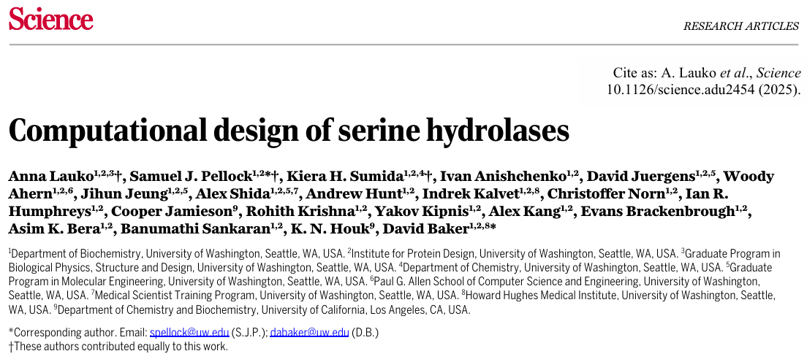
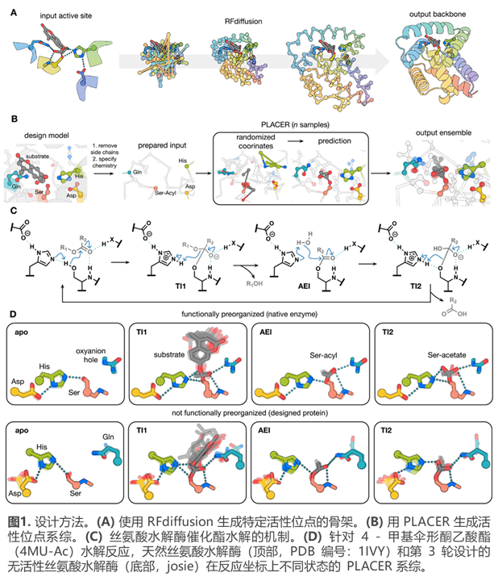
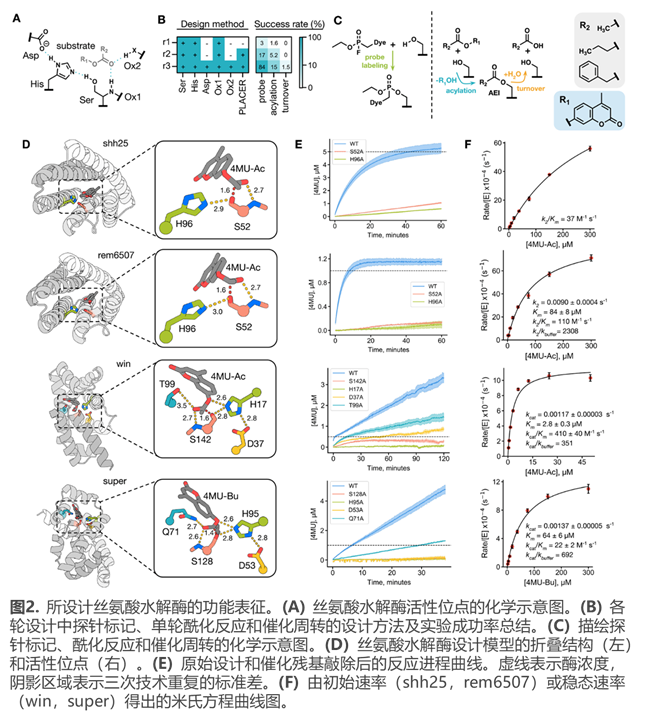
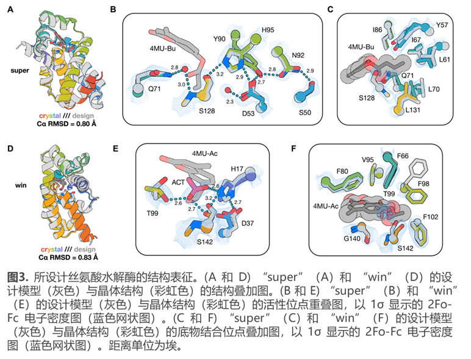
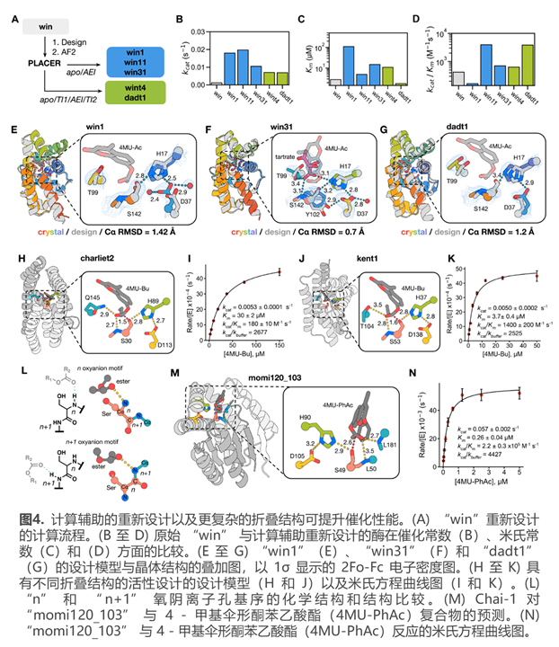
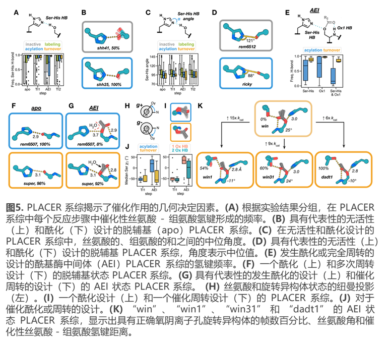

# 蛋白设计|丝氨酸水解酶的计算机设计  
| **研究方向**       | **文章类型**       | **研究体系**       | **研究策略**       |
|--------------------|--------------------|--------------------|--------------------|
| 丝氨酸水解酶的计算设计研究 | 蛋白设计  | 丝氨酸水解酶及相关反应体系 | 结合 RFdiffusion 与 PLACER 方法进行蛋白设计 |

设计复杂多步反应酶困难重重，研究人员以丝氨酸水解酶为模型，结合 RFdiffusion 与系综生成方法进行设计。计算设计所得酶的催化效率更高，晶体结构与设计模型高度匹配。研究还筛选出五种新折叠结构的催化剂，该从头设计法为催化研究和多步反应酶设计提供关键思路。  

  

## 背景
酶作为强大的催化剂，能在温和条件下显著加快反应速率，构建可催化任意化学反应的酶意义重大，是计算蛋白质设计的长期目标。但酶设计面临诸多挑战，如固定骨架限制催化几何结构的实现、活性位点预组织困难等，尤其是设计丝氨酸水解酶，既要克服酰基酶中间体（AEI）的稳定性问题，又要应对其活性位点构建的复杂性。以往设计酯酶的尝试多采用避开丝氨酸水解酶难题的策略，但初始计算设计的效率仍远低于天然酶。此前以核转运因子 2（NTF2）折叠为基础的设计也未成功，可能是关键催化特征难以植入。如今，研究人员借助深度学习，利用 RFdiffusion（图 1A）从活性位点的几何描述出发设计丝氨酸水解酶，并通过模拟催化中间体的结构系综（图 1B）评估活性位点预组织和功能相互作用，期望解决这些问题。  

  

## 使用 PLACER 评估反应路径兼容性
为探究以往设计的丝氨酸水解酶无法有效催化酯水解的原因，研究人员认为模拟反应的每一步对于评估设计酶的催化转化能力至关重要（图 1）。为此，他们开发了深度神经网络 PLACER（蛋白质 - 配体原子构象系综解析器）。该网络依据小分子结合口袋或活性位点的骨架坐标、各位置氨基酸残基身份以及结合小分子的化学结构（不包括位置信息），生成结合位点的完整原子坐标。通过对 PDB 中蛋白质 - 小分子复合物进行训练，在基准测试中，PLACER 预测天然结构区域的平均均方根偏差为 1.1Å。利用 PLACER 对一组天然和之前设计的丝氨酸水解酶催化循环的每一步生成结构系综，发现天然丝氨酸水解酶比之前设计的系统活性位点预组织更好，在反应坐标的每一步，天然酶的催化残基形成关键氢键的频率更高。研究人员通过计算催化功能基团与反应中间体之间关键相互作用的形成频率，来量化活性位点的形成程度，并以此评估新设计的酶。  

## 丝氨酸水解酶的设计与表征
研究人员利用 RFdiffusion 为丝氨酸水解酶活性位点基序搭建支架，借助 PLACER 评估反应各步骤的预组织情况（图 2A、B），致力于设计活性位点复杂度递增的蛋白质，并以 4 - 甲基伞形酮（4MU）酯水解反应为目标设计催化剂（图 2C）。在设计过程中，基于天然水解酶分析，通过采样催化侧链位置和枚举催化残基构象生成活性位点基序，再用 RFdiffusion 构建骨架、LigandMPNN 设计序列，经 Rosetta FastRelax 优化，并用 AlphaFold2 预测结构，筛选符合条件的设计进行实验。前两轮设计构建了相对简单的活性位点，通过 PLACER 筛选实验设计，结果显示第二轮实验中经 FP 探针标记和有催化活性的设计比例提高。第三轮设计引入新元素并筛选，部分设计展现出催化周转活性，如 “super” 和 “win”。对活性设计进行动力学分析，“win” 虽有低 Km 值，但并非因底物结合紧密，而是快速酰化导致（图 2E、F）。  

   

## 设计的丝氨酸水解酶的结构表征
研究人员通过 X 射线晶体学来确定 “super” 和 “win” 这两种设计的丝氨酸水解酶的设计准确性（图 3）。成功解析出它们的晶体结构后发现，“super” 在 165 个残基上与设计模型的 Cα 均方根偏差（RMSD）为 0.8 埃，“win” 在 160 个残基上为 0.83 埃。活性位点的设计精度也很高，除了 “win” 中侧链氧阴离子接触残基 Thr99 的旋转异构体位移外，“super”（22 个原子上的全原子 RMSD = 0.38 埃）和 “win”（20 个原子上的全原子 RMSD = 0.86 埃）的催化残基侧链构象与设计高度吻合。“super” 活性位点中有一个水分子与氧阴离子孔接触形成氢键，模拟了酯底物羰基氧的位置；“win” 的催化中心有一个乙酸酯分子与催化丝氨酸、侧链氧阴离子孔和组氨酸酸碱残基形成氢键。尽管结构解析时未结合小分子底物或过渡态类似物，但 “super” 的设计模型与晶体结构重叠显示出与偏好底物丁酸酰基的高形状互补性，“win” 晶体结构中 F98 的旋转异构体位移使其对较小的 4MU-Ac 底物有选择性。“super” 和 “win” 的结构与已知结构差异很大，通过 Foldseek 搜索显示其与已知结构的 TM 分数分别为 0.52 和 0.46（低于 0.5 的截断值，表明拓扑折叠不同），且与已知水解酶在折叠或活性位点水平无相似性，这表明该设计方法拓展了丝氨酸水解酶活性的结构空间，超越了自然界中已有的结构 。  

  

## 根据反应坐标上的预组织情况进行筛选可提升催化性能
研究人员通过从活性设计 “win” 出发，进行 LigandMPNN 和 FastRelax 的额外迭代，根据 PLACER 对反应路径中两个状态（脱辅基（apo）和酰基酶中间体（AEI）状态）或四个状态的预组织情况进行筛选设计并比较（图 4A）。获得 45 个两状态筛选设计的基因用于实验表征，其中部分有 FP 探针标记和活性，如 win1、win11 和 win31 的催化周转高于起始设计；11 个四状态筛选设计中多数有 FP 探针标记和活性，dadt1 和 wint4 的催化效率高于 “win”。确定了 win1、win31 和 dadt1 的晶体结构，与设计模型有不同程度的吻合。对第三轮除 “win” 外的骨架进行序列设计和 PLACER 筛选，部分设计有酯酶活性，还改变了 win1 的底物选择性。将 RFdiffusion 结合 PLACER 筛选应用于不同活性位点构型，“momi” 活性较高。实验发现 kent1 易失活，侧链氧阴离子孔残基突变对活性影响不一。使用 RFdiffusion 改进现有设计，如 momi120 活性提高，对 “super” 改进后 superfast 和 supercool 的活性也显著提升。重新设计 momi120 用于水解聚对苯二甲酸乙二酯（PET），部分设计对 4MU - 苯乙酸酯（4MU-PhAc）有活性，momi120-103 效率最高，PLACER 和 Chai-1 预测显示 4MU-PhAc 与重新设计的口袋形状互补。   

  

## 催化作用的结构决定因素
天然丝氨酸水解酶中催化几何结构的高度保守性表明其可能接近催化的最优状态，但因难以系统改变主链几何结构，所以难以评估活性与过渡态和催化残基相互作用的详细几何关系。与之不同，研究采用的从头构建方法能对多种催化几何结构进行采样。为探究活性位点几何结构和预组织对催化活性的影响，研究人员为812个经实验表征的设计（包括1至3轮设计及先前基于NTF2的设计）在4MU-Ac水解反应的每个步骤生成PLACER系综，并按无活性、FP探针标记、酰化和催化周转进行分类（图5）。结果显示，Ser-His氢键的预组织程度增加和弯曲程度与探针标记、酰化和周转速率更高相关，有催化周转能力的设计在四种状态下Ser-His氢键预组织程度高，且其键角比无活性设计更尖锐。丝氨酸旋转异构体在催化循环中的几何结构与实验结果也紧密相关，有酰化或周转活性的设计中丝氨酸在脱辅基状态多为活性的(g-)旋转异构体，有周转活性的设计在形成AEI时保持(g-)构象，不可逆酰化的设计则转变为(g+)构象。此外，第二个氧阴离子孔残基的存在有利于活性(g-)丝氨酸旋转异构体。对win、win1、win31和dadt1系列的分析表明，更具活性的win1、win31和dadt1在AEI状态下更多采样到设计的T99氧阴离子孔旋转异构体，且win1和dadt1的丝氨酸旋转异构体状态变化较小，其酰基构象异质性更低，更易发生组氨酸介导的水攻击。   

  

## 结论
本文所描述的计算酶设计在催化效率、活性位点复杂性和设计的原子精度方面取得了重大进展。所设计的丝氨酸水解酶效率很高，相比先前设计的酯酶有显著提升，也实现了对化学稳定的酰基酶中间体水解的加速，估计速率提升超过一亿倍。尽管这些设计不如天然丝氨酸水解酶对其同源底物的效率高，但与天然蛋白酶对活性酯的效率相当或更好。通过优化催化几何结构、进一步预组织活性位点和增加活性位点复杂性可能实现更高的催化效率。此前基于催化三联体的设计未能实现多次周转，而本文基于RFdiffusion从头生成主链的方法克服了支架限制，能生成几乎任何所需的催化几何结构。深度神经网络PLACER可快速生成反应中间体的系综以预测预组织情况，基于PLACER筛选显著提高了实验成功率，为酶设计提供了有价值的反馈。尽管这些设计使用了已知机制，但其采样的几何结构和支架折叠与天然蛋白质不同，预计未来利用RFdiffusion精确定位多个催化基团以及使用PLACER评估活性位点组织的能力，将有助于设计多种新型催化剂，如PET酶、酰胺酶和连接酶等。   

## 方法
### 核转运因子 2（NTF2）设计
在 NTF2 设计活动中，研究人员利用先前对天然丝氨酸水解酶分析得出的催化几何结构来生成约束文件，以便用于 RosettaMatch 算法。用于匹配的支架集是一组由 trRosetta生成的理想化的核转运因子 2（NTF2）折叠蛋白。匹配完成后，按照 LigandMPNN 进行序列设计，并使用 FastRelax 优化，然后如后文所述使用 AlphaFold2 对设计进行筛选。此外，还采用了额外的筛选条件，要求活性位点中的所有催化氢键都必须在 AlphaFold2 的预测结构中形成。  
### 丝氨酸水解酶的计算设计方法
**（1）**
### 其他实验方法
基于活性探针的凝胶内荧光筛选；裂解物筛选；蛋白质表达与纯化；动力学分析；晶体学研究；质谱法分析；蛋白质数据库（PDB）和 AlphaFold 数据库（AFDB）的结构相似性搜索（FoldSeek）等。  