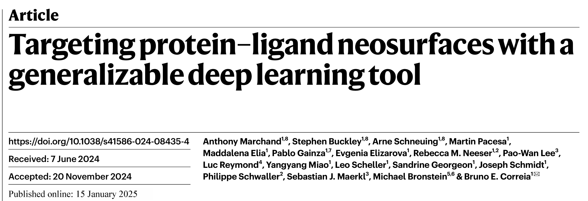
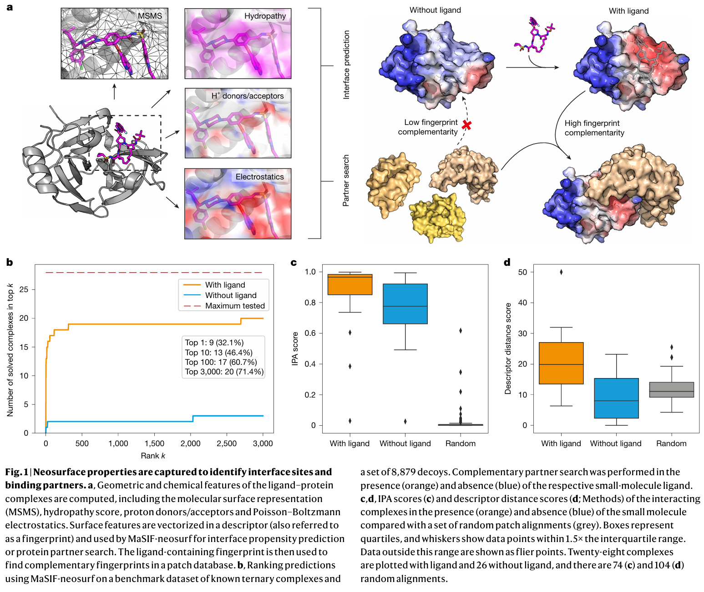
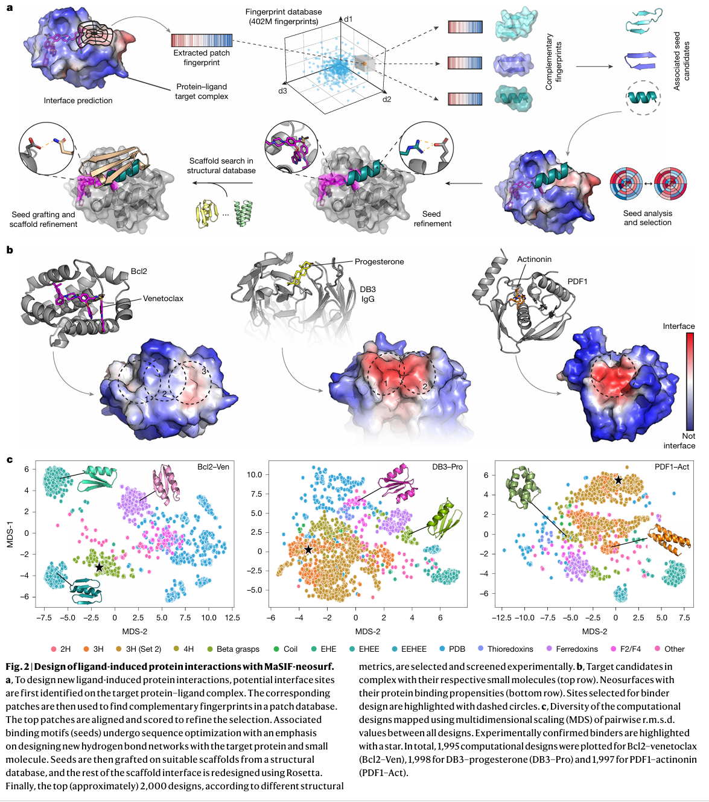
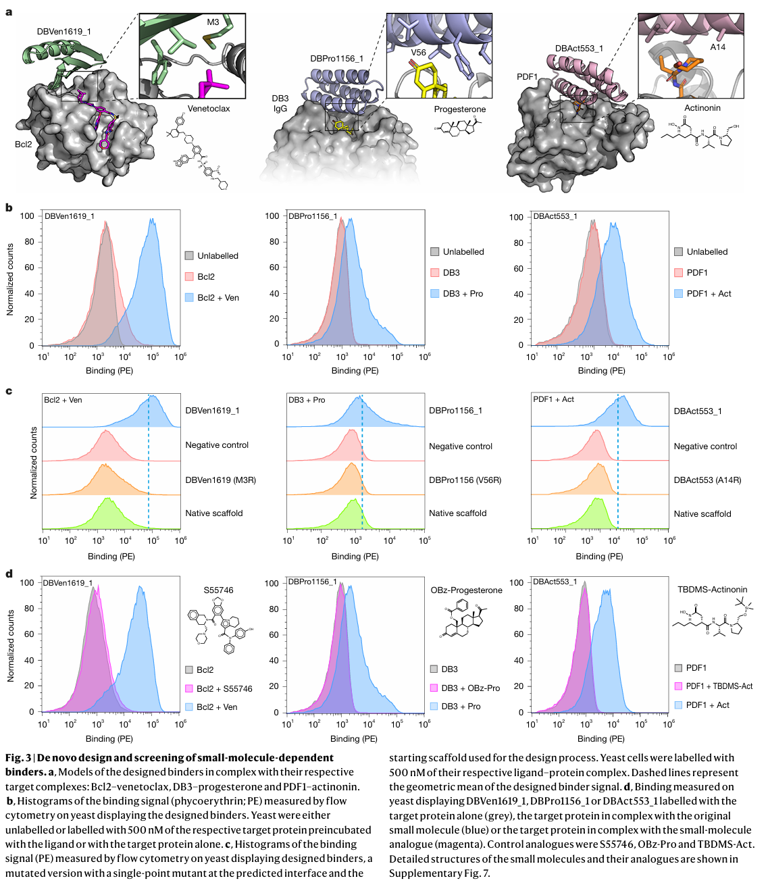
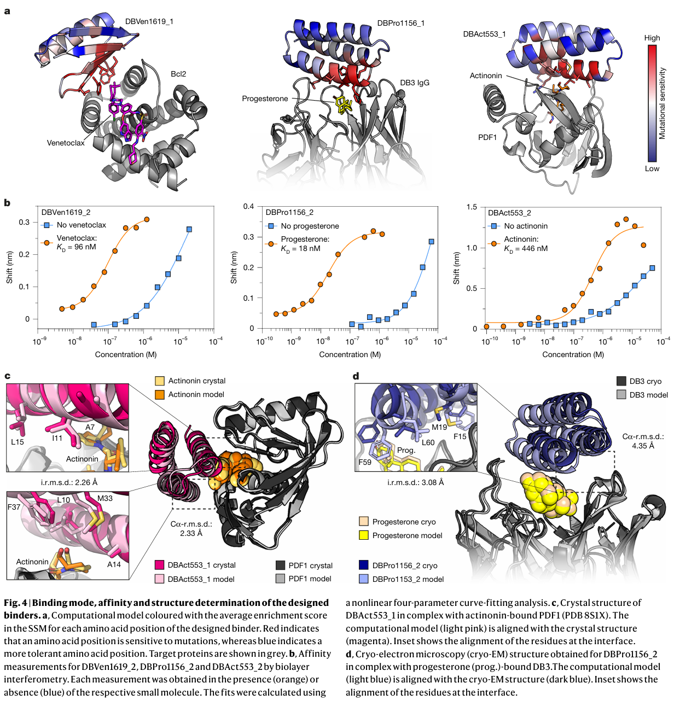
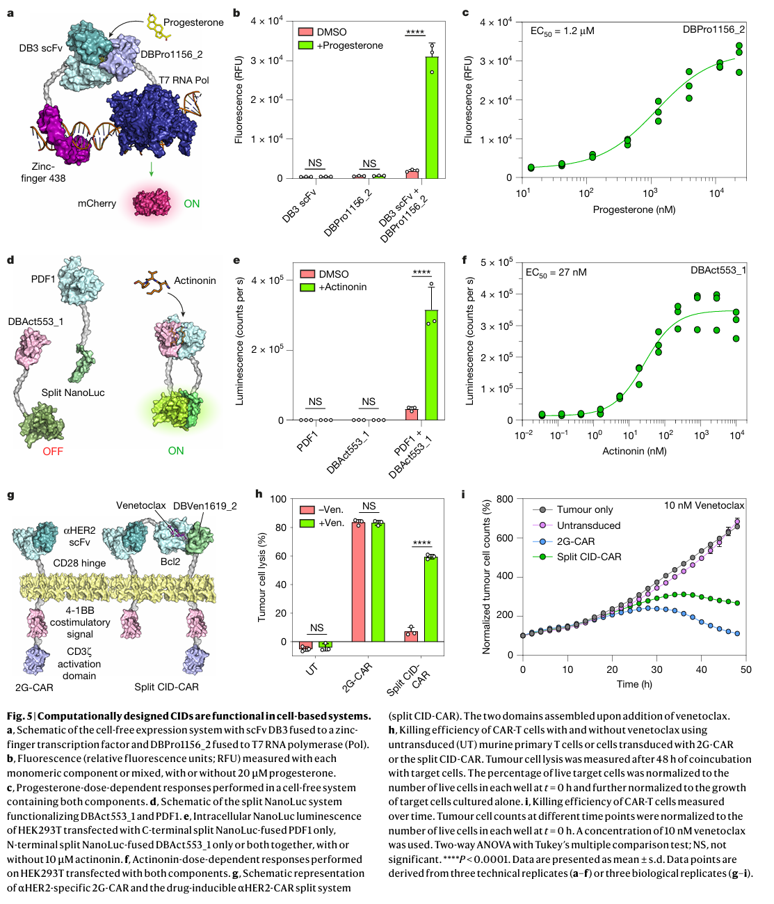

# 蛋白设计|靶向蛋白-小分子形成的新表面进行蛋白设计的几何深度学习计算策略MaSIF-neosurf
这篇文献介绍了一种基于几何深度学习的计算策略，用于**设计能够靶向 neosurfaces（由蛋白质-配体复合物形成的新表面）的蛋白质**。作者通过分子表面表示学习，生成表面指纹，并成功设计出高亲和力、高特异性的结合蛋白，实验验证了其在三种药物-蛋白质复合物中的有效性。该方法展示了罕见的通用性，能够将仅基于蛋白质训练的模型应用于小分子诱导的新表面。这一技术**有望扩展工程化细胞的传感能力，并推动创新药物控制的细胞疗法，为合成生物学和精准医学提供了新的工具**。

  
## 背景
在生命的微观世界中，蛋白质-蛋白质相互作用（PPIs）是驱动细胞稳态和疾病发生的关键机制。近年来，科学家们发现**小分子可以通过调控PPIs，为生物系统提供更高层次的调控机制（小分子诱导的PPIs在合成生物学中的应用；小分子触发器； 设计化学诱导二聚化（CID）系统）。然而设计能够精准靶向这些相互作用的计算工具，一直是领域内的重大挑战。**

最近，一项突破性研究提出了一种基于几何深度学习的计算策略——MaSIF（分子表面相互作用指纹识别），成功解决了这一难题。**MaSIF通过学习蛋白质表面的几何和化学特征，生成“表面指纹”，并设计出能够靶向neosurfaces（由蛋白质-配体复合物形成的新表面）的高亲和力蛋白质。** 实验验证表明，这些设计的蛋白质在多种药物-蛋白质复合物中表现出优异的结合能力。

更令人振奋的是，MaSIF展示了罕见的通用性：即使仅基于蛋白质数据训练，它也能成功应用于小分子诱导的新表面。这一突破为合成生物学和精准医学开辟了新的可能性。例如，**通过设计小分子诱导的蛋白质相互作用，科学家可以开发出更智能的细胞疗法，精确调控细胞行为，甚至构建全新的合成生物学通路。**

## 几何深度学习精准捕捉蛋白质-配体复合物新表面
蛋白质与配体（如小分子药物）的相互作用是许多生物过程的核心。然而，当配体与蛋白质结合时，会形成一种全新的表面——**neosurfaces**。这些新表面不仅复杂多变，还承载着蛋白质功能调控的关键信息。如何精准捕捉这些neosurfaces的特征，一直是科学家们面临的重大挑战。  

最近，一项突破性研究为我们带来了解决方案：**MaSIF-neosurf**，这是基于几何深度学习的MaSIF（分子表面相互作用指纹识别）框架的最新扩展。它不仅能够精准预测蛋白质-配体复合物的新表面，还能设计出高亲和力的蛋白质结合剂，为药物设计和合成生物学开辟了全新的可能性。  

**（1）MaSIF的核心功能：从蛋白质到neosurfaces的跨越。** MaSIF框架最初包含两个核心应用：**MaSIF-site**用于预测蛋白质表面可能形成相互作用界面的区域，而**MaSIF-search**则通过互补表面特征快速找到并对接互补蛋白质。这些功能在蛋白质-蛋白质相互作用的研究中已经取得了显著成果。然而，蛋白质-配体相互作用的研究需要更进一步。配体结合后形成的新表面（neosurfaces）具有独特的几何和化学特征，传统的计算方法难以捕捉。为此，研究团队推出了**MaSIF-neosurf**。  

**（2）MaSIF-neosurf的创新：小分子与蛋白质的完美结合。** MaSIF-neosurf的创新之处在于，它将小分子纳入目标蛋白质的分子表面表示中，基于**neosurface指纹**预测相互作用界面和互补蛋白。这一突破使得MaSIF能够精准捕捉由小分子诱导的新表面特征。为了全面描述neosurfaces，MaSIF-neosurf结合了**几何特征（如形状指数和距离依赖曲率）和化学特征（如静电势、氢键供体/受体倾向和疏水性）**。这种多维度的特征提取方法，使得模型能够更准确地预测蛋白质-配体相互作用的界面。  

**（3）性能验证：超越现有技术的精准度。** 在14个配体诱导的蛋白质复合物测试中，MaSIF-neosurf成功恢复了超过70%的正确结合伙伴及其结合姿态，显著优于当前最先进的RoseTTAFold All-Atom方法。这一结果证明了MaSIF-neosurf在捕捉neosurfaces特征方面的卓越性能。此外，研究还发现，neosurfaces的几何和化学特征之间存在一定的冗余性。即使去除某些特征，模型的性能依然保持稳定，这进一步证明了MaSIF-neosurf的鲁棒性。  

**（4）应用前景：从药物设计到合成生物学的无限可能。** MaSIF-neosurf不仅能够捕捉配体介导的蛋白质相互作用，还展示了从头设计此类相互作用的潜力。这一技术有望在多个领域发挥重要作用：**药物设计，** 通过精准预测蛋白质-配体相互作用，加速新药的发现和优化。**合成生物学，** 设计小分子诱导的蛋白质相互作用，构建智能化的细胞调控系统。**细胞疗法，** 开发基于neosurfaces的精准疗法，实现对细胞行为的精确控制。  

  

## 几何深度学习设计全新配体诱导蛋白质
研究团队成功开发了一种全新的计算策略，能够**设计出配体诱导的蛋白质相互作用。**  

**（1）MaSIF-seed管道。** 研究团队此前开发的MaSIF-seed管道，能够从头设计特异性蛋白质结合剂。  

**（2）MaSIF-neosurf的全新蛋白设计流程。** 研究团队将MaSIF-seed管道与MaSIF-neosurf框架结合，形成了一套全新的设计流程。**首先，利用MaSIF-site预测蛋白质-配体复合物中最可能形成界面的区域。接着，通过广泛的指纹搜索，从包含约64万个结构片段的数据库中识别出互补的结构基序（结合种子）。 最后，通过序列优化和Rosetta grafting技术，将筛选出的结合种子移植到受体蛋白质（支架）上，以稳定结合基序。**  

**（3）实验验证：成功设计配体依赖性蛋白质结合剂。** 研究团队针对三种不同的蛋白质-配体复合物成功设计了配体依赖性的蛋白质结合剂。所有设计出的结合剂在配体存在的情况下，均表现出更高的界面结构指标（如预测结合能、埋藏表面积和原子接触数），证明了其与neosurfaces的高效结合能力。  

  

## MaSIF-neosurf设计的化学诱导蛋白质相互作用展现高特异性与高效性
**（1）特异性结合。** 设计的最佳蛋白在没有小分子配体的情况下不显示结合信号，而在配体存在时则表现出中等至高强度的结合信号。  

**（2）突变实验验证结合模式。** 在界面热点残基引入点突变后，结合剂与目标复合物的结合被完全阻断，进一步支持了设计的结合模式。  

**（3）配体特异性验证。** 使用对照化合物验证了结合剂对目标配体的特异性：S55746用于Bcl2，OBz-Pro用于DB3 IgG，TBDMS-Act用于PDF1。设计的结合剂仅与目标配体结合，而不与对照化合物结合，证明了其高配体特异性和精准的界面识别能力。  

  

## 生化和结构验证
**（1）位点饱和突变（SSM）研究。** 研究发现这些相互作用对单点突变非常敏感，且高敏感性残基与设计的界面非常接近，支持了计算模型的准确性。  

**（2）生物物理表征。** 初始成功设计的结合剂被表达和纯化，用于进一步的生物物理表征。所有设计均为单体、折叠良好且在溶液中高度稳定。并且所有三个设计在纯计算生成后，显示出与天然瞬时蛋白质-蛋白质相互作用（PPIs）相当的结合亲和力，范围从中纳摩尔到低微摩尔。  

**（3）突变优化与亲和力提升。** 由于DBVen1619_1有大量潜在的有益突变候选，引入三个突变后，结合剂的亲和力提高了42倍。  

**（4）结构验证。** 晶体结构与计算模型非常接近，证明了设计流程的准确性。  

  

## 细胞系统中的功能验证
在合成生物学和细胞疗法中，化学可控的蛋白质相互作用组件具有重要的应用价值。MaSIF-neosurf框架的最新研究成果不仅通过计算设计实现了这一目标，还在细胞系统中展示了其强大的功能性和应用潜力。   

**（1）无细胞系统中的功能验证。** 研究团队首先改造了一个基于异二聚化的报告系统，用于测试DB3抗体（单链可变片段，scFv）与DBPro1156_2的结合。在没有孕酮的情况下，仅观察到基线荧光，而在添加孕酮后，荧光信号增加了15.8倍。孕酮滴定实验展示了剂量-响应关系，表明其可能用作一种新的无细胞生物传感器。  

**（2）哺乳动物细胞系统中的功能验证。** 为了测试设计的化学诱导模块在哺乳动物细胞中的活性，研究团队使用了广义 extracellular molecule sensor (GEMS) 系统。在GEMS系统中引入Bcl2和DBVen1619_2后，在venetoclax存在下观察到发光信号增加了26.8倍，而在没有药物的情况下仅观察到最小背景信号。改进后的GEMS系统对药物表现出更高的敏感性，半最大有效浓度（EC50）为0.31 nM。  

**（3）细胞质系统中的功能验证。** 接下来，研究团队设计了一个细胞质系统，用于响应actinonin，并将PDF1和DBAct553_1与split NanoLuc的两个部分融合。在这一系统中，添加actinonin后观察到信号显著增加了19.1倍。这一ON-switch系统对药物表现出高度敏感性，滴定实验显示EC50为 27 nM。  

**（4）在CAR-T细胞疗法中的应用。** 最后，研究团队展示了CID系统可以用于控制表达嵌合抗原受体（CAR）的小鼠原代T细胞的肿瘤杀伤活性。使用split CID-CAR系统，在添加venetoclax后观察到HER2表达肿瘤细胞（MC38）的可诱导CAR-T细胞杀伤，而传统的2G-CAR没有观察到差异。 肿瘤杀伤活性在48小时内保持稳定，且在10 nM venetoclax浓度下达到显著效果。  

  

## 优化设计流程，结合AlphaFold2与LigandMPNN提升蛋白质结合剂设计成功率
在设计能够精准识别neosurfaces（由配体结合形成的新表面）的蛋白质结合剂时，尽管MaSIF-neosurf框架取得了显著成果，但实验成功率仍然较低（2000个设计中仅成功1个）。为了提高设计成功率，研究团队结合了AlphaFold2和LigandMPNN等深度学习工具，优化了设计流程，显著提升了结合剂的设计效率。  

**（1）引入AlphaFold2作为过滤步骤** 是一种有前景的方法，可以显著提高设计成功率，因为大量计算设计在计算机模拟中被预测为无法正确折叠。  

**（2）使用LigandMPNN优化序列设计。** 使用LigandMPNN优化每个蛋白质-配体复合物的2000个设计序列后，计算机模拟中的折叠率显著提高。  

根据之前描述的计算指标，筛选出每个目标复合物的前500个设计（排除已知结合剂）。通过酵母展示技术，筛选并分离出1个新的Bcl2–venetoclax结合剂和12个PDF1–actinonin结合剂，成功率分别提高了4倍和52倍。

总而言之，MaSIF-neosurf框架结合AlphaFold2和LigandMPNN等深度学习工具，显著提高了蛋白质结合剂的设计成功率。这一优化设计流程不仅展示了计算生物学在蛋白质-配体相互作用研究中的强大能力，还为药物设计、合成生物学和精准医学提供了新的工具和方法。  

## 总结
**（1）深度学习在蛋白质设计中的局限性。** 大多数基于深度学习的蛋白质设计流程主要依赖于天然氨基酸库，因此在设计涉及小分子的相互作用时缺乏通用性。基于分子表面物理和化学特征的几何深度学习方法可以克服这些局限性，并为蛋白质和小分子复合物提供联合表示。

**（2）MaSIF-neosurf的成功案例。** 用MaSIF-neosurf框架，研究团队成功设计了针对Bcl2–venetoclax、DB3–孕酮和PDF1–actinonin复合物的特异性结合剂。 所有设计的结合剂在纯计算生成后，均表现出高稳定性、特异性和与天然蛋白质相互作用相当的亲和力。 通过实验优化，结合剂的亲和力达到了纳摩尔级别，并通过突变和结构表征验证了结合模式，证明了设计流程的准确性。    

## 参考文献
1. Marchand A, Buckley S, Schneuing A, et al. Targeting protein–ligand neosurfaces with a generalizable deep learning tool[J]. Nature, 2025: 1-10.  