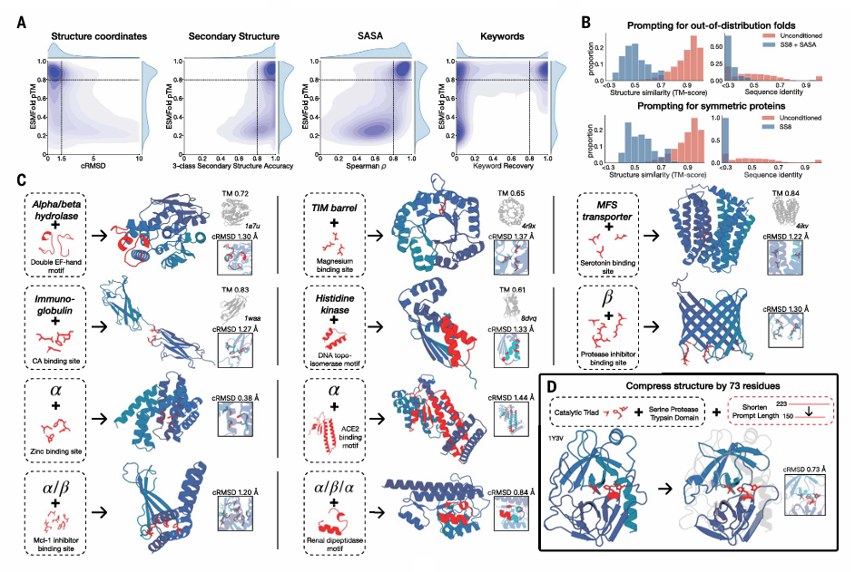
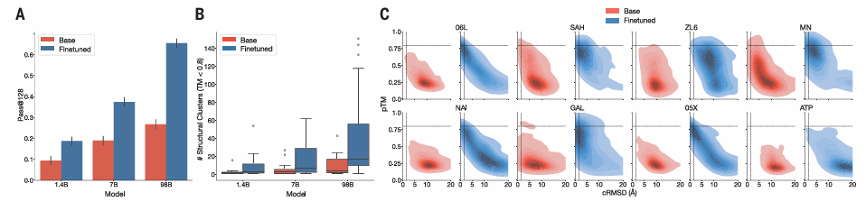
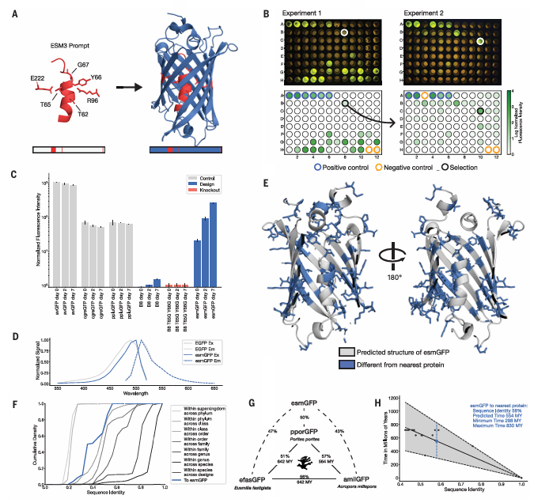
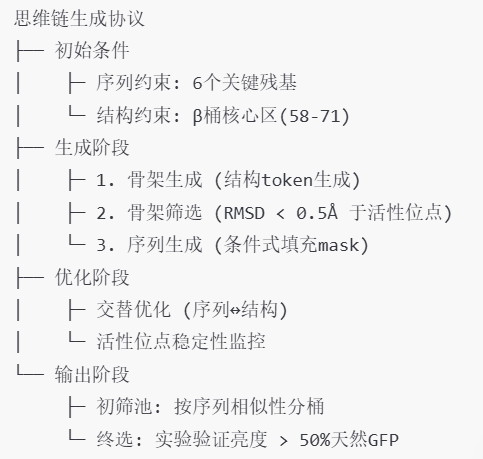

# 蛋白质大语言模型ESM3
本文提出了蛋白质大语言模型ESM3，这是一个前沿的多模态生成语言模型，能够推理蛋白质的序列、结构和功能。ESM3还可以遵循复杂的提示，结合其多模态，并且对对齐以提升其保真度非常敏感。本文研究人员还通过提示ESM3发现了一种明亮的荧光蛋白，其与已知荧光蛋白的序列相似度较低（58%），估计这相当于模拟了5亿年的进化。  

  

## 为什么要开发蛋白质大语言模型？
进化是一个漫长的过程，蛋白质的多样性和功能是通过自然选择逐步形成的。语言模型（如ESM3）能够从这些数据中学习蛋白质的基本规律。语言模型在蛋白质研究中表现出强大的潜力，尤其是在无监督学习和可扩展性方面。并且随着模型规模的增加，其性能也会提升。  

## ESM3 的工作原理和技术细节
  

### 多模态建模：统一表示序列、结构和功能
ESM3 的核心创新在于将蛋白质的序列、结构和功能统一表示为离散的符号（tokens），并通过一个共享的潜在空间进行处理。  

**1. 序列、结构和功能的 Token 化**  
**序列：** 蛋白质的氨基酸序列被直接表示为离散符号。  
**​结构：** 蛋白质的3D结构通过一个离散自编码器被压缩成离散符号。这种自编码器能够高效地表示复杂的3D结构，并通过解码器重建完整的原子坐标。  
**​功能：** 蛋白质的功能信息（如结合位点、酶活性等）通过关键词语义描述被转化为离散符号。  

**2. 多模态输入和输出**  
模型将序列、结构和功能作为独立的输入轨道，并在模型内部将它们融合到一个共享的潜在空间中。这种统一的表示方式使得模型能够同时处理这三种属性，而不需要为每种属性设计复杂的架构。  

### 生成式掩码语言建模：动态掩码预测
ESM3 使用生成式掩码语言建模作为训练目标，但其掩码策略与传统方法有所不同。  

**1. 掩码预测目标**  
在训练过程中，模型会随机掩码掉蛋白质的某些部分（序列、结构或功能），然后尝试预测这些被掩码的部分。  

**2. 动态掩码率**  
与传统掩码语言建模使用固定掩码率不同，ESM3 使用动态掩码率，即在训练过程中掩码的比例是变化的。这种策略使得模型能够学习到在不同掩码情况下的预测能力，从而增强其生成和表示学习的能力。  

### 双向Transformer架构：处理多模态信息
ESM3 使用双向Transformer架构来处理序列、结构和功能的多模态输入。  

**1. 共享的Transformer架构**  
序列、结构和功能的符号首先被嵌入，然后通过一个堆叠的Transformer块进行处理。这种架构的简单性和可扩展性使得模型能够处理大规模的参数（如980亿参数）和计算量（超过一万亿次浮点运算）。  

**2. 几何注意力机制**  
为了处理蛋白质的3D结构，ESM3 引入了一种**不变几何注意力机制**。这种机制在局部参考框架中操作，允许局部结构信息通过全局框架进行交互，从而高效地处理3D结构。

### 结构Token化：离散自编码器
蛋白质的3D结构通过一个离散自编码器被压缩成离散符号。  

**1. 离散自编码器**  
自编码器将蛋白质的3D结构压缩成离散符号，并通过解码器重建完整的原子坐标。自编码器的训练目标是重建原子坐标，使用几何损失函数监督成对距离和相对方向。  

**2. 高精度重建**  
通过这种Token化方法，ESM3 能够实现高精度的结构重建。  

### 训练数据和模型规模
ESM3 的训练数据规模和模型规模是其高性能的关键。  

**1. ​训练数据**  
ESM3 使用了27.8亿个天然蛋白质序列、2.36亿个蛋白质结构和5.39亿个带有功能注释的蛋白质进行训练。为了补充实验数据的不足，模型还使用了预测结构。  
​
**2. 模型规模**   
ESM3 训练了三个不同规模的模型：14亿、70亿和980亿参数。
实验表明，随着模型规模的增加，模型在测试集上的损失显著降低，尤其是在序列预测方面。  

### 生成和表示学习
ESM3 的训练目标不仅适用于生成，也适用于表示学习。  

**1. ​生成能力**  
ESM3 能够从部分掩码的上下文中迭代地生成蛋白质的序列、结构和功能。这种生成能力使得模型能够可控地生成高质量的蛋白质。  

**2. ​表示学习**  
高掩码率增强了生成能力，而低掩码率则提高了表示学习的效果。这种平衡使得 ESM3 在生成和表示学习任务中都表现出色。  

### 高性能与广泛适用性
ESM3 在多个任务中表现出色，证明了其强大的生成和表示学习能力。   

**1. ​结构预测**  
在单序列结构预测任务中，ESM3 980亿参数模型的表现超过了ESMFold，显示出更高的预测精度。  
​
**2. 无提示生成**  
在无提示条件下生成的蛋白质序列具有高质量，表现出多样性和广泛的结构分布，涵盖了已知蛋白质的分布范围。  

## 使用ESM3进行可编程蛋白设计
  

### 多模态提示能力：从原子级到功能级
ESM3 的设计允许用户通过不同层次的提示（如原子坐标、二级结构、溶剂可及表面积或功能关键词）来指导蛋白质的生成。这种灵活性使得 ESM3 能够处理从微观到宏观的多种设计需求。  

**技术细节**  
​**序列提示：** 直接指定氨基酸序列，生成具有特定序列的蛋白质。  
​**结构坐标提示：** 指定原子坐标（如主链原子的位置），生成具有特定三维结构的蛋白质。  
**​二级结构提示​：** 指定蛋白质的二级结构（如α螺旋、β折叠），生成具有特定二级结构的蛋白质。  
**​溶剂可及表面积提示​：** 指定蛋白质表面区域的溶剂可及性，生成具有特定表面特性的蛋白质。  
**​功能关键词提示：** 指定蛋白质的功能（如酶活性、结合位点），生成具有特定功能的蛋白质。  

### 提示响应评估：独立轨道测试
为了验证 ESM3 的提示响应能力，研究团队为每个轨道构建了一组提示，并通过 ESMFold 评估生成蛋白质的质量。评估指标包括一致性（如与提示的匹配程度）和结构预测的置信度。  

**技术细节**  
**​测试集构建：** 使用自然蛋白质的测试集为每个轨道构建提示。  
**​评估方法：** 通过 ESMFold 评估生成蛋白质的结构预测置信度（pTM）和与提示的一致性。​一致性指标包括​约束位点 RMSD（cRMSD）；二级结构​准确率；​SASA Spearman r；​关键词恢复率。   

### 无条件生成与分布外提示
ESM3 不仅能够生成与自然蛋白质相似的序列和结构，还能够通过分布外提示生成新颖的蛋白质设计，这表明其具有较强的泛化能力。  

**技术细节**  
​**提示构建：** 使用与训练集相似度低的结构（TM <0.7）构建 SS8 和 SASA 提示。  
​**生成结果：** 生成的蛋白质具有高结构预测置信度（pTM > 0.8）和低序列/结构相似性（序列相似性 <20%，TM 得分 0.48 ± 0.09）。  
​**人工对称蛋白质设计：** 使用人工对称蛋白质设计的二级结构提示，生成与自然蛋白质显著不同的蛋白质。  

### 复杂提示组合：原子级与高级提示的结合
通过将原子级提示与高级提示结合，ESM3 能够生成具有特定功能或结构的蛋白质。例如，设计一个包含特定催化中心的蛋白质，同时满足特定的折叠拓扑。  

**技术细节**  
**​原子级提示：** 指定催化中心或配体结合位点的原子坐标。  
​**高级提示：** 指定二级结构（如α螺旋、β折叠）或功能关键词（如酶活性、结合位点）。  
​**生成策略：** 迭代生成序列，直到满足以下条件：原子级提示：全原子 RMSD <1.5 Å。高级提示：TM >0.6（折叠架构），SS3 准确率 >80%。
整体蛋白质：pTM >0.8，pLDDT >0.8。  

### 创造性解决方案：蛋白质压缩与功能保留
以一个具体例子展示，从天然胰蛋白酶（PDB 1Y3V）出发，通过提示催化三联体的序列和坐标以及功能关键词，生成一个序列长度减少三分之一的蛋白质，同时保留其活性位点的协调性和整体折叠结构。  

## 生物对齐
  

### 核心发现
**1. 基础模型的局限性**  
尽管基础模型（如ESM3 1.4B、7B、98B）在规模扩大时表现出性能提升，但其生成的蛋白质可能无法完全满足复杂设计要求（如特定三级结构基序的精准支架）。  

​**2. 对齐的关键作用**  
通过偏好优化​对模型进行微调，显著提升了模型生成蛋白质的质量和对设计提示的忠实度。​**性能提升：** 98B模型对齐后，解决复杂三级协调任务的比例从26.8%提升至65.5%。对齐后的模型不仅能解决更多任务，还能为每个任务生成更多样化的解决方案（结构聚类数量增加）。**​规模效应：** 模型规模越大，对齐后的性能提升越显著（98B > 7B > 1.4B），表明大模型具备更强的潜在能力。  

### 对齐方法
**1. 数据集构建**  
​**提示类型：** 使用​骨架原子坐标和​三级基序作为设计提示，例如配体结合位点的空间构型。**​数据生成：** 对每个提示生成多个蛋白质序列，并通过ESMFold预测其结构。根据 ​骨架RMSD（cRMSD）​ 和 ​结构置信度（pTM）​ 筛选高质量和低质量样本，构建偏好数据集。  

​**2. 偏好优化​**  
**​目标：** 让模型倾向于生成高质量样本（高pTM、低cRMSD），而非低质量样本。**​损失函数：** 使用基于偏好的损失函数（如对比学习），通过最大化高质量样本的似然概率，同时最小化低质量样本的概率。  

### 实验结果
​**1. 任务解决能力**  
​**复杂任务示例：** 设计包含​配体结合基序的蛋白质，要求精准协调远距离残基的骨架原子（如催化中心）。**​评估指标：** ​Pass@128：通过生成128个候选蛋白质，统计满足条件（cRMSD <1.5Å、pTM >0.8）的比例。结构聚类数：生成的结构多样性（以TM >0.8为聚类标准）。**​结果：** 对齐后模型的Pass@128翻倍（如98B模型从26.8%提升至65.5%）。
对齐模型生成的结构聚类数显著增加，表明其能生成更多样化的解决方案。  

​**2. 规模效应**  
​**大模型优势：** 98B模型对齐后性能远超小模型，表明大模型通过预训练学习到更丰富的生物特征表示。大模型在生成高置信度（pTM >0.8）和低偏差（cRMSD <1.5Å）结构时表现更优。  

### 理论意义
**​1. 内部表征空间：** 预训练过程中，模型从进化数据中学习到蛋白质的复杂生物特征（如折叠规则、相互作用）。对齐通过微调激活这些潜在特征，使其更直接服务于生成任务。  
​
**2. 规模与泛化能力：** 大模型（如98B）的表示空间更接近真实生物学特性，因此对齐后能更高效地泛化到新任务。
这表明模型规模的扩大不仅提升计算能力，还增强了对生物复杂性的建模能力。  

### 应用价值
**1. ​蛋白质设计：** 精准设计复杂功能位点（如酶催化中心、药物结合口袋）。生成高多样性且符合要求的蛋白质结构库，加速药物开发和合成生物学研究。  
​
**2. 方法学启示：** ​偏好优化 可推广到其他生成任务（如抗体设计、蛋白质稳定性优化）。​模型规模 是提升生成质量的关键因素，尤其在需要高精度协调的任务中。  

## 使用ESM3生成远缘荧光蛋白
   

想象你是一个乐高设计师，要设计一个会发光的乐高模块。传统方法只能微调现有发光模块的几块积木（比如换个颜色或加固连接处），而这次科学家开发了一个"AI乐高大师"，它能从头设计一个造型完全不同、但依然能发光的全新模块。这个AI不仅参考了现有模块的核心发光结构（相当于GFP中的关键氨基酸），还自主设计了全新的支撑框架，最终创造出一个外形差异巨大却仍能发光的作品。  

### 核心科学突破
**1. ​远缘设计能力验证**  
天然界中GFP的多样性是经过数亿年进化形成的，而AI仅用实验室时间就创造出：序列差异相当于5亿年自然进化的荧光蛋白（esmGFP）；与最近天然荧光蛋白仅53%序列相同（传统工程最多维持80%相似度）。  

**2. AI设计方法论创新**  
采用"思维链"生成策略：  
  
引入结构约束条件（保留活性位点的原子级空间排列）。  

**3. ​功能实现突破**  
设计的esmGFP具有：成熟后亮度与天然GFP相当；光谱特性发生偏移（激发峰496nm vs 天然489nm）；发光机制验证：突变关键位点（Thr65/Tyr66）后荧光消失。  

### 技术难点解析
  

### 生物学意义
**​1. 进化生物学：** 证明功能性蛋白可能存在"跳跃式进化路径"，突破传统渐进进化理论。人工设计的esmGFP填补了水母与珊瑚间天然存在的进化鸿沟。  

**2. ​蛋白工程学：** 建立"序列差异-功能保留"的新标准（突破80%相似度限制），揭示活性位点刚性（22个内部突变耐受性）与结构柔性区域的可设计性。  

### 应用前景
**1. ​生物传感器开发：** 定制光谱特性的荧光标记（如近红外荧光探针）。  
​**2. 合成生物学工具：** 设计耐高温/耐酸碱的荧光报告系统。  
​**3. 进化机制研究：** 通过对比人工设计与自然进化路径，揭示蛋白功能约束规律。  

## 总结与展望
**1. 语言模型的进化模拟本质**  
​**关键机理：** 蛋白质语言模型通过token预测任务隐式学习：进化可行的突变路径（保留功能的相邻序列）；序列空间中的高概率连通区域。  
​**物理约束突破：** 自然进化受制于生物体的生存压力（突变必须逐步保留功能）；AI设计可跳跃式探索非连续序列空间。  

**2. 未来研究方向**  
**​基础科学问题**  
​序列-功能映射规律：研究高变异度下功能保持的物理化学原理（如esmGFP的22个内部突变耐受机制）；​进化路径可逆性：验证AI设计蛋白能否通过自然进化路径重现。  
**​技术优化方向**  
​混合建模：结合语言模型与分子动力学（MD）模拟；​多目标优化：同时优化荧光强度、成熟速度、热稳定性等指标。  

## 参考文献
Hayes T, Rao R, Akin H, et al. Simulating 500 million years of evolution with a language model[J]. Science, 2025: eads0018.  