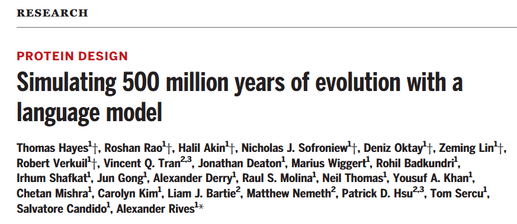
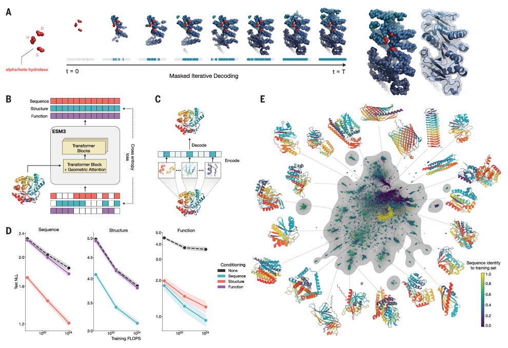

# 蛋白质大语言模型ESM3
本文提出了蛋白质大语言模型ESM3，这是一个前沿的多模态生成语言模型，能够推理蛋白质的序列、结构和功能。ESM3还可以遵循复杂的提示，结合其多模态，并且对对齐以提升其保真度非常敏感。本文研究人员还通过提示ESM3发现了一种明亮的荧光蛋白，其与已知荧光蛋白的序列相似度较低（58%），估计这相当于模拟了5亿年的进化。  

  

## 为什么要开发蛋白质大语言模型？
进化是一个漫长的过程，蛋白质的多样性和功能是通过自然选择逐步形成的。语言模型（如ESM3）能够从这些数据中学习蛋白质的基本规律。语言模型在蛋白质研究中表现出强大的潜力，尤其是在无监督学习和可扩展性方面。并且随着模型规模的增加，其性能也会提升。  

## ESM3 的工作原理和技术细节
### 多模态建模：统一表示序列、结构和功能
ESM3 的核心创新在于将蛋白质的序列、结构和功能统一表示为离散的符号（tokens），并通过一个共享的潜在空间进行处理。  

**1. 序列、结构和功能的 Token 化**  
**序列：** 蛋白质的氨基酸序列被直接表示为离散符号。  
**​结构：** 蛋白质的3D结构通过一个离散自编码器被压缩成离散符号。这种自编码器能够高效地表示复杂的3D结构，并通过解码器重建完整的原子坐标。  
**​功能：** 蛋白质的功能信息（如结合位点、酶活性等）通过关键词语义描述被转化为离散符号。  

**2. 多模态输入和输出**  
模型将序列、结构和功能作为独立的输入轨道，并在模型内部将它们融合到一个共享的潜在空间中。这种统一的表示方式使得模型能够同时处理这三种属性，而不需要为每种属性设计复杂的架构。  

### 生成式掩码语言建模：动态掩码预测
ESM3 使用生成式掩码语言建模作为训练目标，但其掩码策略与传统方法有所不同。  

**1. 掩码预测目标**  
在训练过程中，模型会随机掩码掉蛋白质的某些部分（序列、结构或功能），然后尝试预测这些被掩码的部分。  

**2. 动态掩码率**  
与传统掩码语言建模使用固定掩码率不同，ESM3 使用动态掩码率，即在训练过程中掩码的比例是变化的。这种策略使得模型能够学习到在不同掩码情况下的预测能力，从而增强其生成和表示学习的能力。  

### 双向Transformer架构：处理多模态信息
ESM3 使用双向Transformer架构来处理序列、结构和功能的多模态输入。  

**1. 共享的Transformer架构**  
序列、结构和功能的符号首先被嵌入，然后通过一个堆叠的Transformer块进行处理。这种架构的简单性和可扩展性使得模型能够处理大规模的参数（如980亿参数）和计算量（超过一万亿次浮点运算）。  

**2. 几何注意力机制**  
为了处理蛋白质的3D结构，ESM3 引入了一种**不变几何注意力机制**。这种机制在局部参考框架中操作，允许局部结构信息通过全局框架进行交互，从而高效地处理3D结构。

### 结构Token化：离散自编码器
蛋白质的3D结构通过一个离散自编码器被压缩成离散符号。  

**1. 离散自编码器**  
自编码器将蛋白质的3D结构压缩成离散符号，并通过解码器重建完整的原子坐标。自编码器的训练目标是重建原子坐标，使用几何损失函数监督成对距离和相对方向。  

**2. 高精度重建**  
通过这种Token化方法，ESM3 能够实现高精度的结构重建。  

### 训练数据和模型规模
ESM3 的训练数据规模和模型规模是其高性能的关键。  

**1. ​训练数据**  
ESM3 使用了27.8亿个天然蛋白质序列、2.36亿个蛋白质结构和5.39亿个带有功能注释的蛋白质进行训练。为了补充实验数据的不足，模型还使用了预测结构。  
​
**2. 模型规模**   
ESM3 训练了三个不同规模的模型：14亿、70亿和980亿参数。
实验表明，随着模型规模的增加，模型在测试集上的损失显著降低，尤其是在序列预测方面。  

### 生成和表示学习
ESM3 的训练目标不仅适用于生成，也适用于表示学习。  

**1. ​生成能力**  
ESM3 能够从部分掩码的上下文中迭代地生成蛋白质的序列、结构和功能。这种生成能力使得模型能够可控地生成高质量的蛋白质。  

**2. ​表示学习**  
高掩码率增强了生成能力，而低掩码率则提高了表示学习的效果。这种平衡使得 ESM3 在生成和表示学习任务中都表现出色。  

### 高性能与广泛适用性
ESM3 在多个任务中表现出色，证明了其强大的生成和表示学习能力。   

**1. ​结构预测**  
在单序列结构预测任务中，ESM3 980亿参数模型的表现超过了ESMFold，显示出更高的预测精度。  
​
**2. 无提示生成**  
在无提示条件下生成的蛋白质序列具有高质量，表现出多样性和广泛的结构分布，涵盖了已知蛋白质的分布范围。  

  

## 