# 遗传算法
遗传算法（Genetic Algorithm, GA）作为一种模拟自然选择和遗传机制的优化方法，在解决复杂问题中展现了独特的优势。它通过模拟生物进化过程中的选择、交叉和变异等过程，能够有效地在庞大的解空间中寻找近似最优解。与传统的优化算法相比，遗传算法不依赖于问题的具体数学形式，具有更强的适应性和鲁棒性，尤其适用于解决非线性、高维度以及多峰的优化问题。在工程、计算机科学、经济学等领域，遗传算法已被广泛应用于图像处理、机器学习、数据挖掘、进化设计等多个前沿领域。其灵活性和高效性使得它成为求解复杂问题时不可忽视的强大工具。因此，遗传算法不仅是人工智能领域的重要组成部分，也为优化问题提供了新的解决思路，推动了技术创新和实际应用的不断发展。  
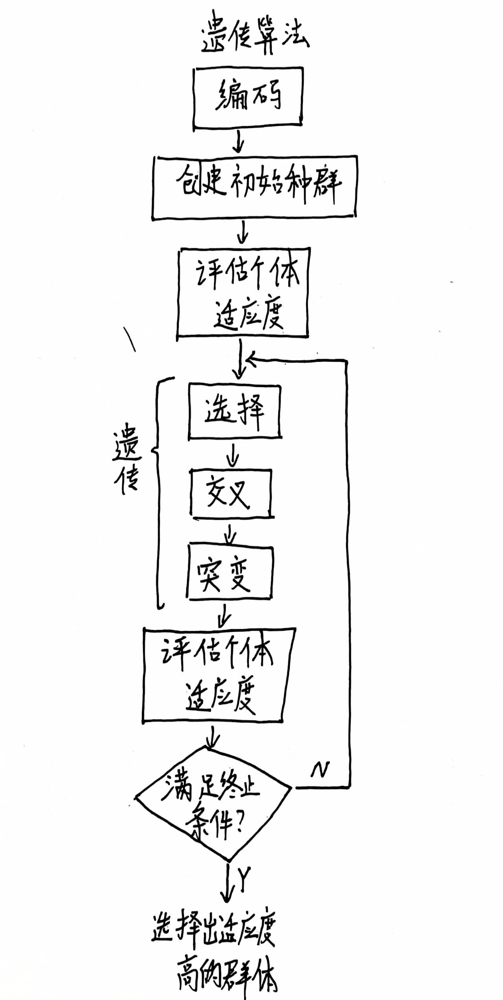 
## 前置知识
### 一些基础概念
**（1）基因：** 在遗传算法中基因是指表示解空间中一个解的基本单位。通常基因被表示为一串数字、字符或二进制位。在生物学中，基因是控制生物特征的遗传信息，遗传算法中，基因通常代表某个解的特定参数。  
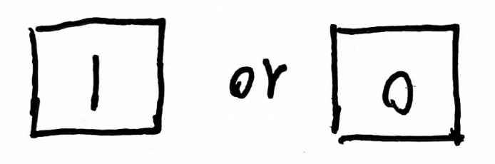  
**（2）染色体（个体）：** 染色体是由一组基因组成的解的表示。在遗传算法中，每个染色体代表一个解，它是基因的集合。染色体的结构可以是一个字符串、一个数组或者一个列表等，具体取决于问题的编码方式。一个染色体即代表着一个个体。  
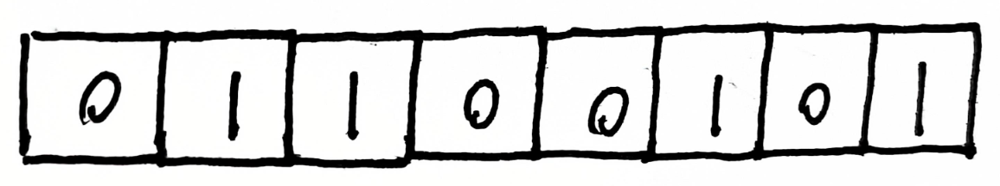  
**（3）种群：** 种群是指一组染色体的集合，是遗传算法的核心。种群中的每个染色体代表一个潜在的解，遗传算法通过在种群中选择、交叉和变异等操作来不断优化解的质量。种群通常会随着迭代而逐渐改进，以期找到最优解。  
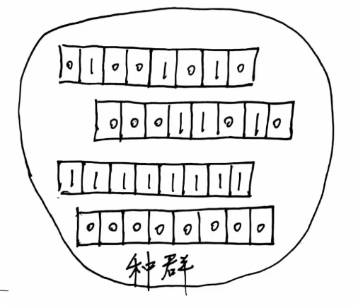  
**（4）适应度：** 适应度是评估每个染色体（即解）质量的标准。在遗传算法中，适应度函数用来衡量解的优劣，通常是根据问题的目标函数来定义。适应度越高，表示该解越接近最优解。在进化过程中，具有较高适应度的染色体更有可能被选择进行交叉和变异。  
**（5）选择：** 选择是遗传算法中的一项操作，它决定哪些染色体将被保留下来，并进行交叉或变异。选择操作通常基于适应度进行，适应度较高的染色体被更有可能选择出来。  
**（6）交叉：** 交叉是遗传算法中的一个关键操作，它模拟自然界中的基因重组过程。在交叉过程中，两个或多个染色体通过交换部分基因的方式生成新的后代。交叉的目的是将优秀解的特征结合起来，以探索更优的解空间。  
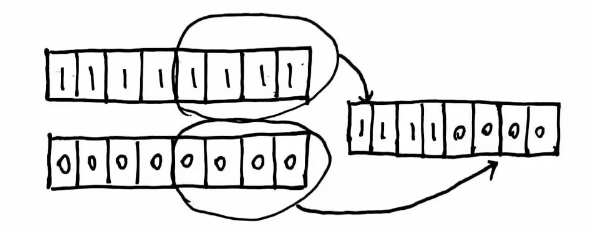  
**（7）变异：** 变异是指染色体中的基因在某个小概率下发生改变，模拟自然界中的基因突变。变异操作能够引入新的基因组合，避免算法陷入局部最优解，增强算法的全局搜索能力。  
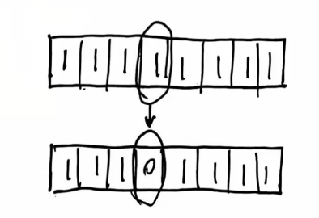  
**（8）遗传算法的迭代：** 遗传算法通常是通过多代（Generation）的进化来逐步改进解的质量。每一代都包含选择、交叉、变异等操作，直到达到设定的停止准则，如最大代数、适应度阈值等。  
### 达尔文进化理论
**（1）自然选择：** 在自然界中，个体之间的差异是遗传的，某些个体因其具备有利的特征而更能适应环境，并且能够存活并繁殖后代。这些有利特征将随着代际的传递而在种群中逐渐增加。更适应环境的个体在生存中更加具有优势，会产生更多后代，在进化中会走的更远。    
**（2）遗传：** 一些特征可以从前一代遗传到后代中。遗传导致后代与双亲样本之间有一定程度的相似性。  
**（3）变异：** 种群中单个样本的特征（也叫性状或者属性）可能有所不同。变异导致样本之间会有一定程度的差异。  
**总结：** 进化过程中，群体中每个个体样本彼此不同。那些适应环境的个体存活的几率更大，繁殖也会将他们性状传给下一代。一代代更迭之后，存活下来的物种更加适应生存环境。进化过程中重要的驱动力是交叉，交叉即结合双亲的特征产生后代。交叉有助于维持物种的多样性，并随着时间的推移将更好的特征融合在一起并筛选出来。另外，变异可以引入偶然性变化，在进化中发挥重要作用。总之，进化过程可以使得物种通过世代更替、适应性变异和环境压力来逐渐演化，形成新的物种（筛选出最适应环境的解）。  
## 遗传算法原理及算法流程
### 遗传算法原理
遗传算法是模拟达尔文生物进化论的自然选择和遗传学机理的生物进化过程的计算模型，是一种通过模拟自然进化过程搜索最优解的方法。其可以用于加速某些求最大值或最小值的算法。遗传算法模拟了自然选择的过程，适应环境的个体能够存活下来繁殖后代，不适应环境的将被淘汰。适应度评分被用于评价个体是否适应环境，适应度高的个体将具有更高的繁殖和生存机会。   

针对一个特定的最优化问题，遗传算法保留了针对给定问题的候选解的集合。这些候选解被评估迭代后产生一代又一代的解。更优的解会有更大的机会被选择，其特征也会传给下一代。随着一代代的迭代更新。最终形成的新生代种群就是最优候选解的集合，它们最接近问题的最优值。  
### 算法流程
  
**（1）编码**  
编码是使用遗传算法时候要解决的首个问题，是非常关键的一步。编码方式会影响后续交叉算子和变异算子的运算方式，很大程度上决定了遗传进化的效率。常见的编码方式主要有二进制编码，浮点编码和符号编码三种方式。  

**二进制编码：** 由二进制符号0和1所组成的二值符号集，一个位能表示出2种状态的信息量，因此足够长的二进制染色体便能表示所有的特征，这就是二进制编码。优点是编码解码简单易行；交叉变异等操作便于实现等。缺点是对于连续函数优化，特别是高精度问题，当解逼近最优解时候，变异后的表型差异大并且不连续，往往会远离最优解，导致不稳定。  

**浮点编码：** 个体中的每个基因值使用某一范围内的一个浮点数表示。浮点数编码中必须保证基因值在给定区间限制范围内，遗传算法中所使用的遗传算子也必须保证其运算结果产生的新个体值也在这个区间限制范围内。适用于表示范围较大的数；精度要求高的；便于更大的空间搜索；提高了运算效率。    

**符号编码：** 染色体中的基因值取一个无数值含义，只有代码含义的符号集，比如（a,b,c,d）。优点是符合有意义的积木块

**（2）创建初始种群**  
初始种群是随机选择的一组有效候选解(个体)。由于遗传算法使用染色体代表每个个体，因此初始种群实际上是一组染色体。  

**（3）计算适应度**  
适应度函数的值是针对每个个体计算的。对于初始种群，此操作将执行一次，然后在应用选择、交叉和突变的遗传算子后，再对每个新一代进行。由于每个个体的适应度独立于其他个体，因此可以并行计算。由于适应度计算之后的选择阶段通常认为适应度得分较高的个体是更好的解决方案，因此遗传算法专注于寻找适应度得分的最大值。如果是需要最小值的问题，则适应度计算应将原始值取反，例如，将其乘以值 (-1)。适应度函数就是用于优化的函数或者试图解决的问题，需自定义。随着遗传算法进行，解的质量会不断提高。  

**（4）选择**  
选择过程是一种基于适应度的优胜劣汰的过程。选择的目的是把优化的个体传到下一代。选择操作是建立在群体中个体适应度评估基础上，有以下几种：  
**轮盘赌选择：** 依据个体适应度值计算每个个体在子代中出现的概率并按照此概率随机选择个体构成子代种群，也叫做适应度比例法。该选择策略是适应度越好的个体被选择的概率就越大。类似于转盘一样，适应度越好的个体在转盘上的扇面就越大，从给定种群中选出M个个体就等价于将转盘旋转M次，类似于放回概率抽样，优势个体可以被多次选择进入下一代中。如下：  
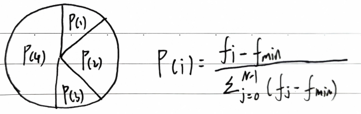  
最差的适应度值为fmin，最小适应度值被选择的概率为0。适应度高的被选择的概率也高。该法完全根据适应度对应的概率进行选择。  

**随机抽样遍历：** 该法是轮盘选择的修改版本。使用相同的轮盘，相同的比例，但是有多个选择点。轮盘只需要选择一次就可以同时选择出所有个体。与轮盘法相比，该法可以防止个体被过分的反复选择，避免了高适应度个体垄断下一代，减少了原始轮盘方法的不公平性。  
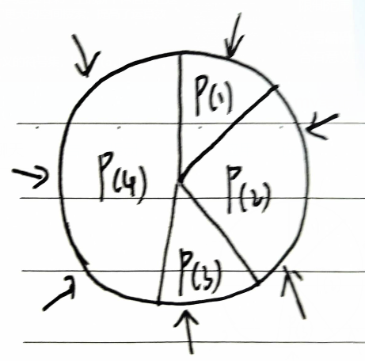  

**排序选择：** 类似于轮盘法选择。但是不是使用适应度值计算概率，而是根据适应度值对个体排序。排序后为每个个体指定等级，根据等级数值计算概率。  
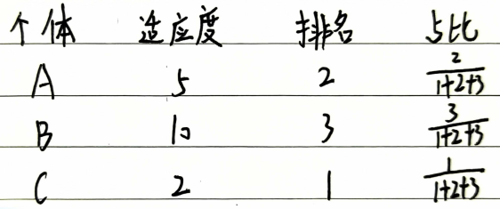  

**适应度缩放选择：** 该法是将原始适应度缩放转换将其映射到目标范围中。  
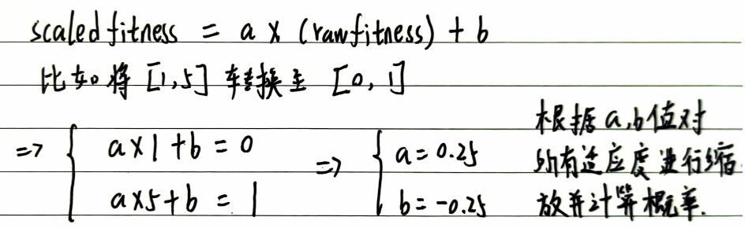  

**锦标赛选择：** 从种群中随机选择S个个体（有放回采样），然后选择其中最优的那一个个体进入下一代。在这种选择过程中，最差的个体永远不会幸存，最优的个体在所有的锦标赛中都会胜出。选择压力可以通过改变锦标赛个体数目的大小S来改变。常见的有二元/三元锦标赛。该法在实际应用中常被使用。  
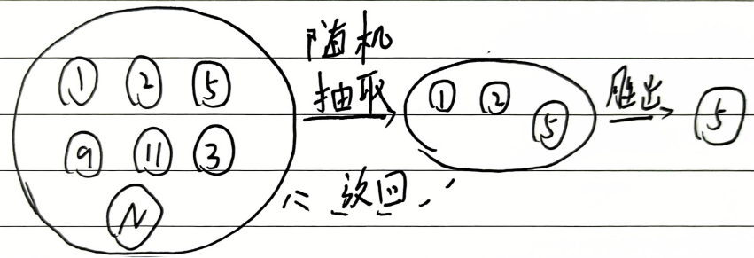  

**精英选择（截断选择）：** 根据适应度值从优到劣进行排序。只有前n个最好的个体被选择进入下一代，是非常基础的算法，但是该法在实际应用中并不实用。  

**（5）交叉**  
**单点交叉：** 选一个随机位置，在该位置点上对两个亲代染色体进行分割并交换分割点右侧部分，从而得到两个不同的子代染色体。特点是交叉混合速度慢；对于交叉点位置具有一定内在含义的问题而言，单点交叉可以造成更小的破坏。  
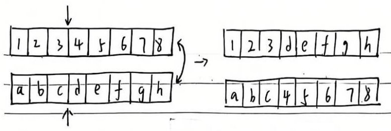  

**两点交叉：** 随机选择两个位置，对两个亲代染色体交换两个交叉点之间的内容，获得两个子代。  
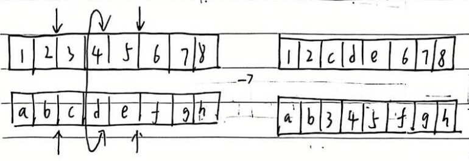  

**多点交叉：** 随机选择多个交叉点，对两个亲代染色体交换多个交叉点的内容。  
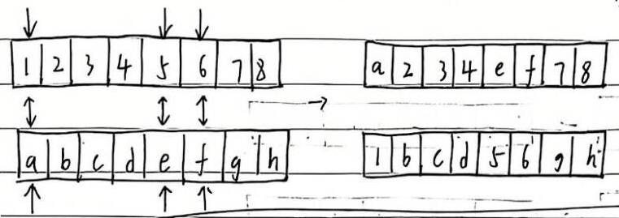  

**部分匹配交叉：** 先进行两点交叉，两点交叉之后个别基因可能会出现重复。为修改重复的染色体，可在交叉区域内建立每个染色体的匹配关系，在交叉区域外对重复基因应用此匹配关系可以消除冲突。  
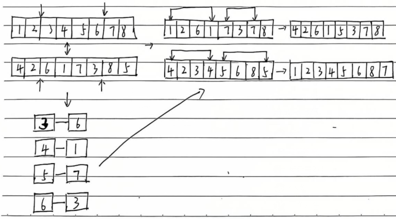  

**均匀交叉：** 均匀交叉中，两个亲代染色体中索引i位置处的基因以交换概率P进行交换。均匀交叉是一种很有利用价值的方法。可以更好的搜索设计空间，同时保持良好的信息交换。  
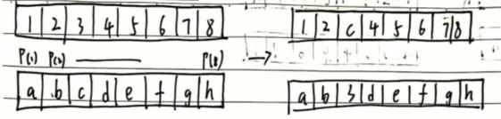  

**顺序交叉：** 在1号亲代染色体中选择起始和终止位置。将1号亲代染色体该区域的基因复制到1号子代相同位置。再在2号亲代染色体上将1号子代中缺少的基因按顺序填入。另一个子代也使用类似的方式获得。  

**基于位置交叉：** 在1号亲代染色体中随机选择几个位置，位置可以不连续，将1号亲代染色体这些位置上的基因复制到1号子代染色体相同位置，再在2号亲代染色体上将1号子代染色体中缺少的基因按照顺序填入。另一个子代以类似方式得到。  

**基于顺序交叉：** 在1号亲代染色体中随机选择几个位置，位置可以不连续，然后在2号亲代染色体中找到1号亲代染色体被选中基因的位置，再用2号父代染色体中其余的基因生成子代，并保证位置对应，将1号父代染色体中被选择的基因按顺序放入子代剩余位置中。另一个子代以类似方式得到。   

**循环交叉：** 在1号亲代染色体中随机选择一个基因，然后找到2号亲代染色体相应位置上的基因编号，再回到1号亲代染色体中找到同编号的基因的位置，重复先前工作，直至形成一个环，环中的所有基因的位置即为最后选中的位置。用1号亲代染色体中选中的基因生成子代，并保证位置对应，最后将2号亲代染色体中剩余基因放入子代中。另一个子代以相同方式获得。  
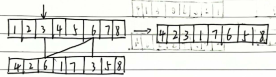   

**子路径交叉交叉：** 在某个亲代染色体上选择1组基因，在另一亲代染色体上找到这些基因的位置，保持未选中基因不变，按选中基因的出现顺序，交换两亲代染色体中基因的位置，一次生成两个子代。S该法特点是只在一个染色体上选择基因的位置。  
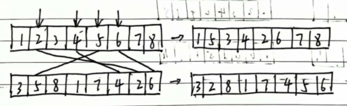  

**（6）突变**  
低概率的随机改变某个基因，可以有效避免陷入局部最优或者过慢收敛。突变操作应用于选择操作和交叉操作侯产生的后代。突变是极低概率的突变。如果突变率过度增加，遗传算法有可能等效于随机搜索算法。变异率在0.01-0.05之间即可，变异率太高会导致收敛慢，太低会陷入局部最优。    
**翻转突变：** 随机选择一个基因，将其值翻转。  
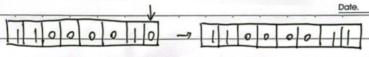  

**互换突变：** 随机选择两个基因交换它们的值。  
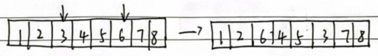  

**反转突变：** 随机选择一个基因序列，将该序列中的基因顺序颠倒。  
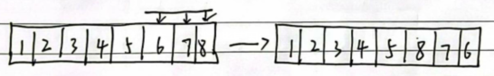    

**倒转突变：** 随机选择一个基因序列，将该序列中的基因顺序打乱。 
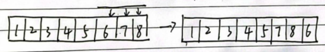  

**（7）终止条件：**  
进化次数限制；计算资源限制；一个个体已经满足最优条件，找到了最优值；适应度已饱和，再进化也不会产生更好的个体；认为干预；将上述几种方式进行组合。  
### 遗传算法特点及应用场景
**（1）与传统优化算法的区别：**   
**基于种群：** 很多传统的优化算法是对单个候选方案进行不断优化。而遗传算法是针对一组候选解决方案进行优化。在搜索过程中是保留一组个体，而不是一个个体。  

**适应度函数：** 适应度函数就是要解决的问题。遗传算法的目的就是找到使得适应度函数得分最高/低的个体。与传统算法不同的是，该适应度函数并不一定非得是具有公式的数学函数。遗传算法只考虑适应度函数的值，不依赖于导数或者其他信息。非常适合处理不可数学上求导的函数。  

**概率行为：** 传统算法很多在搜索过程中是确定的。遗传算法从上一代产生下一代的规则是概率性的。尽管遗传过程中一代代之间具有概率性，但是基于遗传算法的搜索不是随机的，它利用随机将搜索引向搜索空间中有更好机会改善结果的区域。  

**（2）优点：**  
搜索目标是全局最优；可以处理难以求导的复杂问题；处理缺乏数学表达的问题；适应度函数对每个个体打分时可以并行；可以持续学习，进化永无止境。  

**（3）缺点：**  
需要定义适应度函数，染色体，基因，选择/交叉突变算子；需要调整一些超参数；需要大量计算资源；过早趋同（如果一个个体的适能力比其他高很多。那么它可能重复性的覆盖整个种群，会导致遗传算法过早的陷入局部最优值，因此需要物种多样性）；无法保证解的质量，只能说是一套良好的解决方案，但是无法保证是全局最优。  

**（4）应用场景：**   
数学表示复杂的问题；没有数学表达式的问题等。    
## 一些参考
1. https://blog.csdn.net/LOVEmy134611/article/details/111639624  
2. https://www.cnblogs.com/aabbcc/p/10762836.html  
3. https://blog.csdn.net/hba646333407/article/details/103349279 