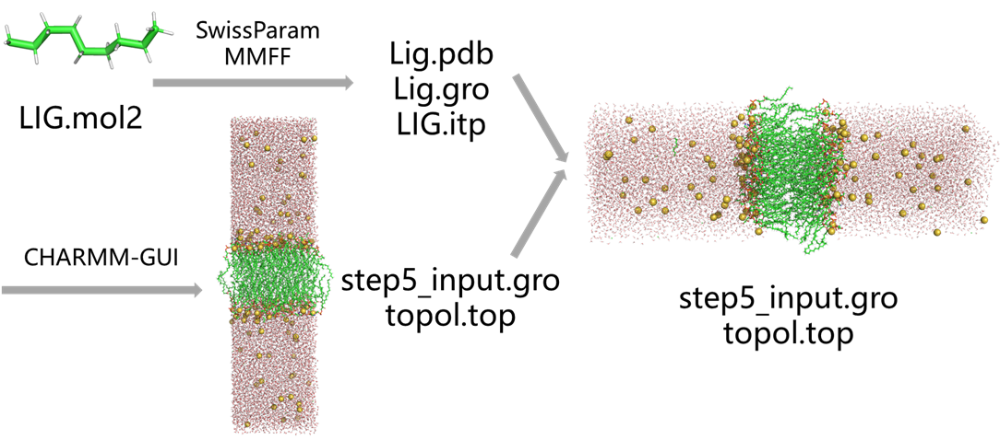
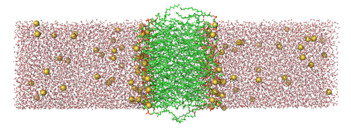
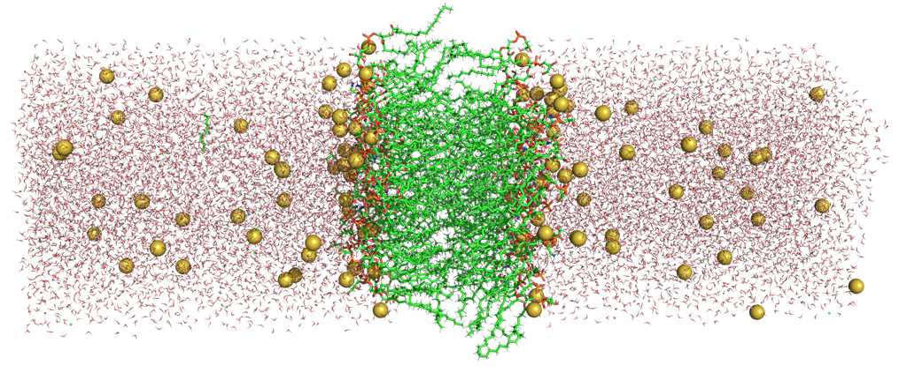
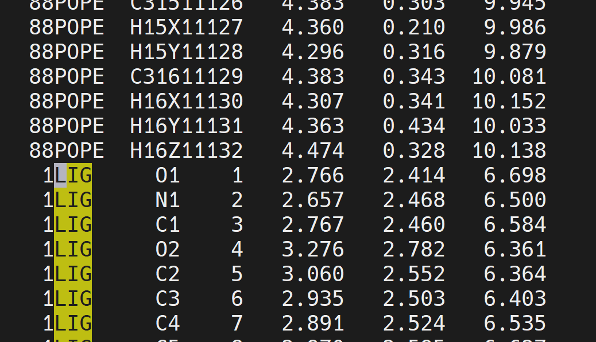
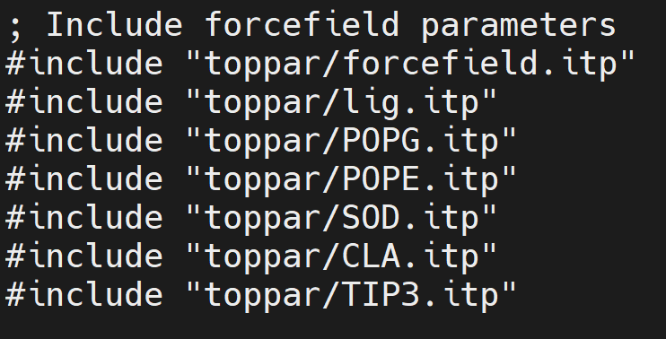
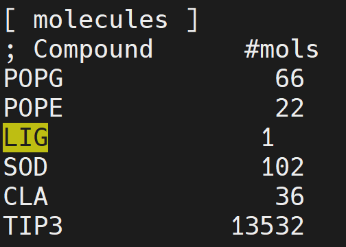

# 配体小分子与膜体系分子动力学模拟：CHARMM-GUI构建脂质双分子层，SwissParam生成小分子力场
在现代药物设计和生物学研究中，配体小分子与细胞膜的相互作用至关重要。细胞膜不仅是细胞的物理屏障，还是分子与细胞内部进行相互交流和物质交换的主要平台。因此，研究配体小分子如何穿越膜、与膜相互作用，并影响膜结构和功能，对于药物的优化、靶向治疗以及理解生物过程具有重要意义。而分子动力学（MD）模拟作为一种强大的理论工具，能够提供从原子级别的动态信息，从而揭示配体与膜体系之间复杂的相互作用机制。

然而，进行配体小分子与膜体系的分子动力学模拟并非易事，尤其是需要精准构建膜体系并为小分子生成合适的力场参数。幸运的是，随着计算生物学领域的发展，诸如CHARMM-GUI和SwissParam等工具的出现，使得这一过程变得更加高效和可靠。CHARMM-GUI能够简便地构建脂质双分子层（Lipid Bilayer）膜模型，并且能根据研究需求定制模拟条件；而SwissParam则提供了一个快速生成小分子力场参数的平台，支持与GROMACS等常用模拟软件兼容，使得配体小分子的模拟更加精确。

本篇文章将详细介绍如何使用CHARMM-GUI构建膜体系，结合SwissParam生成小分子的力场参数，并进行配体小分子与膜体系的分子动力学模拟。通过这一方法，我们能够深入探讨配体小分子如何与细胞膜相互作用，为药物设计、靶点识别及膜相关疾病研究提供重要的理论依据。通过精确模拟这些复杂的生物过程，最终为新药的开发与治疗策略的优化提供强有力的支持。

  
## CHARMM-GUI构建膜体系
CHARMM-GUI构建膜体系流程可参考文章 [细胞膜体系动力学模拟：CHARMM-GUI构建脂质双分子层](https://mp.weixin.qq.com/s/bv-asjP6tht7Gai-w42Xcw)。该步骤之后可以获得膜体系的gro文件和top文件。  


## Pymol中摆放配体小分子在膜中的位置
Pymol中摆放配体小分子在膜中的位置的操作可参考文章 [Pymol界面编辑模式下的多种操作（坐标平移旋转等）](https://mp.weixin.qq.com/s/wabUmh7f2QudbRLDm_leYw)，在Pymol编辑模式下使用Shift+Middle移动配体小分子至膜体系的合适位置中。  

  
## SwissParam生成MMFF小分子力场参数
使用SwissParam生成MMFF小分子力场参数流程可参考文章 [蛋白-配体小分子动力学模拟：蛋白使用pdb2gmx charmm36，小分子使用swissparm生成的MMFF94力场参数](https://mp.weixin.qq.com/s/O7vRQ5AHHSrNtDAoCsiZWw)。该步骤之后即可获得配体小分子的pdb文件和itp文件。  
## 合并膜和小分子的gro文件和top文件
通过上述两个步骤获得了膜体系的gro文件和top文件以及配体小分子的pdb文件和itp文件。现需要将膜体系和配体小分子合并。  

**合并gro文件：** 使用下述命令将配体小分子的pdb文件转成gro文件。  
```shell
gmx editconf -f lig.pdb -o lig.gro
```
如下，将lig.gro的内容复制于膜gro文件中的脂质分子之后，离子之前。**另外记得将配体原子数目加在gro文件第二行的总数目上**。  
  

**合并top文件：** 如下，将配体小分子的itp文件include到总的top文件中。  
  
如下，在总的top文件末尾molecules中加入配体的名称。**这里需要注意的是配体在整个体系中的位置需要与gro文件中保持一致。这里前面的gro文件中是将配体gro加在脂质分子和离子之间。所以molecules中也需要将配体名字加在脂质分子名字和离子名字之间。**  
  

**准备index.ndx文件：** 使用下述命令生成index.ndx文件，准备好SOLU，SOLV，MEMB，SOLU_MEMB组分。  
```shell
gmx make_ndx -f step5_input.gro -o index.ndx   # SOLU MEMB SOLV SOLU_MEMB
```
## 准备膜体系模拟mdp文件
可使用下述脚本 python do.py 生成：  
```python
import os
import shutil

class config:

    def __init__(self):

        self.time = 1000           # unit: ns
        self.frame_steps = 500000

def mdp_file():

    if os.path.exists(os.path.join(".", "mdp")):
        shutil.rmtree(os.path.join(".", "mdp"))
        os.makedirs(os.path.join(".", "mdp"))
    else:
        os.makedirs(os.path.join(".", "mdp"))

def step6_0_minimizationmdp():

    step6_0_mdp = open(os.path.join(".", "mdp", "step6.0_minimization.mdp"), "w")
    step6_0_mdp.write(
'''define                  = -DPOSRES -DPOSRES_FC_BB=4000.0 -DPOSRES_FC_SC=2000.0 -DPOSRES_FC_LIPID=1000.0 -DDIHRES -DDIHRES_FC=1000.0 -DPOSRES_LIGAND
integrator              = steep
emtol                   = 1000.0
nsteps                  = 5000
nstlist                 = 10
cutoff-scheme           = Verlet
rlist                   = 1.2
vdwtype                 = Cut-off
vdw-modifier            = Force-switch
rvdw_switch             = 1.0
rvdw                    = 1.2
coulombtype             = PME
rcoulomb                = 1.2
;
constraints             = h-bonds
constraint_algorithm    = LINCS
nstxout                = 0          ; save coordinates to .trr every 250 steps
nstvout                = 0          ; don't save velocities to .trr
nstfout                = 0          ; don't save forces to .trr

nstxout-compressed     = 0      ; xtc compressed trajectory output every 500 steps
compressed-x-precision = 1000
nstlog                 = 500        ; update log file every 500 steps
nstenergy              = 500        ; save energies every 500 steps
nstcalcenergy          = 500                                           
'''
    )

def step6_1_equilibrationmdp():

    step6_1_mdp = open(os.path.join(".", "mdp", "step6.1_equilibration.mdp"), "w")
    step6_1_mdp.write(
'''define                  = -DPOSRES -DPOSRES_FC_BB=4000.0 -DPOSRES_FC_SC=2000.0 -DPOSRES_FC_LIPID=1000.0 -DDIHRES -DDIHRES_FC=1000.0 -DPOSRES_LIGAND
integrator              = md
dt                      = 0.001
nsteps                  = 125000
;nstxtcout               = 0
nstvout                 = 0
nstfout                 = 0
nstcalcenergy           = 1000
nstenergy               = 10000
nstlog                  = 10000
nstxout-compressed     = 0      ; xtc compressed trajectory output every 5000 steps
compressed-x-precision = 1000       ; precision with which to write to the compressed trajectory file
;
cutoff-scheme           = Verlet
nstlist                 = 20
rlist                   = 1.2
vdwtype                 = Cut-off
vdw-modifier            = Force-switch
rvdw_switch             = 1.0
rvdw                    = 1.2
coulombtype             = PME
rcoulomb                = 1.2
;
tcoupl                  = berendsen
tc_grps                 = SOLU MEMB SOLV
tau_t                   = 1.0 1.0 1.0
ref_t                   = 310.15 310.15 310.15
;
constraints             = h-bonds
constraint_algorithm    = LINCS
;
nstcomm                 = 100
comm_mode               = linear
comm_grps               = SOLU_MEMB SOLV
;
gen-vel                 = yes
gen-temp                = 310.15
gen-seed                = -1
'''
    )

def step6_2_equilibrationmdp():

    step6_2_mdp = open(os.path.join(".", "mdp", "step6.2_equilibration.mdp"), "w")
    step6_2_mdp.write(
'''define                  = -DPOSRES -DPOSRES_FC_BB=2000.0 -DPOSRES_FC_SC=1000.0 -DPOSRES_FC_LIPID=400.0 -DDIHRES -DDIHRES_FC=400.0 -DPOSRES_LIGAND
integrator              = md
dt                      = 0.001
nsteps                  = 125000
;nstxtcout               = 0
nstvout                 = 0
nstfout                 = 0
nstcalcenergy           = 1000
nstenergy               = 10000
nstlog                  = 10000
nstxout-compressed     = 0      ; xtc compressed trajectory output every 5000 steps
compressed-x-precision = 1000       ; precision with which to write to the compressed trajectory file
;
cutoff-scheme           = Verlet
nstlist                 = 20
rlist                   = 1.2
vdwtype                 = Cut-off
vdw-modifier            = Force-switch
rvdw_switch             = 1.0
rvdw                    = 1.2
coulombtype             = PME
rcoulomb                = 1.2
;
tcoupl                  = berendsen
tc_grps                 = SOLU MEMB SOLV
tau_t                   = 1.0 1.0 1.0
ref_t                   = 310.15 310.15 310.15
;
constraints             = h-bonds
constraint_algorithm    = LINCS
continuation            = yes
;
nstcomm                 = 100
comm_mode               = linear
comm_grps               = SOLU_MEMB SOLV
'''
    )

def step6_3_equilibrationmdp():

    step6_3_mdp = open(os.path.join(".", "mdp", "step6.3_equilibration.mdp"), "w")
    step6_3_mdp.write(
'''define                  = -DPOSRES -DPOSRES_FC_BB=1000.0 -DPOSRES_FC_SC=500.0 -DPOSRES_FC_LIPID=400.0 -DDIHRES -DDIHRES_FC=200.0 -DPOSRES_LIGAND
integrator              = md
dt                      = 0.001
nsteps                  = 125000
;nstxtcout               = 0
nstvout                 = 0
nstfout                 = 0
nstcalcenergy           = 1000
nstenergy               = 10000
nstlog                  = 10000
nstxout-compressed     = 0      ; xtc compressed trajectory output every 5000 steps
compressed-x-precision = 1000       ; precision with which to write to the compressed trajectory file
;
cutoff-scheme           = Verlet
nstlist                 = 20
rlist                   = 1.2
vdwtype                 = Cut-off
vdw-modifier            = Force-switch
rvdw_switch             = 1.0
rvdw                    = 1.2
coulombtype             = PME
rcoulomb                = 1.2
;
tcoupl                  = berendsen
tc_grps                 = SOLU MEMB SOLV
tau_t                   = 1.0 1.0 1.0
ref_t                   = 310.15 310.15 310.15
;
pcoupl                  = berendsen
pcoupltype              = semiisotropic
tau_p                   = 5.0
compressibility         = 4.5e-5  4.5e-5
ref_p                   = 1.0     1.0
refcoord_scaling        = com
;
constraints             = h-bonds
constraint_algorithm    = LINCS
continuation            = yes
;
nstcomm                 = 100
comm_mode               = linear
comm_grps               = SOLU_MEMB SOLV
'''
    )

def step6_4_equilibrationmdp():

    step6_4_mdp = open(os.path.join(".", "mdp", "step6.4_equilibration.mdp"), "w")
    step6_4_mdp.write(
'''define                  = -DPOSRES -DPOSRES_FC_BB=500.0 -DPOSRES_FC_SC=200.0 -DPOSRES_FC_LIPID=200.0 -DDIHRES -DDIHRES_FC=200.0 -DPOSRES_LIGAND
integrator              = md
dt                      = 0.002
nsteps                  = 250000
;nstxtcout               = 0
nstvout                 = 0
nstfout                 = 0
nstcalcenergy           = 1000
nstenergy               = 10000
nstlog                  = 10000
nstxout-compressed     = 0      ; xtc compressed trajectory output every 5000 steps
compressed-x-precision = 1000       ; precision with which to write to the compressed trajectory file
;
cutoff-scheme           = Verlet
nstlist                 = 20
rlist                   = 1.2
vdwtype                 = Cut-off
vdw-modifier            = Force-switch
rvdw_switch             = 1.0
rvdw                    = 1.2
coulombtype             = PME
rcoulomb                = 1.2
;
tcoupl                  = berendsen
tc_grps                 = SOLU MEMB SOLV
tau_t                   = 1.0 1.0 1.0
ref_t                   = 310.15 310.15 310.15
;
pcoupl                  = berendsen
pcoupltype              = semiisotropic
tau_p                   = 5.0
compressibility         = 4.5e-5  4.5e-5
ref_p                   = 1.0     1.0
refcoord_scaling        = com
;
constraints             = h-bonds
constraint_algorithm    = LINCS
continuation            = yes
;
nstcomm                 = 100
comm_mode               = linear
comm_grps               = SOLU_MEMB SOLV
'''
    )

def step6_5_equilibrationmdp():

    step6_5_mdp = open(os.path.join(".", "mdp", "step6.5_equilibration.mdp"), "w")
    step6_5_mdp.write(
'''define                  = -DPOSRES -DPOSRES_FC_BB=200.0 -DPOSRES_FC_SC=50.0 -DPOSRES_FC_LIPID=40.0 -DDIHRES -DDIHRES_FC=100.0 -DPOSRES_LIGAND
integrator              = md
dt                      = 0.002
nsteps                  = 250000
;nstxtcout               = 0
nstvout                 = 0
nstfout                 = 0
nstcalcenergy           = 1000
nstenergy               = 10000
nstlog                  = 10000
nstxout-compressed     = 0      ; xtc compressed trajectory output every 5000 steps
compressed-x-precision = 1000       ; precision with which to write to the compressed trajectory file
;
cutoff-scheme           = Verlet
nstlist                 = 20
rlist                   = 1.2
vdwtype                 = Cut-off
vdw-modifier            = Force-switch
rvdw_switch             = 1.0
rvdw                    = 1.2
coulombtype             = PME
rcoulomb                = 1.2
;
tcoupl                  = berendsen
tc_grps                 = SOLU MEMB SOLV
tau_t                   = 1.0 1.0 1.0
ref_t                   = 310.15 310.15 310.15
;
pcoupl                  = berendsen
pcoupltype              = semiisotropic
tau_p                   = 5.0
compressibility         = 4.5e-5  4.5e-5
ref_p                   = 1.0     1.0
refcoord_scaling        = com
;
constraints             = h-bonds
constraint_algorithm    = LINCS
continuation            = yes
;
nstcomm                 = 100
comm_mode               = linear
comm_grps               = SOLU_MEMB SOLV
'''
    )

def step6_6_equilibrationmdp():

    step6_6_mdp = open(os.path.join(".", "mdp", "step6.6_equilibration.mdp"), "w")
    step6_6_mdp.write(
'''define                  = -DPOSRES -DPOSRES_FC_BB=50.0 -DPOSRES_FC_SC=0.0 -DPOSRES_FC_LIPID=0.0 -DDIHRES -DDIHRES_FC=0.0 -DPOSRES_LIGAND
integrator              = md
dt                      = 0.002
nsteps                  = 250000
;nstxtcout               = 0
nstvout                 = 0
nstfout                 = 0
nstcalcenergy           = 1000
nstenergy               = 1000
nstlog                  = 1000
nstxout-compressed     = 0      ; xtc compressed trajectory output every 5000 steps
compressed-x-precision = 1000       ; precision with which to write to the compressed trajectory file
;
cutoff-scheme           = Verlet
nstlist                 = 20
rlist                   = 1.2
vdwtype                 = Cut-off
vdw-modifier            = Force-switch
rvdw_switch             = 1.0
rvdw                    = 1.2
coulombtype             = PME
rcoulomb                = 1.2
;
tcoupl                  = berendsen
tc_grps                 = SOLU MEMB SOLV
tau_t                   = 1.0 1.0 1.0
ref_t                   = 310.15 310.15 310.15
;
pcoupl                  = berendsen
pcoupltype              = semiisotropic
tau_p                   = 5.0
compressibility         = 4.5e-5  4.5e-5
ref_p                   = 1.0     1.0
refcoord_scaling        = com
;
constraints             = h-bonds
constraint_algorithm    = LINCS
continuation            = yes
;
nstcomm                 = 100
comm_mode               = linear
comm_grps               = SOLU_MEMB SOLV
'''
    )

def step7_productionmdp(time, frame_steps):

    nsteps = int(time*1000000/2)

    prod_mdp = open(os.path.join(".", "mdp", "step7_production.mdp"), "w")
    prod_mdp.write(
'''integrator              = md
dt                      = 0.002
nsteps                  = {0}
nstxout                 = 0
nstvout                 = 0
nstfout                 = 0
nstcalcenergy           = 1000
nstenergy               = {1}
nstlog                  = {1}
nstxout-compressed     = {1}      ; xtc compressed trajectory output every 5000 steps
compressed-x-precision = 1000       ; precision with which to write to the compressed trajectory file
;
cutoff-scheme           = Verlet
nstlist                 = 20
rlist                   = 1.2
vdwtype                 = Cut-off
vdw-modifier            = Force-switch
rvdw_switch             = 1.0
rvdw                    = 1.2
coulombtype             = PME
rcoulomb                = 1.2
;
tcoupl                  = V-rescale
tc_grps                 = SOLU MEMB SOLV
tau_t                   = 1.0 1.0 1.0
ref_t                   = 310.15 310.15 310.15
;
pcoupl                  = Parrinello-Rahman
pcoupltype              = semiisotropic
tau_p                   = 5.0
compressibility         = 4.5e-5  4.5e-5
ref_p                   = 1.0     1.0
;
constraints             = h-bonds
constraint_algorithm    = LINCS
continuation            = yes
;
nstcomm                 = 100
comm_mode               = linear
comm_grps               = SOLU_MEMB SOLV
'''.format(nsteps, frame_steps)
    )

def run():

    settings = config()
    mdp_file()
    step6_0_minimizationmdp()
    step6_1_equilibrationmdp()
    step6_2_equilibrationmdp()
    step6_3_equilibrationmdp()
    step6_4_equilibrationmdp()
    step6_5_equilibrationmdp()
    step6_6_equilibrationmdp()
    step7_productionmdp(settings.time, settings.frame_steps)                                                                           

def main():

    run()

if __name__=="__main__":
    main()
```
## 准备跑模拟的提交脚本文件
提交脚本 job.sh 如下所示：  
```shell
init=step5_input
rest_prefix=step5_input
mini_prefix=step6.0_minimization
prod_prefix=step7_production
prod_step=step7

# Minimization
mkdir em
cd em
gmx grompp -f ../mdp/${mini_prefix}.mdp -o ${mini_prefix}.tpr -c ../${init}.gro -r ../${rest_prefix}.gro -p ../topol.top -n ../index.ndx -maxwarn 4
gmx mdrun -s ${mini_prefix}.tpr -deffnm ${mini_prefix} -nb gpu -gpu_id 0 -ntmpi 1
cd ..

## Equilibration
mkdir equil
cd equil
cnt=1
cntmax=6
cp ../em/${mini_prefix}.gro .
while [ `echo "${cnt} <= ${cntmax}" |bc` -eq 1 ]
do
    pcnt=`echo "${cnt}-1"|bc`
    if [ `echo "${cnt} == 1" |bc` -eq 1 ];then pstep=${mini_prefix};else pstep=step6.${pcnt}_equilibration;fi

    gmx grompp -f ../mdp/step6.${cnt}_equilibration.mdp -o step6.${cnt}_equilibration.tpr -c ${pstep}.gro -r ${pstep}.gro -p ../topol.top -n ../index.ndx -maxwarn 4
    gmx mdrun -s step6.${cnt}_equilibration.tpr -deffnm step6.${cnt}_equilibration -nb gpu -bonded gpu -gpu_id 0 -pme gpu -ntmpi 1
    cnt=`echo "${cnt}+1"|bc`
done
cd ..

# Production
mkdir prod
cd prod
cnt=1
cntmax=1
cp ../equil/step6.6_equilibration.gro .
while [ `echo "${cnt} <= ${cntmax}" |bc` -eq 1 ]
do
    pcnt=`echo "${cnt}-1"|bc`
    istep=${prod_step}_${cnt}
    pstep=${prod_step}_${pcnt}

    if [ `echo "${cnt} == 1" |bc` -eq 1 ];then
        pstep=step6.6_equilibration
        gmx grompp -f ../mdp/${prod_prefix}.mdp -o ${istep}.tpr -c ${pstep}.gro -r ${pstep}.gro -p ../topol.top -n ../index.ndx -maxwarn 4
    else
        gmx grompp -f ../mdp/${prod_prefix}.mdp -o ${istep}.tpr -c ${pstep}.gro -r ${pstep}.gro -t ${pstep}.cpt -p ../topol.top -n ../index.ndx -maxwarn 4
    fi
    gmx mdrun -s ${istep}.tpr -deffnm ${istep} -nb gpu -bonded gpu  -gpu_id 0 -pme gpu -ntmpi 1 -nsteps 500000000
    cnt=`echo "${cnt}+1"|bc`
done
cd ..
```